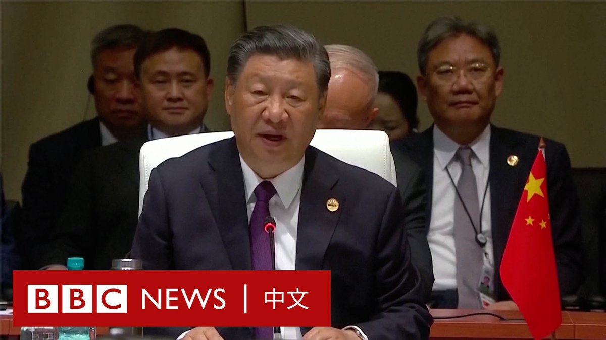
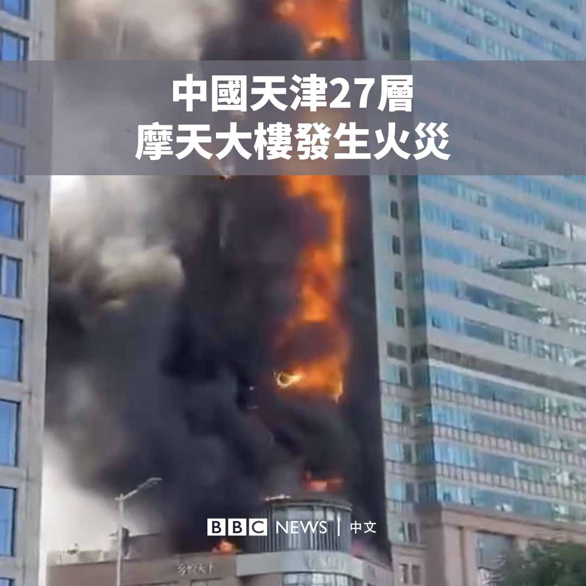
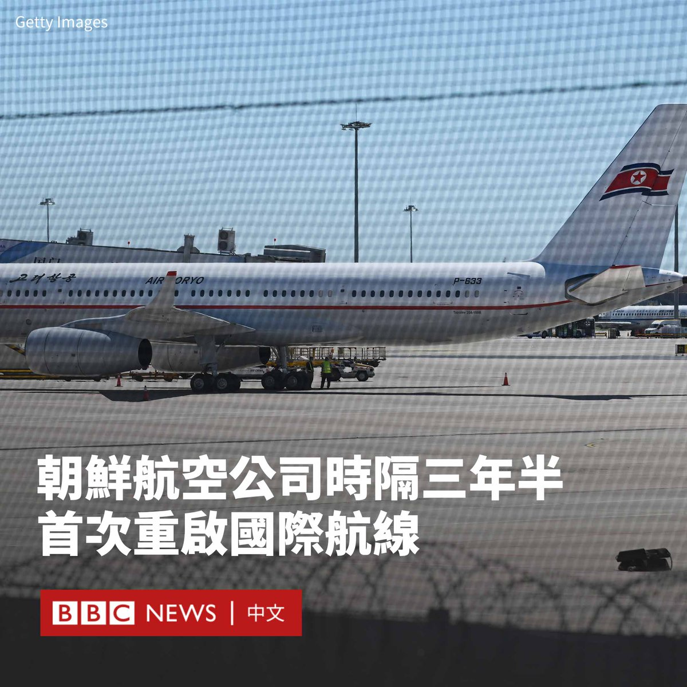

D英国广播公司BBC 北京时间 2023-08-23T19:30:34Z 1694311163775860749 香港政府近日公布最新统计数字，自过去三年移民潮及疫情以来，香港人口首次止跌回升，与外界对于香港人口萎缩的普遍印象形成落差，引起各界争议是否“移民潮结束”，甚至出现“回流潮”。https://t.co/ygjaT2wpiT   D英国广播公司BBC 北京时间 2023-08-23T20:29:17Z 1694325939935772972 【现场画面】中国国家主席习近平在金砖国家峰会上发表演讲。他呼吁加速金砖国家的扩员进程，让更多国家加入到该组织。他还呼吁，金砖国家要一起反对“脱钩断链”和“经济胁迫”。 https://t.co/lbF8Hzhz4e   D英国广播公司BBC 北京时间 2023-08-23T17:38:58Z 1694283077223092610 在中国西北部城市西安，许多年轻人周二（8月22日）准备庆祝象征爱情的七夕节时，发现收到了来自当局的祝福讯息，但内容是呼吁他们适龄婚育，以“赓续中华血脉，共担复兴重任”。https://t.co/ShHeKAIqsK   D英国广播公司BBC 北京时间 2023-08-23T15:11:16Z 1694245905455550496 一名被指曾经因批评习近平而入狱的中国男子在韩国被捕。据报道，他仅靠望远镜、指南针和几桶汽油的辅助，骑摩托艇穿越黄海。韩国海岸警卫队表示，他因涉嫌“自行偷渡”入境而被拘留。https://t.co/N5Tmd1ih0b   D英国广播公司BBC 北京时间 2023-08-23T12:51:38Z 1694210766151283153 尽管金砖集团是一个处在萌芽阶段且组织松散的阵营，但这些国家正凭一种对挑战西方在全球事务中主导地位的盼望而团结起来，还有几十个国家排着队，想要加入。

BBC记者哈丁在约翰内斯堡报道说，对于南非的外交决策人士来说，众人几乎一致认同中国才是未来，西方已是明日黄花。https://t.co/C7ofnUONax   D英国广播公司BBC 北京时间 2023-08-23T11:49:51Z 1694195220186099751 中国天津市南开区一座27层的大厦周二（8月22日）下午发生火灾，大火吞噬了楼房的一侧。

天津消防救援总队表示其部署了284名消防员和62辆消防车前往救火。目前大火已被扑灭，没有发现人员伤亡。 https://t.co/x3dQY36Lrq   D英国广播公司BBC 北京时间 2023-08-23T08:55:53Z 1694151440128720934 拜登和特朗普很可能再次在明年的美国大选展开角逐。从目前来看，拜登似乎并未因经济复苏而得到太多赞许，而官司缠身的特朗普面临的情况则相反——坏消息并非坏消息。https://t.co/JN2b42DPRm   D英国广播公司BBC 北京时间 2023-08-23T00:06:24Z 1694018187988537842 随着朝鲜向部分旅客开放边境，一架从平壤起飞的高丽航空客机于周二（8月22日）早些时候降落在北京，这是自2020年初新冠疫情爆发以来平壤首次重启国际航线。

实时航班跟踪服务Flightradar24的数据显示，高丽航空JS151航班于当地时间周二（8月22日）上午8:30从平壤飞往北京，在当地时间09:16降落在北京首都机场。之后，该班机于当天下午返回平壤。

韩联社拍摄的画面显示，在北京首都机场，有很多携带行李的朝鲜旅客正在办理北京至平壤航班的登机手续。

专营赴朝旅游业务的北京高丽旅行社（Koryo Tours）表示，该航班并不意味着航线的完全恢复，其主要作用是让滞留海外的朝鲜人回家。

Flightradar24数据显示，执飞该航线的是图波列夫Tu-204双引擎飞机，最多可搭载210名乘客。

中国外交部在周一（8月21日）表示，已批准恢复高丽航空往返于北京和平壤的客运航线。

朝鲜最近逐步开放国际旅行。上周，一群朝鲜运动员乘车前往中国丹东，随后转往哈萨克斯坦参加跆拳道世界锦标赛。   