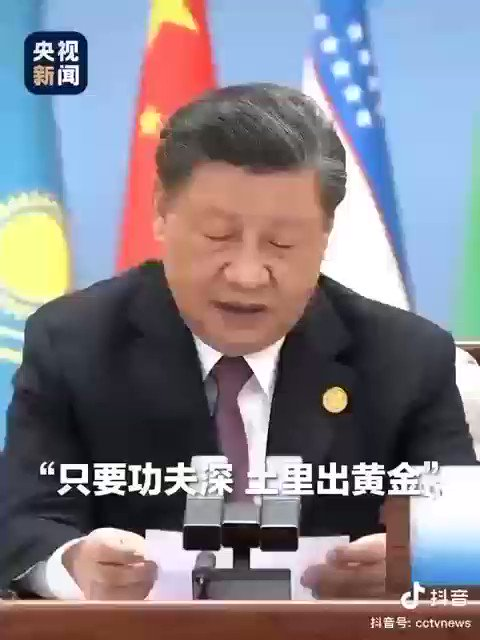
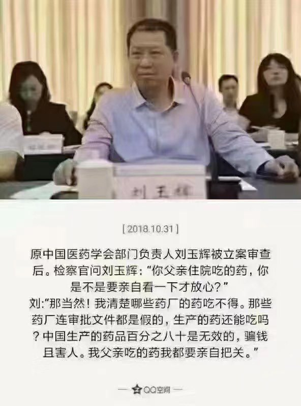
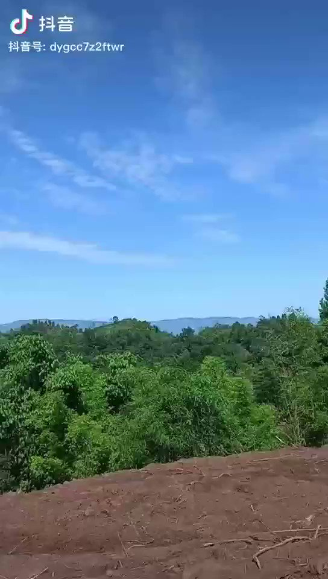
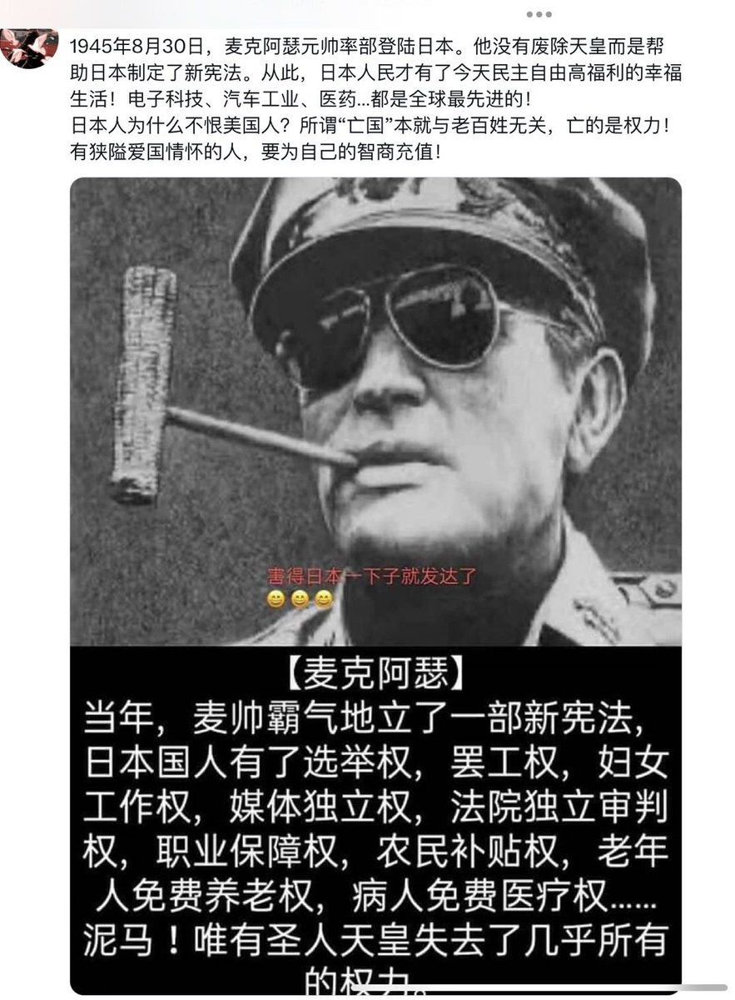
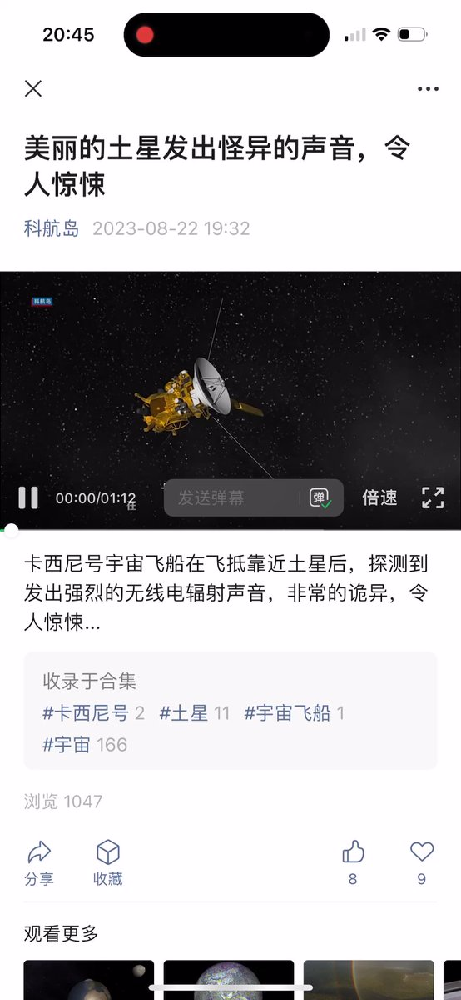
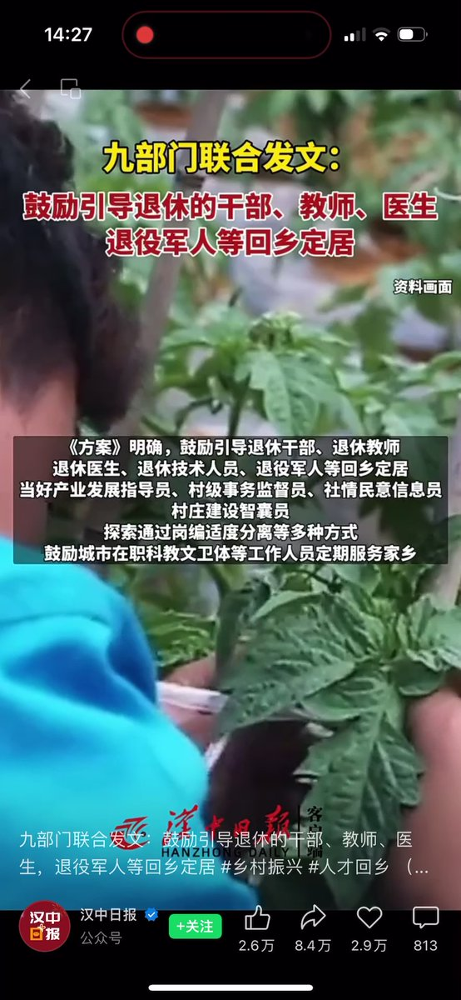

Petrichor 北京时间 2023-08-23T21:17:02Z 1694337957166043362 “只要功夫深，铁杵磨成针”，处于南宋祝穆的《方舆胜览·眉州·磨针溪》。字面意思明确：只要花精力和时间去磨，铁棒也能逐渐变细，最后磨成针。
习总金口玉言，现在将其改成“只要功夫深，土里出黄金”。这一改，就有了经济意义。但是，字面逻辑反而欠缺了。只要在土里刨寻，就一定能找到黄金？那可不一定，黄金在地球中的分布是极其不均匀的，否则还要探金矿的专家干嘛？给你随便拉一车土，你功夫再深，土里依然出不来黄金。或许有人说，用土种菜种粮，收获后卖了，买黄金。 那是田，不是土。多少田，收获后扣除成本，结余能买黄金？中国农民历来温饱解决不了，还买黄金？   Petrichor 北京时间 2023-08-23T20:26:10Z 1694325154942259245 连救死扶伤的药很多是假的，假药竟然高价卖给百姓。当局还让受剥削的百姓作为这个国家的居民偷着乐。这个国家里，偷着乐的一直是贪官污吏和赵家人，他们是捂产阶级，有巨额财产却不敢公开，把子女情人送国外慢慢享受他们贪腐敛财，正是偷着乐。 https://t.co/Cz395FMQoU   Petrichor 北京时间 2023-08-23T10:35:33Z 1694176521605247031 给割掉中国588.38万平方公里的侵略者援助4000亿美元，大脑有病吧，而且是在中国人民自已温饱问题没有解决、许多人看不起病、上不起学的情况下援助俄罗斯的，这不是伤心病狂吗？俄罗斯拿着中国援助的钱去侵略乌克兰，然后遭到全世界群殴。怪不得老百姓称他们是俄爹的亲儿子。 https://t.co/4I2mQhYkU1   Petrichor 北京时间 2023-08-23T12:03:32Z 1694198662031720882 突然羡慕起日本人来。要不是当年的军国主义，被美军打败，战后也不会有一套美国主导制定的法律和制度？ https://t.co/1gbAQJZGm3   Petrichor 北京时间 2023-08-23T08:50:09Z 1694149997342736723 卡西尼号宇宙飞船在飞抵靠近土星后，探测到一种极其恐怖的声音，令人惊悚，其成因尚不清楚。 https://t.co/LbZHwhADeW   Petrichor 北京时间 2023-08-23T02:33:46Z 1694055277161508986 现在说是鼓励引导退休的干部、教师、医生、退役军人等行业人员下乡定居。最后会不会变成强制性的下乡定居？农村永远是大海绵，城市不要的就往农村放。上山下乡从来就是红朝解决经济危机、就业危机的土方土药。习近平什么都模仿毛泽东的，没能与时俱进呢。 https://t.co/8C5QwQA0c6   