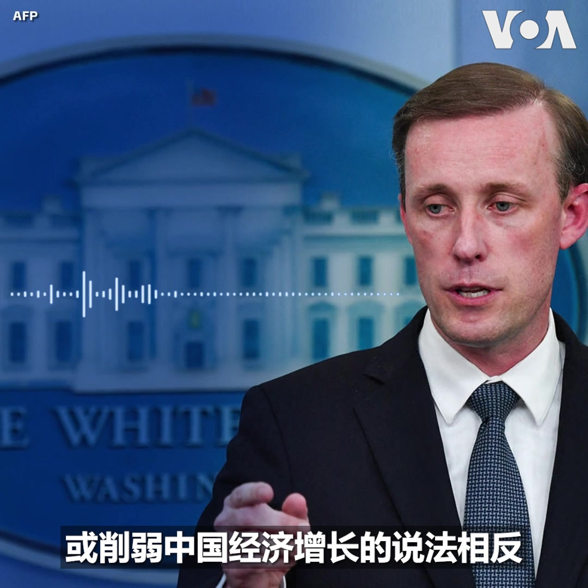

美国之音中文网 北京时间 2023-08-23T09:31:04Z 1694160295088816339 越海逃亡:曾穿“习包子”T恤抗议的异议人士从中国驾水上摩托车抵韩国寻求庇护 https://t.co/WIkNHEpAQW   美国之音中文网 北京时间 2023-08-23T05:39:10Z 1694101932791759091 朱嘉迪的芯片材料创新论文发表后，中国自媒体反应强烈，有的说，“又一中国鸡在美国下蛋了，而且是一枚金蛋”、“北大毕业生让美国芯片再次领先！”；有的称， “如果朱嘉迪在中国，能不能取得如此大的成就值得商榷” 。为此，朱嘉迪做出了回应。 https://t.co/sTPFyrf8YX https://t.co/lvfkjxB1nE   美国之音中文网 北京时间 2023-08-23T06:26:03Z 1694113733738717566 推特上的中国：习近平去哪了？中国领导人意外缺席一场重要金砖峰会论坛 https://t.co/8l6aMSo85t   美国之音中文网 北京时间 2023-08-23T06:38:02Z 1694116748084281351 美国因西藏政策对中国官员实施签证限制 https://t.co/u1Edul6pWu   美国之音中文网 北京时间 2023-08-23T07:06:34Z 1694123926778216904 流亡藏人维人支持美国反制中国的强制同化措施 https://t.co/LyVRA17gJg   美国之音中文网 北京时间 2023-08-23T07:30:12Z 1694129874930114662 共和党党内初选首场辩论即将登场。美国应如何处理与中国的紧张关系以及因应中国日益增强的影响力，料将是这场辩论中重要的外交政策议题之一。共和党主要的总统候选人竞逐者如何看待美中关系？他们都有怎样的对华政策立场或表述？ https://t.co/0o4sI7h6Lb   美国之音中文网 北京时间 2023-08-23T07:37:03Z 1694131600655852021 白宫：拜登将在G20峰会上推动国际货币基金组织和世界银行改革 https://t.co/qJQPq5paZU   美国之音中文网 北京时间 2023-08-23T07:37:05Z 1694131608125952094 对华政策跨国议会联盟谴责中美洲议会取消台湾观察员资格 https://t.co/zS2KonaQy6   美国之音中文网 北京时间 2023-08-23T07:55:00Z 1694136115861852478 白宫国安顾问沙利文8月22号表示，美国商务部长雷蒙多下周访华要传递的信息是：美国不寻求与中国脱钩，而是要降低风险。另外，雷蒙多部长也将强调，中国一些人声称美国正寻求削弱中国经济增长，这跟事实是相反的。 详细报道：https://t.co/Vst0xiPGn3 https://t.co/Af9c8Hv8yM   美国之音中文网 北京时间 2023-08-23T08:40:33Z 1694147581730078798 拜登前往G20峰会,哈里斯将出席东盟和东亚峰会 https://t.co/RAOzylEHqg   美国之音中文网 北京时间 2023-08-23T09:06:01Z 1694153990215262559 #揭谎频道 上周，到访俄罗斯的中国防长李尚福称，两国在军事领域建立了不结盟、不对抗、不针对第三方的合作典范。然而鉴于俄罗斯于 2022 年入侵乌克兰，中国又将目光瞄准台湾，这种结盟本质上是对抗性的。 
https://t.co/QZ9BBbMHDx   美国之音中文网 北京时间 2023-08-23T01:43:34Z 1694042641221165236 香港保安局长邓炳强拒绝归还“国殇之柱”，创作者称香港已“无法无天” https://t.co/SyMoWclAaB   美国之音中文网 北京时间 2023-08-23T03:18:12Z 1694066456663634242 乌克兰国防部8月22日说，乌克兰军队在东南部扎波罗热地区撤走了大批困在当地的平民。官员说，乌军第47机械化旅驾驶布莱德利坦克执行了这次平民撤离行动。7月底，俄军宣称在扎波罗热地区挫败了乌军的反攻。乌克兰国防部指责俄军持续对当地村落的平民实施空袭。 https://t.co/JuJfJQpW5D   美国之音中文网 北京时间 2023-08-23T03:54:35Z 1694075615987777824 雷蒙多访华传递什么信息？沙利文：美不寻求与中国脱钩或削弱中国经济 https://t.co/BbGcJBnpz1   美国之音中文网 北京时间 2023-08-23T04:25:34Z 1694083409759584472 新加坡总理李显龙承诺交权，中国社媒审查有关讨论 https://t.co/uePwZELlnl   美国之音中文网 北京时间 2023-08-23T04:54:04Z 1694090585400058238 特朗普选举干扰案被告开始向佐治亚州投案 https://t.co/11lkGGdS3g   美国之音中文网 北京时间 2023-08-23T05:10:05Z 1694094614003933493 泰国议会投票支持斯雷塔担任总理，亲民主政党被边缘化 https://t.co/Tx3VF8Pnad   美国之音中文网 北京时间 2023-08-23T05:10:43Z 1694094774595195233 快讯：根据美国商务部声明，美国商务部长雷蒙多8月22日与中国驻美大使谢锋举行了“富有成效的讨论”。雷蒙多将于8月27日至30日访问北京和上海。商务部的声明说，“雷蒙多部长提出了对美国、美国企业和工人重要的问题，并讨论了与美中商业关系有关的问题、美国企业面临的挑战以及潜在的合作领域。” https://t.co/6X6BJeH16v   美国之音中文网 北京时间 2023-08-23T05:29:04Z 1694099391114870875 非盟暂停尼日尔成员国资格,直至其“有效恢复宪法秩序”为止 https://t.co/8pusYccXsJ   美国之音中文网 北京时间 2023-08-23T05:57:03Z 1694106434034880961 席卷世界一些地区的热浪可能周末达到高峰 https://t.co/fqxJko2Xzn   美国之音中文网 北京时间 2023-08-23T05:57:05Z 1694106441559547981 记者手记：库皮扬斯克居民为俄军来犯恶况做准备 https://t.co/yiqIJfgG5v   美国之音中文网 北京时间 2023-08-23T06:00:01Z 1694107182545924320 目前所有数据都显示中国经济有严重问题，北京却反批这是西方唱衰中国，中共若继续用维稳方式处理经济问题会有什么后果？香港资深媒体人纪硕鸣告诉美国之音，中共向来对自身问题死不认帐，现在经济问题就像屁股上的脓包怕丑捂住但却越长越大危及性命。时事大家谈完整节目请看：https://t.co/Jv088UH9oE https://t.co/iTZpOZRYNA   美国之音中文网 北京时间 2023-08-23T01:00:34Z 1694031820143345692 中国人润美走线借道南美，巴拿马边防人员疲于应对 https://t.co/QnmHkmYutT   美国之音中文网 北京时间 2023-08-23T02:38:14Z 1694056399054012831 金砖五国（BRICS）22至24日在南非约翰内斯堡举行第15届领导人峰会，寻求扩大影响力并推动全球地缘政治转变。目前金砖集团的扩员引发关注，我们来看一看有哪些国家希望加入？金砖五国的成员对扩员问题态度如何。 https://t.co/EJy2rwScEq   美国之音中文网 北京时间 2023-08-23T02:40:19Z 1694056925141324163 西班牙警方8月22日在加纳利群岛附近海域截获了一艘装有大量毒品走私船。警方说，他们在船上发现了超过1500磅（约合700公斤）的可卡因，并逮捕了四名犯罪嫌疑人。警方怀疑他们受雇于一个从南美向欧洲贩卖毒品的庞大犯罪组织。 https://t.co/GNiTSgXbOD   美国之音中文网 北京时间 2023-08-23T02:58:34Z 1694061516461613522 香港保安局长回信“国殇之柱”创作者 称艺术创作是危害国安惯技 https://t.co/5xyA6Bd5vh   美国之音中文网 北京时间 2023-08-23T03:41:03Z 1694072206685544948 美国务卿宣布对涉强制同化藏族儿童的中国官员实施签证限制 https://t.co/fRWfslds83   美国之音中文网 北京时间 2023-08-23T03:54:34Z 1694075608484168014 尼泊尔总理九月访华 两国将恢复联合军事演习 https://t.co/6CZiv9OiXg   美国之音中文网 北京时间 2023-08-23T04:11:34Z 1694079888737845585 北大高材生推动美国芯片材料创新 https://t.co/p9XUGZq8pQ   美国之音中文网 北京时间 2023-08-23T00:23:32Z 1694022502845223324 繁华过后一地鸡毛，欧商会主席：北京当务之急是消除不确定性 https://t.co/PivaxUxLPb   美国之音中文网 北京时间 2023-08-23T00:23:34Z 1694022510474649817 清真寺消除阿拉伯元素，分析：中共最终会消除外来宗教 https://t.co/wauSbNWVAF   美国之音中文网 北京时间 2023-08-23T00:30:00Z 1694024130604200130 美国国务院8月22日宣布对参与在政府开办的寄宿学校强行同化100多万藏族儿童的中华人民共和国官员实施签证限制。美国国务卿布林肯在一份声明中敦促中国当局停止在西藏和其他地区的压制性同化政策。 https://t.co/kfrYDVUJKO   美国之音中文网 北京时间 2023-08-23T01:16:02Z 1694035714835628258 路透：因应美中贸易关系恶化，中韩稀土磁铁公司进军越南 https://t.co/FFXSS32v5I   美国之音中文网 北京时间 2023-08-23T01:43:35Z 1694042648791917044 华盛顿取消对27家中国实体制裁，北京解读：在雷蒙多访华前释放积极信号 https://t.co/VC1li5CrgV   美国之音中文网 北京时间 2023-08-23T00:06:04Z 1694018104572129469 世界媒体看中国 - 危机溯源与展望 https://t.co/DBikzcpUGE   美国之音中文网 北京时间 2023-08-23T00:20:20Z 1694021694539903486 中国最近在南中国海有主权争议的西沙群岛中建岛疑似新修筑了一条机场跑道。分析人士推测，这条跑道应是为了探采石油与能源而建的后勤补给用途，但中国违反“南海各方行为宣言”的做法不仅无助推进“南海行为准则”的磋商，反而加深对周边国家的干扰。报道：https://t.co/0GGuDeypuy https://t.co/lLXU7034eO   