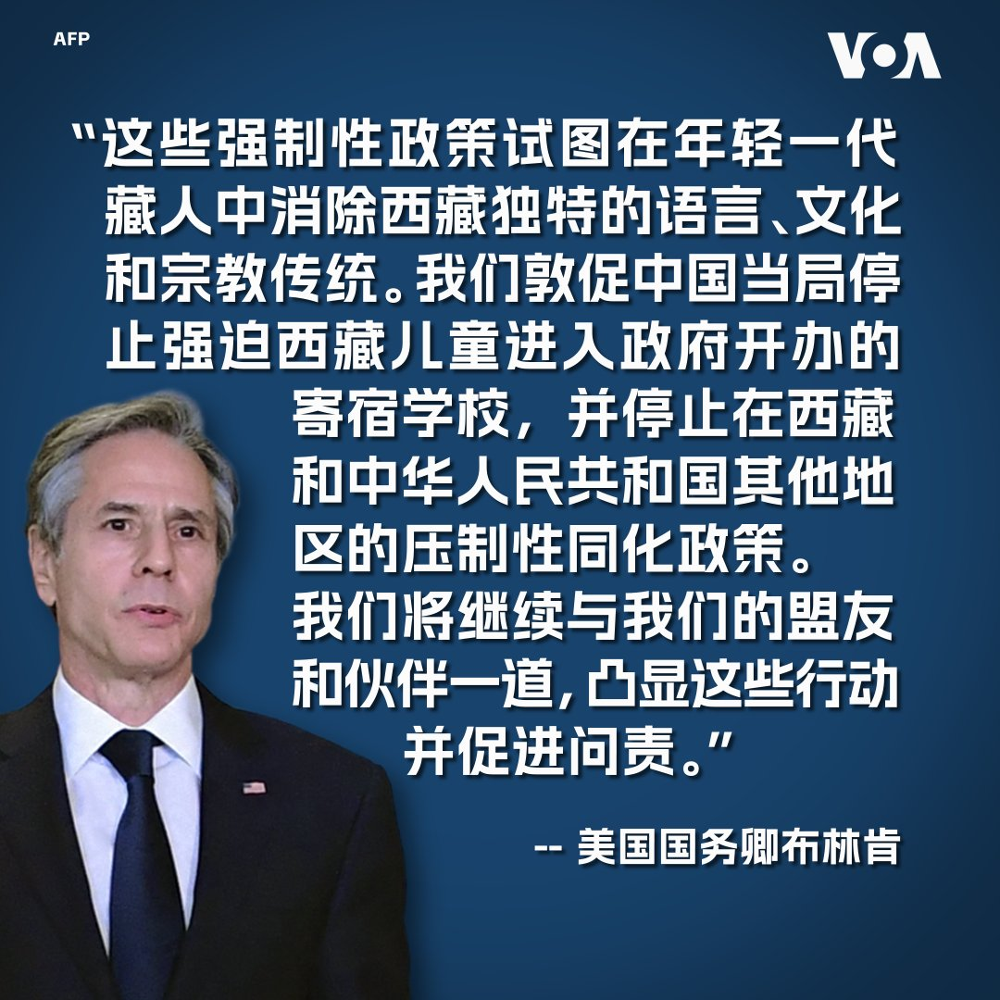

美国之音中文网 北京时间 2023-08-23T02:38:14Z 1694056399054012831 金砖五国（BRICS）22至24日在南非约翰内斯堡举行第15届领导人峰会，寻求扩大影响力并推动全球地缘政治转变。目前金砖集团的扩员引发关注，我们来看一看有哪些国家希望加入？金砖五国的成员对扩员问题态度如何。 https://t.co/EJy2rwScEq   美国之音中文网 北京时间 2023-08-23T02:40:19Z 1694056925141324163 西班牙警方8月22日在加纳利群岛附近海域截获了一艘装有大量毒品走私船。警方说，他们在船上发现了超过1500磅（约合700公斤）的可卡因，并逮捕了四名犯罪嫌疑人。警方怀疑他们受雇于一个从南美向欧洲贩卖毒品的庞大犯罪组织。 https://t.co/GNiTSgXbOD   美国之音中文网 北京时间 2023-08-23T02:58:34Z 1694061516461613522 香港保安局长回信“国殇之柱”创作者 称艺术创作是危害国安惯技 https://t.co/5xyA6Bd5vh   美国之音中文网 北京时间 2023-08-23T03:41:03Z 1694072206685544948 美国务卿宣布对涉强制同化藏族儿童的中国官员实施签证限制 https://t.co/fRWfslds83   美国之音中文网 北京时间 2023-08-23T03:54:34Z 1694075608484168014 尼泊尔总理九月访华 两国将恢复联合军事演习 https://t.co/6CZiv9OiXg   美国之音中文网 北京时间 2023-08-23T04:11:34Z 1694079888737845585 北大高材生推动美国芯片材料创新 https://t.co/p9XUGZq8pQ   美国之音中文网 北京时间 2023-08-23T00:23:32Z 1694022502845223324 繁华过后一地鸡毛，欧商会主席：北京当务之急是消除不确定性 https://t.co/PivaxUxLPb   美国之音中文网 北京时间 2023-08-23T00:23:34Z 1694022510474649817 清真寺消除阿拉伯元素，分析：中共最终会消除外来宗教 https://t.co/wauSbNWVAF   美国之音中文网 北京时间 2023-08-23T00:30:00Z 1694024130604200130 美国国务院8月22日宣布对参与在政府开办的寄宿学校强行同化100多万藏族儿童的中华人民共和国官员实施签证限制。美国国务卿布林肯在一份声明中敦促中国当局停止在西藏和其他地区的压制性同化政策。 https://t.co/kfrYDVUJKO   美国之音中文网 北京时间 2023-08-23T01:16:02Z 1694035714835628258 路透：因应美中贸易关系恶化，中韩稀土磁铁公司进军越南 https://t.co/FFXSS32v5I   美国之音中文网 北京时间 2023-08-23T01:43:35Z 1694042648791917044 华盛顿取消对27家中国实体制裁，北京解读：在雷蒙多访华前释放积极信号 https://t.co/VC1li5CrgV   美国之音中文网 北京时间 2023-08-23T00:06:04Z 1694018104572129469 世界媒体看中国 - 危机溯源与展望 https://t.co/DBikzcpUGE   美国之音中文网 北京时间 2023-08-23T00:20:20Z 1694021694539903486 中国最近在南中国海有主权争议的西沙群岛中建岛疑似新修筑了一条机场跑道。分析人士推测，这条跑道应是为了探采石油与能源而建的后勤补给用途，但中国违反“南海各方行为宣言”的做法不仅无助推进“南海行为准则”的磋商，反而加深对周边国家的干扰。报道：https://t.co/0GGuDeypuy https://t.co/lLXU7034eO   