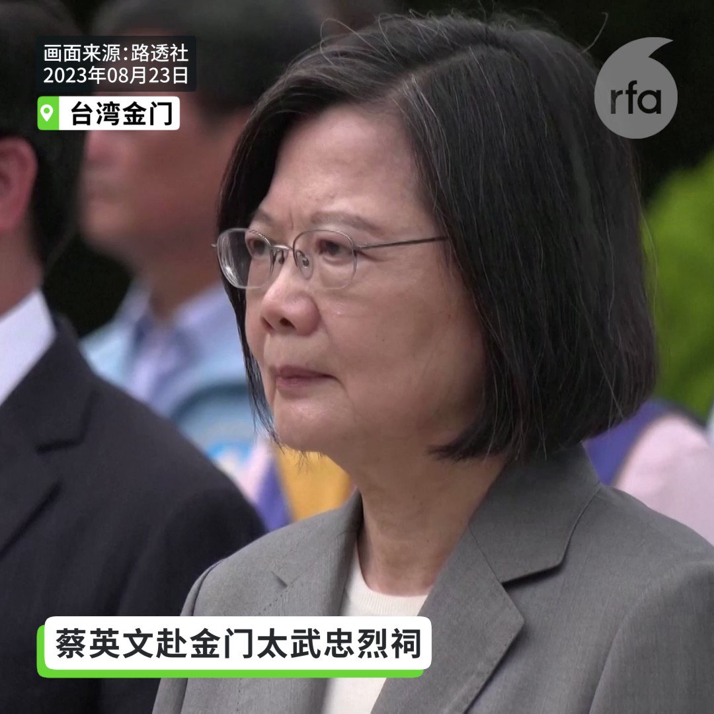
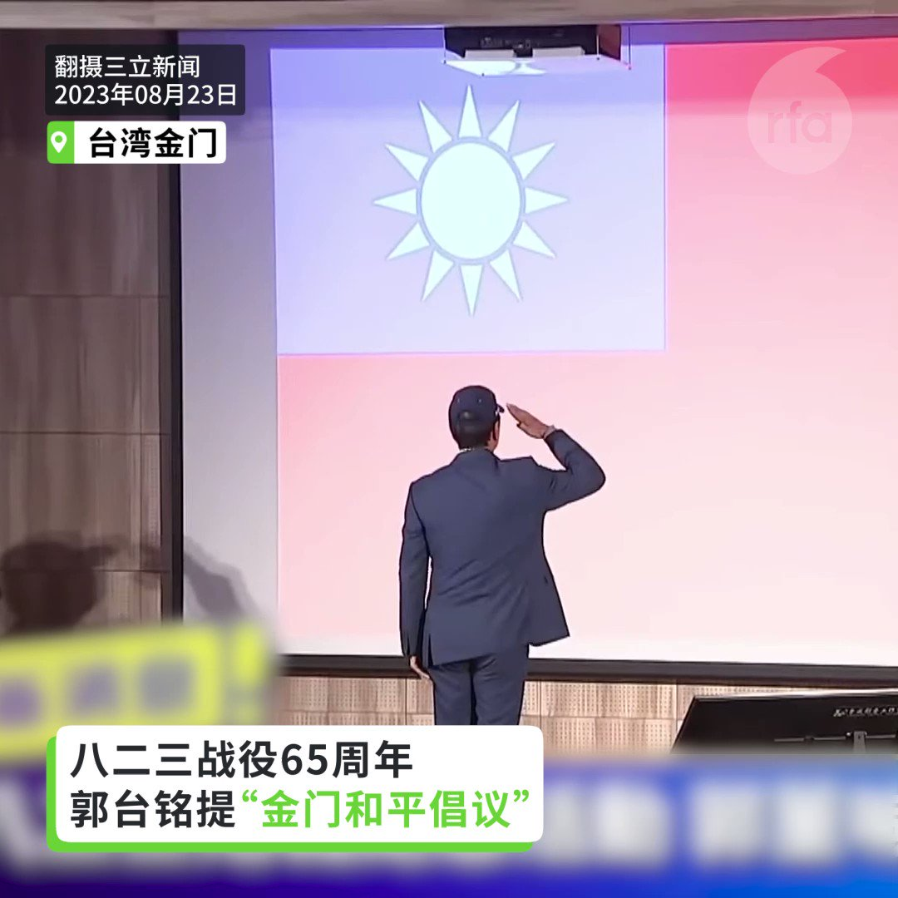
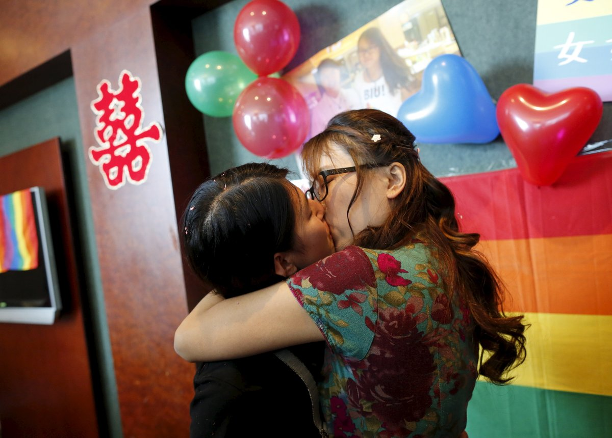

自由亚洲电台 北京时间 2023-08-23T22:42:15Z 1694359401724043484 评论 | #魏京生：#北戴河 如今静悄悄
 https://t.co/v97nKbg3lh   自由亚洲电台 北京时间 2023-08-23T23:44:19Z 1694375021714825391 今年是 #823金门战役65周年，台湾的总统 #蔡英文 赴金门出席纪念活动。由于正值台湾总统大选竞选期，金门成了参选人发表两岸议题的造势场合。与此同时，中国又宣布将在周四举行实弹射击。

 https://t.co/SDAodmKlk8   自由亚洲电台 北京时间 2023-08-23T21:49:20Z 1694346084619870226 RT @RFA_Chinese: 【中国青年张俊杰控诉因参与白纸运动被送入精神病院】

中央财经大学大一学生张俊杰控诉因为他接连参加白纸与烟花运动，两度被送进精神病院。张俊杰接受本台专访揭露在精神病院遭不人道待遇。他一拿到新西兰大学的入学申请，立刻决定提前“润”出中国。 htt…   自由亚洲电台 北京时间 2023-08-23T21:49:44Z 1694346185580892266 RT @RFA_Chinese: 【习近平高调出访南非  拉拢"全球南方"国家制衡西方？】 https://t.co/rtQN0qgCOD   自由亚洲电台 北京时间 2023-08-23T22:13:39Z 1694352202612293982 身在南非的中国国家主席 #习近平 没有现身工商论坛闭幕式，成为这次 #金砖五国峰会 的焦点。 "#习近平去哪儿"瞬间成为国际热门话题。中国外交部对此闪烁其词引发更多揣测。对于事件背后，是否涉及更高的机密，专家学者各有看法。

 https://t.co/nciS8Yg0sM   自由亚洲电台 北京时间 2023-08-23T18:21:17Z 1694293724929650919 【#八二三炮战65周年】
【蔡英文侯友宜赴金门参加同场纪念活动】
【柯文哲台北忠烈祠致敬阵亡将士】
8月23日金门战役65周年，曾经是烽火最前线的金门成为台湾总统选举角力战场。台湾的总统蔡英文赴金门出席纪念活动。国民党总统参选人侯友宜也同场出席。而民众党的柯文哲在台北的忠烈祠向823炮战阵亡将士献花致敬。柯文哲主张打造专业实战军队，实践国防预算占GDP3%。   自由亚洲电台 北京时间 2023-08-23T17:25:58Z 1694279803489378670 【八二三炮战65周年】
【郭台铭主张两岸签和平协定 基进党斥“卖国贼”】
8月23日八二三炮战65周年，鸿海创办人郭台铭提出台湾应该与中国签和平协定，提出“金门和平宣言”和“金门和平倡议”。他23日赴金门县议会发表演说时，遇到台湾基进党干部闹场，怒骂他是“卖国贼”。
#823 #郭台铭 #金门 https://t.co/JOEnmBrjSa   自由亚洲电台 北京时间 2023-08-23T15:24:48Z 1694249313441046739 【中国多个同性恋公众号被永久关闭】
【性少数群体活动受重创】
中国七夕情人节当天，北京拉拉沙龙、豌豆黄艺术小组等6个同性恋、无性恋微信公众号被同时关闭。学者说，不仅是侵犯言论自由，也侵犯了同性恋群体。封号使同性恋群组无法通过社交平台进行交流活动，侵害了同性恋的相关权益。详细报道：https://t.co/OWolnaDMQU     
#情人节 #同性恋   自由亚洲电台 北京时间 2023-08-23T13:40:08Z 1694222971794043267 RT @RFA_Chinese: 【中国青年张俊杰控诉因参与白纸运动被送入精神病院】

中央财经大学大一学生张俊杰控诉因为他接连参加白纸与烟花运动，两度被送进精神病院。张俊杰接受本台专访揭露在精神病院遭不人道待遇。他一拿到新西兰大学的入学申请，立刻决定提前“润”出中国。 htt…   自由亚洲电台 北京时间 2023-08-23T09:25:47Z 1694158964576104683 8月19日，#中国海军医院船 停靠 #所罗门群岛 霍尼亚拉，还访问了基里巴斯、汤加和瓦努阿图，作为其当前任务的一部分，为太平洋岛国提供免费医疗，其中许多岛国难以提供足够的基本医疗保健。
 https://t.co/xOVPjhU6XV   自由亚洲电台 北京时间 2023-08-23T09:30:57Z 1694160265640870390 "己所不育勿施于人"
#七夕 #催生 #生育率  https://t.co/v7gQIUF2Zk   自由亚洲电台 北京时间 2023-08-23T09:32:41Z 1694160697947791545 据本台中文部日前引述韩联社报道，韩国仁川海洋警察署8月20日披露，有一名中国人试图骑水上摩托艇潜入韩国，当天被警方抓获。此人是从山东出发，共行驶了300公里，8月16日到达了仁川近海。他向警方交代，他曾来过韩国，并到过仁川几次。
 https://t.co/ZaZVXEjh7t   自由亚洲电台 北京时间 2023-08-23T10:00:25Z 1694167679106752654 由四川省成都市政府运营的媒体《每日经济新闻》上周援引国家卫健委下属单位的一项研究称，去年中国 #总和生育率 从2020年的1.30降至1.09。总和生育率指一国或地区的妇女在育龄期间每人平均生育子女数。
 https://t.co/NjEVInMvKn   自由亚洲电台 北京时间 2023-08-23T04:26:49Z 1694083725057998927 随着美日韩三国联手强化印太地区同盟，中国似乎也在拉拢"全球南方"国家，试图打造制衡西方的力量体系。本周二，中共领导人 #习近平 与 #南非 总统拉马福萨举行会谈，其所谓"#同志加兄弟"的外交口号再次引发外界的关注。

 https://t.co/U7rufRqRzu   自由亚洲电台 北京时间 2023-08-23T05:00:25Z 1694092182456803835 【习近平高调出访南非  拉拢"全球南方"国家制衡西方？】 https://t.co/rtQN0qgCOD   自由亚洲电台 北京时间 2023-08-23T03:00:24Z 1694061978405454266 #英国外相 克莱弗利（James Cleverly）据报将于下周访问中国，这将是五年来首位访问中国的英国外相。虽然克莱弗利很可能向中方提出 #香港 及 #新疆 议题，然而人权关注者担心，如果缺乏实际行动，克莱弗利对人权议题的表态成效有限。

 https://t.co/3Pd4UVMfoI   自由亚洲电台 北京时间 2023-08-23T03:07:53Z 1694063863141146915 8月22日，天津南开区 #新天地大厦 发生火灾。 https://t.co/qgBZJEj8sO   自由亚洲电台 北京时间 2023-08-23T03:30:01Z 1694069430538649644 中国人权律师 #高智晟 失踪已经六年，加拿大和全球许多国家城市连动声援，一百多人站在街头呼吁中国当局释放高智晟。
活动组织者表示，海外更需要大声力挺中国政治犯，让他们知道世人不会遗忘他们的付出。

 https://t.co/Btx4Jp5XaB   自由亚洲电台 北京时间 2023-08-23T04:00:00Z 1694076977916035233 “我在去年参加 #白纸革命，今年1月份又参加 #烟花革命，导致我两次被中国警方关入精神病院。所以，我润出中国主要是为了逃离中共的迫害。”人在新西兰的 #张俊杰 接受本台视频访问，揭露参与两次运动后的悲惨遭遇。

 https://t.co/0UtnEfYS4y   自由亚洲电台 北京时间 2023-08-23T00:48:01Z 1694028663355056296 评论 | #程晓农：#中国金融 外资断流（下篇）
 https://t.co/TQlkbeUtPQ   自由亚洲电台 北京时间 2023-08-23T01:33:35Z 1694040130221162547 美国国务院8月22日发布关于西藏强迫同化问题的签证限制公告。公告说，国务院正在根据《移民和国籍法》第 212(a)(3)(C) 条的规定，对中华人民共和国 (PRC) 有关官员实施签证限制，因为他们参与了强迫超过 一百万藏族儿童在政府开办的寄宿学校就读。 这些强制性政策旨在消除年轻一代藏人中西藏独特的语言、文化和宗教传统。
公告敦促中国当局停止强迫西藏儿童进入政府开办的寄宿学校，并停止在西藏和中国其他地区的镇压同化政策。 公告说，我们将继续与我们的盟友和伙伴合作，持续这些行动并促进问责制。
美国国务院22日在回复本台藏语组的电邮中说，根据美国法律，个人签证记录是保密的，我们无法提供有关谁正在或将受到影响的详细信息。该政策涵盖被认为对镇压宗教和精神实践者、少数民族成员、持不同政见者、人权捍卫者、记者、劳工组织者、民间社会组织者，以及和平抗议者实施的政策或行动负有责任、或者同谋的现任或前任中国官员 。   自由亚洲电台 北京时间 2023-08-23T00:15:33Z 1694020491038904507 据路透社报道，中美洲议会周一投票决定，在台湾成为常驻观察员二十多年后，取消其资格，取而代之的则是中国。因为北京在拉美日益增长的经济影响力使得台北日益边缘化。
 https://t.co/Nml9XsSKi9   