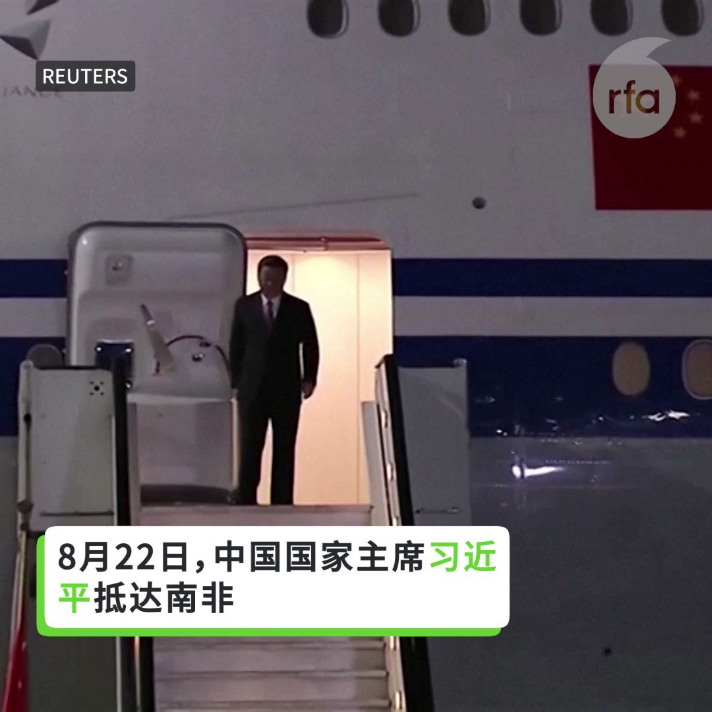
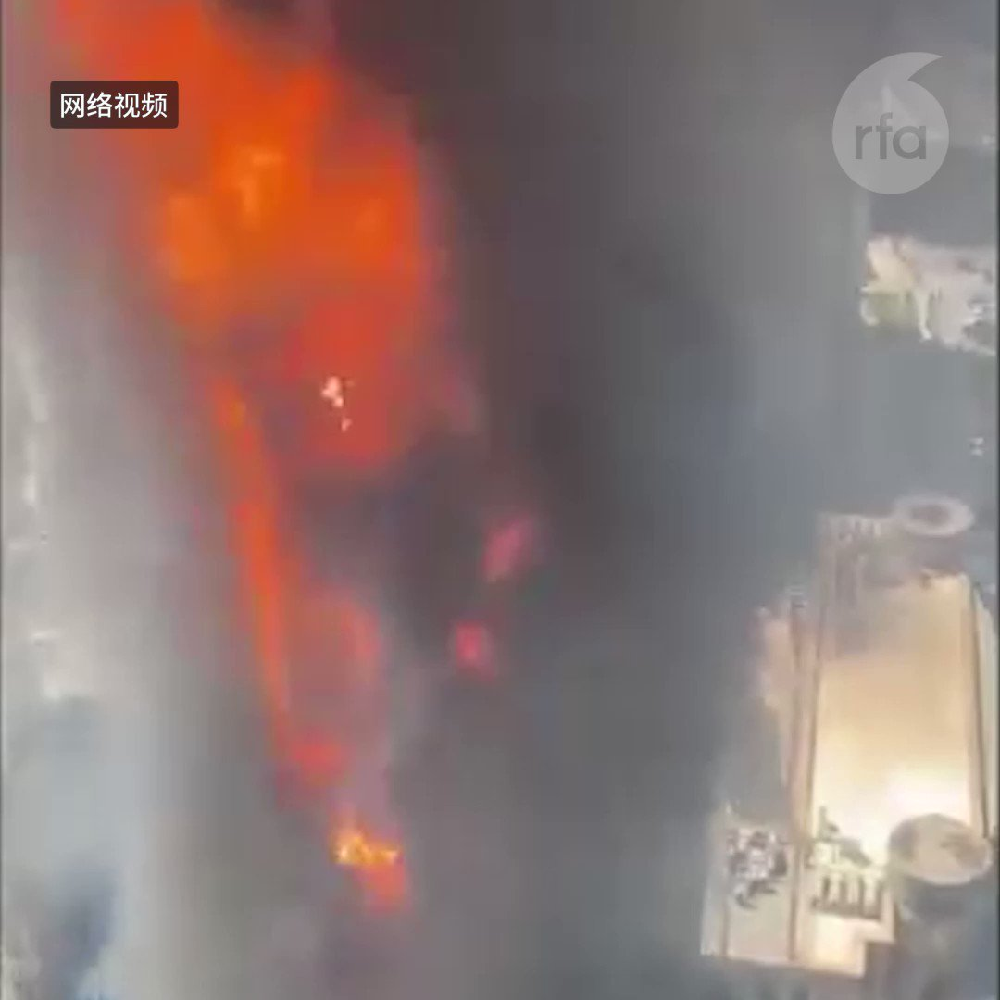
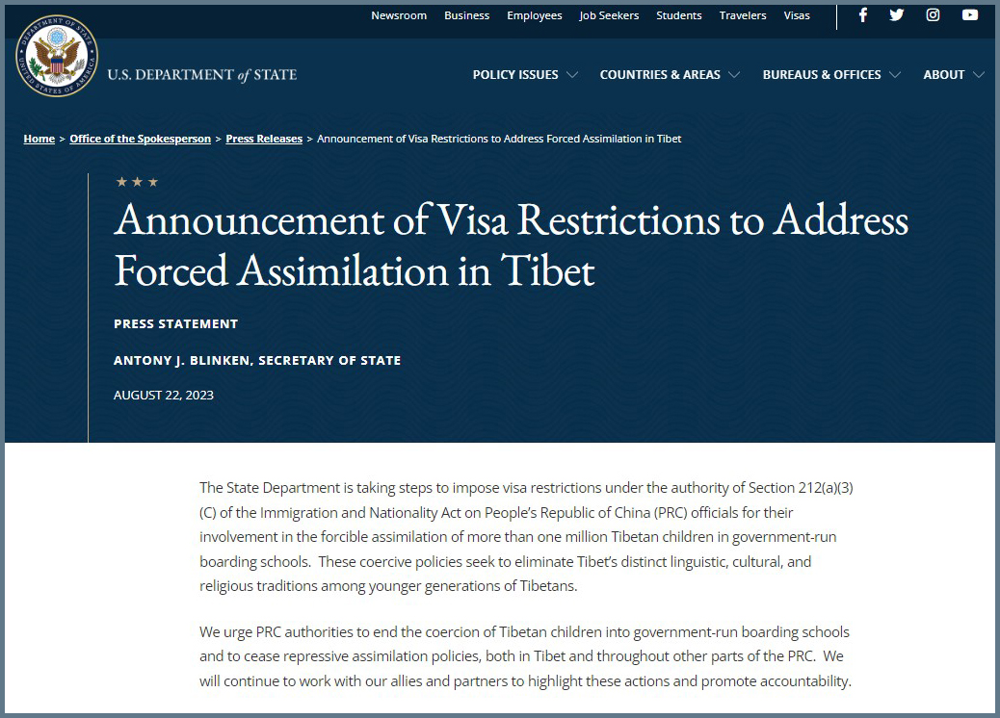

自由亚洲电台 北京时间 2023-08-23T04:26:49Z 1694083725057998927 随着美日韩三国联手强化印太地区同盟，中国似乎也在拉拢"全球南方"国家，试图打造制衡西方的力量体系。本周二，中共领导人 #习近平 与 #南非 总统拉马福萨举行会谈，其所谓"#同志加兄弟"的外交口号再次引发外界的关注。

 https://t.co/U7rufRqRzu   自由亚洲电台 北京时间 2023-08-23T05:00:25Z 1694092182456803835 【习近平高调出访南非  拉拢"全球南方"国家制衡西方？】 https://t.co/rtQN0qgCOD   自由亚洲电台 北京时间 2023-08-23T03:00:24Z 1694061978405454266 #英国外相 克莱弗利（James Cleverly）据报将于下周访问中国，这将是五年来首位访问中国的英国外相。虽然克莱弗利很可能向中方提出 #香港 及 #新疆 议题，然而人权关注者担心，如果缺乏实际行动，克莱弗利对人权议题的表态成效有限。

 https://t.co/3Pd4UVMfoI   自由亚洲电台 北京时间 2023-08-23T03:07:53Z 1694063863141146915 8月22日，天津南开区 #新天地大厦 发生火灾。 https://t.co/qgBZJEj8sO   自由亚洲电台 北京时间 2023-08-23T03:30:01Z 1694069430538649644 中国人权律师 #高智晟 失踪已经六年，加拿大和全球许多国家城市连动声援，一百多人站在街头呼吁中国当局释放高智晟。
活动组织者表示，海外更需要大声力挺中国政治犯，让他们知道世人不会遗忘他们的付出。

 https://t.co/Btx4Jp5XaB   自由亚洲电台 北京时间 2023-08-23T04:00:00Z 1694076977916035233 “我在去年参加 #白纸革命，今年1月份又参加 #烟花革命，导致我两次被中国警方关入精神病院。所以，我润出中国主要是为了逃离中共的迫害。”人在新西兰的 #张俊杰 接受本台视频访问，揭露参与两次运动后的悲惨遭遇。

 https://t.co/0UtnEfYS4y   自由亚洲电台 北京时间 2023-08-23T00:48:01Z 1694028663355056296 评论 | #程晓农：#中国金融 外资断流（下篇）
 https://t.co/TQlkbeUtPQ   自由亚洲电台 北京时间 2023-08-23T01:33:35Z 1694040130221162547 美国国务院8月22日发布关于西藏强迫同化问题的签证限制公告。公告说，国务院正在根据《移民和国籍法》第 212(a)(3)(C) 条的规定，对中华人民共和国 (PRC) 有关官员实施签证限制，因为他们参与了强迫超过 一百万藏族儿童在政府开办的寄宿学校就读。 这些强制性政策旨在消除年轻一代藏人中西藏独特的语言、文化和宗教传统。
公告敦促中国当局停止强迫西藏儿童进入政府开办的寄宿学校，并停止在西藏和中国其他地区的镇压同化政策。 公告说，我们将继续与我们的盟友和伙伴合作，持续这些行动并促进问责制。
美国国务院22日在回复本台藏语组的电邮中说，根据美国法律，个人签证记录是保密的，我们无法提供有关谁正在或将受到影响的详细信息。该政策涵盖被认为对镇压宗教和精神实践者、少数民族成员、持不同政见者、人权捍卫者、记者、劳工组织者、民间社会组织者，以及和平抗议者实施的政策或行动负有责任、或者同谋的现任或前任中国官员 。   自由亚洲电台 北京时间 2023-08-23T00:15:33Z 1694020491038904507 据路透社报道，中美洲议会周一投票决定，在台湾成为常驻观察员二十多年后，取消其资格，取而代之的则是中国。因为北京在拉美日益增长的经济影响力使得台北日益边缘化。
 https://t.co/Nml9XsSKi9   