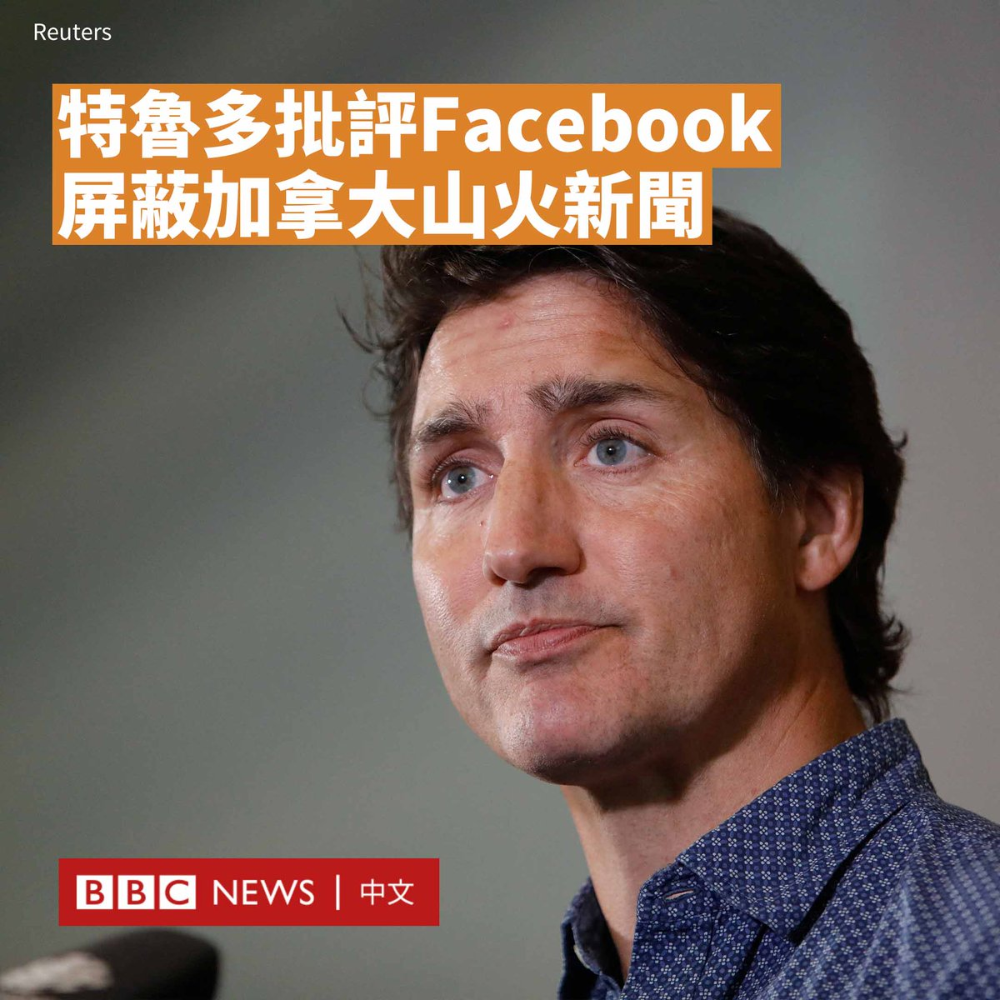
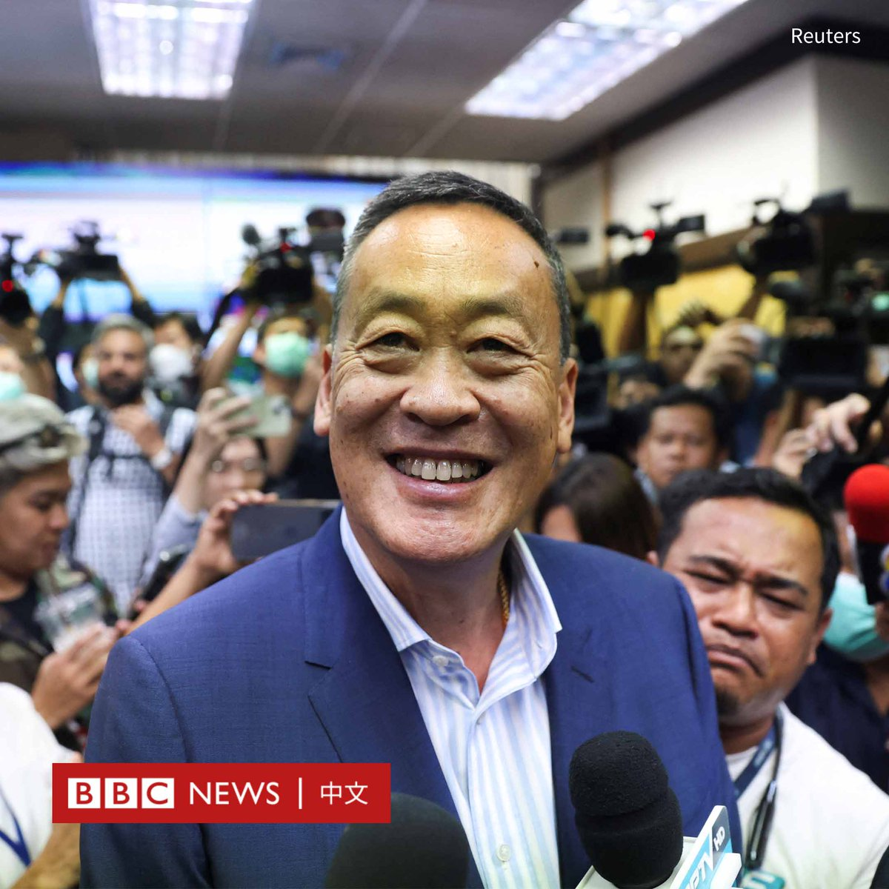
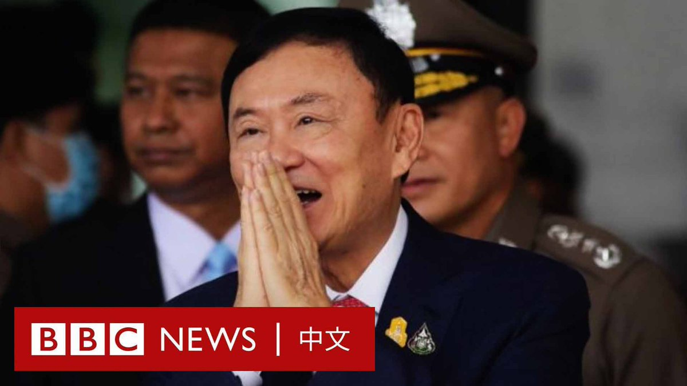

D英国广播公司BBC 北京时间 2023-08-22T20:51:14Z 1693969073493983730 加拿大总理特鲁多（Justin Trudeau）指责Facebook“将利润置于公众安全之上”，因为在加拿大野火肆虐时，Facebook封锁了新闻内容。

此前，加拿大通过了一项“线上新闻法”（Online News Act），强制性要求Google及Facebook等科技巨头向媒体购买新闻内容。

Facebook母公司Meta自8月1日起，在加拿大封锁了Facebook和Instagram上的新闻。

加拿大正遭遇有史以来最严重的野火侵袭。受大火影响的撤离者表示，这一封锁措施影响了他们传递重要消息。

特鲁多周一（8月21日）称，Meta的行为“不可思议”。

自8月起，Meta受到了加拿大官员的严厉批评。上周六，加拿大遗产部长帕斯卡尔·圣翁格（Pascale St-Onge）在社交媒体上发帖称，该公司正在屏蔽用户的“基本信息”。

她补充说，尽管“线上新闻法”尚未生效，但Meta就开始实施反制行为。在另一篇文章中，她曾说Meta的决定“鲁莽”。

Meta称这项法律“立法有根本性的缺陷，忽视了我们平台运作的现实情况”。

Meta在给BBC的声明中称，正是该法律迫使公司“停止发布新闻内容，以遵守法律规定”。

声明称，该平台已为疏散地区的居民开启“安全检查”功能，允许用户标记自己的安全状态，并获得“信誉良好的信息”。

数据显示，约77%的加拿大人使用Facebook，其中四分之一的用户依赖它获取新闻。   D英国广播公司BBC 北京时间 2023-08-22T19:11:38Z 1693944009138294931 日本决定从周四（8月24日）起将处理后的福岛核电站放射性污水排入太平洋。中国外交部批评日本此举“极端自私，极不负责任”，香港则宣布禁止十个都县水产品进口。https://t.co/Vduguaw5nI   D英国广播公司BBC 北京时间 2023-08-22T18:14:06Z 1693929529964732477 【最新消息】泰国国会参众两院召开联席会议投票选举总理，为泰党候选人社他（又译：赛塔；Srettha Thavisin）获得过半支持，当选下一任泰国总理。 https://t.co/8NVNDD4SNx   D英国广播公司BBC 北京时间 2023-08-22T15:18:45Z 1693885403793907996 一只长颈鹿宝宝🦒上个月在美国田纳西州的布莱兹动物园诞生，但她很快引起很多人的关注，因为她没有任何斑点。

该动物园称，长颈鹿专家相信，她是地球上目前唯一一只纯色网纹长颈鹿。 https://t.co/963qdrKlBw   D英国广播公司BBC 北京时间 2023-08-22T16:21:10Z 1693901111223108060 【最新消息】在日本宣布从周四（8月24日）起向太平洋排放核废水后，香港官员宣布，将从当日起禁止日本东京都、福岛县等十个都县的所有水产品，包括活生、冷冻和干制品，进口香港。 https://t.co/AC9n4uZlQm   D英国广播公司BBC 北京时间 2023-08-22T13:49:07Z 1693862843693793578 在泰国国会即将再就新总理进行投票之际，在海外流亡15年的前总理他信（Thaksin Shinawatra）周二（8月22日）回国。

他在抵达后被带到最高法院，法庭称他将在狱中服刑八年。
  
74岁的他信曾是泰国最受欢迎也极具争议的民选领导人，长期以来受到亲军方和保皇派的反对，其政府在2006年军方政变中倒台。 https://t.co/cE6JN6Ycpn   D英国广播公司BBC 北京时间 2023-08-22T09:19:49Z 1693795076076364183 TikTok平台有强大的力量驱动消费者花钱购买内容制造者推荐的产品，这当中的魔力何在？https://t.co/ProruIwsjt   D英国广播公司BBC 北京时间 2023-08-22T10:35:47Z 1693814192967651649 俄罗斯圣彼得堡附近一架远程轰炸机疑遭到乌克兰无人机袭击损毁。基辅尚未发表回应。

社交媒体上发布的画面显示，一架图波列夫图-22M轰炸机在圣彼得堡以南的索尔茨-2（Soltsy-2）空军基地起火。

图-22M北约代号“逆火”（Backfire），飞行速度能达到音速的两倍，也可携带反舰导弹，曾被俄罗斯广泛用于攻击乌克兰的城市。

俄罗斯国防部在一份声明中表示，莫斯科时间上周六（8月19日）10点左右，一架“直升机型无人机”发动了袭击。

声明称，事发地点是“诺夫哥罗德地区的一个军用机场”，索尔茨-2基地位于该地。

国防部表示，该无人机被机场的观察哨发现，随后被击落。事件导致“一架飞机受损”，但没有造成人员伤亡，火势也很快被扑灭。

社交媒体平台Telegram上的画面显示，一场大火吞噬了一架有着图-22M独特鼻锥的飞机。

尽管损失一架图-22M飞机对目前有着60多架该型号飞机的莫斯科实力影响不大，但此次行动突显出，基辅打击俄罗斯境内纵深目标的能力日益增强。

此外，俄罗斯当局周二（8月22日）表示，俄罗斯军方在莫斯科附近以及与乌克兰接壤的布良斯克地区上空击落了四架乌克兰无人机。   D英国广播公司BBC 北京时间 2023-08-22T09:39:06Z 1693799926801518717 【最新消息】日本首相岸田文雄宣布，将从周四（8月24日）开始，将受损的福岛核电站处理后的废水排入太平洋。 https://t.co/G1kTL7R4XD   