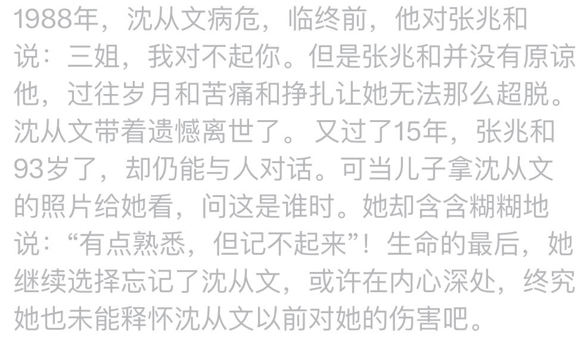
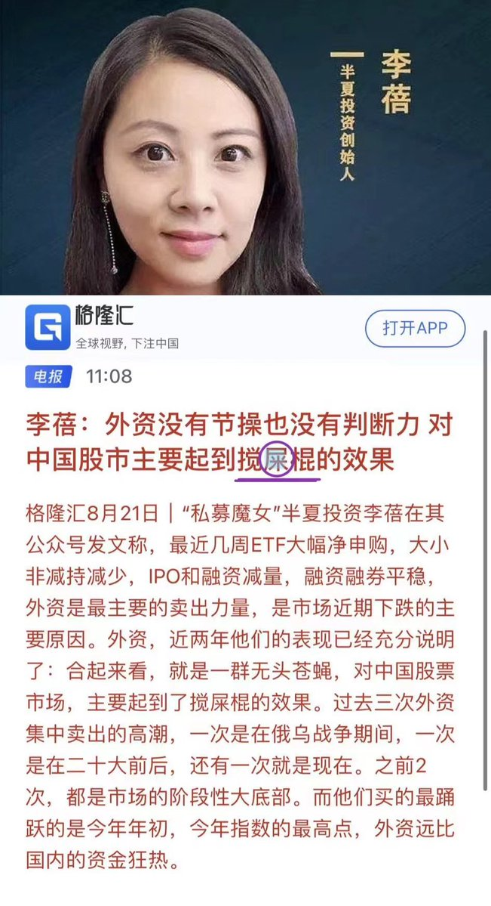
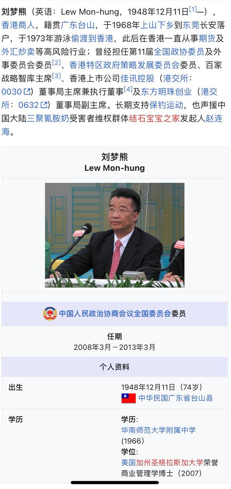
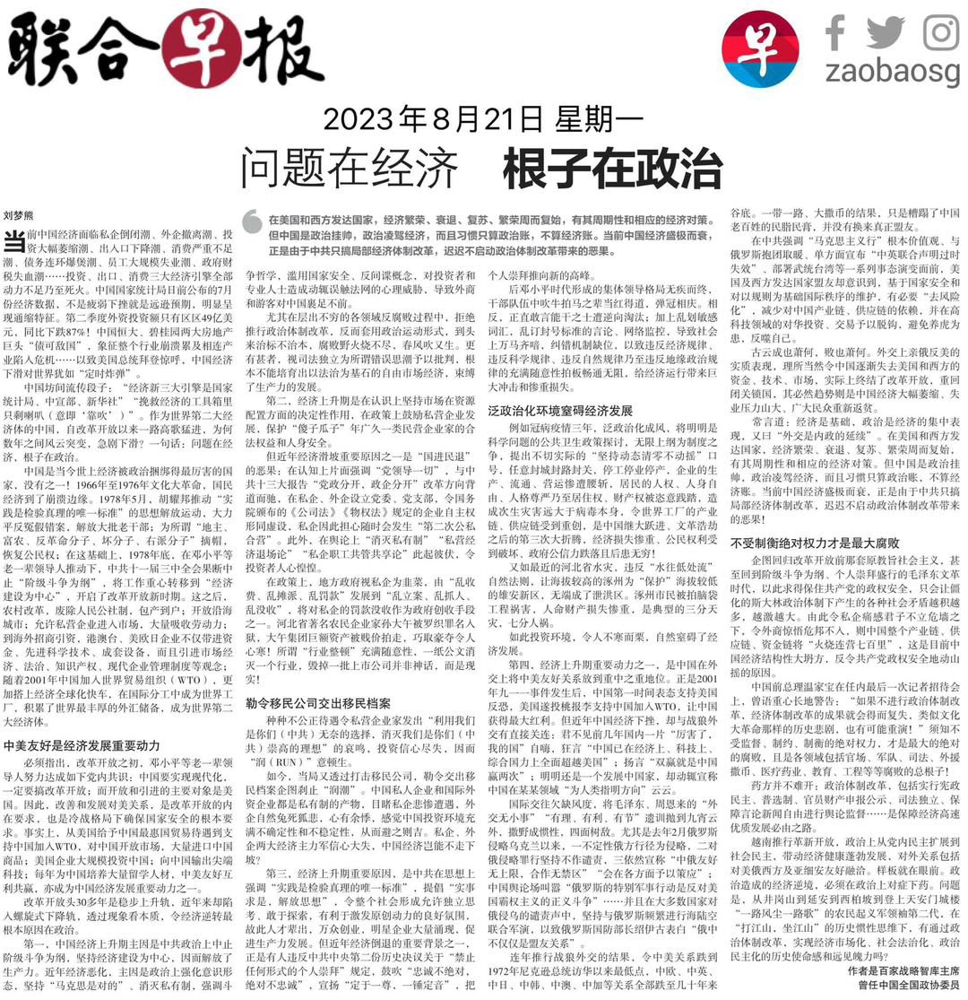
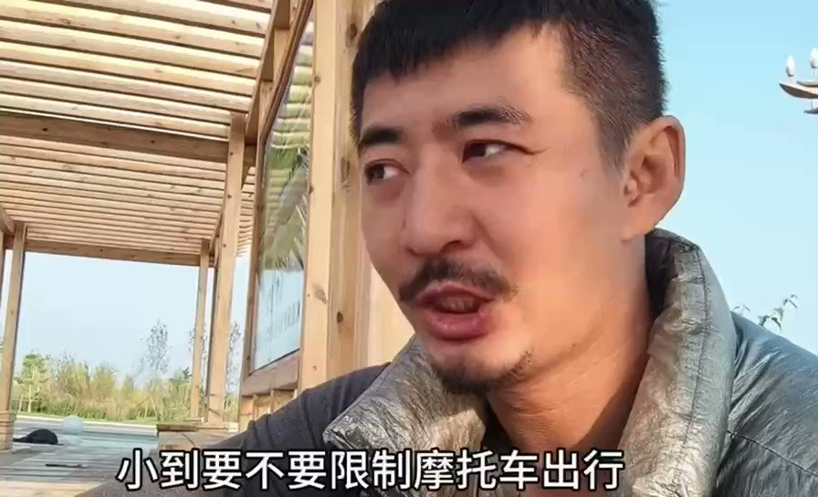
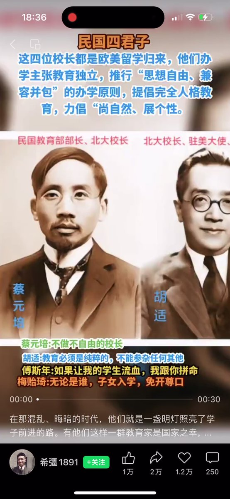
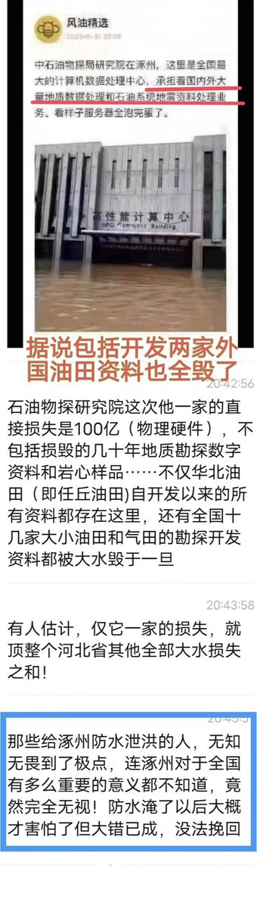

Petrichor 北京时间 2023-08-22T11:01:59Z 1693820786874724836 这是一对不幸福的夫妻，放到现在早离婚了。那个年代，他们内外都忍受煎熬和痛苦。 https://t.co/V3l5CqstIi   Petrichor 北京时间 2023-08-22T11:31:32Z 1693828221672825324 既然已经是“屎”，你还在乎外国人去搅？ https://t.co/MxxSNlNoop   Petrichor 北京时间 2023-08-22T11:40:57Z 1693830589655199876 像刘梦熊这样在境外发表与习总唱反调的学者，现在回中国是否会被抓起来，判刑几年？给他按个境外势力、妄议中央、妄图颠覆国家政权的罪名，是否可能？ https://t.co/f7mzz0ugZV   Petrichor 北京时间 2023-08-22T06:37:06Z 1693754123630309753 无论宪法还是民法，不如领导的看法。
当下中国就是一个卡夫卡式的荒诞社会。什么是卡夫卡式的社会呢？其特质是，“无论规则多么离奇，荒谬或不合逻辑，大多数人都会毫不犹豫地遵守”。因为遵守它，事后才会付出代价，不遵守它，立刻就会付出代价，总之早晚都会为别人的行为付出代价。”最典型的就是疫情期间的三年封控，大白就是坚定执行领导错误决定的一批人，明知政策是错误有害的，但是依然去强力执行，否则官员就丢官。   Petrichor 北京时间 2023-08-22T06:44:33Z 1693756001822884223 存在这样大学校长的国家，制度应该不是太坏、其国家最高领导也应该不是太坏。正因为如此，1949年之后，这样的大学校长没有了。 https://t.co/Ojwz3OXAHU   Petrichor 北京时间 2023-08-22T07:10:14Z 1693762461835342127 中石油下属机构“中国石油东方地球物理公司（物探局）”在涿州。它简称“东方地球物理公司”，BGP），是在原中国石油天然气集团公司石油地球物理勘探局进行公司制改造的基础上，吸纳新疆石油管理局、长庆石油勘探局、大港油田集团有限责任公司、青海石油管理局、华北石油管理局、吐哈石油勘探开发指挥部六家企业的物探资源于2002年12月6日重组成立的 ，是中国石油旗下、中国最大的专门从事地球物理勘探的专业化工程技术服务公司，肩负着为国“找油找气” 的神圣使命。地球物理勘探是石油工业链条中的第一个环节，承担着探寻地宫奥秘、寻找油气资源的重要职责。该集团主要从事国内外陆地、海上地震勘探及综合物化探采集、处理、解释，以及与地球物理（化学）勘探有关的技术及装备研发、产品研制、技术引进与产品销售等业务。公司综合实力位居全球同行业第三，陆上采集业务连续8年稳居全球第一。   