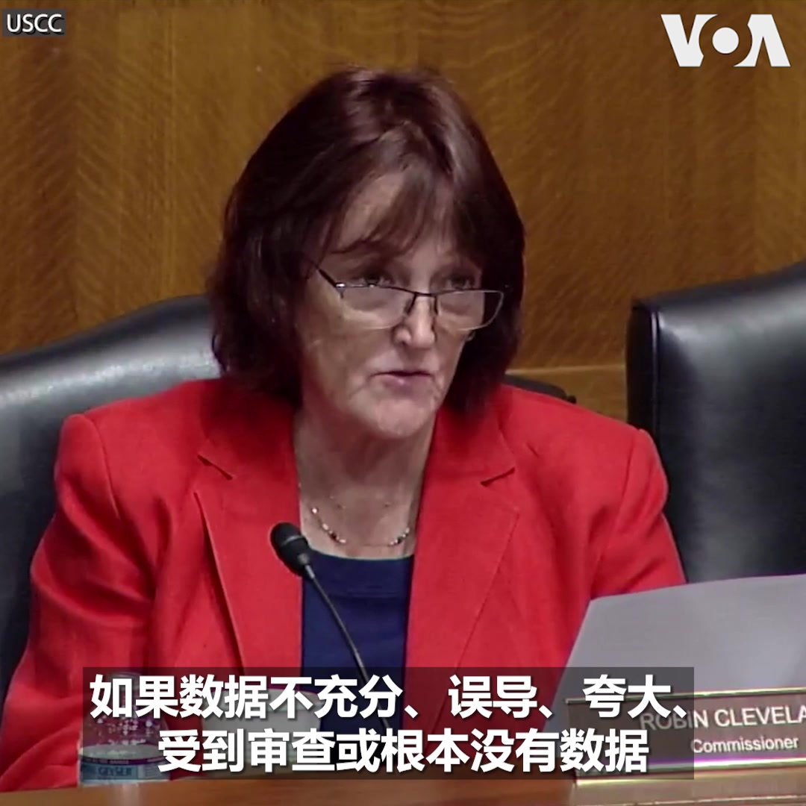

美国之音中文网 北京时间 2023-08-22T20:34:00Z 1693964736763965669 韩国国会22日进行反恐演习。这是民防乙支演习的一部分。 军人、警察、消防队员和政府人员参与演习，模拟国会遭到空袭时的应对。 乙支演习21日开始，将持续4天。韩国还从21日起开始与美国进行乙支自由护盾军演。 https://t.co/6xIlmWGGzl   美国之音中文网 北京时间 2023-08-22T17:51:33Z 1693923857823105491 泰国前总理他信结束流亡 回国后被送入监狱 https://t.co/Cc805Tmqtq   美国之音中文网 北京时间 2023-08-22T14:27:02Z 1693872389317414985 中美洲议会取消台湾永久观察员资格、改由中国取代 https://t.co/NCoZXop72w   美国之音中文网 北京时间 2023-08-22T15:23:03Z 1693886482627637738 福岛核废水定周四排放入海 日相称将负全责 https://t.co/OqJckyUsQq   美国之音中文网 北京时间 2023-08-22T16:14:34Z 1693899447275770164 拜登访问夏威夷 承诺支持野火灾后重建 https://t.co/MB75iZ6ucA   美国之音中文网 北京时间 2023-08-22T07:57:03Z 1693774246110253316 拜登在野火灾后视察夏威夷 https://t.co/XBRAnJjG3i   美国之音中文网 北京时间 2023-08-22T13:06:04Z 1693852011207516252 中国经济陷困境之际 习近平抵南非出席金砖峰会 https://t.co/QsybGLoJfY   美国之音中文网 北京时间 2023-08-22T09:42:33Z 1693800793273762131 前总统特朗普表示周四去佐治亚州投案；法庭文件显示保释金为20万美元 https://t.co/wYPwrEyDk9   美国之音中文网 北京时间 2023-08-22T06:54:05Z 1693758397756444772 乌克兰官员：F-16战机将改变游戏规则 https://t.co/brE10gH2dK   美国之音中文网 北京时间 2023-08-22T07:00:02Z 1693759895219441696 中国经济连环爆雷炸毁国际市场信心，中国崩溃论再现，金融海啸涌进中南海对习近平政权造成多大冲击？ #台湾当归 微博热搜登顶、小粉红暴动，中共军方学者称台湾是中国梦的枕头。台湾当归究竟是大内宣喊爽的？还是习近平真打算在台湾问题上铤而走险以求自保？ 周二【时事大家谈】欢迎留参加讨论。 https://t.co/nbJF2BZC4c   美国之音中文网 北京时间 2023-08-22T07:08:05Z 1693761921835786323 F-16战机能帮乌克兰扭转战局吗？ https://t.co/QGLohBso1j   美国之音中文网 北京时间 2023-08-22T09:00:00Z 1693790086318445016 一键解锁#美国热搜 榜 1、经济崩盘，为什么习近平如此淡定？解码习近平的阳谋
2、中共为什么不给百姓发钱救市3、宿命：10年前种下的经济祸根 4、姓社姓资，习近平的选择5、刑法中的投降罪 6、公共厕所中的总厕长7、河北霸州继续泄洪 https://t.co/pl3XJkrAzJ https://t.co/zSVk95wmCM   美国之音中文网 北京时间 2023-08-22T09:54:32Z 1693803812556075389 即使缺席辩论，特朗普也可能抢对手的风头 https://t.co/8U6hPtkvQu   美国之音中文网 北京时间 2023-08-22T09:54:34Z 1693803820080607243 特朗普在艾奥瓦州早期民调中保持大幅领先 https://t.co/ycNE4lcTyk   美国之音中文网 北京时间 2023-08-22T05:04:04Z 1693730710782447990 澳大利亚最大战舰在菲律宾演习 https://t.co/dy4lL1Vp7a   美国之音中文网 北京时间 2023-08-22T06:39:33Z 1693754741698986411 俄罗斯瓦格纳集团的普里戈津上传兵变后的首个视频，显示他在非洲 https://t.co/Qrn5vt6GRc   美国之音中文网 北京时间 2023-08-22T06:43:56Z 1693755843148452183 美国总统拜登和第一夫人吉尔·拜登抵达夏威夷毛伊岛。拜登夫妇将在毛伊岛与火灾幸存者和紧急救援人员会面。毛伊岛本月发生的火灾造成一百多人死亡，大量房屋被烧毁。这场火灾被认为是美国近一个世纪以来最严重的野外大火。 https://t.co/tpWC8u9k0r   美国之音中文网 北京时间 2023-08-22T06:45:00Z 1693756112057897400 金砖国家峰会22日在南非开幕，中国领导人习近平亲自出席。这是他今年第二次出访，“金砖”为何让他如此重视？分析认为，中国冀望金砖扩员，与美国领导的七国集团抗衡。但印度和巴西对此不太开心，担心中国把金砖变成服务中国利益的工具。金砖能否成功扩张？会否挑战世界秩序？欢迎分享您的看法。 https://t.co/m2aLBzpx7d   美国之音中文网 北京时间 2023-08-22T06:54:06Z 1693758405243277784 五角大楼：美国与日本正“最后敲定”共同开发高超音速武器拦截器项目 https://t.co/4w9oKrPq2X   美国之音中文网 北京时间 2023-08-22T07:49:04Z 1693772236057194555 中国的中药需求助长了越南的蚯蚓热 https://t.co/CMW2d46CJL   美国之音中文网 北京时间 2023-08-22T08:00:00Z 1693774987130225119 【家事国事天下事，你有何见解】
从传说中的大禹到胡锦涛、温家宝，中国历朝历代统治者都将防止和减轻洪水对民众的灾害视为自己合法性的展示和证明。但当朝的中国统治者却公开号令民众接受洪灾并奉献自己的生命财产以铺垫首都北京和副都雄安的护城河。此乃旷古未见的雄才大略？史无前例的残民以逞？ https://t.co/wgIVS2K7Dy   美国之音中文网 北京时间 2023-08-22T08:06:02Z 1693776507599282386 美在台协会主席：在旧金山与台湾副总统回顾了美台前所未有的紧密关系 https://t.co/LGUdPFybX7   美国之音中文网 北京时间 2023-08-22T08:08:40Z 1693777166943822140 拜登总统及第一夫人21日在毛伊岛视察野火造成的破坏后向民众表示，“我们会支持你们，整个国家都会支持你们。” 拜登夫妇周一抵达卡胡卢伊机场，受到夏威夷州长格林和夏威夷国会代表团成员的迎接，然后搭乘“陆战队一号”（Marine One）直升机视察野火灾情。https://t.co/u1ElSocGsH https://t.co/yG40s5l8LM   美国之音中文网 北京时间 2023-08-22T08:27:05Z 1693781802689962099 美国FDA批准孕妇接种RSV疫苗以保护新生儿 https://t.co/4Y2KUgMaJv   美国之音中文网 北京时间 2023-08-22T09:06:33Z 1693791736156615094 美参联会主席米利和教宗方济各讨论乌克兰战争 https://t.co/iHZbr3Uwxu   美国之音中文网 北京时间 2023-08-22T02:45:47Z 1693695910608617475 【家事国事天下事，你有何见解】
中共当局以台湾副总统赖清德过境访问美国为由再度推出针对台湾的军演，并不出所料地受到台湾执政党民进党和在野党国民党的抗议或批评。中共是否会因台湾朝野反对军事威胁的这种共同立场而反省并收敛？抑或会因反对而强化尽快夺取台湾以便对台湾人施行“再教育”的决心？ https://t.co/OrjnzpaqAk   美国之音中文网 北京时间 2023-08-22T03:47:05Z 1693711338902782385 伊朗：可能需要两个月完成与美国的换囚计划 https://t.co/DhAD02EIl7   美国之音中文网 北京时间 2023-08-22T04:34:34Z 1693723287669674340 消息人士：英外交大臣本月将访华 https://t.co/14Elp9cC2t   美国之音中文网 北京时间 2023-08-22T04:44:04Z 1693725678439629058 香港传媒再现危机 学者及记协谈国安法下传媒生存空间 https://t.co/wgi4nofNH6   美国之音中文网 北京时间 2023-08-22T04:44:06Z 1693725686085845072 拜登政府宣布为农村宽带基础设施提供更多新资金 https://t.co/PZX9NXxEaW   美国之音中文网 北京时间 2023-08-22T04:59:11Z 1693729483998859293 “尽管中国经济数据的透明度正在消失，但中国的经济疲软现在已经太明显了，以至于中共无法隐藏，”美中经济与安全审查委员会委员克里弗兰(Robin Cleveland)8月21日在一场关于中国经济的听证会上说。她说，中国面临缺乏足以刺激经济增长的可行基础设施项目，以及开发商和地方政府债务负担过重的双重挑战。 https://t.co/6qZKg8dctu   美国之音中文网 北京时间 2023-08-22T05:37:45Z 1693739187680444418 美国国会下属的美中经济与安全审查委员会的委员格拉斯(Kimberly T. Glas) 周一在一场有关中国经济的听证会上表示，在美国企业力图降低来自中国的风险的同时，中国正在采取行动，确保美企和美国投资者与中国市场交织在一起。 https://t.co/KIxlSsYumN   美国之音中文网 北京时间 2023-08-22T06:13:06Z 1693748086517239892 在中国经济危机四伏之际，美国商务部长雷蒙多据报可能本周访华。中国总理李强21日说，美中关系与贸易合作面临困难。POLITICO报道，雷蒙多访华部分议程是扩大对华出口，中国则会寻求美国放松贸易限制以助中国经济“一臂之力”，美国国会一直敦促雷蒙多绝不让步。雷蒙多的中国行能否缓解困局？您的看法？ https://t.co/7Q2ur4I4RT   美国之音中文网 北京时间 2023-08-22T01:35:33Z 1693678237124342159 美中航班增多：洛杉矶华裔家庭追寻团聚，跨越三年情感等待之旅 https://t.co/4ezcmbabAu   美国之音中文网 北京时间 2023-08-22T03:22:33Z 1693705164409143300 实地目击：乌军在南方反攻之际，俄军攻击乌东北城市 https://t.co/iHe5Za5aU0   美国之音中文网 北京时间 2023-08-22T04:01:36Z 1693714993118883916 印度外交部一位高级官员8月21日说，印度政府对金砖国家扩员保持积极和开放的态度。约占全球GDP约四分之一的金砖五国（BRICS），即巴西、俄罗斯、印度、中国和南非领导人将从8月22日开始在约翰内斯堡举行为期三天的峰会。该机构官员最近说，已有20多个国家正式要求加入该集团。 https://t.co/OfgZg9BqPF   美国之音中文网 北京时间 2023-08-22T04:17:04Z 1693718882559955309 后热带风暴“希拉里”给加利福尼亚州带来洪水暴雨 https://t.co/OubE4Bs3ef   美国之音中文网 北京时间 2023-08-22T01:06:34Z 1693670941749018893 乌克兰无人机再次袭击莫斯科州，导致两人受伤、50个航班起降延误 https://t.co/ST2vhLO80j   美国之音中文网 北京时间 2023-08-22T01:35:35Z 1693678244766286163 美中关系改善仍无起色 李强承认中美关系面临困难 https://t.co/rUIzc9oNrp   美国之音中文网 北京时间 2023-08-22T01:40:59Z 1693679606094852172 美国总统拜登和第一夫人吉尔·拜登21日前往夏威夷毛伊岛视察火灾灾情，与幸存者和救援人员会面。毛伊岛本月发生的火灾造成一百多人死亡，旅游城市拉海纳 Lahaina 几乎被毁。 https://t.co/JOQqpZ0cff   