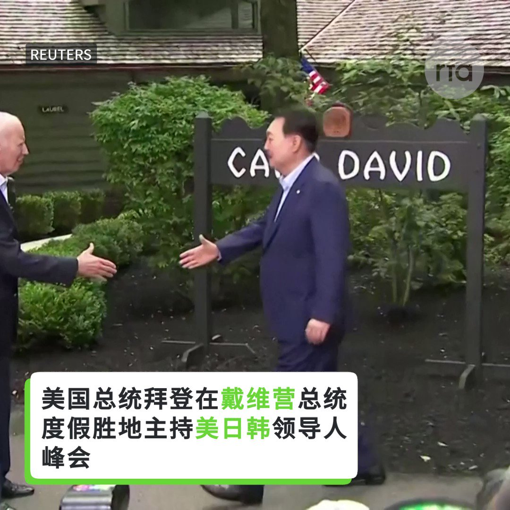
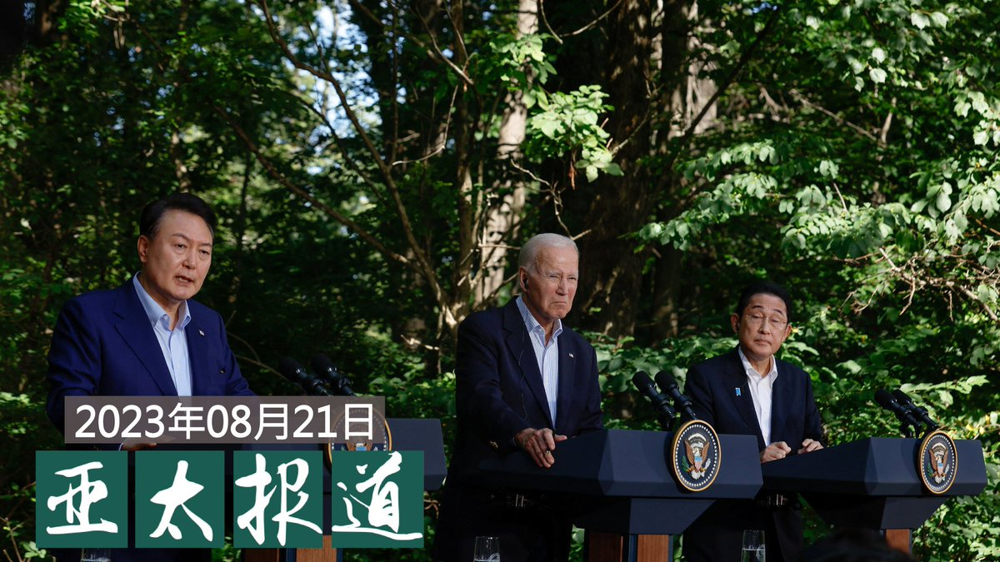

自由亚洲电台 北京时间 2023-08-22T11:02:36Z 1693820939987742824 RT @RFA_Chinese: 中国医疗反腐运动引发极大关注。如何去评价这场运动？反腐会给中国医疗系统带来怎样的影响？中国医疗系统为什么会如此腐败？根本出路在哪？这篇读者来稿从一个角度做出了分析。
医疗事关每个人的切身利益，希望读者听友们广开言路，参与讨论。投稿请寄fanku…   自由亚洲电台 北京时间 2023-08-22T07:29:21Z 1693767275881607605 【#美日韩 戴维营峰会联手　中国为何"坚决反对"？】 https://t.co/1neLWSvADB   自由亚洲电台 北京时间 2023-08-22T07:40:48Z 1693770156931989590 #李玟 生前控诉《#中国好声音》黑幕的录音和视频上周曝光后，《中国好声音》母公司 #星空华文 股价断崖式暴跌，近两个交易日累计跌幅高达47%，市值蒸发达200亿港元。截至发稿，《中国好声音2022》豆瓣评分至已降至2.4分。评论区愤怒声讨排山倒海。 而新一季好声音暂未开分。

您如何看待中国的电视选秀黑幕？这次真的是李玟用生命打败了资本和权力，还是如有的网友质疑，这是高层要整顿娱乐传媒界，拿《中国好声音》开刀？   自由亚洲电台 北京时间 2023-08-22T10:00:00Z 1693805188463915268 评论 | #程晓农：#中国金融 外资断流（上篇）
 https://t.co/Xq52aWJGDJ   自由亚洲电台 北京时间 2023-08-22T07:04:23Z 1693760990289264820 专栏 | #夜话中南海：说说 #中国外汇管理局 和 #金融稳定局 的几位高管
#潘功胜 #易纲 https://t.co/xWLRHL93eh   自由亚洲电台 北京时间 2023-08-22T07:06:31Z 1693761527378272343 中国政府近期提升针对 #数据安全 的监管力度，不但国内企业面临整顿，多家 #国际审计机构 也成为目标。有学者指出，当局此举导致中方企业陷入了既要满足业务和 #审计 需求，又要迎合政府的两难境地。
https://t.co/y6Kft0TkGn https://t.co/TrL8RecmjF   自由亚洲电台 北京时间 2023-08-22T07:23:29Z 1693765796521197936 【#亚太报道（2023-8-21）】
欢迎收听和订阅播客【亚太报道】 https://t.co/MjLNSvVMqc
中国公布涉美 #间谍 案件 / #美日韩峰会 击中谁的软肋？ / 中国央行警告 #防范债务风险 / 中方 #对台军演 为何“雷声大雨点小”？ / 香港法院推迟审理 #黎智英案 https://t.co/TiWDIXrtzF   自由亚洲电台 北京时间 2023-08-22T07:32:26Z 1693768050192114034 【中方不断搞军演 台湾民众怕不怕？】
中国官媒8月19日报道，中国将在台湾周边进行演习，称这是对分裂势力的“严重警告”，是对副总统 #赖清德访美 的愤怒和回应。面对中国政府不断的 #台海军演，台湾民众又作何感想？ https://t.co/7ALMb6lCHR   自由亚洲电台 北京时间 2023-08-22T08:37:18Z 1693784372862681216 RT @RFA_Chinese: 【#亚太报道（2023-8-21）】
欢迎收听和订阅播客【亚太报道】 https://t.co/MjLNSvVMqc
中国公布涉美 #间谍 案件 / #美日韩峰会 击中谁的软肋？ / 中国央行警告 #防范债务风险 / 中方 #对台军演 为何“雷…   自由亚洲电台 北京时间 2023-08-22T09:03:06Z 1693790868644475160 #事实查核｜中国官媒实况转播 #环台军演 围岛进逼？
 https://t.co/5l0NaASINg   自由亚洲电台 北京时间 2023-08-22T09:06:43Z 1693791775742398963 中国医疗反腐运动引发极大关注。如何去评价这场运动？反腐会给中国医疗系统带来怎样的影响？中国医疗系统为什么会如此腐败？根本出路在哪？这篇读者来稿从一个角度做出了分析。
医疗事关每个人的切身利益，希望读者听友们广开言路，参与讨论。投稿请寄fankui@rfa.org https://t.co/EWheb8052Y   自由亚洲电台 北京时间 2023-08-22T03:20:47Z 1693704718281806286 #习近平 此行为期四天，将同 #南非 总统拉马福萨共同主持中非领导人对话会。路透社分析说，这次行程对于因政治问题增多而宁愿待在国内的中国领导人来说，是一次罕见的出国之行。
 https://t.co/xVC8dwNXMg   自由亚洲电台 北京时间 2023-08-22T04:39:32Z 1693724536661835874 中国政府近期提升针对 #数据安全 的监管力度，不但国内企业面临整顿，多家国际审计机构也成为目标。有学者指出，当局此举导致中方企业陷入了既要满足业务和 #审计 需求，又要迎合政府的两难境地。
https://t.co/PGFOdjDl0H   自由亚洲电台 北京时间 2023-08-22T04:39:33Z 1693724541778837947 达利欧在文章中说，中国早应通过去杠杆来减轻 #债务负担，因为沉重的债务负担正在冻结中国经济，尤其是在最贫穷的省份。
https://t.co/EAYVFMd9E6   自由亚洲电台 北京时间 2023-08-22T00:47:39Z 1693666184351396341 据美国媒体Axios8月20日独家报道，在坦桑尼亚“姆瓦利姆·朱利叶斯·尼雷尔领导力学校”（The Mwalimu Julius Nyerere Leadership School）里，中国教师却在对 #非洲 领导人进行政治培训，灌输有关执政党应凌驾于行政和司法之上、严明党内纪律以贯彻意识形态等中国的特色理念。 https://t.co/DWOQAv6PQk   自由亚洲电台 北京时间 2023-08-22T02:45:01Z 1693695721214558627 #房地产爆雷 引发的中国经济问题，已升级成为国际问题。#韩国 政府高调成立工作组，紧盯中国的经济变化，以及时作出应对。
https://t.co/lHWAxyMZdh   自由亚洲电台 北京时间 2023-08-22T04:06:31Z 1693716228873851260 美、日、韩三国领导人近日举行历史性峰会，针对涉及印太局势及协调合作等发表联合声明。21日中国外交部却对声明的内容表示"强烈不满和坚决反对"。那么，这份声明有哪些内容触到了中国的痛处？未来美中两国在印太地区的竞争又将呈现怎样的新局面？
https://t.co/QTNODJMqTl   自由亚洲电台 北京时间 2023-08-22T01:30:17Z 1693676910415577115 据台湾总统府官网的新闻稿，台湾的总统蔡英文周一（8月21日）宣布，明年 #台湾总体国防预算 将达到6068亿元（新台币，约1400亿元人民币），创历史新高，占GDP（生产总值）的2.5%。而2023年的国防预算为5863亿元新台币。
 https://t.co/JMSbUSrdgT   自由亚洲电台 北京时间 2023-08-22T00:00:19Z 1693654269256466825 香港壹传媒创办人 #黎智英 及集团旗下三家公司涉嫌勾结外国势力等案件原定下月展开审讯，但法院决定押后至12月18日开审。 
有政界人士批评，香港法院处理黎智英案的程序有违普通法，不排除背后有政治考量。

 https://t.co/7kzbxFx58H   