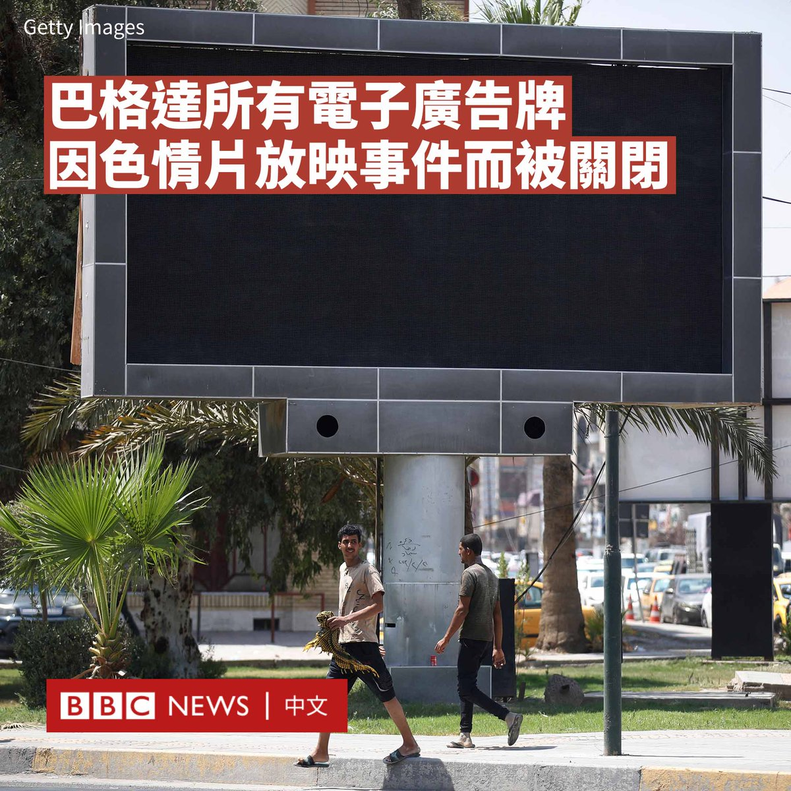

D英国广播公司BBC 北京时间 2023-08-21T13:40:23Z 1693498258713354619 伊拉克官员下令关闭首都巴格达的所有电子广告屏幕，因为此前一个屏幕疑似遭黑客侵入，播放色情电影。

该事件发生在巴格达的一个主要路口，相关影片在社交媒体上被广泛转发。

警方表示，一名涉嫌参与该事件的男子被逮捕。该嫌疑人是一名技术人员，与经营广告屏幕的公司有财务纠纷。他据说因此采取行动试图报复。

安全部门官员表示，这名黑客上周六（8月19日）在屏幕上播放了“几分钟色情电影”，而当局随后将电缆切断。

该官员解释说，这些“不道德的场景”促使当局暂时关闭巴格达的所有广告屏幕，以审查安全措施。

巴格达的电子屏幕数量众多，通常用于为产品或政客做广告。   D英国广播公司BBC 北京时间 2023-08-21T11:09:12Z 1693460215457280133 中国当局在医疗领域掀起“反腐风暴”。官方媒体报道显示今年以来该国已至少有174位医院院长、党委书记被查，超过去年两倍。不仅在医院端，反腐也深入到医药企业，一些上市公司的董事长被立案调查。

中国医疗领域为何会形成大面积腐败？现有的医疗体系可能被如何改革？https://t.co/pRN1w1Dgi0   D英国广播公司BBC 北京时间 2023-08-21T09:44:07Z 1693438800595456497 Blackswan是一个K-pop女子流行音乐团体，但该组合的成员并不来自韩国，而是不同大洲。随着韩流文化在全球流行，没有韩国人的K-pop会成为一种新趋势吗？ https://t.co/Ibrd4dR50M   