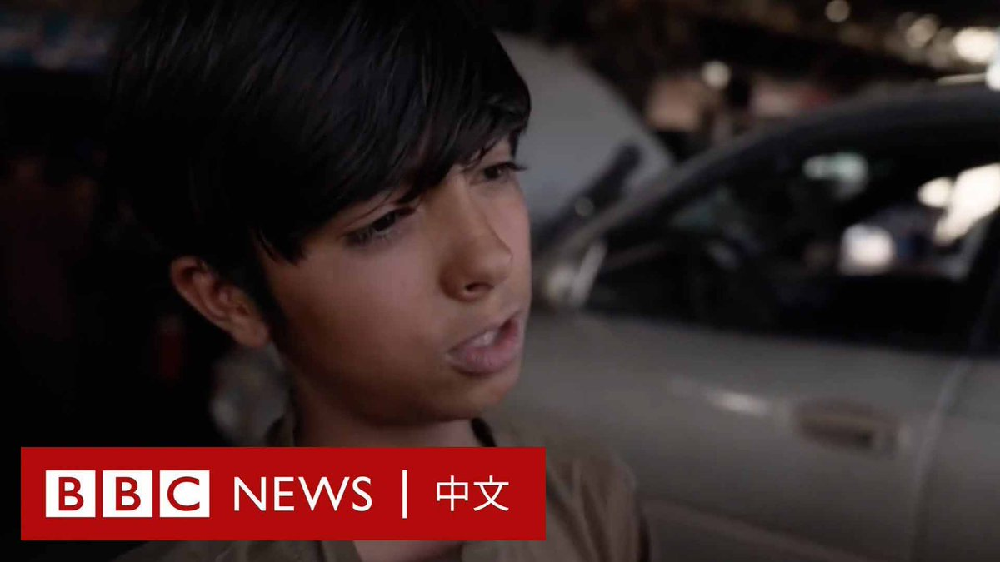
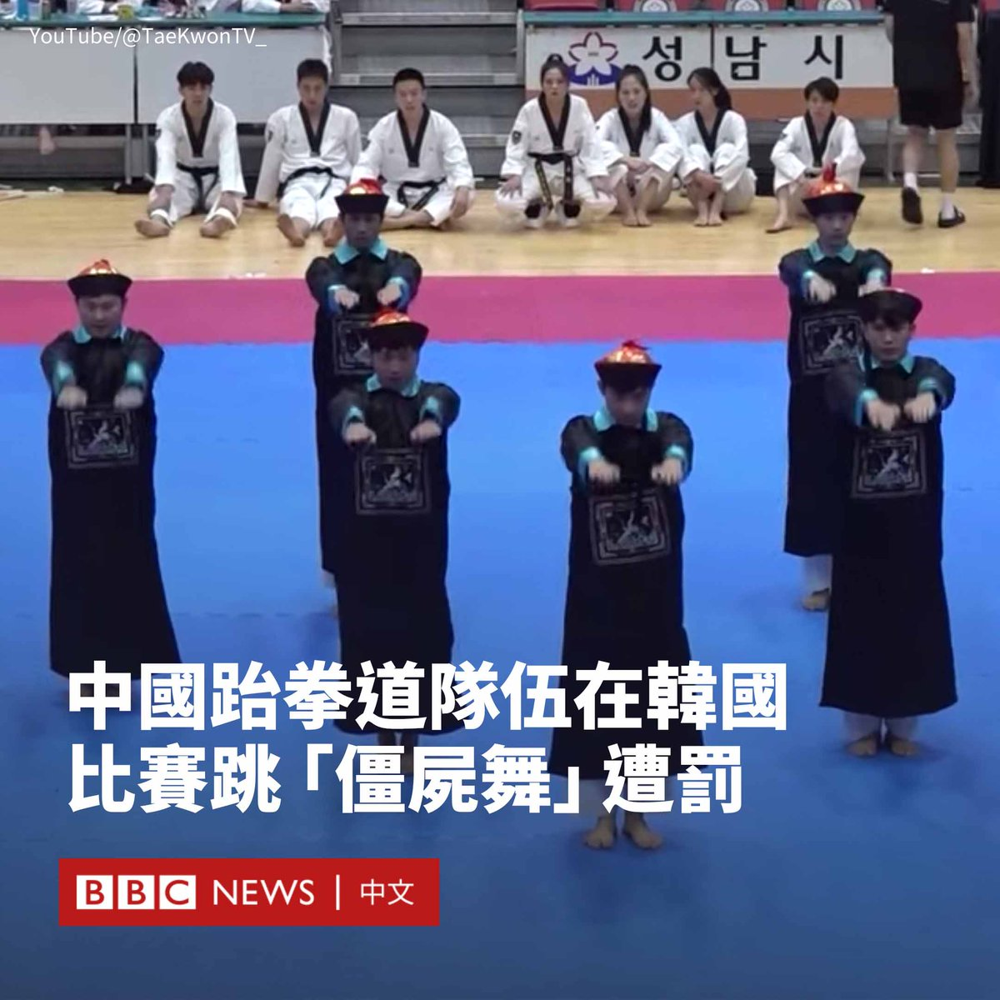
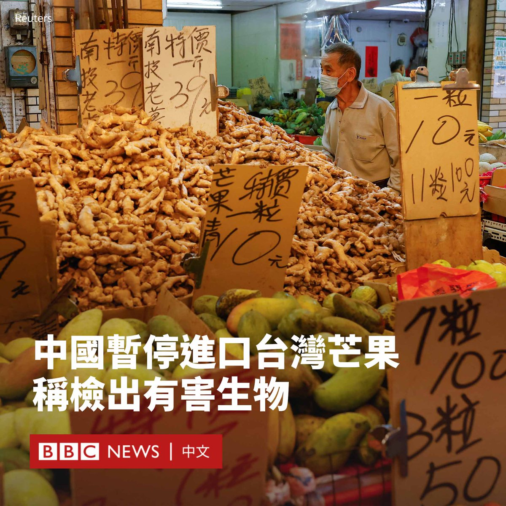

D英国广播公司BBC 北京时间 2023-08-21T21:36:58Z 1693618197591638340 “如果真的没办法，我会被迫把我的孩子卖掉才能活下来。”

塔利班在阿富汗执政两年后，经济和人道主义危机日益严峻。数十万人失业，营养不良现象激增，大多数妇女被禁止工作。

塔利班政权至今没有得到国际社会承认。多国和援助机构不再提供支持，阿富汗央行外汇资产被美国冻结。

联合国独立人权专家本月发表声明指，阿富汗估计有1600万儿童无法获得基本食物或卫生保健，严峻形势正助长童婚、虐待、剥削，甚至买卖儿童和人体器官等有害做法。   D英国广播公司BBC 北京时间 2023-08-21T17:16:13Z 1693552574572703965 中国跆拳道协会周一（8月21日）宣布对一家跆拳道俱乐部进行处罚，原因是该俱乐部上个月在韩国一场国际跆拳道大赛中，表演了模仿清朝僵尸的舞蹈。

中国跆拳道协会指责该表演“宣扬遗风陋习，丑化民族形象，亵渎中华文化，造成恶劣影响”。

由韩国国技院主办的2023世界跆拳道大赛于7月21日至24日在韩国城南市举行。主办方称，有近60国的4000多名跆拳道选手参赛。

中国名为“X-跆拳道馆”的队伍也参加了该比赛，并在跆拳体操高级组比赛中夺得冠军。他们在表演中打扮成类似僵尸电影中清朝官员的造型，身穿黑色官服、头戴红色官帽，甚至帽子上还粘有假辫子。

现场画面显示，七名选手以这样特别的装扮亮相后，现场爆发了欢呼声。

他们还在表演中将殭尸的动作融入表演，包括模仿僵尸跳跃。在比赛后半段，他们则脱掉了该装扮。

在这场比赛的影片被上传到网络后，随即引发讨论。有人他们的表演“太帅了”，但也有网友批评其让人想到傅满洲的形象，是“传递封建糟粕”和“自我丑化”。

中国跆拳道协会在声明中称，由广东省深圳市一家公司经营的“X-跆拳道馆”自行报名并持旅游签证赴韩国参加了该比赛，而该舞是其教练刘豪“根据恐怖电影，自编自导”，事件“影响恶劣、教训深刻”。

声明称，将取消“X-跆拳道馆”中国跆拳道协会会员资格和全国跆拳道相关赛事参赛资格、取消刘豪教练员注册资格，并责令广东省跆拳道协会做出检查。   D英国广播公司BBC 北京时间 2023-08-21T18:56:56Z 1693577921187938569 中国海关总署称在台湾芒果中检出有害生物，决定自即日起暂停台湾芒果输入中国大陆。

据中国官方媒体报导，中国国台办发言人朱凤莲周一（8月21日）表示，今年以来，中国大陆海关从台湾输入的芒果中“截获检疫性有害生物大洋臀纹粉蚧”，该有害生物一旦传入，将对中国农业生产和生态安全造成严重威胁。

她表示，海关总署决定自8月21日起暂停台湾芒果输入中国大陆，并已向台湾通报，要求其进一步完善植物检疫管理体系。

台湾的农业部则回应称，对北京屡次不符合国际惯例，未经科学性对话即任意中断贸易的作法“深感遗憾”，并表示台湾从未接获其他贸易国提出类似问题。

台湾农业部在一份声明中称，台湾芒果外销量仅占总产量2.2%，并且主要销往日本、韩国、香港等地，销往中国大陆数量仅占0.5%，且今年芒果产季已近尾声，影响产销有限。农业部将采取措施确保农民收益不受影响。

此前，中国大陆曾多次针对台湾农渔产品发布禁令，这被广泛视为是两岸关系恶化下对台湾进行施压和制裁的方式。

2021年，中国宣布禁运台湾的凤梨、莲雾和释迦，去年则禁止台湾石斑鱼等输入。   D英国广播公司BBC 北京时间 2023-08-21T12:47:23Z 1693484923024298441 由巴西、俄罗斯、印度、中国和南非五国组成的金砖国家集团领导人将于8月22日在约翰内斯堡举行会议，会议的一个关键议题是——是否接纳新成员。

此次峰会的东道国南非表示，现在有40个或更多国家希望加入该集团。https://t.co/R9hDdBll5t   D英国广播公司BBC 北京时间 2023-08-21T17:52:03Z 1693561595870535851 俄罗斯周日（8月20日）发布消息称，“月球25”号探测器偏离预定轨道，于月球表面坠毁，意味俄罗斯近半世纪以来首次探月任务宣告失败。 https://t.co/5DzVkm0ImB   D英国广播公司BBC 北京时间 2023-08-21T15:20:00Z 1693523327422513169 2023女足世界杯总决赛周日（8月20日）举行。西班牙队的队长奥尔加·卡孟纳（Olga Carmona）攻进决胜一球，以1比0战胜英格兰队。但在比赛后，她获知父亲去世的噩耗。

23岁的卡孟纳效力于皇家马德里足球俱乐部，她在决赛中攻进了唯一进球，为西班牙队夺下首冠。

据报导，卡孟纳的父亲一直在与病魔作斗争，于周五（8月18日）去世。

“我知道你今晚一直在看着我，你为我感到骄傲。爸爸，安息吧。”卡孟纳在社交媒体上写道。

卡孟纳还在留言中附上了一张她亲吻奖牌的照片。

西班牙皇家足球协会（RFEF）发布声明表示：“西班牙足协对卡孟纳父亲过世的消息深感遗憾。”声明指卡孟纳在决赛结束后才获悉这个悲痛的消息。

声明说：“在悲痛之时，我们向奥尔加和她的家人致以最诚挚的慰问。奥尔加，我们爱你，你已被载入西班牙足球史。”

西班牙媒体Relevo称，为了让卡孟纳专注于决赛，她的家人和朋友决定不告诉她该消息，而她的母亲和兄弟于周六（8月19日）抵达澳大利亚，到现场为她打气。

皇家马德里足球俱乐部也对此表达了哀悼。   D英国广播公司BBC 北京时间 2023-08-21T13:40:23Z 1693498258713354619 伊拉克官员下令关闭首都巴格达的所有电子广告屏幕，因为此前一个屏幕疑似遭黑客侵入，播放色情电影。

该事件发生在巴格达的一个主要路口，相关影片在社交媒体上被广泛转发。

警方表示，一名涉嫌参与该事件的男子被逮捕。该嫌疑人是一名技术人员，与经营广告屏幕的公司有财务纠纷。他据说因此采取行动试图报复。

安全部门官员表示，这名黑客上周六（8月19日）在屏幕上播放了“几分钟色情电影”，而当局随后将电缆切断。

该官员解释说，这些“不道德的场景”促使当局暂时关闭巴格达的所有广告屏幕，以审查安全措施。

巴格达的电子屏幕数量众多，通常用于为产品或政客做广告。   D英国广播公司BBC 北京时间 2023-08-21T11:09:12Z 1693460215457280133 中国当局在医疗领域掀起“反腐风暴”。官方媒体报道显示今年以来该国已至少有174位医院院长、党委书记被查，超过去年两倍。不仅在医院端，反腐也深入到医药企业，一些上市公司的董事长被立案调查。

中国医疗领域为何会形成大面积腐败？现有的医疗体系可能被如何改革？https://t.co/pRN1w1Dgi0   D英国广播公司BBC 北京时间 2023-08-21T09:44:07Z 1693438800595456497 Blackswan是一个K-pop女子流行音乐团体，但该组合的成员并不来自韩国，而是不同大洲。随着韩流文化在全球流行，没有韩国人的K-pop会成为一种新趋势吗？ https://t.co/Ibrd4dR50M   