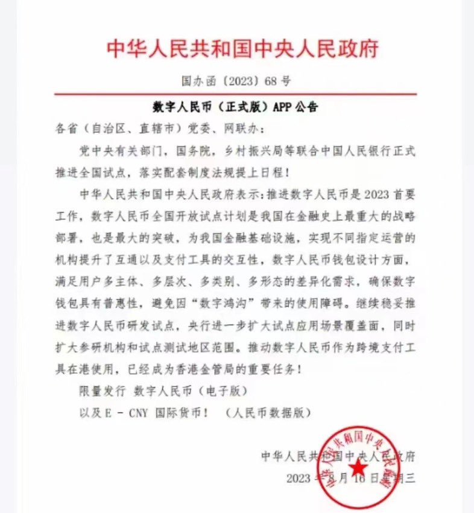
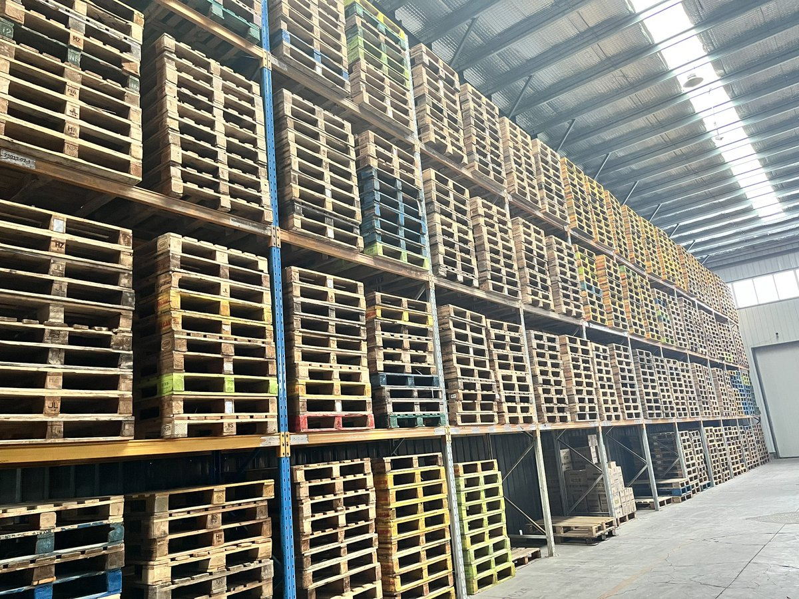

王歪嘴 北京时间 2023-08-21T18:42:49Z 1693574369543630994 论：中国人民的人性是怎样泯灭的？ https://t.co/tHRjrkt0qG   王歪嘴 北京时间 2023-08-21T18:51:24Z 1693576527768928722 好日子越来越近了 https://t.co/xPXIjInmt3   王歪嘴 北京时间 2023-08-21T12:57:24Z 1693487444019273860 托盘上货架的唯一原因就是客户的仓储需求下降太快，以前需要一万平米库房的快销品客户，现在有两千平米都够用了。进入经济腾飞“高速发展”的2023年，几乎所有品类所有领域的物流需求都在下降，以前每个月要发十几万立方米的客户，现在连每天一台13.5米货车都不能保证装满。估计再腾飞、发展下去，就关门大吉了   