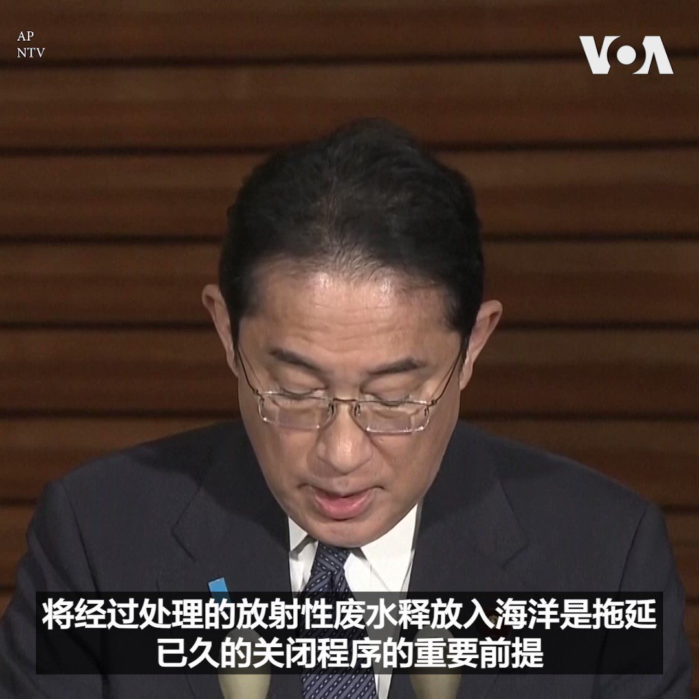

美国之音中文网 北京时间 2023-08-21T21:00:53Z 1693609116080681129 8/21【#时事大家谈】美日韩结盟，战狼会不会促成小北约？拜登对美中峰会信心满满，习近平怎么想？
 
嘉宾：西密歇根大学政治系教授王元纲; 2)日本国际教养大学中国研究助理教授陈宥桦 
主持人：许波

Youtube🔗 https://t.co/Tc9sjGbGmA https://t.co/VgdVETSyn6   美国之音中文网 北京时间 2023-08-21T21:45:57Z 1693620455947501599 正在丹麦访问的乌克兰总统弗拉基米尔·泽连斯基8月21日在哥本哈根克里斯蒂安堡王宫向丹麦民众发表演说。他对丹麦在乌俄战争期间向乌克兰提供的援助表达感谢。一天前，丹麦与荷兰宣布将向乌克兰提供F-16战机。 https://t.co/71t21wZpRT   美国之音中文网 北京时间 2023-08-21T22:20:41Z 1693629197686575214 日本首相岸田文雄21日表示22日的内阁会议上将决定福岛核废水的释放日期。 https://t.co/yeEW5uE9uH   美国之音中文网 北京时间 2023-08-21T22:26:34Z 1693630679924289910 恒大危机 分析:房市恐“五雷轰顶” 习近平救与不救两难 https://t.co/K3fP9B8pQB   美国之音中文网 北京时间 2023-08-21T22:40:32Z 1693634194751058001 中国在中建岛建飞机跑道 台湾沉默 越南反对 https://t.co/R48a7Pu4d0   美国之音中文网 北京时间 2023-08-21T22:51:03Z 1693636840031408178 全球粮食安全面临重大威胁 大米价格飙升 饥饿人群增加 https://t.co/ZZQwTZJkIx   美国之音中文网 北京时间 2023-08-21T23:07:33Z 1693640992891756589 台湾副总统赖清德过境美国后，北京环台军演“雷声大雨点小” https://t.co/dtrqPzkIqH   美国之音中文网 北京时间 2023-08-21T23:10:00Z 1693641607290167385 恒大上周在纽约申请“破产保护”，以免资产遭美籍债权人扣押，影响其债务重组程序。观察人士分析，恒大企图重整求生，但背后据传有江泽民、曾庆红派系势力，习近平政府救与不救皆两难。尤其中国房市低迷，银行、信托产品、地方债若接连爆雷，恒大不清盘止损，债务恐只增不减。https://t.co/48UT4m4LaK https://t.co/aAUnHQ72Gx   美国之音中文网 北京时间 2023-08-21T23:21:33Z 1693644516019093661 热带风暴“希拉里”侵袭南加州带来强降雨触发山洪 https://t.co/8VvkzgRk3R   美国之音中文网 北京时间 2023-08-21T23:36:32Z 1693648285947560436 或因对赖清德过境美国表不满，北京宣布暂停输入台湾芒果 https://t.co/Xpwh3TCerV   美国之音中文网 北京时间 2023-08-21T23:47:52Z 1693651136329462043 英国法庭21日判处谋杀7名婴儿的护士莱比Lucy Letby终身监禁。法官说莱比“将在监狱中度过余生”。莱比拒绝出席宣判，苏纳克首相说政府在考虑修改相关法律，确保莱比这样犯下恶劣罪行的人必须出席宣判。反对党工党领袖斯塔摩也表示赞成修改法律。 33岁的莱比自2015年谋杀了7名婴儿，5个男婴和两个女婴。 https://t.co/s6tsYHbfo4   美国之音中文网 北京时间 2023-08-21T23:55:58Z 1693653177357554051 台湾总统蔡英文8月21日宣布，明年台湾国防预算将达到6068亿元新台币（约合190亿美元），创下历史新高。台湾国防开支占GDP比重将达到2.5%。蔡英文说，台湾在持续强化自我防卫能力的同时，也将争取更多国际支持。 https://t.co/B7hnwrPaNQ   美国之音中文网 北京时间 2023-08-21T23:59:43Z 1693654120522289477 【家事国事天下事，你有何见解】
从传说中的大禹到胡锦涛、温家宝，中国历朝历代统治者都将防止和减轻洪水对民众的灾害视为自己合法性的展示和证明。但当朝的中国统治者却公开号令民众接受洪灾并奉献自己的生命财产以铺垫首都北京和副都雄安的护城河。此乃旷古未见的雄才大略？史无前例的残民以逞？ https://t.co/d7Zf4abBGm   美国之音中文网 北京时间 2023-08-21T18:28:33Z 1693570778368033064 俄罗斯和中国期待在金砖国家峰会上推进议程 https://t.co/FDD0O03uOB   美国之音中文网 北京时间 2023-08-21T20:27:44Z 1693600771571593451 英国法庭21日宣判谋杀7名婴儿的护士莱比 Lucy Letby的刑期，但莱比拒绝出庭。苏纳克首相说政府在考虑修改相关法律，确保莱比这样犯下恶劣罪行的人必须面对他们的受害者，听取这些罪行对受害者造成的伤害。 莱比18日被认定在她工作的医院杀害7名婴儿并试图杀害另外6名婴儿的罪行成立。 https://t.co/F3K3HPgTgA   美国之音中文网 北京时间 2023-08-21T16:35:02Z 1693542212565614782 韩美展开军演之际 朝鲜领导人金正恩监督巡航导弹发射 https://t.co/DPXQb6cyul   美国之音中文网 北京时间 2023-08-21T17:30:33Z 1693556184241123584 朝鲜突然取消新冠疫情后首次国际商业航班 https://t.co/GBfZAMhCgQ   美国之音中文网 北京时间 2023-08-21T11:13:03Z 1693461181254836705 欧盟发表香港年度报告后 活动人士呼吁欧盟对在逃港人提供帮助 https://t.co/NqPZBQof3U   美国之音中文网 北京时间 2023-08-21T16:05:33Z 1693534790346235926 危地马拉选出新总统 新政府可能更靠近北京 https://t.co/noMSW2uZNu   美国之音中文网 北京时间 2023-08-21T10:48:39Z 1693455043205509239 拜登、岸田文雄和尹锡悦举行了历史性峰会。为什么说美日韩三国峰会是一次历史性突破？三国结盟会不会发展成北京担心的“亚太小北约”？尽管拜登对习近平的指责从“独裁者”上升为“坏家伙”，但他仍然对今年秋季在旧金山举行拜习会信心满满。习近平会满足拜登的愿望吗？请收看周一时事大家谈并留言互动。 https://t.co/NdLac6MKa1   美国之音中文网 北京时间 2023-08-21T13:46:04Z 1693499689352790388 随着经济恶化 中国央行再度降息以增加放贷 https://t.co/SeUbtyTbmJ   美国之音中文网 北京时间 2023-08-21T11:31:34Z 1693465840191209865 聿文视界：中国经济危机可能是2023年全球最大地缘政治风险 https://t.co/oYNeBDPhei   美国之音中文网 北京时间 2023-08-21T04:17:32Z 1693356616077443556 荷兰、丹麦将向乌克兰供应美制F-16战斗机 https://t.co/Io0oNVwoGh   美国之音中文网 北京时间 2023-08-21T07:00:00Z 1693397500437135437 https://t.co/XKYfjklhuz   美国之音中文网 北京时间 2023-08-21T07:48:03Z 1693409593085645036 日本首相表示尚未决定福岛核废水释放日期 https://t.co/aoYc4b9ESA   美国之音中文网 北京时间 2023-08-21T04:59:03Z 1693367063744847951 热带风暴希拉里对美国墨西哥造成洪水威胁 https://t.co/Jo7xDx0KGQ   美国之音中文网 北京时间 2023-08-21T01:42:33Z 1693317609788219872 戴维营峰会强化对华统一战线，美中各自建立对抗阵营 https://t.co/fgt0A9y1gp   