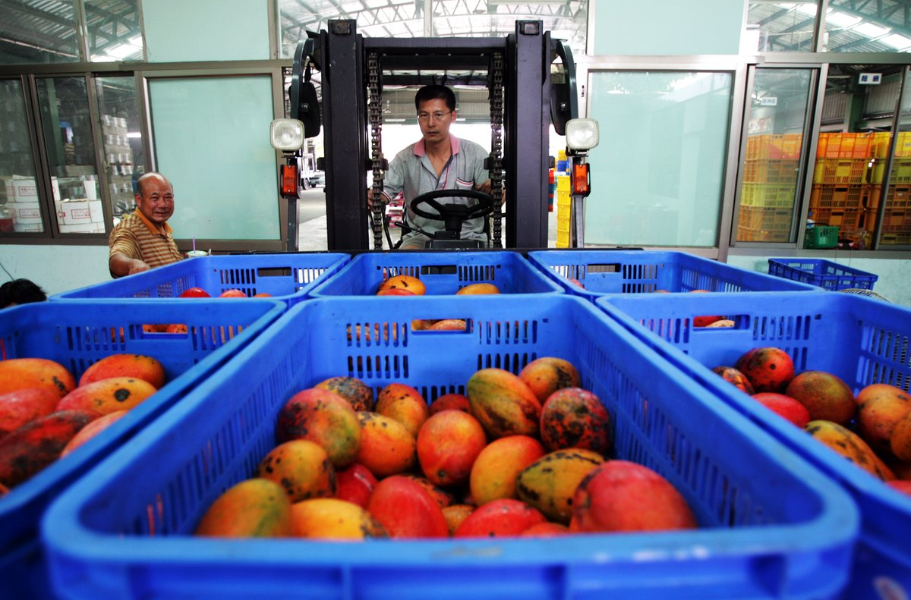
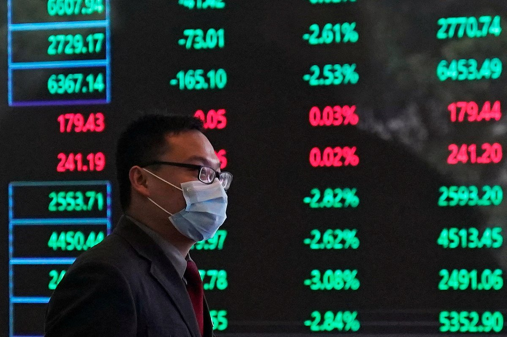

自由亚洲电台 北京时间 2023-08-21T23:30:27Z 1693646756180078981 台湾的副总统 #赖清德出访巴拉圭 返台后，中国解放军隔日于8月19日宣布在台湾周边举行 #军演 。有台湾军事专家认为，中方除发表措辞强硬的声明外，演习的时间与规模却是"雷声大雨点小"。

 https://t.co/ZlkJ92qvTu   自由亚洲电台 北京时间 2023-08-21T16:58:02Z 1693547998519964032 【称检获有害生物 中国暂停台湾 #芒果 输入】
【台吁对话解决】
国台办宣布，因为今年以来从台湾输入中国的芒果检出 #有害生物，决定自8月21日起暂停台湾芒果输入中国。而台湾农业部则呼吁中国与台湾进行“技术谈话”寻求合理解决方法。
https://t.co/8NhjqowLkr https://t.co/kUIdX5gQgZ   自由亚洲电台 北京时间 2023-08-21T17:16:41Z 1693552691832832191 【三金融机构提四大 #救市 措施】
【央行 #降息 市场仍疲弱】
中国 #央行 等三大金融机构举行会议，再次要求化解 #金融风险，会议强调要加大支持实体经济力度等四大措施。在央行周一宣布降低利率后，#人民币 汇市盘中跌破7.3，而A股沪深两市个股跌多涨少，三大股指均跌超1%，沪指跌破3100点，北向资金净卖出超60亿元。港股亦下跌。
https://t.co/Gi0X9tdIsH   自由亚洲电台 北京时间 2023-08-21T05:25:04Z 1693373607416914102 面对经济增长乏力、出口下滑及失业率高企，中国央行再次要求增强金融支持实体经济力度的稳定性，并承诺以此化解地方债务风险。但有专家认为，相关举措对于调整中国市场复苏力度太弱，时机也已过于迟缓。 https://t.co/HtchM6XOOW   自由亚洲电台 北京时间 2023-08-21T05:26:27Z 1693373957230194851 路透社8月20日披露的一份德国政府文件显示，德国联邦经济部长哈贝克（Robert Habeck）要求强化针对外国企业的投资审查程序，以推动旨在提升经济安全的投资立法。该文件明确指出，投资审查近年在涉及德国、欧洲和国际领域方面已变得“非常重要”。 https://t.co/wqSFurkkkC   自由亚洲电台 北京时间 2023-08-21T05:27:49Z 1693374303222579600 据维权网8月19日发布的消息，湖北黄冈自媒体账号“#湖北新视点网”负责人 #吕华 失联数月后，据悉已被 #黄冈 市公安局抓捕。 https://t.co/19APVcOSb3   自由亚洲电台 北京时间 2023-08-21T00:19:17Z 1693296654500118988 RT @RFA_Chinese: 中国疫情后复苏乏力，青年失业率创历史新高，正促使更多人进入网约车行业，导致市场饱和 https://t.co/kyTUAiqAiJ   自由亚洲电台 北京时间 2023-08-21T00:19:22Z 1693296677640188139 RT @RFA_Chinese: 8月17日中国恒大集团向美国法院申请破产保护，寻求320 亿美元债务重组 https://t.co/Zu9LWoMT7G   自由亚洲电台 北京时间 2023-08-21T00:19:32Z 1693296717637071237 RT @RFA_Chinese: 【#亚太报道（2023-8-18）】 
欢迎收听和订阅播客【亚太报道】 https://t.co/MjLNSvVeAE 

#美日韩 #戴维营峰会 强化三方合作/#恒大 在美申请 #破产 政府关心什么？/#医疗反腐 工作组引发恐慌/高法承认“#…   自由亚洲电台 北京时间 2023-08-21T00:19:35Z 1693296733529260079 RT @RFA_Chinese: 【习近平欲拆弹房地产 反加速引爆】 
【经济叠加政治问题 习近平“#不惜一战”转移焦点？】
https://t.co/xxdKL5GpWy
中华经济研究院第一研究所助研究员 #王国臣，独立时评人 #郑旭光，在 #亚洲很想聊… https://t…   自由亚洲电台 北京时间 2023-08-21T00:19:39Z 1693296747424965045 RT @RFA_Chinese: 日本政府报告称11艘中国和俄罗斯海军舰艇已穿越日本南部冲绳岛和宫古岛之间的水域，中国政府表示，其与俄罗斯舰船过航的行为符合国际法和准则 https://t.co/Gj7vzSQInu   自由亚洲电台 北京时间 2023-08-21T00:19:44Z 1693296771751961082 RT @RFA_Chinese: 一群碧桂园的业主在北京一处未完工的碧桂园楼盘外安营扎寨进行维权，据报道该房产公司已经亏损了数十亿美元，极有可能面临破产。 https://t.co/GgwyuMPG6d   自由亚洲电台 北京时间 2023-08-21T00:20:05Z 1693296859555520613 RT @RFA_Chinese: 中国政府8月16日表示，#中国 的 #经济复苏“将是一个坎坷曲折的过程”，称来自西方政客的批评最终会被现实打脸 https://t.co/rLHacWVImL   自由亚洲电台 北京时间 2023-08-21T00:20:14Z 1693296893940347293 RT @RFA_Chinese: 8月15日，中国国家统计局宣布，自今年8月份开始，因调查统计须进一步完善，暂停发布新的青年就业数据。
国家统计局新闻发言人付凌晖解释，暂停发布相关数据的主要原因是：经济社会在不断发展变化，统计工作需要不断完善，劳动力调查统计也需要进一步健全优化…   