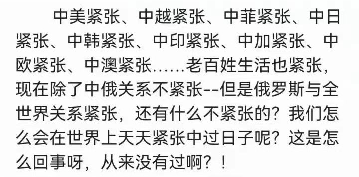

Petrichor 北京时间 2023-08-20T09:03:29Z 1693066189071700156 在美国，新移民都要考公民常识，其中一个问题是：
“美国是法制国家，这是什么意思？”

几乎所有中国人的回答都是：
“公民必须守法”。

但美国给出的标准答案却是：
“政府必须守法”。

美国之所以是法制国家，就是因为它要求每个公民行使监督政府的权利，来确保政府权力受到约束！   Petrichor 北京时间 2023-08-20T09:04:21Z 1693066407531925564 在美国，任何机构和个人都可以自由办报或其他媒体，唯独政府不可以。美国不允许权力控制舆论，不允许权力主导思想，不允许少数人左右整个社会的思想。

美国的言论自由保障一切普通百姓，但却不保障公众人物。你可以骂总统是任何东西，但是辱骂普通人，并对其造成了实际危害，就会被严惩。   Petrichor 北京时间 2023-08-20T09:05:02Z 1693066577942299105 公共财产

美国的房子不仅是永久产权，而且房子的上空，屋子下面800米以内的地也是属于房主的。只有高于一定的高度之后，天空才是国家的，如果在底下800米以内发现了石油或者其他矿产，这些资源都归房主所有。   Petrichor 北京时间 2023-08-20T09:05:42Z 1693066743906775409 美国在唱衰自己中强大自己
美国是全世界最热衷唱衰自己的国家，知识分子和新闻界几乎永远站在政府对立面，唱衰制度、唱衰政策、唱衰政府。

二战后美国至少发生八次唱衰自己的讨论，每次都把美国的内在缺陷掀个底朝上。幸运的是，美国领导人总是认真倾听并不断矫正，从而在自我唱衰中完善了自己。   Petrichor 北京时间 2023-08-20T09:06:57Z 1693067058450170358 普世价值观
太平天国时期，美国传教士密迪乐来到中国，他看到了种种匪夷所思的苦难，然后做出诊断：中国最需要的不是现代科技，而是基础文明。所谓基础文明，指的就是契约精神、权利意识，还有对民主政治和个人自由的理解，这些东西现在称为普世价值，意思就是，每个人都该懂得，除非你还是个野蛮人。   Petrichor 北京时间 2023-08-20T09:07:32Z 1693067205775167708 校车
美国对孩子生命安全的保护是最大限度的。校车有鲜明的颜色和最牢固的设计，学生放学时，所有的车辆必须无条件停下来让孩子先行，这是法律规定。

他们的理念是：要像保护总统一样保护孩子的安全，因为你不知道，这些过马路的孩子中，不知道哪个会成为美国未来的总统。   Petrichor 北京时间 2023-08-20T01:42:46Z 1692955276264009777 这种紧张的日子，他一个人过就行了，为什么非要带着14亿人一起过？ https://t.co/3wLIb06VI4   Petrichor 北京时间 2023-08-20T02:03:33Z 1692960506900873386 童曾欢面部硬朗、喉结明显、胸部平坦、阴部鼓起下垂，说话十足男性。但是，中国派“他”去参加世界女子运动比赛。 https://t.co/w9ZzDvOQCl   