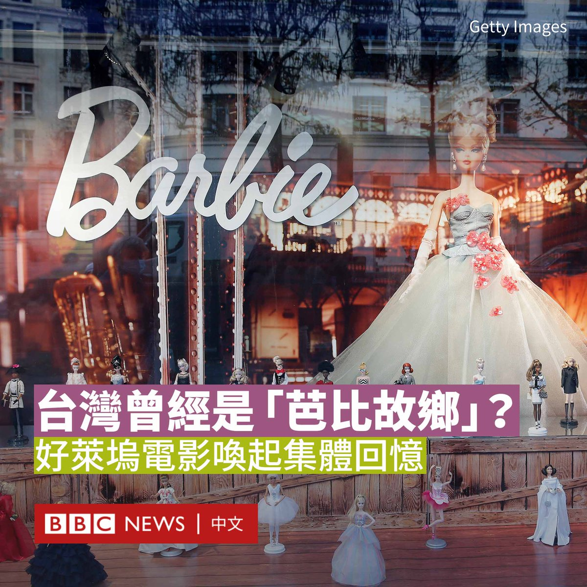

D英国广播公司BBC 北京时间 2023-08-19T07:59:06Z 1692687595808117160 台湾新竹市长高虹安被起诉贪污罪名，引来在野党派竞相声援。这个案件到底有何特别？ https://t.co/VDsZuzHnSC   D英国广播公司BBC 北京时间 2023-08-19T08:59:06Z 1692702696589930700 香港政局发展能否用哲学角度来解读？自由民主在哲学里又是什么模样？BBC中文对话移英港人学者，香港中文大学哲学系前系主任张灿辉教授。 https://t.co/5uMaGI28Vj   D英国广播公司BBC 北京时间 2023-08-19T09:01:03Z 1692703188489552369 【一周热点回顾】从九月起，俄罗斯的中学生们将会在新的历史教科书中学习有关乌克兰战争的内容。他们将被教导，如果不是普京总统对乌克兰发起“特别军事行动”，人类文明将走向终结。https://t.co/tbZ50WaAnx   D英国广播公司BBC 北京时间 2023-08-19T01:04:38Z 1692583293315866837 好莱坞电影《芭比》（Barbie）在全球票房掀起旋风，但你可能不知道，“金发碧眼”的芭比小姐，事实上却和远在亚洲的台湾有着很长的渊源。

1960年代，台湾政府想要吸引外资来台，同时积极发展“加工出口”工业，台湾陆续成立许多加工出口区，需要庞大的劳动力，台北市郊成为芭比娃娃的生产商美泰（Mattel）公司来台湾设厂的首选。

资料显示，1967年美泰公司与台湾生产塑胶原料的台商华夏集团，合作在当时仍称台北县泰山乡的这片土地上盖了“美宁工厂”，专门生产芭比娃娃，再外销全球各地。

全盛时期，每一年有上千万芭比娃娃都是在台湾制造，送到全球不同的女孩手中。美宁工厂曾经一度是亚洲最大的代工工厂。

根据资料，当时在台北的这座工厂其芭比娃娃产能曾占全球市场的80%，20多年来，工厂做出了近10亿只的芭比到全球各地。

泰山区公所资料提到，当时美宁工厂提供优渥的薪资，起初员工仅有20人，后来因为业务大增加，员工迅速扩展超过8000人，约占全泰山乡的三分之一。许多人在17、18岁时进入工厂，一直工作到1987年工厂停工，搬迁至中国大陆为止。

除了外包代工，成为当时台湾工厂的佼佼者之外，彼时来自全台各地到美宁工厂的数千名女工，也因为亲手做出了一只又一只昂贵、代表美国西洋文化的芭比娃娃，有了“时髦光环”，被当地人称为“美宁小姐”。

1980年代中，随着全球经济的变化，中国大陆开放劳动力市场，美宁工厂在开业20年后，于1987年宣布关闭台湾厂房。

阅读详细报道：https://t.co/lURidQQsOo   