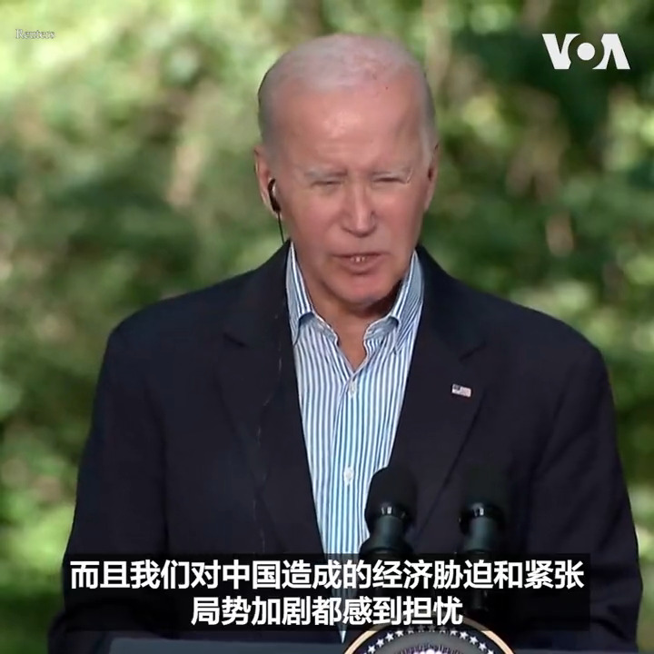
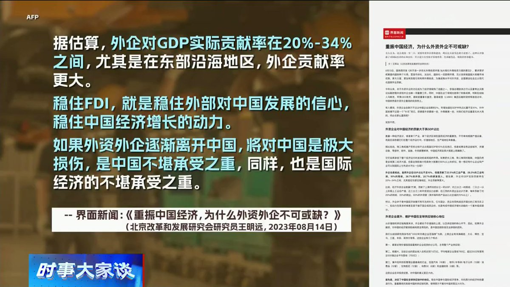

美国之音中文网 北京时间 2023-08-19T16:41:03Z 1692818952488161340 欧盟年度报告：香港自治、民主、自由持续受侵蚀 https://t.co/dRQJSiHWPr   美国之音中文网 北京时间 2023-08-19T14:24:33Z 1692784598286246339 中国调查台湾贸易壁垒考虑中止ECFA 台湾控政治动机 https://t.co/OMftZQjJGb   美国之音中文网 北京时间 2023-08-19T13:12:33Z 1692766478087725495 朝鲜抨击联合国安理会有关朝鲜人权状况会议是美国的“阴谋” https://t.co/KNpviPQea2   美国之音中文网 北京时间 2023-08-19T09:00:00Z 1692702922826760327 一键解锁#美国热搜 榜：1、私有数据显示：各地房价降幅远超官方数据 2、人民币汇率逼近纪录高点，专家推断年底可能破八 3、独裁者的黄昏，警惕习近平的最后大招 4、涿州灾民忍饥挨饿 5、丽水市要求公务员登记九族信息 6、荒唐的电动车管理 7、谁是间谍 ？https://t.co/wsifQTW8CN https://t.co/SYK59jit5r   美国之音中文网 北京时间 2023-08-19T09:20:04Z 1692707973574111456 贸易是习近平南非国事访问的重要议程 https://t.co/lJYfTiELFH   美国之音中文网 北京时间 2023-08-19T10:36:33Z 1692727219930747084 美台正式展开《21世纪贸易倡议》新阶段谈判 https://t.co/cjiZhcZUAE   美国之音中文网 北京时间 2023-08-19T11:43:02Z 1692743951672041698 台湾副总统结束出访返国 中国再祭出针对性军演 https://t.co/nYWNjckH6H   美国之音中文网 北京时间 2023-08-19T07:32:38Z 1692680936356475218 “这次峰会不是有关中国，这不是这次会议的目的”，美国总统拜登在与韩国总统尹锡悦和日本首相岸田文雄举行峰会后的记者会上说。他表示各国对中国的经济胁迫以及造成紧张局势加剧感到担忧。三国同意要加强经济和军事关系，并谴责中国在南中国海“危险而咄咄逼人的行为”。 
报道：https://t.co/cXFf0B646f https://t.co/fbcMBAyp99   美国之音中文网 北京时间 2023-08-19T09:36:04Z 1692711998398881914 世卫组织和美国卫生当局追踪新型新冠病毒变种 https://t.co/8m86NfBMbv   美国之音中文网 北京时间 2023-08-19T09:36:06Z 1692712007005516205 美国国防部《生物防御态势评估》报告将中国列为关键长期威胁 https://t.co/lYUWit8gny   美国之音中文网 北京时间 2023-08-19T10:07:04Z 1692719802157301807 美国会共和党人致函商务部长,警告勿与中国协商出口管制政策 https://t.co/dAIp0JUudF   美国之音中文网 北京时间 2023-08-19T04:39:33Z 1692637380497531288 美日韩联合声明谴责北京在南中国海从事“危险而咄咄逼人的行为” https://t.co/Xe2lkG7Zly   美国之音中文网 北京时间 2023-08-19T04:56:34Z 1692641660864520507 美商务部裁定五家中国太阳能公司通过东南亚规避美国双反关税 https://t.co/N4YaHRLnKB   美国之音中文网 北京时间 2023-08-19T06:17:07Z 1692661932644589865 正当菲律宾与中国在南中国海的主权争端持续升级之际，对华态度一贯强硬的前菲律宾外长洛钦被任命为总统的中国特使。观察人士分析，这显示马尼拉将坚定在南中国海维护其主权的立场，虽然北京很可能不会因此而过度反应，但两国的海上对峙，有可能冲击双边的经贸合作。https://t.co/xTTKDhHCfi https://t.co/eZ3mkMVXkj   美国之音中文网 北京时间 2023-08-19T06:30:00Z 1692665173365187022 没有外资，中共伤不起还是无所谓可搞内循环？美国欧道明大学国际商学教授李少民博士说：中共不是没有钱，从资本额来说，外资对中国并不重要。中国老板有钱，不敢投。但外资带来信心。搞内循环就是中共内斗和文革，独裁国家需要民主国家市场和接受它。#时事大家谈 完整版：https://t.co/tdNIAMRpDM https://t.co/jOw2iFPkFq   美国之音中文网 北京时间 2023-08-19T06:33:06Z 1692665956185891198 夏威夷毛伊岛紧急服务部门负责人辞职 https://t.co/zOaG2aAR4B   美国之音中文网 北京时间 2023-08-19T07:00:00Z 1692672724622024733 刘亚洲动摇了解放军政工系统，影响超过张国焘和林彪。但因无法超越父辈历史和自身利益 ，2000年后, 写书的刘亚洲变成了刘亚洲政委。红色文化网批刘亚洲文章十天后下架，说明它是一个试探气球，当局不想让他成英雄。请于8月18日上午9点收看美国之音专访赖小刚教授：解放军另类上将刘亚洲命运之谜。 https://t.co/Qi91IYoyVm   美国之音中文网 北京时间 2023-08-19T07:00:34Z 1692672865307680904 夏威夷大火阴谋论蔓延中国互联网，官媒借机抨击美国 https://t.co/ufmvltE6Zc   美国之音中文网 北京时间 2023-08-19T07:34:03Z 1692681291454656601 美日韩领导人戴维营峰会公开批评北京在南中国海“危险而咄咄逼人的行为” https://t.co/Cn0kS6v9TJ   美国之音中文网 北京时间 2023-08-19T08:53:04Z 1692701180424573437 中国和俄罗斯盯上美国航天公司 https://t.co/du6waaivU9   美国之音中文网 北京时间 2023-08-19T09:06:02Z 1692704442309914689 美军在尼日尔准备应对最坏情况，包括撤离 https://t.co/bF7I3vcVlc   美国之音中文网 北京时间 2023-08-19T01:17:06Z 1692586429602488477 世界媒体看中国：情况可坏到啥地步  https://t.co/9Lu3rSEVYB   美国之音中文网 北京时间 2023-08-19T02:47:03Z 1692609069432144283 调查：在英港人感保障公民参与措施不足 忧虑申领香港证件有危险 https://t.co/IA2fXBWBR4   美国之音中文网 北京时间 2023-08-19T04:39:35Z 1692637388705849678 中国工程人员为什么在巴基斯坦不时遭到恐怖袭击？ https://t.co/YNP27uhSYt   美国之音中文网 北京时间 2023-08-19T04:56:36Z 1692641669123104851 乌战久拖不决之下中俄关系已难掩裂痕，还是抱团越抱越紧？ https://t.co/1Bx0kBgCZB   美国之音中文网 北京时间 2023-08-19T05:28:03Z 1692649582562599256 枪手袭击柬埔寨牙医诊所，劫走服刑中的中国囚犯 https://t.co/gU4dQ8vQqW   美国之音中文网 北京时间 2023-08-19T05:41:02Z 1692652853620597207 菲律宾对华强硬的外交官被总统任命为中国特使 将如何影响两国关系？ https://t.co/0udaEvNC37   美国之音中文网 北京时间 2023-08-19T06:00:00Z 1692657626478198852 恒大在纽约申请破产保护想东山再起，这种可能性多大？独立时评人、专栏作家蔡慎坤先生说：可能性不是完全没有。恒大外债如何处理，中国政府持观望态度。纽约申请破产保护，更大可能性是逃掉部分外债。恒大彻底倒掉，中国担心连累银行和政府稳定。#时事大家谈完整版：https://t.co/tdNIAMQROe https://t.co/3vh7NPXUIC   美国之音中文网 北京时间 2023-08-19T00:38:05Z 1692576610837561546 进军欧洲电动车市场，中国厂商打遍天下无敌手的王牌恐不灵验 https://t.co/0OdTGWTP9t   美国之音中文网 北京时间 2023-08-19T01:10:34Z 1692584786446209480 中国经济险象丛生之际，北京迄今出台举措被指力度远远不够。为什么？分析人士告诉路透社，习近平“统筹发展和安全”的指令太模糊，下边官员一旦摸不准上意，就宁可先按兵不动，导致政策瘫痪。也有专家说，这是因中共一贯担忧“如果资本主义和私营经济发展得足够强大，自己可能会被推翻”。您的看法？ https://t.co/Fdh52Ed3tZ   美国之音中文网 北京时间 2023-08-19T02:33:09Z 1692605570824687785 香港传媒大亨黎智英国安案拟押后至12月中开审 评论指一再押后对被告不公 https://t.co/Xrf5nWDdCf   美国之音中文网 北京时间 2023-08-19T03:00:00Z 1692612328154619939 【家事国事天下事，你有何见解】
许多经济专家早就指出，消费/内需不足制约中国经济进一步发展，民众害怕生一场病便倾家荡产是他们顾忌消费的主因之一，而税收丰厚的中国当局早有足够的财力为民众提供可靠的医保解决他们的后顾之忧。如今力促民众消费以解决经济危机的当局是否愿为民众排忧解难？ https://t.co/idoBlzCGFB   美国之音中文网 北京时间 2023-08-19T00:57:34Z 1692581516000530484 美国安顾问沙利文：美日韩峰会标志着三方合作新时代  https://t.co/brk0C5U2zw   美国之音中文网 北京时间 2023-08-19T01:30:04Z 1692589695006622175 中澳贸易关系解冻后澳大利亚葡萄酒业喜忧参半 https://t.co/ba6qKNoXAF   美国之音中文网 北京时间 2023-08-19T02:18:18Z 1692601833255293253 “当我们团结一致的时候，我们的国家会更强大，世界会更安全”，美国总统拜登18日在马里兰的戴维营举行的美日韩首脑峰会上说。这次峰会的重点包括加强三方的安全与经济合作。拜登政府官员说，三国同意一项新的安全承诺，在太平洋地区出现安全危机或威胁时要相互协商。 https://t.co/3hym5R6dsa   美国之音中文网 北京时间 2023-08-19T00:03:34Z 1692567925427990779 资安公司报告：台湾是黑客攻击重要目标 上半年每秒遭网攻1.5万次 https://t.co/j5k3DlJl56   美国之音中文网 北京时间 2023-08-19T00:08:01Z 1692569043579076710 美国总统拜登、韩国总统尹锡悦和日本首相岸田文雄18日在马里兰州的戴维营举行历史性的峰会。拜登政府官员说，三国同意一项新的安全承诺，在太平洋地区出现安全危机或威胁时要相互协商。在三位领导人的峰会之前，拜登总统还分别会晤了尹锡悦和岸田文雄。 https://t.co/HvOqf21juc   