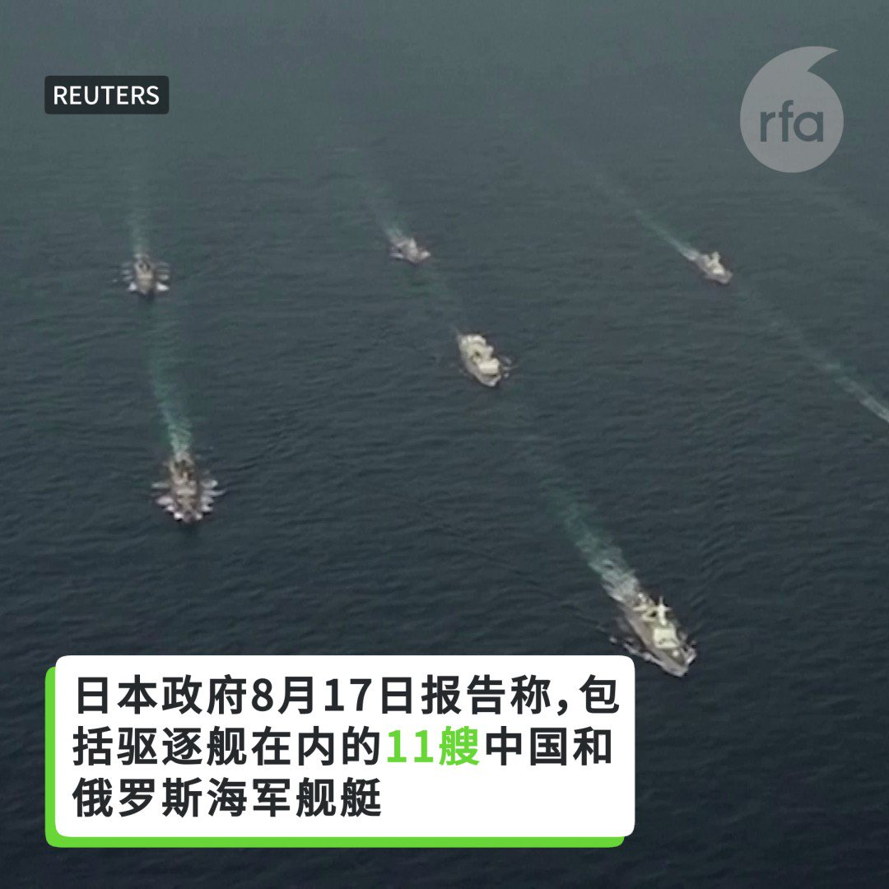

自由亚洲电台 北京时间 2023-08-19T02:19:38Z 1692602166953808083 RT @RFA_Chinese: 据台媒报道，截至8月15日，今年习近平仅在3月出访俄罗斯一次，全年只在国外度过两天时间，有望创下自他提出“中国特色大国外交”以来出访国家最少、出访时间最短的记录。
然而，2022年12月，中国外长王毅谈2023年中国特色大国外交6大任务时强调，…   自由亚洲电台 北京时间 2023-08-19T02:50:22Z 1692609901858808258 中国干预加拿大内部事务的方式非常多元化。根据加拿大情报局内部文件披露，中国不仅企图控制加拿大中文媒体，其渗透也延伸到非中文媒体。为了防堵中国干预，加拿大跨党派议员共同呼吁渥太华尽速制定外国代理人登记法案，并已发起请愿签名活动，希望凝聚更多民意支持。 https://t.co/Inh9dVngQX   自由亚洲电台 北京时间 2023-08-19T02:51:12Z 1692610112584835383 美、日、韩三国首脑周五（18日）在 #美国戴维营 举行历史性 #峰会，就加强在科技、外交、军事等领域的一系列合作展开讨论，并将在会后发表联合声明。 https://t.co/6gIYi8Hx3N   自由亚洲电台 北京时间 2023-08-19T03:08:25Z 1692614445430890937 路透：#习近平更重维稳 不急于救经济 https://t.co/lYNYuSQJgG   自由亚洲电台 北京时间 2023-08-19T02:19:49Z 1692602213238267967 日本政府报告称11艘中国和俄罗斯海军舰艇已穿越日本南部冲绳岛和宫古岛之间的水域，中国政府表示，其与俄罗斯舰船过航的行为符合国际法和准则 https://t.co/Gj7vzSQInu   自由亚洲电台 北京时间 2023-08-19T00:10:10Z 1692569586133270564 中国 #恒大 集团周四已向纽约法院依破产 法第十五章申请破产保护，恒大18日发布公告，申请境外债务重组不涉及 #破产 申请。有分析指，恒大、#碧桂园 民营房企出事，#中国 政府不会出手，而是更在意房价持续下跌会引发社会动荡。 https://t.co/VPQnIhO0o9   自由亚洲电台 北京时间 2023-08-19T00:10:38Z 1692569704643354843 综合中国媒体消息，8月18日，四川内江市在70分钟内连续发生3次地震，强度为3.4到4级。部分铁路线停运，有列车停在半路。官方暂未收到灾情报告及人员伤亡情况 https://t.co/G7la5axvnR   自由亚洲电台 北京时间 2023-08-19T00:11:47Z 1692569993282568352 专栏 | #劳工通讯：福建省闽侯县顺邦防护科技有限公司拖欠工人工资引发罢 (一) https://t.co/PvDctkajtN   