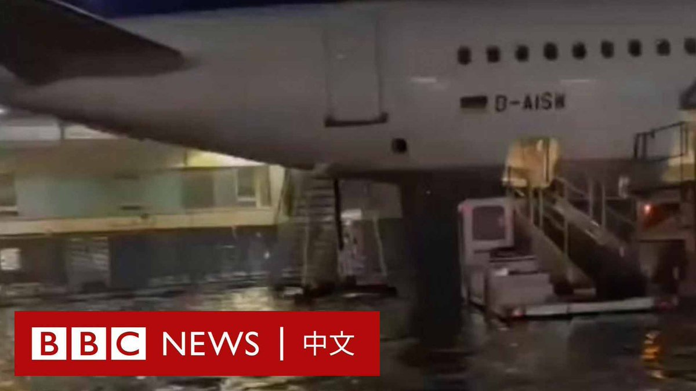
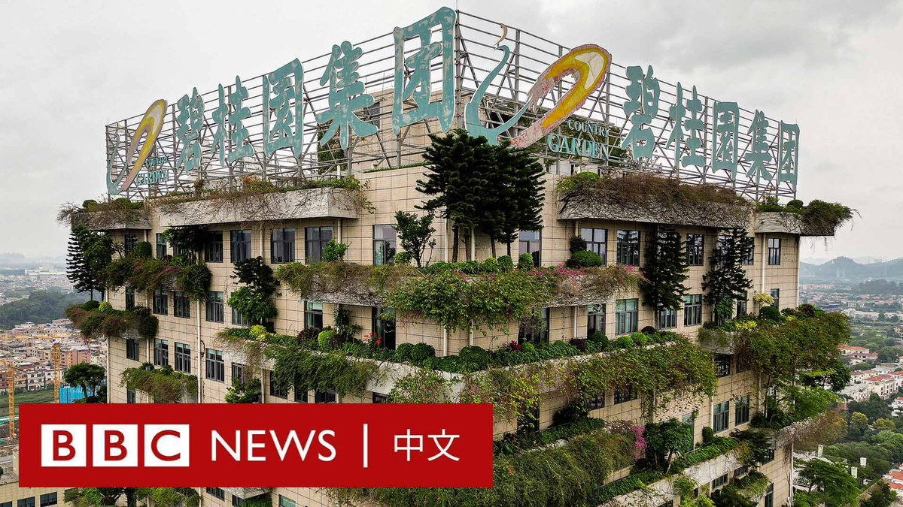
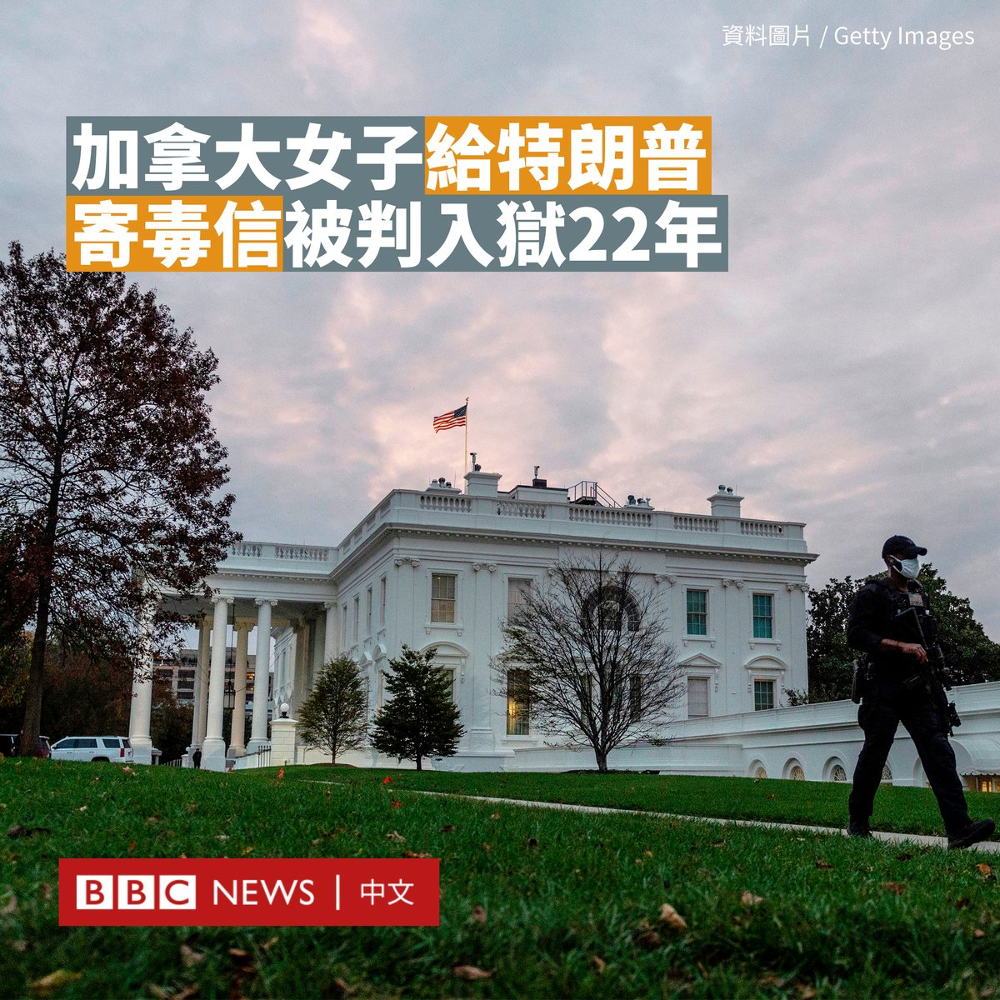
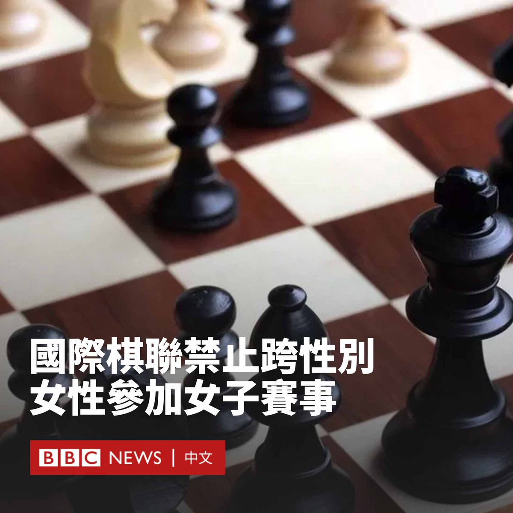
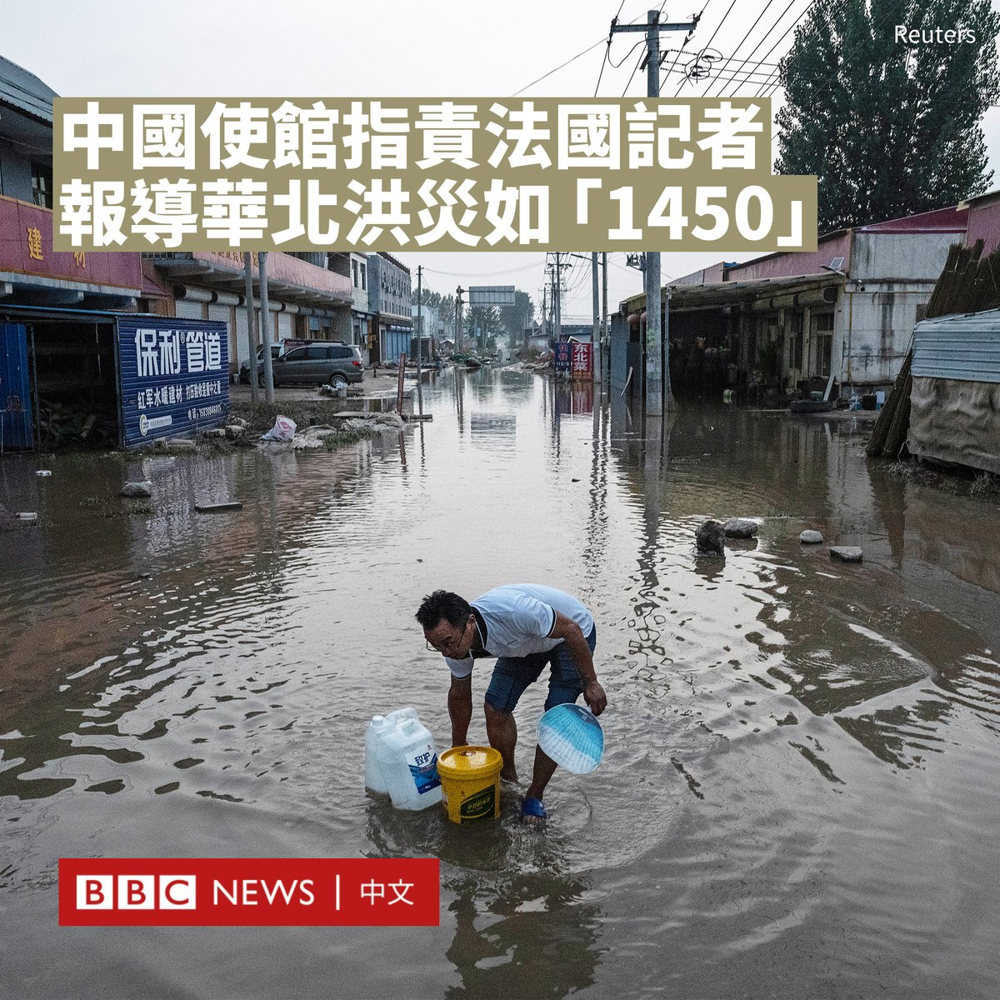
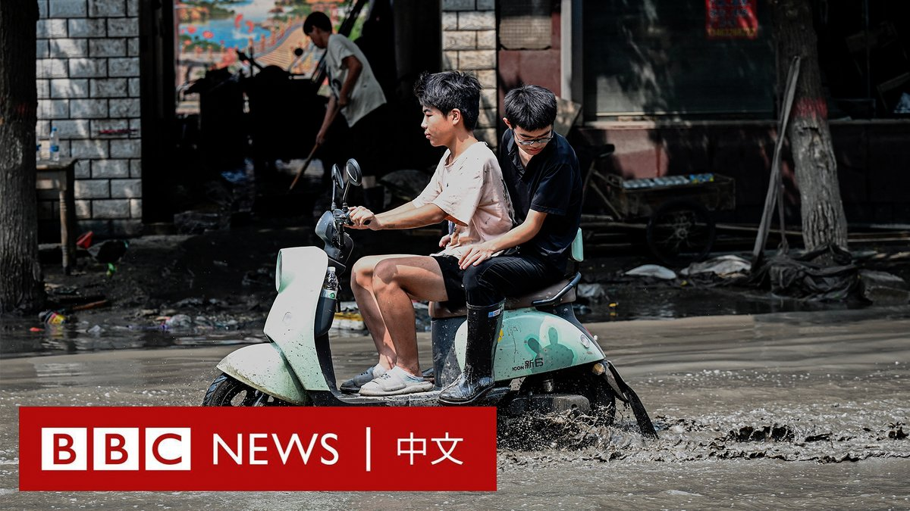

D英国广播公司BBC 北京时间 2023-08-18T23:37:59Z 1692561487876005961 德国遭遇暴雨侵袭，法兰克福国际机场的停机坪被洪水包围，大量洪水还倾泻而下，涌入地铁站。 https://t.co/au3fg22oHu   D英国广播公司BBC 北京时间 2023-08-18T21:58:43Z 1692536507314413956 继恒大之后，中国另一家主要房企碧桂园也遇到了麻烦，其今年上半年亏损预计达450亿元人民币（61亿美元）。据估计，该公司在中国数百个城市的未交付公寓近100万套。

中国曾经火热的房地产市场为何一夜之间变天？经济金融专家为你解释。 https://t.co/oOINqebmzT   D英国广播公司BBC 北京时间 2023-08-18T14:36:47Z 1692425291170447487 一名加拿大女子因向时任美国总统特朗普（Donald Trump）等多人邮寄掺有蓖麻毒素的信件，被判入狱近22年。

现年56岁的帕斯卡尔·费里尔（Pascale Ferrier）此前已对生物武器的指控认罪。她的刑期实际上早在今年1月已由控辩双方讨论商定，但直到本周才被主审法官批准。

2020年9月，当特朗普还是美国总统时，她试图将该信件寄往白宫，但在分拣设施被截获，邮政人员联系了联邦调查局（FBI）。

当时，她在信中敦促特朗普退出总统竞选。她还在信中写道：“我为你找到了一个新名字：‘丑陋的暴君小丑’。”

费里尔在向法庭发表的陈述中称，她认为自己是一名活动人士，而不是恐怖分子。她告诉法庭，她对自己的计划失败感到遗憾，因为她“无法阻止特朗普”。

联邦调查局在给特朗普的信上发现了她的指纹。地区法官判处她262个月监禁。她将在服刑后被美国驱逐出境。

法官表示，费里尔的行为“可能致命”，并且“对你有害，对社会有害，对潜在受害者也有害”。

费里尔还承认向八名得克萨斯州执法官员发送了类似的带有毒素的信件。检方指，2019年，她因非法携带武器和无证驾驶而在该州被拘留了约10周。

费里尔是法国和加拿大的双重公民，于2020年9月越境进入纽约州时被捕。她当时带着一把枪、一把刀和几发子弹。

后来，她承认在魁北克的家中制造了蓖麻毒素，并将其与信件一起放入信封。蓖麻毒素是一种由蓖麻豆加工而成的毒剂。

目前还没有已知的蓖麻毒素解药。根据美国疾病控制和预防中心的数据，根据剂量的不同，它可能在36至72小时内致人死亡。

2014年，密西西比州一名男子因向时任总统奥巴马（Barack Obama）和其他官员寄送含有蓖麻毒素的信件而被判处25年监禁。   D英国广播公司BBC 北京时间 2023-08-18T19:28:43Z 1692498757311778912 世界国际象棋联合会（FIDE）裁定，将暂时禁止跨性别女性选手参加女子赛事。此举受到一些选手和国际象棋爱好者的批评。

国际棋联表示，个别案例需要进行“进一步分析”，有可能需要长达两年的时间作出决定。

许多体育管理机构一直在制定针对跨性别运动员的政策，但是国际象棋并非类似强度的体育活动。

国际棋联向BBC表示，跨性别选手仍然可以参加其比赛的公开组，并希望分析这些政策的影响，不想仓促行事。

会方说：“国际棋联将密切关注这些发展，看看我们如何将其应用到国际象棋的世界。两年时间对于全面分析这些发展似乎是合理的。”

拥有国际棋联大师称号的跨性别女棋手尤沙·伊格莱西亚斯（Yosha Iglesias）表示，这一政策将给跨性别选手和女性带来“不必要的伤害”。

女子特级大师和两届美国女子冠军詹妮弗·沙哈德（Jennifer Shahade）也形容政策为“荒谬且危险”。

她说：“显然他们在制定这一政策时没有谘询任何跨性别棋手的意见……我强烈敦促FIDE改变这一立场，并聘请更好的顾问进行评估。”

上个月，国际竞技自行车运动管理机构国际自行车联盟（UCI）裁定，跨性别女性将被禁止参加女子组赛事。

世界泳联（World Aquatics）则于去年投票决定禁止跨性别运动员参加女子精英赛事，并于今年世界杯为变性运动员新设一个“公开组别”。   D英国广播公司BBC 北京时间 2023-08-18T17:54:14Z 1692474978191761698 中国周四（8月17日）措辞强硬地批评一名法国记者是“1450”和“键盘侠”，指其上周撰写的一篇关于中国洪灾的报道是“抹黑”中国形象。

“1450”是中国大陆和台湾的网络用语，最初在台湾用于形容亲执政党民进党的网络水军，中国网民近年来则常用其形容台湾网络水军，但其很少被官方使用。

中国驻法国大使馆周四在使馆首页刊登了这篇题为《关于中国洪灾的谎言与真相》文章，其中指控法国《世界报》（Le monde）驻中国记者西蒙·勒普拉特（Simon Leplâtre）的报道“相信网上的道听途说”，是“唯恐中国不乱”。

该报道发布于8月11日，题为《中国被牺牲地区灾民的苦涩》，其中讲述了由于当局为了保卫北京而在河北泄洪，引发一些民众的不满，有人甚至走上街头抗议。

中国大使馆的文章批评道：“微博上的谣言比比皆是……不做事实调查，却煞费苦心地搜罗网上的只言片语，刻意放大、扩散情绪化言论，甚至变身1450造谣传谣，勒先生居心何在？”

“堂堂《世界报》记者，已经堕落到懒得到现场采访，而是躲在某个阴暗角落充当键盘侠的地步了。”

“明眼人一看便知，这就是为了挑动中国党和政府与人民之间的对立，为了抹黑西方民众心目中的中国形象。”文章补充道。

大使馆还称，当地政府和农民“说好了一旦来洪水需要泄洪，他们的庄稼是要被淹的，不过政府会给予补偿”，并强调是在人员转移后才进行泄洪。

勒普拉特对BBC表示，他暂不会对该事件发表评价。

中国华北多地在七月底和八月初遭到暴雨和洪水侵袭。据官方媒体报道，首都北京有33人遇难，临近的河北省则有29人遇难。

据河北省应急管理厅，为保障行洪安全，缓解京津防汛压力，河北启用了七处蓄滞洪区，其中两处位于涿州，而涿州是此次灾情最为严重的地区。蓄滞洪区共转移近86万人。

据路透社的采访，一些涿州民众抱怨当局的疏散通知来得太晚，甚至没有任何预警。在临近的霸州，则有民众上街抗议要求赔偿损失。

《世界报》是法国最具影响力的报纸之一，但中国驻法国大使馆曾多次批评该报纸“抹黑中国”。

中国驻法国大使卢沙野也经常接受法国媒体采访，对西方进行批评，他多次因为咄咄逼人的言论而引发争议。   D英国广播公司BBC 北京时间 2023-08-18T16:12:18Z 1692449327463940527 女子足球运动员为争取女性权利所做的贡献，向全世界发出了强有力的讯息，也启发着更多人勇敢发声。

在本届女足世界杯接近尾声之际，BBC巾帼百名（BBC 100 Women）栏目探讨了这些足坛偶像如何利用世界的关注来为女性在生育权益、平等薪酬等问题上推动变革。https://t.co/oTHwdNTMRK   D英国广播公司BBC 北京时间 2023-08-18T10:34:48Z 1692364393462583656 随着全球气候灾害频发，多个台风在今年夏季侵袭亚洲，带来强降雨。在中国，暴雨导致原本较干旱的京津冀地区沦为泽国，数十人死亡，超过一百万人被疏散。

为缓解洪水问题，中国曾在2014年起斥巨资推动“海绵城市”计划，但此次洪灾让人不禁疑问该计划真的能挡住洪水吗？BBC中文与专家一同探讨。 https://t.co/AVY4JQcLwO   D英国广播公司BBC 北京时间 2023-08-18T13:36:49Z 1692410200202842277 华盛顿宣布将限制向中国某些敏感技术领域进行投资，标志着两国高科技之间的博弈从“出口管控”扩展到“投资管控”。分析人士认为，虽然美国已选择用“去风险”而非“脱钩”来描述其政策取向，但这两个全球最大的经济体“必将继续渐行渐远，而且对抗加剧”。https://t.co/R35tqlRR4s   D英国广播公司BBC 北京时间 2023-08-18T12:17:00Z 1692390112242323659 债务缠身的中国房地产巨头恒大集团在美国申请破产保护意味着什么？https://t.co/891nUlEWsg   D英国广播公司BBC 北京时间 2023-08-18T07:23:16Z 1692316190834868339 【最新消息】中国恒大集团在纽约根据美国破产法第15章申请破产保护。此举旨在保护正在进行重组的非美国公司免遭债权人起诉或扣押在美国的资产。

恒大曾是中国最大的房地产集团之一，其于2021年首次出现债务违约，总负债一度达到2.4万亿元人民币，引发中国房地产市场大规模危机。 https://t.co/tJG5u9tPLQ   