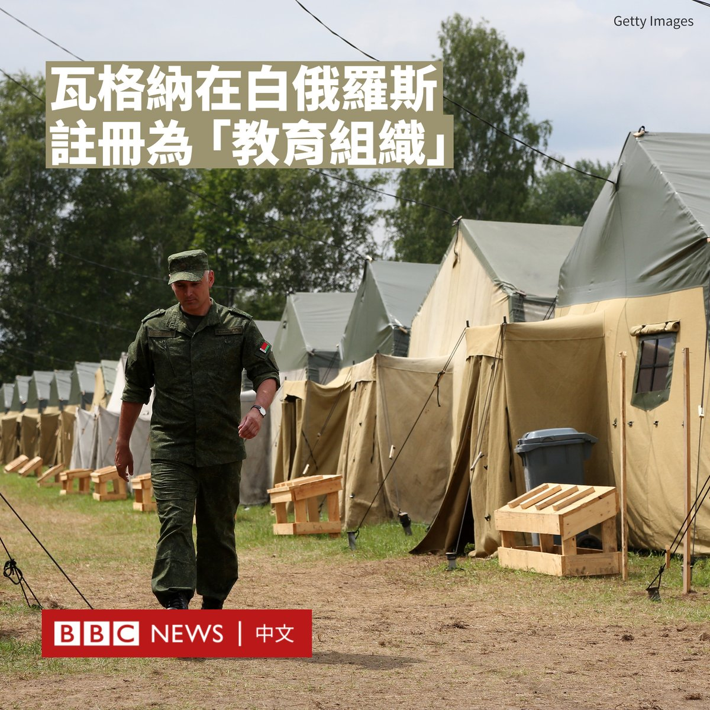
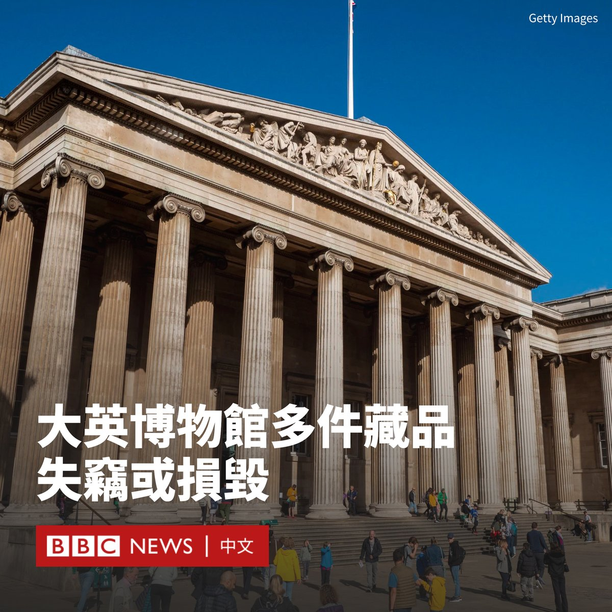

D英国广播公司BBC 北京时间 2023-08-17T14:31:01Z 1692061452029612164 曾起兵反叛克里姆林宫的俄罗斯雇佣兵组织瓦格纳在白俄罗斯被列为“教育组织”。

据报道，瓦格纳集团已于8月4日注册为有限公司，其登记地点与瓦格纳部队据信驻扎的地区相对应。

在六月的兵变后，瓦格纳成员被允许转移到俄罗斯的邻国白俄罗斯。有目击者看到瓦格纳部队后来抵达明斯克以南的一个营地，训练白俄罗斯军队。

根据白俄罗斯法人和个体企业家统一国家登记处的数据，瓦格纳组织以阿西波维奇地区的Tsel村为地址，注册从事“教育活动”。

此外，一家名为康科德管理咨询公司（Concord Management and Consulting）的房地产公司上个月在同一地址注册。

据报道，康科德公司由一家俄罗斯同名公司100%持有，该公司的总经理是瓦格纳首领叶夫根尼·普里戈津（Yevgeny Prigozhin）。

瓦格纳集团以残暴著称，其被指控在非洲多地和乌克兰犯下各种暴行。今年6月，瓦格纳集团以不满俄罗斯军事领导层为由，占领俄罗斯南部城市并向莫斯科进军，但在白俄罗斯的斡旋下撤军。

上个月，白俄罗斯国防部表示，瓦格纳士兵正在训练白俄罗斯的特种部队。官员表示，白俄罗斯军队需要瓦格纳集团的“实战经验”。   D英国广播公司BBC 北京时间 2023-08-17T13:07:49Z 1692040511144804794 伦敦大英博物馆（British Museum）周三（8月16日）发布声明指，有藏品“丢失、被盗或损坏”，该博物馆已报警处理并解雇了一名员工。

失踪物包括从公元前15世纪到公元19世纪的金饰、珠宝和半宝石。馆方表示，大部分物品都保存在储藏室中用于学术和研究目的，在最近没有展出。

大英博物馆馆长哈特维格·费舍尔（Hartwig Fischer）表示，这是一起“极不寻常”的事件，博物馆将“全力恢复物品”。

他说：“我们已经加强了安保安排，并正与外部专家合作，以完成对丢失、被盗或损坏物品的确切统计。”

博物馆还补充说，将对被解雇的员工采取法律行动。伦敦警察厅经济犯罪指挥部表示正进行调查，但尚未逮捕任何人。

报联社（PA）报道称，这些物品是在2023年之前就不翼而飞了，并且持续了“相当长”的一段时间。

大英博物馆主席乔治·奥斯本（George Osborne）表示，在得悉事件后，大英博物馆的受托人非常担心。
 
 “我们报警后，采取了紧急措施来加强安保，同时对所发生的事情吸取教训并进行独立审查，并动用了可用的纪律权力来处理涉事者。”奥斯本说。   D英国广播公司BBC 北京时间 2023-08-17T11:31:19Z 1692016228666315162 中国暂停发布青年失业率数据，而该数据近几个月连续创新高。一些年轻人担忧“毕业即失业”。 https://t.co/SJE1lUUUDq   D英国广播公司BBC 北京时间 2023-08-17T09:23:56Z 1691984170610790717 卫星图片与前后对比照片，显示了美国夏威夷毛伊岛拉海纳镇受近期山火的破坏程度。https://t.co/2NbUwG2cAH   