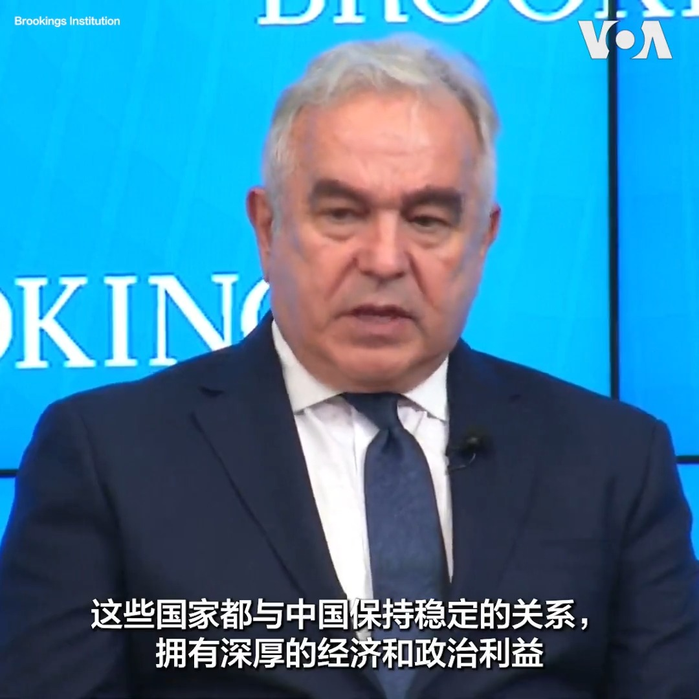
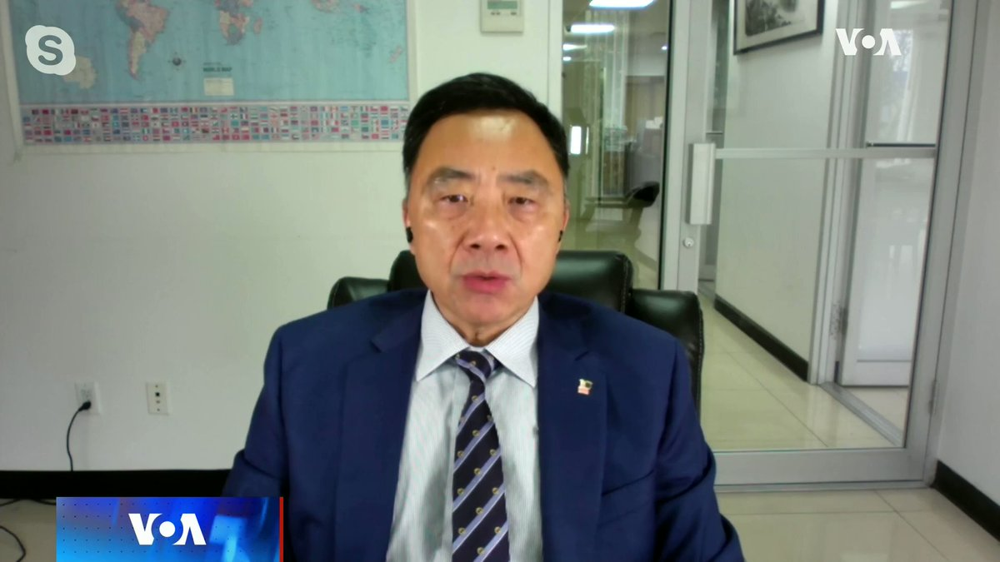
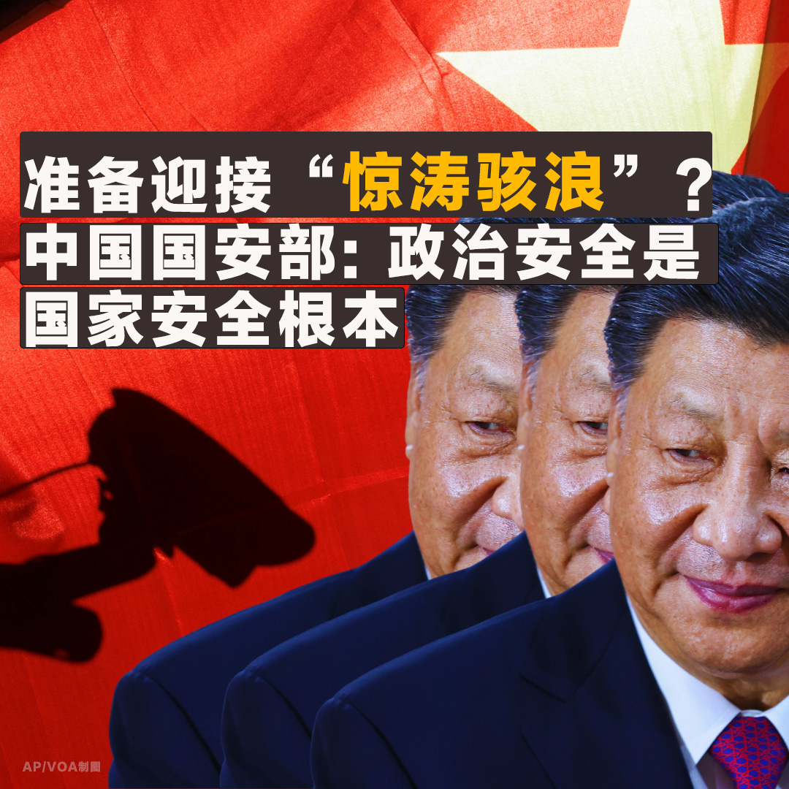
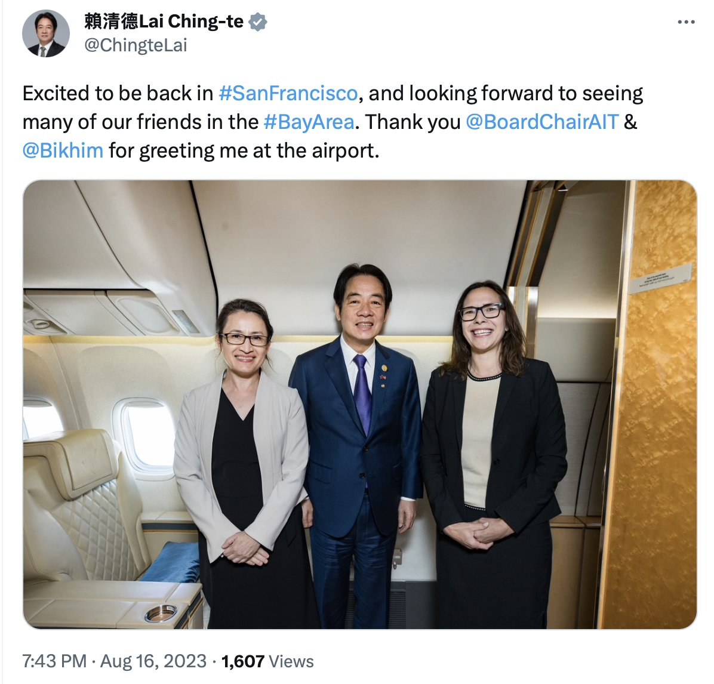
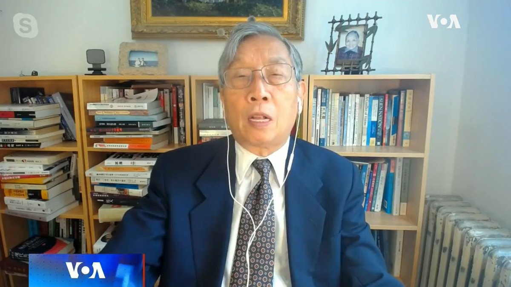

美国之音中文网 北京时间 2023-08-17T23:26:33Z 1692196222843617645 美日韩首次峰会将确立三国安全合作机制抗衡中朝俄威胁 https://t.co/dSW2Pqzxby   美国之音中文网 北京时间 2023-08-17T23:41:32Z 1692199993938235594 路透：中国输美汽车零部件有可能受到反强迫劳动法限制 https://t.co/xhuhs1OUNw   美国之音中文网 北京时间 2023-08-17T23:50:49Z 1692202330601537763 一场女子铁人三项赛8月17日在巴黎举行。来自世界各地的65位铁人三项女选手参加了赛事。赛程包括塞纳河1500米游泳，40公里自行车骑行以及巴黎市区的10公里长跑。这是巴黎为明年奥运会举行的热身赛。巴黎奥组委最近宣布，奥运门票已经售出七成。铁人三项从2000年开始成为奥运项目。 https://t.co/pOixTpkUgx   美国之音中文网 北京时间 2023-08-17T23:58:03Z 1692204148488630459 美国将对产于中国、德国和加拿大的食品罐头薄金属加征新关税 https://t.co/qgN9I2hVqJ   美国之音中文网 北京时间 2023-08-17T16:56:04Z 1692097952356118611 纽约市跟进宣布政府设备禁止TikTok 近半数美国成年人支持禁令 https://t.co/Hop7iQpMng   美国之音中文网 北京时间 2023-08-17T20:10:08Z 1692146793306530180 “打造亚洲硅谷” 赖清德旧金山侨宴演说：以民主为指南针带领台湾往前进 https://t.co/ce1ZHiVsuv   美国之音中文网 北京时间 2023-08-17T17:25:03Z 1692105246565339170 访问“欧洲最后的独裁国家”白俄罗斯 中国防长：“我们是真正的铁杆兄弟” https://t.co/dbm3SQKaXU   美国之音中文网 北京时间 2023-08-17T18:10:05Z 1692116578773368914 中国称正全面评估如何应对美国投资禁令 https://t.co/5cDVSlTaUR   美国之音中文网 北京时间 2023-08-17T11:40:03Z 1692018425789624444 美日韩“铁三角”重现？ 中国到底怕什么？ https://t.co/k8msx0so6o   美国之音中文网 北京时间 2023-08-17T15:13:03Z 1692072026994041114 多名跨党派前美国高官致函国会 呼吁加强拜登的限制中国投资令 https://t.co/Z3LzvZs7sx   美国之音中文网 北京时间 2023-08-17T15:29:04Z 1692076060605837364 中国团客出游名单排除加拿大 中国使馆归咎渥太华“反华言论 https://t.co/8c0lMo3WPY   美国之音中文网 北京时间 2023-08-17T12:53:41Z 1692036957025784063 “我承诺将以和平为灯塔，民主当指南针，带领台湾往前进，”台湾副总统赖清德16日晚在过境旧金山期间的侨宴上发表演说表示。他还期望台湾未来能作为亚洲硅谷，让台湾科技业成为全球供应链重要一环。赖清德在旧金山停留时间相当短暂，侨宴结束后他率领的访问团将搭乘午夜1点的华航航班返回台湾。 https://t.co/9ImWuqQqmz   美国之音中文网 北京时间 2023-08-17T11:50:10Z 1692020973527257506 美日韩领导人本周五将在戴维营举行三边峰会。白宫印太事务协调员坎贝尔星期三表示，美国致力于发展“更广泛、深入和深厚的”三边关系，使其深深植根于三国政治中。他还说，印太国家对美国的一系列加强双边和多边关系的努力表示欢迎，唯一的疑问是美国“能不能持续？”报道内容：https://t.co/GMT17KwstV https://t.co/taCoREdJoN   美国之音中文网 北京时间 2023-08-17T06:47:00Z 1691944675878305900 中国医药反腐的案例和涉案金额触目惊心。美国律师高光俊说，从腐败分子那里拿回的钱和老百姓毫无关系，在历次反腐割韭菜中，中共官员吞掉了上亿元。 #完整版：https://t.co/wcIgDTTSDt https://t.co/py3SLUMtmO   美国之音中文网 北京时间 2023-08-17T07:41:34Z 1691958409015509221 中国似乎正在南中国海有争议岛屿上修建机场 https://t.co/NRpYcZF14o   美国之音中文网 北京时间 2023-08-17T08:00:01Z 1691963051795186079 【家事国事天下事，你有何见解】当年中国在毛泽东统治下，经济凋敝，几近崩溃边缘。但毛掀起所谓的“我们也有两只手，不在城市里吃闲饭”的“上山下乡”运动；毛由此创造性地找出并处理了中国的经济、就业问题——原来中国经济不好是因中国人懒惰。面临当今中国经济困境，习近平会展示怎样的创造性？ https://t.co/JXCOMC0zz0   美国之音中文网 北京时间 2023-08-17T09:56:03Z 1691992252208574516 佐治亚州检察官希望3月4日开庭审判特朗普有组织敲诈勒索案 https://t.co/Q7Ckv7Pb84   美国之音中文网 北京时间 2023-08-17T05:31:03Z 1691925562674299049 报告：中国社交媒体平台未能控制针对黑人的种族主义 https://t.co/4wf4jPrwFm   美国之音中文网 北京时间 2023-08-17T07:00:00Z 1691947948152692894 中国国家统计局宣布将暂停公布青年失业率。北京在害怕什么？其掩盖数据的样子是否比数据本身更难看？中国当局称，中国经济不存在通缩，下阶段也不会出现通缩。事实如何？通缩为何可怕？北京否认通缩风险，到底是成竹在胸，还是束手无策之下的鸵鸟战术？请留言参与8/17时事大家谈。 https://t.co/7bMEWEoper   美国之音中文网 北京时间 2023-08-17T07:12:34Z 1691951110096077108 美国加强海湾部署应对伊朗对油轮的威胁 https://t.co/42gYieWfNt   美国之音中文网 北京时间 2023-08-17T07:14:15Z 1691951534823682392 中国国安部微信号最近提及一起2016年退休干部招募“敢死队”密谋颠覆国家政权案，提醒中国“政治安全面临的敌情形势”，谨防“颜色革命”。习近平今年在国安事务上频频强调“底线思维和极限思维”，提醒准备好经受“惊涛骇浪”的考验。中国经济风高浪急之际，中共把政治安全放首位，为什么？您怎么看？ https://t.co/SeZW47LacF   美国之音中文网 北京时间 2023-08-17T07:53:05Z 1691961306918924660 台湾副总统赖清德结束巴拉圭的访问，返程途中过境美国西岸城市旧金山。在赖清德的专机于美国西岸时间周三下午抵达旧金山前，他下榻的酒店外有大批欢迎他的台湾侨民，马路对面则有近百位中国侨民抗议其过境。 https://t.co/6La7SbAGkt   美国之音中文网 北京时间 2023-08-17T07:54:54Z 1691961763560886458 #快讯！台湾副总统赖清德结束巴拉圭的访问，已在返程中抵达美国旧金山。美国在台协会理事主席劳拉·罗森伯格前往接机。赖清德表示，期待见到湾区的许多友人。罗森伯格在其推文中说，很荣幸能在台北的姐妹城市旧金山陪同赖清德副总统及其代表团。 https://t.co/FCtzwYRDCI   美国之音中文网 北京时间 2023-08-17T07:56:03Z 1691962055870627982 格鲁吉亚与中国的战略关系令其西方伙伴担忧 https://t.co/GZxIGImLYe   美国之音中文网 北京时间 2023-08-17T08:08:03Z 1691965072879538388 美国驻尼日尔新大使将于本周履新 https://t.co/Sc4LZFK8H1   美国之音中文网 北京时间 2023-08-17T08:52:32Z 1691976269662171376 台湾副总统赖清德结束巴拉圭之行抵达旧金山过境 https://t.co/fM3LE3t0qi   美国之音中文网 北京时间 2023-08-17T08:54:00Z 1691976637775241536 #现场画面 台湾副总统赖清德当地时间8月16日下午四点多抵达美国西岸城市旧金山过境，受到数百名支持他的台湾侨民热烈欢迎。他们高喊“赖清德，冻蒜(当选)”的口号。预计赖清德将在晚间出席侨宴，与台侨共进晚餐，次日凌晨搭机返回台湾，结束此次出访行程。详细报道：https://t.co/nKJ6zHmPsU https://t.co/hATe1tBR2D   美国之音中文网 北京时间 2023-08-17T09:00:01Z 1691978150912074236 一键解锁#美国热搜 榜 1、面对洪灾亡灵，生者没有哀伤的权利 2、习近平面前我们都是无名氏3、青年失业率清零，中国经济前所未有之危局；4、反间谍运动越来越荒诞5、习近平语录合订本6、小粉红日本街头反日7、中共维稳话术集锦 https://t.co/48cNsx2Isu https://t.co/h9jFUXC9wc   美国之音中文网 北京时间 2023-08-17T09:08:04Z 1691980176010482032 一儿童被守卫中国铜矿的缅甸军队杀害 https://t.co/0luARg8gjF   美国之音中文网 北京时间 2023-08-17T02:23:35Z 1691878385356779617 欧盟今年一季度经济略增 但温室气体排放同比下降 https://t.co/sYQ48vrfMz   美国之音中文网 北京时间 2023-08-17T03:06:25Z 1691889167599628514 美国拜登政府正从产品、技术、人才、资本等多方面试图封堵中国获取西方最先进技术的能力，但专家警告，中国政府和相关企业正在利用美国主管机构的监管疏漏、美国宽松、透明的施政体制，更不惜以网络入侵和经济间谍等非法方式，试图瓦解华盛顿重重布设的技术管制壁垒。https://t.co/WRQkIQUNg4 https://t.co/XvDEkaJnt5   美国之音中文网 北京时间 2023-08-17T04:18:33Z 1691907318928355427 美国制裁参与朝鲜与俄罗斯之间军火交易的实体 https://t.co/bFKa7ybKaQ   美国之音中文网 北京时间 2023-08-17T04:31:28Z 1691910567735521349 【家事国事天下事，你有何见解】鸵鸟遇到麻烦并不会把头埋进沙里以追求眼不见心不烦，“鸵鸟政策”之说是基于不实的传说。但中国年青人失业率高，当局停止发布年青人失业数字则并非不实的传说。这种停止发布是否会变成常态？中国当局今后是否会创制“全职儿女“、“专职待业”之类的就业门类或名目？ https://t.co/YdNCouJadf   美国之音中文网 北京时间 2023-08-17T04:46:35Z 1691914373932171277 拜登夫妇将赴夏威夷查看野火灾情 https://t.co/8zxk7tVVIo   美国之音中文网 北京时间 2023-08-17T05:07:26Z 1691919620914200999 “我们无法核实这些被认为是二等兵金发表的评论，”白宫发言人让-皮埃尔8月16日在记者会上谈到朝鲜官方媒体有关越界入朝的美国军人特拉维斯·金(Travis King)由于“美国陆军内部的非人虐待和种族歧视”而投靠朝鲜的说法做出回应时说。让-皮埃尔表示，美方关注的焦点是让金安全返回美国。 https://t.co/5uFJAwrOfM   美国之音中文网 北京时间 2023-08-17T05:31:05Z 1691925570073121154 投资风险高，保险买不到，中国外资断流情况雪上加霜 https://t.co/m3BmywBpRc   美国之音中文网 北京时间 2023-08-17T05:41:54Z 1691928295628222691 中国掀起医药反腐风暴。《北京之春》荣誉主编胡平说，运动式反腐是选择性反腐，不是依据法律，是依据政策，而政策掌握在领导人手里，因此反腐连治标都成疑问。 #完整版：https://t.co/wcIgDTUqt1 https://t.co/rVD2NjtCNz   美国之音中文网 北京时间 2023-08-17T05:45:00Z 1691929073692328298 “我们都看到了有关中国经济疲软的报道，”白宫发言人让-皮埃尔8月16日在记者会上回应拜登总统日前谈到中国经济时引用了错误数据的批评时说。拜登8月10号在犹他州的一次筹款活动上称中国是“一枚滴答作响的定时炸弹”。让-皮埃尔还提到了中国经济数据存在透明度的问题。 https://t.co/QTZexmpuex   美国之音中文网 北京时间 2023-08-17T00:59:33Z 1691857238569427016 澳大利亚高校针对外国干预发出警告 中国使馆尚未回应 https://t.co/jAc7iO7cjD   美国之音中文网 北京时间 2023-08-17T01:14:33Z 1691861012167987398 美日韩戴维营峰会周五举行，北京非常担心“亚洲小北约”从此诞生 https://t.co/zhTGLXF44p   美国之音中文网 北京时间 2023-08-17T02:23:33Z 1691878377781694540 医疗反腐 是否会带来“一片净土”？ https://t.co/iDT4iuzWvI   美国之音中文网 北京时间 2023-08-17T02:39:03Z 1691882277154992390 中国债务风暴促使台湾自查，台湾金管会：风险可控 https://t.co/1JPbv7QYVa   美国之音中文网 北京时间 2023-08-17T02:39:04Z 1691882284771897479 调查指国际智库对香港一国两制评价持续下跌 学者忧影响国际地位 https://t.co/WnMhyl49LK   美国之音中文网 北京时间 2023-08-17T03:06:34Z 1691889202399686893 世贸组织裁决中国对美钢铝产品额外关税与其义务不符，华盛顿对此表示满意 https://t.co/WFKrgqyCk8   美国之音中文网 北京时间 2023-08-17T03:09:33Z 1691889954476142700 约旦官员说，2023年约旦前7个月的旅游出现了前所未有的增长。今年已接待了大约3百万外国游客游。约旦拥有许多古迹，包括佩特拉古城，安曼城堡等。 https://t.co/GQtnk6r8Mt   美国之音中文网 北京时间 2023-08-17T03:43:10Z 1691898413460369417 丹麦外交大臣拉斯穆森8月16日抵达上海，展开对中国为期4天的访问。拉斯穆森将于本星期晚些时候与中国外长王毅举行会晤。他说，他将敦促中方就乌俄战争问题作出更明确的表态。 https://t.co/vpcYLutAQt   美国之音中文网 北京时间 2023-08-17T03:50:03Z 1691900146618142933 最新民调：美国人支持对中国征收关税，应对中国的军事威胁 https://t.co/vtkiHQJGaf   美国之音中文网 北京时间 2023-08-17T03:59:28Z 1691902514504020299 美日韩三国领导人18日将在戴维营举行峰会，旨在加强联盟关系，因应来自中国和朝鲜日益增加的威胁。中国抨击即将到来的戴维营峰会是试图在东北亚成立小北约。北京为何对此不安？此次美日韩峰会的意义是什么？预计会达成哪些成果？两分钟视频带您了解。 https://t.co/40sfml5IyK   美国之音中文网 北京时间 2023-08-17T01:25:08Z 1691863675228086277 在越南河内动物园，两只年老的大象泰和巴南脚腕被铁链拴住无法自由地走动。它们的遭遇引发了关注，动物组织呼吁将它们安置到适合大象生活的国家公园。动物园表示这两只大象年事已高,  在动物园生活多年, 已无法在野外生存。动物园工作人员称两只大象相当凶猛,  由于电围栏损坏,  只能将它们拴起来。 https://t.co/YJxWk6smIW   美国之音中文网 北京时间 2023-08-17T01:26:32Z 1691864030523126261 一艘集装箱货轮8月16日驶离乌克兰黑海港口敖德萨。此前，俄罗斯曾威胁将把从乌克兰黑海港口出发的船只视为潜在军事目标。俄罗斯今年7月退出了允许从乌克兰港口出发的国际商船在黑海行驶的协议。乌克兰上星期宣布在黑海设立“人道走廊”，以便滞留乌克兰港口的货轮可以出发。 https://t.co/PW2q0PzYdy   美国之音中文网 北京时间 2023-08-17T00:03:04Z 1691843025608020399 复苏动力持续低迷 中国经济难寻突破口 https://t.co/sBJx9cnMUG   美国之音中文网 北京时间 2023-08-17T00:22:52Z 1691848007988249030 作为世界第二大经济体，中国在解除新冠清零的全面封锁后，不但没有迎来预期的经济复苏，许多糟糕的数据显示中国经济陷入大麻烦。从出口下跌到房地产市场危机，再到青年失业率屡创新高和金融市场爆雷，中国经济到底怎么了？是否可能冲击全球经济？锁定美国之音中国经济报道专页https://t.co/HpJ4LP7OeA https://t.co/U0g5cMWUn9   