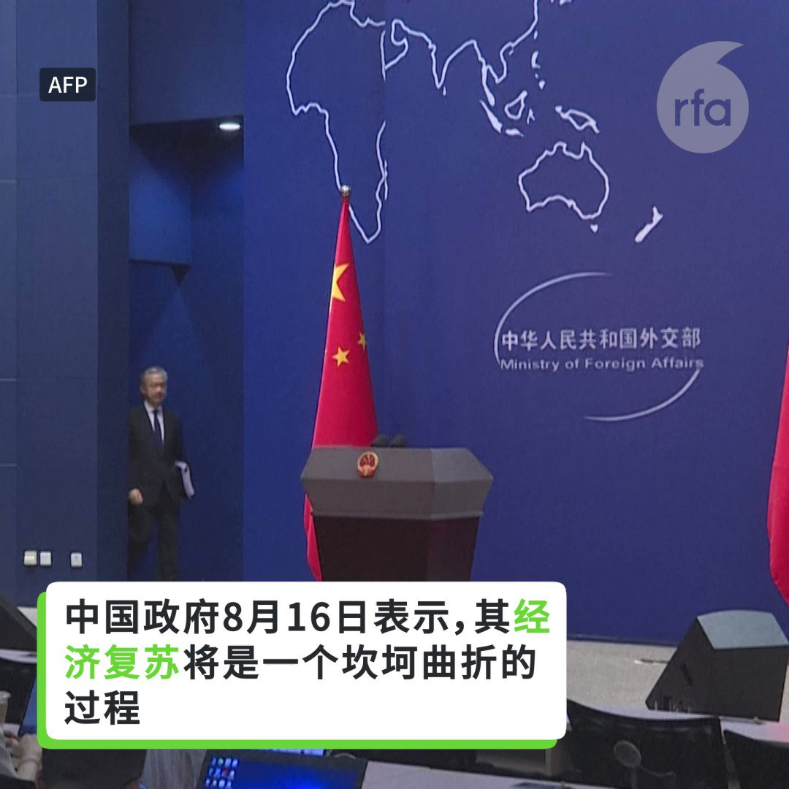

自由亚洲电台 北京时间 2023-08-17T19:43:19Z 1692140045702938788 RT @RFA_Chinese: 据台媒报道，截至8月15日，今年习近平仅在3月出访俄罗斯一次，全年只在国外度过两天时间，有望创下自他提出“中国特色大国外交”以来出访国家最少、出访时间最短的记录。
然而，2022年12月，中国外长王毅谈2023年中国特色大国外交6大任务时强调，…   自由亚洲电台 北京时间 2023-08-17T19:43:29Z 1692140084030562457 RT @RFA_Chinese: 【#亚太报道（2023-8-16）】 欢迎收听和订阅播客【亚太报道】 https://t.co/MjLNSvVMqc 

中国医生抱怨反腐影响工作/中国国安部再炒子肃案/中国消费疲软的背后/港资新玛德旗下深圳公司关闭/人行降息 人民币走弱 医疗…   自由亚洲电台 北京时间 2023-08-17T17:12:10Z 1692102004628447386 【赖清德过境旧金山】
【两岸侨胞现场较劲】
【赖：和平为灯塔 民主当指南针前进】

台湾的副总统 #赖清德 结束 #巴拉圭 的访问后，在回程途经 #旧金山 #过境。美国在台协会理事主席 #罗森伯格 出席台湾的欢迎侨宴。赖清德在侨宴致辞表示，台湾可以在 #民主和平 的愿景上让世界更美好。 https://t.co/9JvJibWBWd   自由亚洲电台 北京时间 2023-08-17T10:29:31Z 1692000673364156739 RT @RFA_Chinese: 【#亚太报道（2023-8-16）】 欢迎收听和订阅播客【亚太报道】 https://t.co/MjLNSvVMqc 

中国医生抱怨反腐影响工作/中国国安部再炒子肃案/中国消费疲软的背后/港资新玛德旗下深圳公司关闭/人行降息 人民币走弱 医疗…   自由亚洲电台 北京时间 2023-08-17T10:30:28Z 1692000912942784576 RT @RFA_Chinese: 据台媒报道，截至8月15日，今年习近平仅在3月出访俄罗斯一次，全年只在国外度过两天时间，有望创下自他提出“中国特色大国外交”以来出访国家最少、出访时间最短的记录。
然而，2022年12月，中国外长王毅谈2023年中国特色大国外交6大任务时强调，…   自由亚洲电台 北京时间 2023-08-17T05:39:47Z 1691927759956918690 英国内政部近日推出一项收费服务，申请BN(O)（英国国民海外护照）签证的港人最快可以在五个工作日内获批签证。中方批评英方"蛊惑港人背井离乡"。这项新措施也引起在英港人议论，猜测是否显示英国政府对香港形势有新的评估。 https://t.co/ObhPEwIx0Q   自由亚洲电台 北京时间 2023-08-17T06:26:46Z 1691939587323736178 专栏 | #网络博弈：曾因海祭刘晓波被捕　旅美自媒体女写手感受自由 https://t.co/9FNHsvp8u4   自由亚洲电台 北京时间 2023-08-17T02:46:52Z 1691884244224848347 中国官方近期不断加强有关国家安全和反间谍的宣传。本周二（15日），国安部发文强调政治安全是国家安全的根本，并翻炒七年前的云南省委党校退休教师子肃案，称其招募"敢死队"，妄图颠覆国家政权。中共为何有如此强烈的不安全感？中国真的会爆发一场"颜色革命"吗？ https://t.co/09Gsf6vQ7A   自由亚洲电台 北京时间 2023-08-17T05:30:09Z 1691925338605973827 据台媒报道，截至8月15日，今年习近平仅在3月出访俄罗斯一次，全年只在国外度过两天时间，有望创下自他提出“中国特色大国外交”以来出访国家最少、出访时间最短的记录。
然而，2022年12月，中国外长王毅谈2023年中国特色大国外交6大任务时强调，2023年元首外交将掀起新高潮。
您认为，习近平为何今年出访仅1次？您如何评价中国现在的外交政策？   自由亚洲电台 北京时间 2023-08-17T05:35:13Z 1691926613020295474 备受瞩目的美日韩三国领导人峰会将于本周五拉开帷幕。据多方消息，在本次峰会上，三国领导人不仅计划宣布年度联合军演，还将在更广泛领域深化合作，以对抗中国和朝鲜对印太地区施加的威胁。多位美国官员周三分析说，加强美日韩三方联盟符合该地区的共同愿景。 https://t.co/ELfexQYSsK   自由亚洲电台 北京时间 2023-08-17T05:38:03Z 1691927324634300809 本周二（8月15日），中国国家统计局公布了今年七月份的主要经济数据，其中消费数据再次让外界失望。中国政府几个月来连续出台的一些提振消费的措施似乎没有产生效果。疲软的消费背后，老百姓的想法和感受到底是什么？如何才能真正提振消费？ https://t.co/fUmM4lldg0   自由亚洲电台 北京时间 2023-08-17T05:40:32Z 1691927951825113329 本台老挝部报道：老挝当局以涉嫌贩卖人口为由逮捕了两名中国男子，因为他们雇佣未成年女孩拍摄淫秽视频，并上传到他们在TikTok的频道。 https://t.co/Z8BQlgq3yI   自由亚洲电台 北京时间 2023-08-17T05:42:33Z 1691928456815362178 #事实查核｜"定向能量武器试验"造成夏威夷毛伊岛火灾的"证据影片"是真的吗？ https://t.co/HrlyHw56Tj   自由亚洲电台 北京时间 2023-08-17T05:44:19Z 1691928903080882672 【#亚太报道（2023-8-16）】 欢迎收听和订阅播客【亚太报道】 https://t.co/MjLNSvVMqc 

中国医生抱怨反腐影响工作/中国国安部再炒子肃案/中国消费疲软的背后/港资新玛德旗下深圳公司关闭/人行降息 人民币走弱 医疗反腐 #疫情 #中国国安部 #子肃 #特务治国 #消费疲软  #新玛德 #人行降息 #人民币 https://t.co/dZPeE2CBhs   自由亚洲电台 北京时间 2023-08-17T00:50:18Z 1691854912081350977 港资企业新玛德电器在深圳的新安电器公司日前宣布，因订单减少和经营情况恶化而将于本周六（18日）停业。据当地人士披露，自新冠疫情爆发以来，几乎所有的外国公司都已撤离，许多人失业。 https://t.co/WxnNtDLEpq   自由亚洲电台 北京时间 2023-08-17T02:44:20Z 1691883607827296324 加拿大企业责任监察办公室（CORE）宣布对时装公司 #拉夫劳伦( #RalphLauren)在其 #新疆 的供应链中，涉嫌使用 #强迫劳动力 展开调查。今年稍早，耐克(NIKE)和王朝金矿(Dynasty Gold)也被点名遭到调查。维吾尔人权组织对此表示欣慰。 https://t.co/TOhDISe6CC   自由亚洲电台 北京时间 2023-08-17T03:50:27Z 1691900245003952529 中国政府8月16日表示，#中国 的 #经济复苏“将是一个坎坷曲折的过程”，称来自西方政客的批评最终会被现实打脸 https://t.co/rLHacWVImL   自由亚洲电台 北京时间 2023-08-17T01:15:16Z 1691861195379388801 #香港 在《#国安法》实施后，每年有数以万计、甚至十万计的港人移民离开。但港府最新公布的人口数据却显示，一年间有超过17万的人口移入香港，不仅止住香港人口连续3年下跌的情况，移入人口更创20年新高。短期内出现大批"新香港人"，各界关注香港是否正在被“换血”。 https://t.co/XhG2RUoziW   自由亚洲电台 北京时间 2023-08-17T01:15:57Z 1691861364120358940 根据世界卫生组织发布的最新猴痘疫情报告，过去一年半，#中国猴痘病例 增加了140%。在中国社区传播的持续推动下，西太平洋地区的猴痘病例显著增加。 https://t.co/kcbq2tUjWA   自由亚洲电台 北京时间 2023-08-17T01:17:01Z 1691861634174644344 就在美中双边关系紧张之际，#波音 公司16日任命中国出身，担任过福特汽车公司大中华区副董事长的 #柳青 担任该公司的中国业务总裁。 https://t.co/GNv4oyabYn   自由亚洲电台 北京时间 2023-08-17T01:22:56Z 1691863122565550244 中国大型民营企业与国企进来连连传出债务违约，恒大集团主席许家印近日传可能与妻子丁玉梅离婚，被怀疑有试图利用”假离婚“规避债务之嫌。 https://t.co/qnQ8z3i0ar   