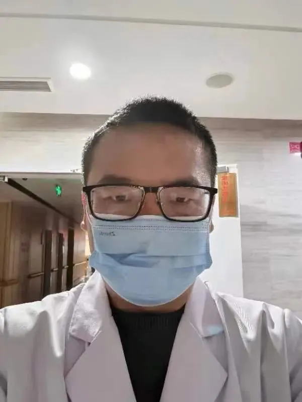
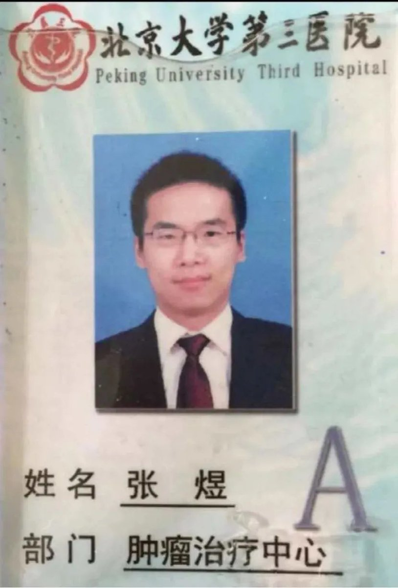
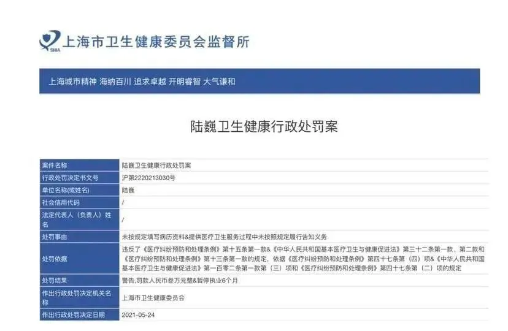
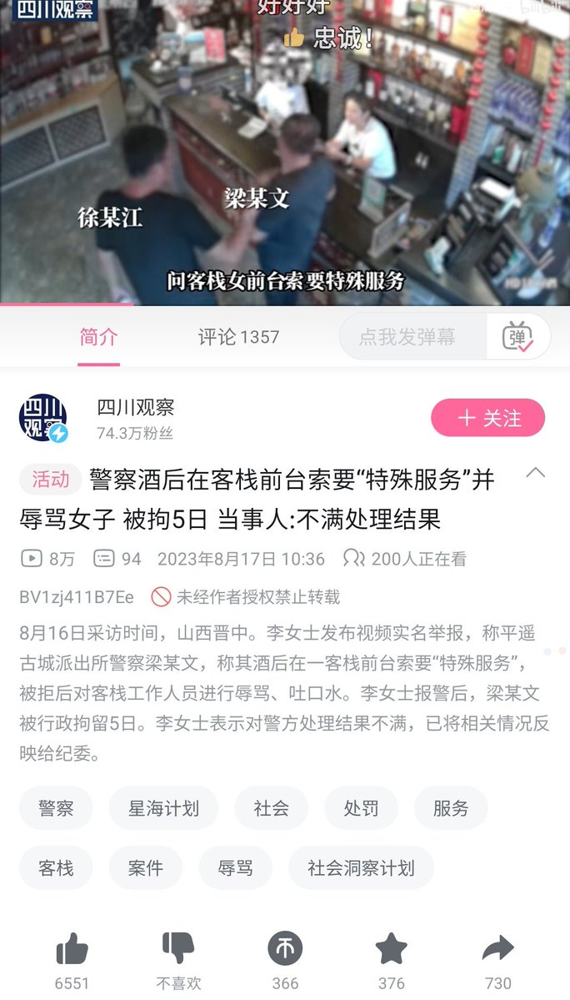
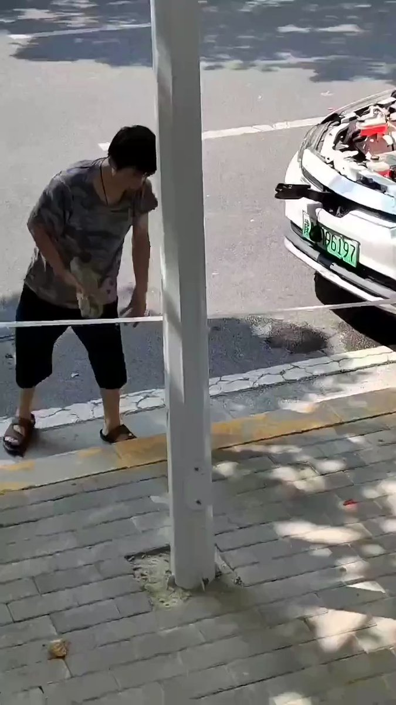

谁将十万横扫三江 北京时间 2023-08-17T16:31:27Z 1692091757037821955 揭黑医生张煜喊话希望重回北医三院
8月16日，原北医三院肿瘤内科医生张煜，在被开除一年半后，借助媒体喊话，希望重回北医三院重操旧业当医生。

他在自己的自媒体“张煜医生”上发文：
 
“想了很久，写下这篇求助的文章，这可能是我这辈子最难写的文章，写了又删，删了又写。因为对于我来说，这篇文章真的是非常重要，很可能关系到我的人生和家庭。
 
 我原以为自己会一辈子在北医三院工作，治病救人，养育家庭，平平淡淡地过完一生。 但世事难料，疫情的出现，让我在机缘巧合下成为网络大V，然后就碰到了一位又一位的人财两空的肿瘤患者，之后震惊地发现绝大部分竟然是因为部分医生的欺骗和过度治疗所致。

但最终我没有忍住，因为我不够冷漠，无法忍受自己置身事外，也难以忍受良心的谴责。于是在2年前，我写下了揭露肿瘤黑幕的文章，指出部分同行为了钱诱骗患者胡乱治疗，可以把花费提高到正常10倍以上但死亡率反而可能升高，受害者众多，这就是医疗腐败导致的恶果。

在这之后，我一度陷入巨大的舆论风波，然后失去了宝贵的工作，之后反复碰壁，好不容易再找到家乡的医生工作，又不幸失去，反反复复。我经历了很多很多事，虽然有好的一面，但主要是痛苦的经历，我平生之中从未遭受过这般程度的痛苦，也不想再提及。
 
这么长时间了，我真的以为毫无希望可言，自己不可能再重回工作岗位当医生。但现在情况有所不同，国家开始大力整顿医疗腐败，有很多支持和信任我的患者发声，说我并没有做错，开除我是不公平的，应该继续回去当医生。我似乎看见了一丝曙光，真的很感谢这些支持者。在离开工作岗位后，我曾经很多次梦到临床工作的点点滴滴，每次醒来都是很长时间的难过和不舍。我还有特别想探索研究的领域，想花毕生的精力去做，这是我一生的梦想，也许能够帮助到很多肿瘤患者。”
 
他表示：“如果真的能重返工作岗位。我保证自己会更加珍惜，会倾注自己的心血去帮助和救治患者，成为一位更出色的好医生，我能做到的。”

2021年5月24日，上海市卫健委监督所对陆巍处以“警告，罚款人民币叁万元整，暂停执业6个月”的处罚，处罚事由为“未按规定填写病历资料，提供医疗卫生服务过程中未按照规定履行告知义务”。此外，对陆巍所在的上海交通大学医学院附属新华医院处以“警告，罚款人民币肆万元整”，处罚事由是“医疗机构医疗质量管理不健全”。影响巨大的“肿瘤揭黑事件”以当事双方，揭黑医生北医三院肿瘤内科医生张煜，上海新华医院普外科副主任医师陆巍先后暂停门诊，最后被医院解职告终。   谁将十万横扫三江 北京时间 2023-08-17T17:12:01Z 1692101969295671418 RT @CirnoSapientia: 警察本来就是社会中最无耻下流的流氓的集中，他们不进行任何生产，欺侮妇女和鱼肉百姓的特权就是从一次次镇压中从统治者手中换来的。
https://t.co/EYohqgwApS https://t.co/ChBzYs3jjk   谁将十万横扫三江 北京时间 2023-08-17T10:37:50Z 1692002767748190356 江西广播电视台一分钟都不站在党的队伍之外，一分钟都不偏离习近平总书记指引的方向，一分钟都不离开习近平总书记和党中央的视野 https://t.co/baWgWseUCi   谁将十万横扫三江 北京时间 2023-08-17T10:48:34Z 1692005469823582613 郑州，砸自己的网约车。进入网约车都是坑，在公司平台买18万的车，自己负债，如今没单了，气得砸车。就业环境不好，警惕没挣钱就花钱的工作 https://t.co/147yFbYNH7   谁将十万横扫三江 北京时间 2023-08-17T06:37:51Z 1691942375709425801 RT @RFA_Chinese: 本周二（8月15日），中国国家统计局公布了今年七月份的主要经济数据，其中消费数据再次让外界失望。中国政府几个月来连续出台的一些提振消费的措施似乎没有产生效果。疲软的消费背后，老百姓的想法和感受到底是什么？如何才能真正提振消费？ https://…   谁将十万横扫三江 北京时间 2023-08-17T09:39:40Z 1691988129627193474 8月13日，广东，一女子得了晚期子宫癌，丈夫却弃之不顾，视频中，女子无奈带着6岁女儿沦落街头，病痛折磨的她身体难以忍耐，还要照顾女儿，女子因没钱也不敢去医院，只能强撑着。 https://t.co/0haokBYk6D   谁将十万横扫三江 北京时间 2023-08-17T06:41:36Z 1691943320153387496 RT @lilaoshizuikeai: 我不认为是“骗”，其实就算是文革时期，又有多少人相信那些人真的是间谍？
实际上政府号召“全民抓间谍”的意义就是一场“天赋人权”，中国版的“人类清除计划”，暗示你只要你能抓到把柄，那些你嫉妒的，你讨厌的，你痛恨的人，我们都允许你把他们搞死…   谁将十万横扫三江 北京时间 2023-08-17T09:01:00Z 1691978398401278250 公诉人执行抓间谍指示精神 https://t.co/qFantrhPuv   