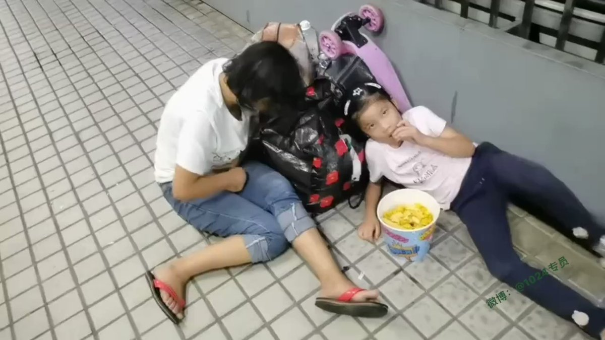
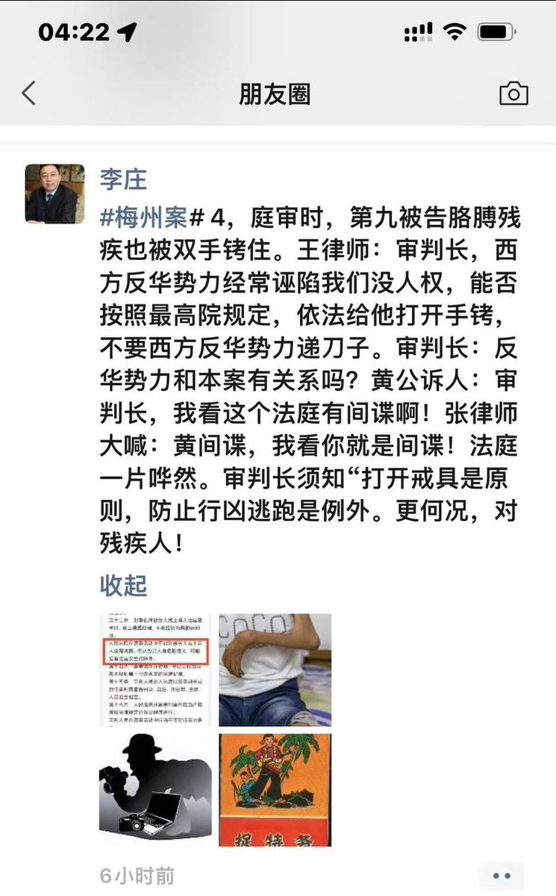

谁将十万横扫三江 北京时间 2023-08-17T09:39:40Z 1691988129627193474 8月13日，广东，一女子得了晚期子宫癌，丈夫却弃之不顾，视频中，女子无奈带着6岁女儿沦落街头，病痛折磨的她身体难以忍耐，还要照顾女儿，女子因没钱也不敢去医院，只能强撑着。 https://t.co/0haokBYk6D   谁将十万横扫三江 北京时间 2023-08-17T06:41:36Z 1691943320153387496 RT @lilaoshizuikeai: 我不认为是“骗”，其实就算是文革时期，又有多少人相信那些人真的是间谍？
实际上政府号召“全民抓间谍”的意义就是一场“天赋人权”，中国版的“人类清除计划”，暗示你只要你能抓到把柄，那些你嫉妒的，你讨厌的，你痛恨的人，我们都允许你把他们搞死…   谁将十万横扫三江 北京时间 2023-08-17T09:01:00Z 1691978398401278250 公诉人执行抓间谍指示精神 https://t.co/qFantrhPuv   