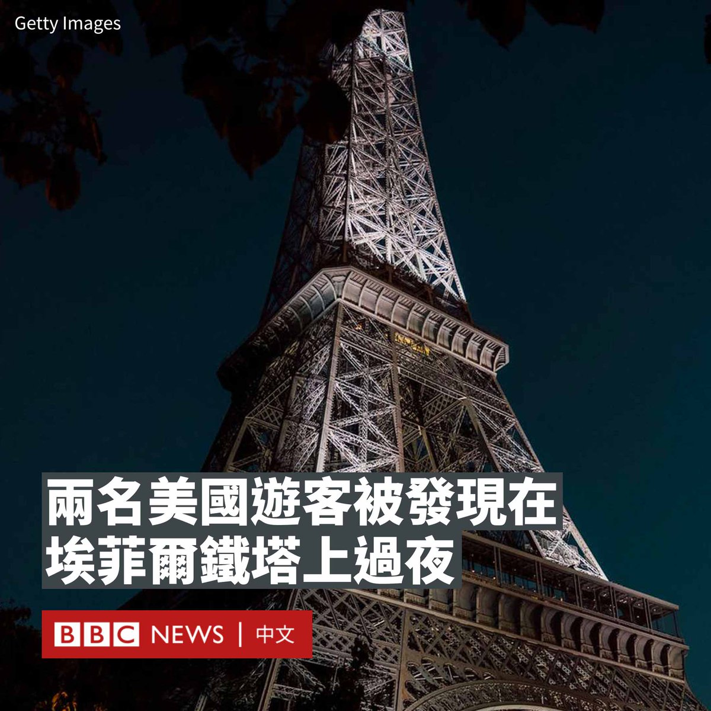
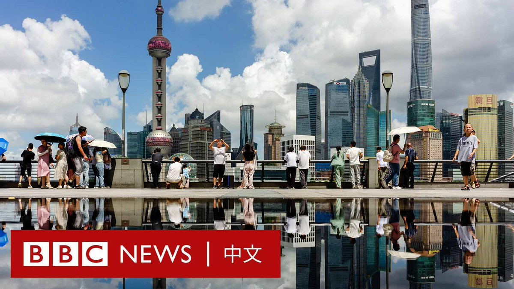

D英国广播公司BBC 北京时间 2023-08-16T15:50:24Z 1691719042116251721 两名美国游客被发现醉酒后滞留在巴黎地标埃菲尔铁塔上过夜。这两名男子于周一（8月14日）清晨被保安发现。

警方表示，他们于前一晚22:40左右参观了埃菲尔铁塔，并在下楼梯时跳过了封锁屏障。他们后来在铁塔的二层和三层之间一个通常不对公众开放的区域被发现。

巴黎检察官对法新社说，这些人“似乎是因为喝醉了才被卡住的”。据报道，保安人员在“清晨”叫醒了这些人，一支专门营救高处人员的消防队被派去营救这两人。

由于发现了这两名醉醺醺的男子，埃菲尔铁塔周一延迟了约一个小时接待游客。

埃菲尔铁塔运营公司（Sete）说，两人没有构成任何威胁。他们在巴黎接受了警方询问，而该公司表示将提起刑事诉讼。

此前，埃菲尔铁塔在上周六发生了两起虚假炸弹威胁事件，迫使铁塔在同一天内两次紧急疏散游客。

埃菲尔铁塔建于1880年代，高300米，去年吸引了580万游客。   D英国广播公司BBC 北京时间 2023-08-16T13:12:23Z 1691679272476283200 朝鲜当局表示，美国军人特拉维斯·金（Travis King）上个月越境进入该国领土，是因为在美国军队中遭受了“非人的虐待和种族歧视”。朝鲜官媒还称金“表示愿意寻求庇护”，这是朝鲜方面首次就这起案件发表公开评论。https://t.co/jIlnEcckGN   D英国广播公司BBC 北京时间 2023-08-16T11:21:36Z 1691651394481324488 中国一直是全球重要的经济引擎之一，但与其他正在应对高通货膨胀的国家不同，中国的物价水平却在走低，引发了人们对通货紧缩幽灵到来的担忧。这是为什么？ https://t.co/7qQwAaTI8W   D英国广播公司BBC 北京时间 2023-08-16T09:34:04Z 1691624333884420335 塔利班在阿富汗已执政两年，该组织曾承诺将允许女性学习和工作，但这些希望都已全面落空。不仅如此，该国的美容院被关闭，女性也不被允许进入公园。对许多阿富汗女性来说，日渐萎缩的生活带来的有悲痛和恐惧，也有希望和决心。https://t.co/CqnG8BS23y   