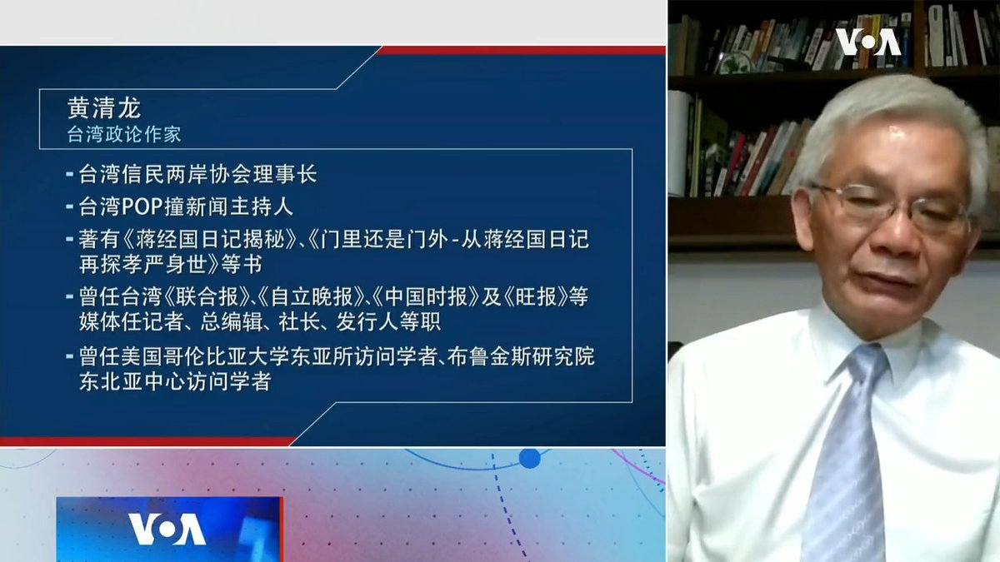
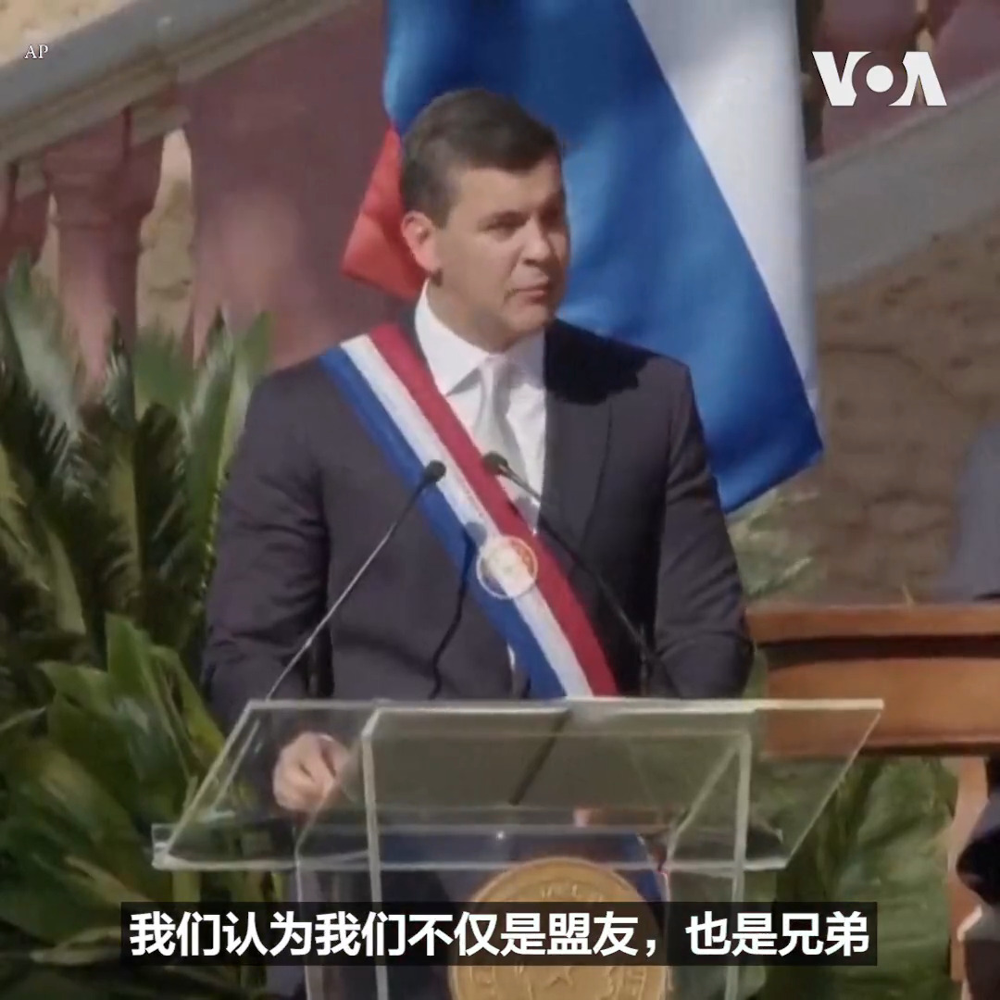

美国之音中文网 北京时间 2023-08-16T05:44:49Z 1691566641098715396 中国经济不断迎来坏消息，牛津大学学者乔治·马格纳斯近日发文提问：一个衰落中的中国是否对西方更危险？拜登总统也直言，陷入经济困局的中国是威胁世界的“定时炸弹”。然而中国媒体人胡锡进说，中国不会衰落。您怎么看？经济问题会否拖垮中国？世界如何应对？https://t.co/HpJ4LP7OeA https://t.co/mAuq1asqYL   美国之音中文网 北京时间 2023-08-16T05:48:34Z 1691567582149796091 加拿大监督机构对两家公司涉嫌维吾尔强迫劳动的指控展开调查 https://t.co/wMHQ8q5E9U   美国之音中文网 北京时间 2023-08-16T06:00:01Z 1691570464928489592 赖清德过境美国强调台海和平，并在专访中称国际的红线就是他的红线，不需另外宣佈台独也不用改中华民国国号。两岸信民协会理事长黄清龙告诉美国之音，中共将赖清德视为陈水扁第二，美方对他的信任度不如蔡英文，赖清德希望藉由此行釐清美方对他可能的怀疑。完整节目请看：https://t.co/wtVOXwgflX https://t.co/W7xPHN7tDT   美国之音中文网 北京时间 2023-08-16T06:08:32Z 1691572607991320966 美日韩将举行首次三边峰会，面对朝鲜和中国的日增威胁 https://t.co/FrSSmLVuC8   美国之音中文网 北京时间 2023-08-16T00:27:34Z 1691486801029222400 日本二季度GDP增幅超预期，年比高达6% https://t.co/GRCK3rzVMU   美国之音中文网 北京时间 2023-08-16T01:42:03Z 1691505545839329280 日本二战投降78周年纪念日，岸田首相重申和平承诺但未提对亚洲国家的侵略 https://t.co/ZNRsnOlroH   美国之音中文网 北京时间 2023-08-16T01:57:04Z 1691509323258814464 中国经济扩张动力之一高科技产业增长断崖式暴跌 经济雪上加霜 https://t.co/qpBI3DYAAV   美国之音中文网 北京时间 2023-08-16T02:57:06Z 1691524432131403776 强降雨天气连日来侵袭印度北部和西北部的喜马偕尔邦及北阿肯德邦等地，引发洪水和泥石流，造成至少50多人丧生，另有多人下落不明。当地官员8月15日说，搜救工作仍在继续，但随着时间推移，找到幸存者的希望变得更加渺茫。 https://t.co/ktSBjAywwl   美国之音中文网 北京时间 2023-08-16T03:57:56Z 1691539740451876866 中国最大民间资管巨头中植面临倒闭风险 金融大厦将倾？
https://t.co/Q5wtT8YImS   美国之音中文网 北京时间 2023-08-16T02:13:02Z 1691513342827909120 国际女足劲旅瑞典队在8月15日的世界杯半决赛中不敌首度闯入四强的西班牙女足，无缘晋级决赛。瑞典女足排名世界第三，也是本届世界杯四强赛中排名最高的球队。在斯德哥尔摩，大批围在电视前观看直播的瑞典球迷表达了失望之情。 https://t.co/VzAljQKOnS   美国之音中文网 北京时间 2023-08-16T00:14:03Z 1691483398316163072 中国最大民间资管巨头中值面临倒闭风险 金融大厦将倾？ https://t.co/O0Qgfvjsir   美国之音中文网 北京时间 2023-08-16T00:19:15Z 1691484707324649472 “我们不仅是盟友，也是兄弟”，巴拉圭新总统潘尼亚15日在就职演说中谈到与台湾的关系时说。潘尼亚还强调，与台湾的关系是“以地缘战略远见建立联盟与合作”的典范。台湾副总统赖清德率领代表团参加了潘尼亚的就职典礼。 https://t.co/GomS9rJlCZ   