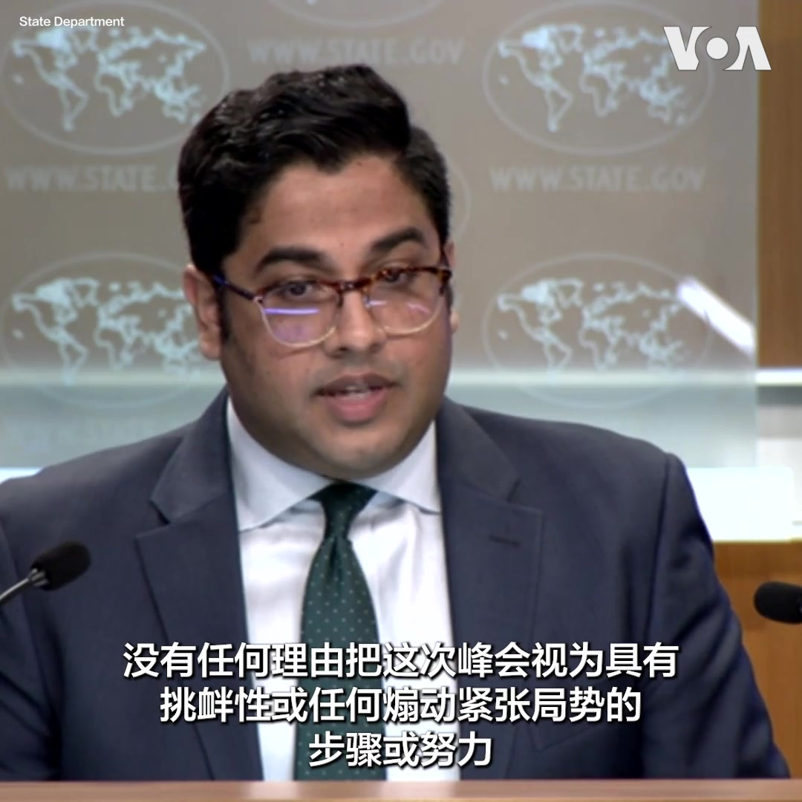

美国之音中文网 北京时间 2023-08-16T18:28:04Z 1691758719045083409 夏威夷毛伊岛山火过百人死亡 中国官媒趁机抨击美军不救灾反而“到南海挑衅” https://t.co/aKoSKaOpz6   美国之音中文网 北京时间 2023-08-16T17:12:04Z 1691739591542550894 巴拉圭总统就职 用“兄弟之情”形容巴台关系 https://t.co/6ciwUsHi1r   美国之音中文网 北京时间 2023-08-16T17:40:33Z 1691746759394111499 中国据信出席美国举办的印太防长会议 但未知是否与美方会晤 https://t.co/jG5dD6obE4   美国之音中文网 北京时间 2023-08-16T14:30:05Z 1691698829018755213 李尚福称台湾问题不容外来干涉 俄罗斯外长防长附和批评西方 https://t.co/XdG3qlSltt   美国之音中文网 北京时间 2023-08-16T15:56:33Z 1691720589101465913 美日韩峰会召开前夕 俄战略轰炸机飞越日本海 https://t.co/IdLulnaYCP   美国之音中文网 北京时间 2023-08-16T14:03:35Z 1691692160012484992 中国企业被勒令在申请境外上市文件中淡化对中国的风险评估 https://t.co/qO8PTpcsi5   美国之音中文网 北京时间 2023-08-16T07:16:34Z 1691589730927096070 前联邦调查局反情报官员承认帮助俄罗斯寡头的共谋指控 https://t.co/da96cIJLUn   美国之音中文网 北京时间 2023-08-16T09:16:04Z 1691619802220228629 朝鲜宣称：越界入朝的美国军人特拉维斯·金因对美军内部虐待和歧视不满而寻求避难 https://t.co/9Wif2nZ284   美国之音中文网 北京时间 2023-08-16T10:32:02Z 1691638920302526941 重重关卡下，中国获取美国和西方的关键技术手法多多 https://t.co/IPgdpTSljG   美国之音中文网 北京时间 2023-08-16T11:12:23Z 1691649073403556341 #揭谎频道：中国官方宣传“舍小家保大家”却否认为保北京而向邻省泄洪 文字报道：https://t.co/SmNjHqAWhn https://t.co/OtzGmfXszm   美国之音中文网 北京时间 2023-08-16T06:30:00Z 1691578011722584420 中共高层聚集北戴河讨论哪些问题？政论作家陈破空在时事大家谈节目中分析，今年北戴河麻烦特别多，但全都是习近平自找的，天灾变成人祸、反间谍法吓跑外资、招致内政、外交、经济全方位危机；他研判今年北戴河也聚焦讨论了武统台湾的问题和处理秦刚事件。完整节目请看：https://t.co/wtVOXwfHwp https://t.co/co5T9PrCzd   美国之音中文网 北京时间 2023-08-16T06:32:02Z 1691578522081587373 美中就业市场“东升西降” 华人赴美求职方兴未艾 https://t.co/KjmIOOqTs5   美国之音中文网 北京时间 2023-08-16T07:00:01Z 1691585565052031088 中国正在掀起一场医药反腐风暴，8月以来每天都有医疗系统干部落马。这场风暴能不能治本？会给民众带来什么？上海最大移民中介“外联出国”遭警方查处，是要加紧控制资金外流？还是强化政治钳制？“润”的路越来越窄，风险加大？请收看8月16号的【时事大家谈】并参加讨论。 https://t.co/HjbGCmPobq   美国之音中文网 北京时间 2023-08-16T07:16:33Z 1691589723779919884 佐治亚州大陪审团起诉特朗普和其他18人，特朗普宣称将发布“彻底证明无罪”的报告 https://t.co/Nu65rG3Gkg   美国之音中文网 北京时间 2023-08-16T07:48:35Z 1691597788231164343 各路共和党总统参选人亮相艾奥瓦州博览会 https://t.co/i34oZV7V7c   美国之音中文网 北京时间 2023-08-16T09:45:05Z 1691627105493405833 特朗普被佐治亚州起诉引发不同反应 https://t.co/ugYr81N67G   美国之音中文网 北京时间 2023-08-16T10:04:04Z 1691631881232826652 保守派团体旨在说服共和党人支持乌克兰 https://t.co/gGDhFtmmNT   美国之音中文网 北京时间 2023-08-16T05:00:03Z 1691555375382974466 菲律宾视台海冲突风险为“主要关切” https://t.co/wbJfaEl0gT   美国之音中文网 北京时间 2023-08-16T06:25:07Z 1691576782015615330 美日韩三国首脑峰会周五将在美国华盛顿郊区的戴维营登场。美国国务卿安东尼·布林肯星期二说，这次峰会将出台具体的倡议，因应包括朝鲜核挑衅在内的区域安全和其他经济安全议题。对于中国抨击此举为试图在东北亚打造小北约，国务院说，这场峰会不应被视为具有挑衅性。报道：https://t.co/IHuyQqXVBj https://t.co/WQjqiVZspw   美国之音中文网 北京时间 2023-08-16T06:50:00Z 1691583042991644957 夏威夷毛伊岛的野火延烧近一周以来，已造成近百人死亡，美国总统拜登8月15号表示这是百年来最致命的野火，联邦政府将提供州政府一切所需来救灾与重建，而他与第一夫人吉尔将在不妨碍救灾的情况下，尽快前往视察当地情况。除了毛伊岛，其他夏威夷岛屿也有零星野火，拜登说已动员驻扎当地美军协助。 https://t.co/nEDUbKhbSQ   美国之音中文网 北京时间 2023-08-16T07:48:33Z 1691597780765303157 中国经济放缓会恶化到什么程度？ https://t.co/gtemPXqlIi   美国之音中文网 北京时间 2023-08-16T08:44:32Z 1691611867658231974 军政府任命的尼日尔总理访问乍得，美国俄罗斯敦促外交解决危机 https://t.co/8TsqR7du7D   美国之音中文网 北京时间 2023-08-16T08:58:04Z 1691615274683011258 波兰在战争肆虐邻国乌克兰时展示军事实力 https://t.co/bEfvMnEPD8   美国之音中文网 北京时间 2023-08-16T04:39:32Z 1691550212400250983 俄罗斯和朝鲜希望加强合作 https://t.co/MnxqVuT78w   美国之音中文网 北京时间 2023-08-16T04:39:34Z 1691550220247789574 今天股市：中国疲软的经济数据导致全球股市下滑 https://t.co/LFXUUdKD7G   美国之音中文网 北京时间 2023-08-16T04:39:36Z 1691550228925616271 推特上的中国：青年失业率太高？不公布，“好日子”就在前方 https://t.co/Z4h1exEy2l   美国之音中文网 北京时间 2023-08-16T04:55:22Z 1691554196430938408 家事国事天下事，你有何见解】坚持拒绝公示官员财产以掩盖非正常收入的中共当局展开医药反腐，严厉追究医药界的非正常收入；当局号称为人民服务却不肯与人民分享当局官员所享受的医疗。这场医药反腐能解决民众看不起病的问题？或使民众忘记医药制度严重不公？民众有何途径解决或回避这一要命问题？ https://t.co/oCqWWLgaSD   美国之音中文网 北京时间 2023-08-16T05:13:05Z 1691558656456974695 蒙古的微妙平衡: 在大国夹缝中探索新前程 https://t.co/fJKYCN01Nn   美国之音中文网 北京时间 2023-08-16T05:27:03Z 1691562167156502578 习近平有望创“中国特色大国外交”新低潮 https://t.co/sXXLMvPY9R   美国之音中文网 北京时间 2023-08-16T05:44:49Z 1691566641098715396 中国经济不断迎来坏消息，牛津大学学者乔治·马格纳斯近日发文提问：一个衰落中的中国是否对西方更危险？拜登总统也直言，陷入经济困局的中国是威胁世界的“定时炸弹”。然而中国媒体人胡锡进说，中国不会衰落。您怎么看？经济问题会否拖垮中国？世界如何应对？https://t.co/HpJ4LP7OeA https://t.co/mAuq1asqYL   美国之音中文网 北京时间 2023-08-16T05:48:34Z 1691567582149796091 加拿大监督机构对两家公司涉嫌维吾尔强迫劳动的指控展开调查 https://t.co/wMHQ8q5E9U   美国之音中文网 北京时间 2023-08-16T06:00:01Z 1691570464928489592 赖清德过境美国强调台海和平，并在专访中称国际的红线就是他的红线，不需另外宣佈台独也不用改中华民国国号。两岸信民协会理事长黄清龙告诉美国之音，中共将赖清德视为陈水扁第二，美方对他的信任度不如蔡英文，赖清德希望藉由此行釐清美方对他可能的怀疑。完整节目请看：https://t.co/wtVOXwgflX https://t.co/W7xPHN7tDT   美国之音中文网 北京时间 2023-08-16T06:08:32Z 1691572607991320966 美日韩将举行首次三边峰会，面对朝鲜和中国的日增威胁 https://t.co/FrSSmLVuC8   美国之音中文网 北京时间 2023-08-16T00:27:34Z 1691486801029222400 日本二季度GDP增幅超预期，年比高达6% https://t.co/GRCK3rzVMU   美国之音中文网 北京时间 2023-08-16T01:42:03Z 1691505545839329280 日本二战投降78周年纪念日，岸田首相重申和平承诺但未提对亚洲国家的侵略 https://t.co/ZNRsnOlroH   美国之音中文网 北京时间 2023-08-16T01:57:04Z 1691509323258814464 中国经济扩张动力之一高科技产业增长断崖式暴跌 经济雪上加霜 https://t.co/qpBI3DYAAV   美国之音中文网 北京时间 2023-08-16T02:57:06Z 1691524432131403776 强降雨天气连日来侵袭印度北部和西北部的喜马偕尔邦及北阿肯德邦等地，引发洪水和泥石流，造成至少50多人丧生，另有多人下落不明。当地官员8月15日说，搜救工作仍在继续，但随着时间推移，找到幸存者的希望变得更加渺茫。 https://t.co/ktSBjAywwl   美国之音中文网 北京时间 2023-08-16T03:57:56Z 1691539740451876866 中国最大民间资管巨头中植面临倒闭风险 金融大厦将倾？
https://t.co/Q5wtT8YImS   美国之音中文网 北京时间 2023-08-16T02:13:02Z 1691513342827909120 国际女足劲旅瑞典队在8月15日的世界杯半决赛中不敌首度闯入四强的西班牙女足，无缘晋级决赛。瑞典女足排名世界第三，也是本届世界杯四强赛中排名最高的球队。在斯德哥尔摩，大批围在电视前观看直播的瑞典球迷表达了失望之情。 https://t.co/VzAljQKOnS   美国之音中文网 北京时间 2023-08-16T00:14:03Z 1691483398316163072 中国最大民间资管巨头中值面临倒闭风险 金融大厦将倾？ https://t.co/O0Qgfvjsir   美国之音中文网 北京时间 2023-08-16T00:19:15Z 1691484707324649472 “我们不仅是盟友，也是兄弟”，巴拉圭新总统潘尼亚15日在就职演说中谈到与台湾的关系时说。潘尼亚还强调，与台湾的关系是“以地缘战略远见建立联盟与合作”的典范。台湾副总统赖清德率领代表团参加了潘尼亚的就职典礼。 https://t.co/GomS9rJlCZ   