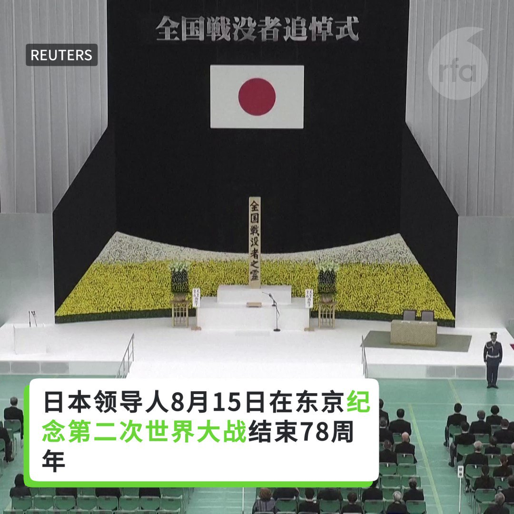
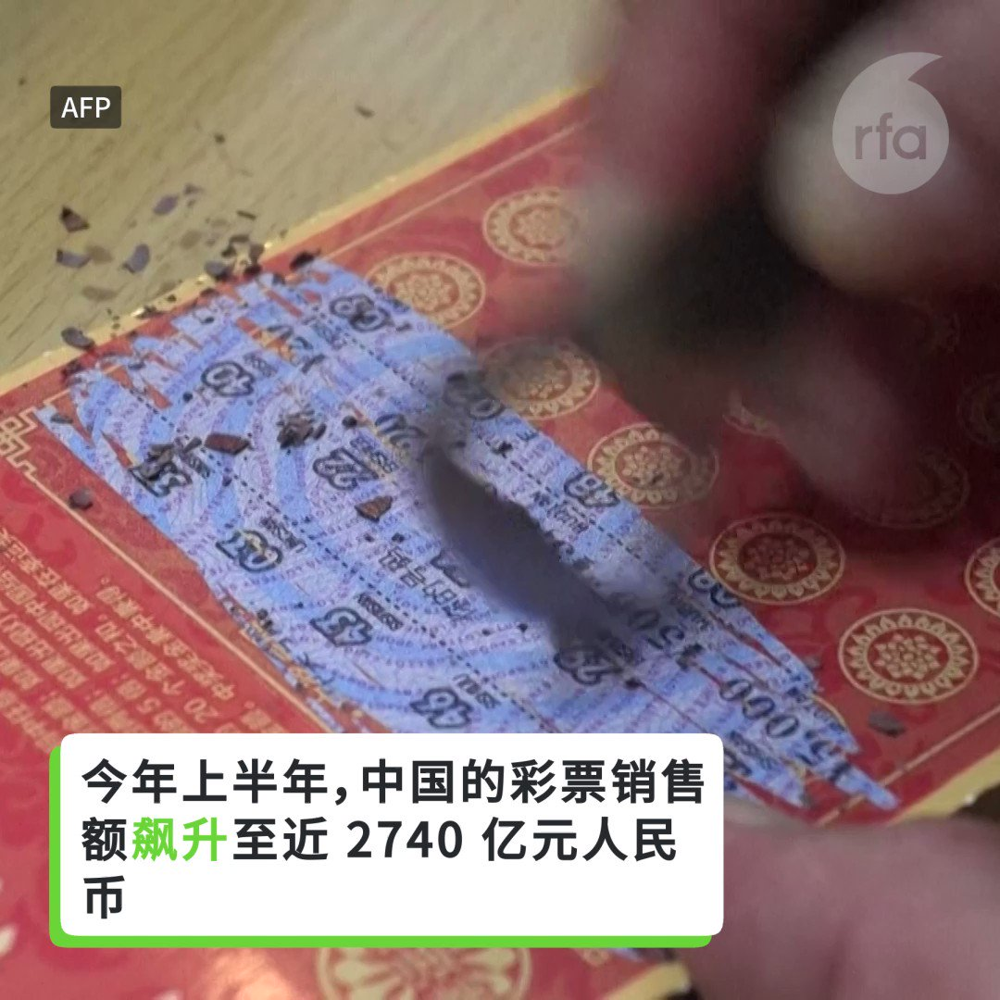

自由亚洲电台 北京时间 2023-08-16T04:49:28Z 1691552711924462008 据德国之声报道，德国《商报》披露，在工艺复杂、技术含量高的产品领域，中国制造正在挤压德国商品在欧盟的份额。 https://t.co/PAhdldlsPj   自由亚洲电台 北京时间 2023-08-16T04:50:58Z 1691553086932938986 中国国家安全部披露了2016年发生的一起国家安全案件, 这起案件中，云南某学校退休干部肃某主动联络境外敌对组织骨干成员，策划境外买武器，境内招募“敢死队”，实施名为“中国班加西工程”的暴力颠覆国家政权的行动，但在策划阶段就被国安破获并抓捕。 https://t.co/NmAS68G3G9   自由亚洲电台 北京时间 2023-08-16T05:18:05Z 1691559914349687113 评论 | #胡平：伟哉郭飞雄 https://t.co/ggcep4CfKj   自由亚洲电台 北京时间 2023-08-16T00:40:54Z 1691490158770798592 评论 | #陈破空：党媒越来越有趣，对习近平是赞还是黑？ https://t.co/BMdY7HOaCt   自由亚洲电台 北京时间 2023-08-16T01:17:38Z 1691499401632784384 据中国官媒央视报道，上周五西安长安区发生了山洪泥石流，到周二（8月15日）为止，已经造成24人死亡，仍有3人失联。 https://t.co/RDEi0nG4dk   自由亚洲电台 北京时间 2023-08-16T03:16:46Z 1691529383020732417 在短短四个月内，中国国防部长 #李尚福 两度出访 #俄罗斯，外界虽多有揣测，但中国官方一直对李尚福此次行程语焉不详。与此同时，美日韩计划本周五在戴维营举行领导人峰会，寻求共同对抗中国。学者指出，美中双方都在积极拉拢盟友，增加谈判筹码。https://t.co/eqfid99stN   自由亚洲电台 北京时间 2023-08-16T03:35:33Z 1691534109971972096 日本领导人8 月 15 日在东京纪念第二次世界大战结束 78 周年。随后中国外交部表示，中方已就日本首相参拜东京靖国神社一事提出严正交涉。 https://t.co/OH01md78nh   自由亚洲电台 北京时间 2023-08-16T04:18:08Z 1691544826704195587 今年上半年，中国的彩票销售额飙升至近 2740 亿元人民币，同比增长超过 50%，分析师指出，年轻人失业率不断攀升，以及经济不景气可能是重要原因。 https://t.co/LZXSUwijsU   自由亚洲电台 北京时间 2023-08-16T00:40:23Z 1691490027728199681 据美国《华尔街日报》报道，今年头六个月，美国从中国进口的商品在其进口总额中占比为13.3%，创造了自2003年以来的最低水平。 https://t.co/Wz8MmIa1rt   自由亚洲电台 北京时间 2023-08-16T00:41:21Z 1691490272377802752 评论 | #王丹：中国经济的未来：是“危机”还是“崩溃”？ https://t.co/1hJ4tRa7nk   自由亚洲电台 北京时间 2023-08-16T01:18:55Z 1691499722450866176 据中国国家卫生健康委员会网站周二（8月15日）披露，卫健委当天表示，全国医药领域腐败问题集中整治工作将为期一年 https://t.co/owakvPi1aH   