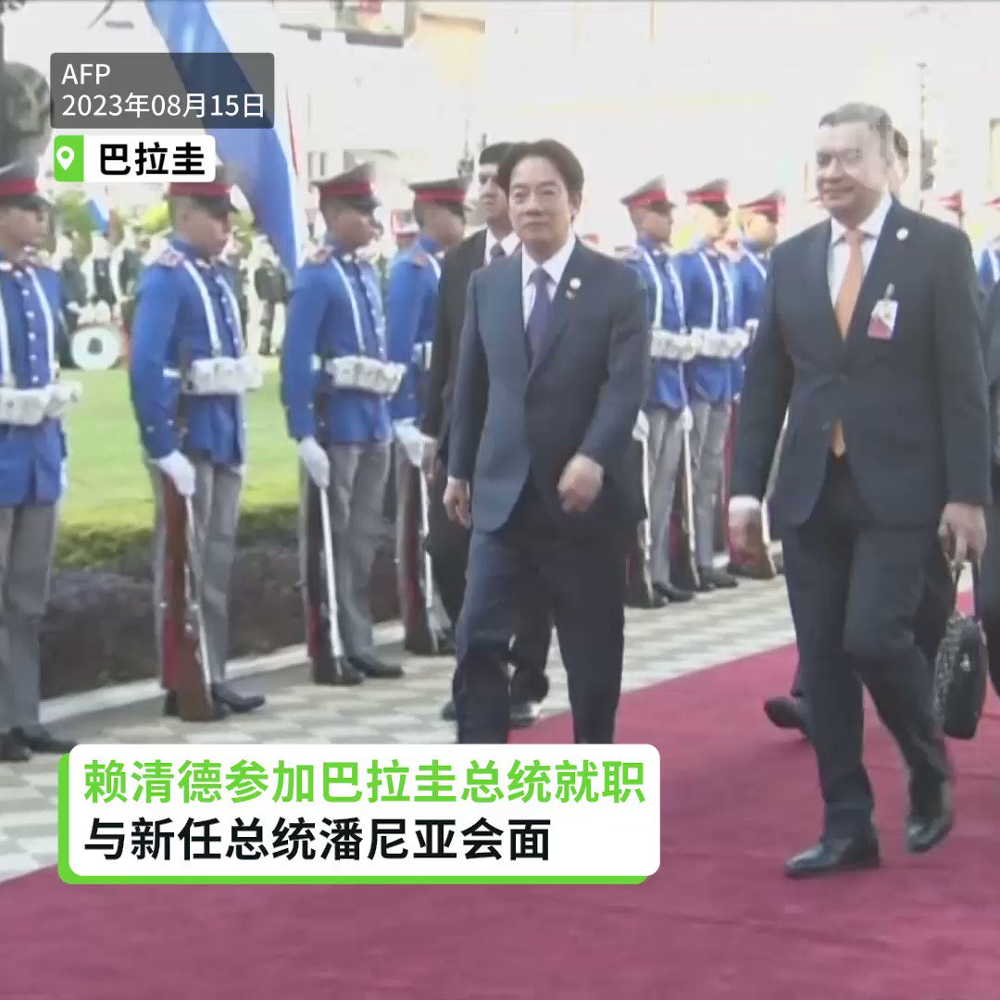
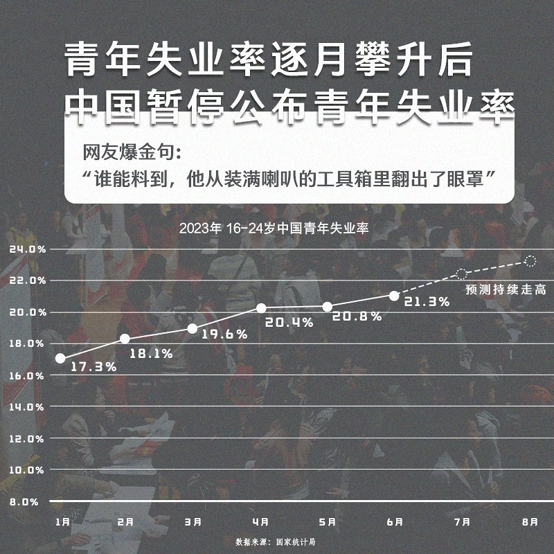

自由亚洲电台 北京时间 2023-08-16T23:17:32Z 1691831566912324043 台湾的副总统 #赖清德 15日出席巴拉圭共和国新任总统潘尼亚（Santiago Peña Palacios）就职典礼。随后他在与媒体茶叙时向对岸喊话，表示过境美国已行之有年，不应成为 #中国文攻武吓 的借口。 https://t.co/M1l60T32Vl   自由亚洲电台 北京时间 2023-08-16T23:51:41Z 1691840159619379494 专栏 | #劳工通讯：安徽省1-5月连续发生三起有限空间事故造成11人死亡 (三) https://t.co/Z34Ffvrz1K   自由亚洲电台 北京时间 2023-08-16T17:54:03Z 1691750157568913590 【中国人行3个月内两度降息】
【人民币持续走弱】
中国 #人行 15日无预警调降调降中、短期政策利率，离岸 #人民币 兑美元16日上午一度跌破7.3关口，创下2023年以来新低纪录。分析指，中国 #消费 意愿不高、#需求 不振，人行刺激政策效果有限。
https://t.co/fqOHgJT8tB https://t.co/8KapmIp02l   自由亚洲电台 北京时间 2023-08-16T14:17:17Z 1691695606341976384 【赖清德参加巴拉圭总统就职】
【巴拉圭总统：与中华民国台湾为兄弟之邦】

台湾的 #赖清德 副总统15日参加 #巴拉圭 新任总统 #潘尼亚 的就职典礼，与各国政要互动寒暄。潘尼亚在就职演说中特别提到与 #中华民国台湾 的邦谊犹如兄弟，也是有战略眼光的合作联盟。 https://t.co/LMRerpAx93   自由亚洲电台 北京时间 2023-08-16T04:29:24Z 1691547661948919808 【#亚太报道（2023-8-15）】 欢迎收听和订阅播客【亚太报道】 https://t.co/MjLNSvVMqc 

#卢思位 在 #老挝 被强制失踪/民企之后 #国企也爆雷/ #中国经济 三驾马车表现不佳/#李尚福出访 #美日韩会面/中国大反 #间谍 令 #外商 却步 https://t.co/dO12iCT32H   自由亚洲电台 北京时间 2023-08-16T04:19:59Z 1691545290808115200 近日传出消息，中国人权律师卢思位今年七月底在老挝被当地警方抓捕后，在上周可能被警方转出了当地的一所监狱，目前仍然下落不明。 https://t.co/RYlXGls8eJ   自由亚洲电台 北京时间 2023-08-16T04:48:23Z 1691552438384271662 8月15日，中国国家统计局宣布，自今年8月份开始，因调查统计须进一步完善，暂停发布新的青年就业数据。
国家统计局新闻发言人付凌晖解释，暂停发布相关数据的主要原因是：经济社会在不断发展变化，统计工作需要不断完善，劳动力调查统计也需要进一步健全优化。
他还指出，随着居民受教育水平提高，青年人在校学习时间增加，在劳动力调查统计中，对于青年人年龄范围的界定也需要进一步研究。
您认为，付凌晖的解释有道理吗？暂停公布青年失业率能否解决实际问题？   自由亚洲电台 北京时间 2023-08-16T04:49:28Z 1691552711924462008 据德国之声报道，德国《商报》披露，在工艺复杂、技术含量高的产品领域，中国制造正在挤压德国商品在欧盟的份额。 https://t.co/PAhdldlsPj   自由亚洲电台 北京时间 2023-08-16T04:50:58Z 1691553086932938986 中国国家安全部披露了2016年发生的一起国家安全案件, 这起案件中，云南某学校退休干部肃某主动联络境外敌对组织骨干成员，策划境外买武器，境内招募“敢死队”，实施名为“中国班加西工程”的暴力颠覆国家政权的行动，但在策划阶段就被国安破获并抓捕。 https://t.co/NmAS68G3G9   自由亚洲电台 北京时间 2023-08-16T05:18:05Z 1691559914349687113 评论 | #胡平：伟哉郭飞雄 https://t.co/ggcep4CfKj   自由亚洲电台 北京时间 2023-08-16T00:40:54Z 1691490158770798592 评论 | #陈破空：党媒越来越有趣，对习近平是赞还是黑？ https://t.co/BMdY7HOaCt   自由亚洲电台 北京时间 2023-08-16T01:17:38Z 1691499401632784384 据中国官媒央视报道，上周五西安长安区发生了山洪泥石流，到周二（8月15日）为止，已经造成24人死亡，仍有3人失联。 https://t.co/RDEi0nG4dk   自由亚洲电台 北京时间 2023-08-16T03:16:46Z 1691529383020732417 在短短四个月内，中国国防部长 #李尚福 两度出访 #俄罗斯，外界虽多有揣测，但中国官方一直对李尚福此次行程语焉不详。与此同时，美日韩计划本周五在戴维营举行领导人峰会，寻求共同对抗中国。学者指出，美中双方都在积极拉拢盟友，增加谈判筹码。https://t.co/eqfid99stN   自由亚洲电台 北京时间 2023-08-16T03:35:33Z 1691534109971972096 日本领导人8 月 15 日在东京纪念第二次世界大战结束 78 周年。随后中国外交部表示，中方已就日本首相参拜东京靖国神社一事提出严正交涉。 https://t.co/OH01md78nh   自由亚洲电台 北京时间 2023-08-16T04:18:08Z 1691544826704195587 今年上半年，中国的彩票销售额飙升至近 2740 亿元人民币，同比增长超过 50%，分析师指出，年轻人失业率不断攀升，以及经济不景气可能是重要原因。 https://t.co/LZXSUwijsU   自由亚洲电台 北京时间 2023-08-16T00:40:23Z 1691490027728199681 据美国《华尔街日报》报道，今年头六个月，美国从中国进口的商品在其进口总额中占比为13.3%，创造了自2003年以来的最低水平。 https://t.co/Wz8MmIa1rt   自由亚洲电台 北京时间 2023-08-16T00:41:21Z 1691490272377802752 评论 | #王丹：中国经济的未来：是“危机”还是“崩溃”？ https://t.co/1hJ4tRa7nk   自由亚洲电台 北京时间 2023-08-16T01:18:55Z 1691499722450866176 据中国国家卫生健康委员会网站周二（8月15日）披露，卫健委当天表示，全国医药领域腐败问题集中整治工作将为期一年 https://t.co/owakvPi1aH   