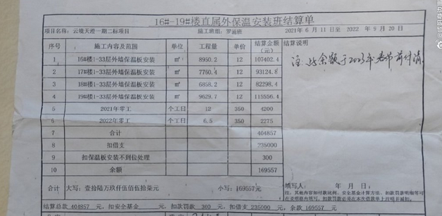
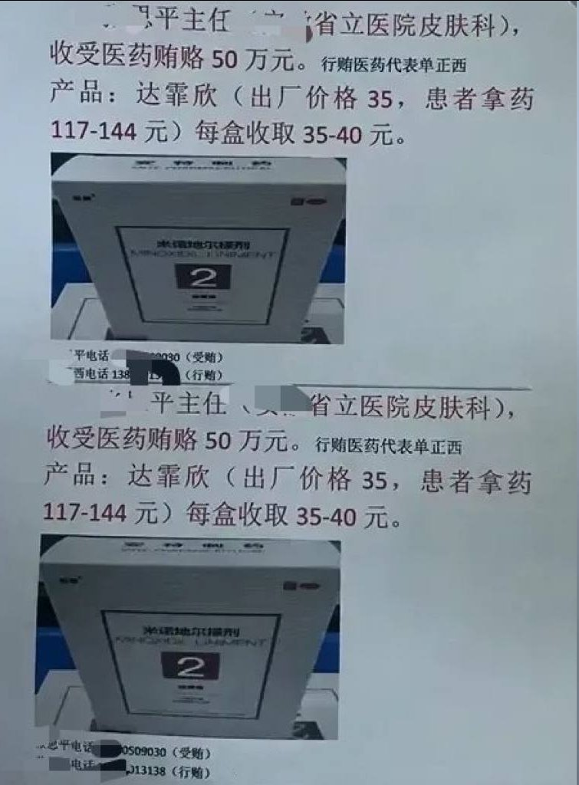

谁将十万横扫三江 北京时间 2023-08-16T21:00:23Z 1691797052231942545 天津聚龙集团印度尼西亚农业产业合作区克扣员工工资：
招聘的主管（杨义）当时在招聘员工的时候，隐瞒岗位的实际情况，到岗后和招聘时所说不符合，环境条件特别差，连最起码的住宿条件都保证不了，宿舍蚂蚁频繁出现，身体上到处都有蚂蚁咬伤，疼痛实在难忍，无法控制，连下班休息都是问题，向领导反应无果，天气炎热，宿舍洗漱，洗衣服都成问题，工作环境区域高度高温状态，也是给领导反应后没有改善。致使不能正常工作，也被工作所烫伤，劳动合同也是没有签署，经给领导反应无果，不能改善，后来辞职回家，但是所工作的实际工作日工资公司给予扣除，没有实际发放   谁将十万横扫三江 北京时间 2023-08-16T21:04:45Z 1691798147943555543 咸阳市一项目干完活，无良开发商一直拖欠农民工血汗钱，被拖欠工资39557元农民工讨薪一年多未果…

     农民工罗师傅（手机号18981661260）是四川南江县人，2021年6月份，罗师傅带着妻子和三四个老乡，在四川忠法建筑劳务有限公司的组织下，进入咸阳市秦都区天伦•云境天澄一期二标段项目，从事外墙保温板安装工作，干的有16、17、18、19楼和零工，干到2022年8月底完工，合计总工资404857元。2022年9月20日，项目上一陈姓经理（手机号180****1418）给罗师傅等人出具了一份工资结算单，结算单上显示除去已发放给工人的工资235000元，余下欠工资169557元，并承诺在2023年春节前付清余下的全部工资。然而，陈经理满口承诺后而未兑现，在2022年底，只付给工友们13万工资，至今被拖欠工资39557元。
     2023年春节后罗师傅多次联系陈经理要工资，但都被各种理由拖延未付工资，开始说是开发商或总承包单位陕建七建集团那边没付款，再到后边儿电话也不接了……
    据了解，天伦•云境天澄一期二标段项目位于咸阳市秦都区，胭脂路与西华路交汇处西南角。
    建设单位：陕西东方天伦地产（集团）有限公司。
    ​总承包单位：陕西建工第七建设有限公司 。
    劳务分包单位：四川忠法建筑劳务有限公司。
   罗师傅讲，他今年49岁，住在大山里农村的家庭本就不富裕，父母年迈，家中还有3个孩子在上学，家里就靠他们夫妇打工挣钱维持生计，拖欠工资使他的家庭生活更加的困难！   谁将十万横扫三江 北京时间 2023-08-16T19:26:54Z 1691773522446549350 RT @whyyoutouzhele: 8月16日，网传天津方舟公园附近，一名小贩捅伤了三名城管 https://t.co/mezT12lNWZ   谁将十万横扫三江 北京时间 2023-08-16T19:44:44Z 1691778013690548640 出厂价35元，医院卖多少钱合适？医生提多少适当？

“这个医药代表是个狠人，这是同归于尽呀！这主任是咋得罪人家了！”。辞职不干的医药代表为了出恶气，把举报信直接贴到医院门口，出厂价35元的药，卖给患者117元到144元，每盒收取35到40元。还收了医药贿赂50万。 https://t.co/wwquMuJpGZ   谁将十万横扫三江 北京时间 2023-08-16T12:21:06Z 1691666368460910607 RT @laomanpindao: 《七月经济，全面塌陷 》2023年7月，可以作为正式的“塌陷时刻”，写进红色中国的经济史。自有数据以来，还从来没有任何一个月，像这个月一样，投资、外贸、地产、金融和消费，所有数据全面崩塌。并且，从数据趋势上来看，这种全面崩塌还会长期持续下去。…   谁将十万横扫三江 北京时间 2023-08-16T15:46:45Z 1691718120640073801 RT @whyyoutouzhele: 有人在郑州桥洞留下新的诗歌 https://t.co/9PpHewPlGZ   谁将十万横扫三江 北京时间 2023-08-16T12:27:05Z 1691667872127271216 小哥真实记录——与患有ADHD（注意力缺陷）女友的生活日常。因为很难集中注意力，小姐姐聊天思维断断续续，话题不断跳跃；平时也经常忘事，总是不记得自己本来要干嘛，两个人表示，他们在一起真的很快乐 https://t.co/LmtZfF6zBo   谁将十万横扫三江 北京时间 2023-08-16T12:32:24Z 1691669211448254906 RT @NiKiTa_32156: 烏克蘭人是真不知道、
距離6000公里以外亞洲土地上、
還有1群中國人1直支持烏克蘭、
喜歡烏克蘭、沒啥說的、中國人真棒。 https://t.co/WSflzj0TW3   谁将十万横扫三江 北京时间 2023-08-16T04:37:33Z 1691549714146283734 RT @whyyoutouzhele: 但是感觉关于这件事的评论区很翻车。 https://t.co/VvuPQs9fes   谁将十万横扫三江 北京时间 2023-08-16T04:43:20Z 1691551169410396617 独立可以，只要这些地方维持高度的经济开放和出入境开放就行，允许走得慢，不允许退回封建   谁将十万横扫三江 北京时间 2023-08-16T05:02:42Z 1691556040435798500 RT @whyyoutouzhele: 大连407路公交车驾驶员家属在车站上张贴告示，控诉公交公司强制司机高强度工作，每天5点出门，晚上8点才能到家，完全无视司机疲劳驾驶和乘客的生命安全。 https://t.co/4Gw07N4YLd   