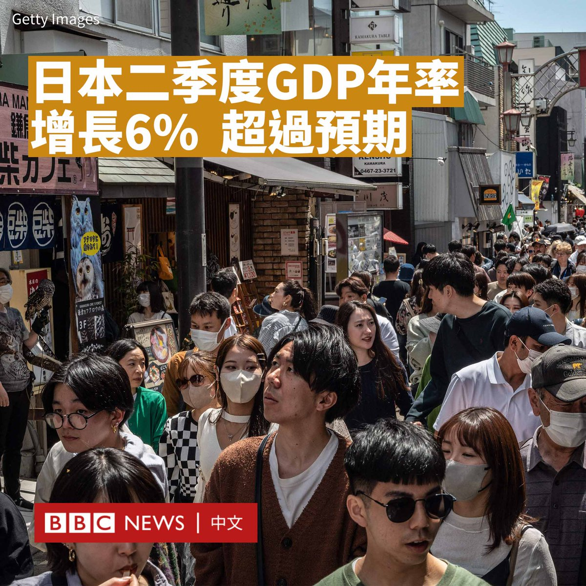

D英国广播公司BBC 北京时间 2023-08-15T22:56:29Z 1691463881682714626 中国房地产问题持续恶化，继恒大之后，中国另一家主要房企碧桂园突然面临债务违约困境，正在努力避免步众多已违约竞争对手的后尘，让危机的阴云再次笼罩在中国楼市之上。https://t.co/ujTefbPkiY   D英国广播公司BBC 北京时间 2023-08-15T16:54:53Z 1691372878514819073 在阿富汗塔利班政府对妇女实施严格限制，并指责音乐“败坏道德”而没收乐器焚烧后，许多身处国外的阿富汗歌手利用音乐表达对塔利班的抗议，以及对阿富汗国内女性的声援。 https://t.co/cNEYDP6kfU   D英国广播公司BBC 北京时间 2023-08-15T19:00:20Z 1691404449523392512 英国北爱尔兰警察局（PSNI）近日发生“自我起底”事件，北爱警察总长伯恩（Simon Byrne）证实，被错误曝光的讯息恐已落入共和派异议武装组织手中，恐会被用于针对警队成员的骚扰与恐吓行为。

PSNI近日在回覆一项《信息自由法》查询时，不慎披露了全警队1万名警员与警队文职人员的名单，内含各人姓氏全写、名字首字母、官阶或职级，以及具体驻地或所属部门。这包括了在情报等敏感部门任职的警务人员。

今年2月，北爱蒂龙郡奥马市（Omagh, County Tyrone）遭枪手伏击后，北爱警察将当地恐怖主义威胁水平提升至英国第二高的“严峻”级别，意味着很可能会有袭击发生。伯恩8月14日称，警队管理层正不眠不休地设法补救。

共和派异议人士指支持北爱与爱尔兰共和国统一的政治阵营中，反对北爱和平各项条约的一群。因北爱的特殊安全环境，警员得极其警惕，甚至对至亲保密其职务，这尤其是为了防范爱尔兰民族主义群体。

英国北爱尔兰事务大臣克里斯·希顿—哈里斯（Chris Heaton-Harris）称，伦敦中央政府仍将致力给予北爱警队专业支持。

信息外泄事件曝光后，北爱政界出现要求伯恩下台的呼声，但也有人警告，北爱尔兰议会与权力分享政府目前停摆，将无法委任新的警察总长。

主张北爱留英的北爱民主统一党（DUP）党魁杰福瑞·唐纳森爵士（Sir Jeffrey Donaldson）15日接受BBC访问时说，此刻让北爱警队群龙无首并非好的选择，但他同时担忧信息外泄事件将削弱北爱警队震摄共和派异议人士武装活动的能力。

爱尔兰共和国前总理埃亨（Bertie Ahern）对北爱警队信息外泄事件感到大惑不解，但他相信事情终将水落石出。

这起信息外泄事件发生之际，正值1998年奥马爆炸案25周年到临之际。当年8月15日，共和派异议武装“真爱尔兰共和军”（Real IRA）在奥马埋下炸弹，造成29人死亡。

爱尔兰共和国副总理马丁（Micheál Martin）就奥马爆炸案25周年发言：“在北爱尔兰从事暴力抗争从不正当，我们必须锲而不舍地为和平、对话和重建互信而努力。”   D英国广播公司BBC 北京时间 2023-08-15T20:16:20Z 1691423577592238080 日本4月至6月的国内生产总值（GDP）按年率换算增长了6%，增速远超预期，是经济学家预测的近两倍，也是这个世界第三大经济体近三年来最大的增幅。

增速的主要原因是日元贬值提振了出口，因为日本制造的商品对全球消费者来说更加便宜。

日元近几个月来对主要货币的贬值幅度较大，日元对美元今年贬值超过10%。

富士通首席经济学家马丁·舒尔茨（Martin Schulz）告诉BBC：“日元走弱是推动GDP数据向好的幕后原因。”

受出口带动，包括丰田、本田和日产在内的日本汽车制造商在近几个月利润大增。

虽然货币贬值使该国进口商品更加昂贵，但最近几个月全球市场石油和天然气等大宗商品价格在下跌。

自日本政府于四月底取消入境限制后，日本的游客数量也有所增加。根据日本国家旅游局的数据，截至6月，访日外国游客数量已恢复到疫情前水平的70%以上。

不过，也有经济学家认为不可忽视日本经济中存在的一些问题，包括私人消费的下降。

由于日本面临四十年来的罕见通胀，工人虽然工资增加，但购买力实际下降。   D英国广播公司BBC 北京时间 2023-08-15T18:05:14Z 1691390584102309888 俄罗斯西南部达吉斯坦共和国首府马哈奇卡拉一座加油站发生爆炸，已致35人死亡，数十人受伤。 https://t.co/hJYCqD43hj   D英国广播公司BBC 北京时间 2023-08-15T15:14:12Z 1691347542112374784 俄罗斯货币卢布兑美元汇率贬至16个月新低，跌破1美元兑100卢布大关。https://t.co/6mqLi3vhPc   D英国广播公司BBC 北京时间 2023-08-15T11:18:38Z 1691288258158661632 【最新消息】美国佐治亚州亚特兰大大陪审团对前总统特朗普（Donald Trump）提起刑事指控，指其涉嫌尝试推翻该州2020年总统选举结果。这是特朗普今年以来第四次被刑事起诉。 https://t.co/WTPFao8Lum   D英国广播公司BBC 北京时间 2023-08-15T13:08:51Z 1691315998446718976 在中国青年失业率飙升至历史最高水平之际，当局宣布将暂停发布该数据。

中国国家统计局发言人付凌晖周二（8月15日）在记者会上宣布，由于调查统计工作的“健全优化”，自今年8月份开始将不再发布这一数据。

“经济社会在不断发展变化，统计工作需要不断完善，劳动力调查统计也需要进一步健全优化。”他说道。

他解释称，由于中国在校学生规模不断扩大，在校学生的主要任务是学习，毕业前寻找工作的学生是否应纳入劳动力调查统计，社会各方面有不同的看法，对于青年人年龄范围的界定也需要进一步研究。

“目前大部分毕业生已经落实就业去向，大学毕业生就业状况总体稳定。”他补充说。

此前，官方公布的6月份青年失业率高达21.3%，是有记录以来的最高值，也是连续第三个月突破新高。

相比之下，美国2023年6月的青年失业率为7.5%，欧盟为14.1%。

青年失业率指的是年龄16至24岁人口的失业率。中国从2018年开始统计这一年龄段人口的就业状况，但限于城镇，而不包含农村地区。

周二公布的官方数据显示，七月份全国城镇调查失业率为5.3%。

随着中国正面临艰难的经济复苏，房地产、科技和教育行业也遭受重创，中国的年轻人正面临最艰难的毕业求职季。

国家统计局的这一决定在互联网引发质疑。一些网民批评当局是“掩耳盗铃”。

上个月，北京大学经济学副教授张丹丹在中国媒体“财新网”上发表的一篇文章中称，研究发现官方公布的青年失业率可能被严重低估，中国3月份青年实际失业率最高上看46.5%。

她称，中国青年失业率高的问题“首先应当归因于2020年以来持续三年的新冠疫情”，因为其对消费、企业营商环境乃至经济整体活力产生持续性影响。   D英国广播公司BBC 北京时间 2023-08-15T12:08:52Z 1691300902106513408 美国前总统特朗普（Donald Trump）因涉嫌试图推翻佐治亚州2020年总统选举的结果遭到刑事起诉。

亚特兰大一个大陪审团听取了富尔顿县地方检察官法尼·威利斯（Fani Willis）在两年多的调查过程中提出的证据，随后向法庭呈交了对特朗普的起诉书。

起诉书包括41项罪名。特朗普和其他18名被告面临有组织敲诈勒索罪等指控。该罪名主要针对有组织犯罪集团的成员，最高可判处20年监禁。

这是特朗普今年以来第四次被刑事起诉。他否认了所有控罪。

被告还包括特朗普前律师鲁迪·朱利安尼（Rudy Giuliani）、白宫前幕僚长马克·梅多斯（Mark Meadows）、白宫前律师约翰·伊斯曼（John Eastman）和司法部前官员杰弗里·克拉克（Jeffrey Clark）等。

长达98页的起诉书称，被告人“明知故犯地加入了非法改变大选结果以支持特朗普的阴谋”。

2021年1月，特朗普在佐治亚州以一万票之差输给了拜登（Joe Biden）后，在一通电话中要求佐治亚州州务卿布拉德·拉芬斯佩尔格（Brad Raffensperger）为他“找到”更多选票。

法尼·威利斯于2021年2月对特朗普及其合作者干预选举的指控展开了调查。

特朗普此前将该调查描述为“政治迫害”。他的竞选团队在一份声明中称，地方检察官是一个“狂热的党派分子”，而“这些虚假起诉”是为了干扰2024年总统竞选。

声明称：“在民主党占压倒性优势的司法辖区，一名有偏见的检察官最近发起协调行动，不仅背叛了美国人民的信任，也暴露了他们捏造指控的真正动机。”   D英国广播公司BBC 北京时间 2023-08-15T09:50:59Z 1691266200972435457 在塔利班统治下，公开执行体罚甚至死刑重现于阿富汗：BBC调查发现，自2022年11月以来，全国举行了至少50场行刑大会，有近350人受笞刑和其他惩罚，还有两人被处决。 https://t.co/nORL3rfvo5   