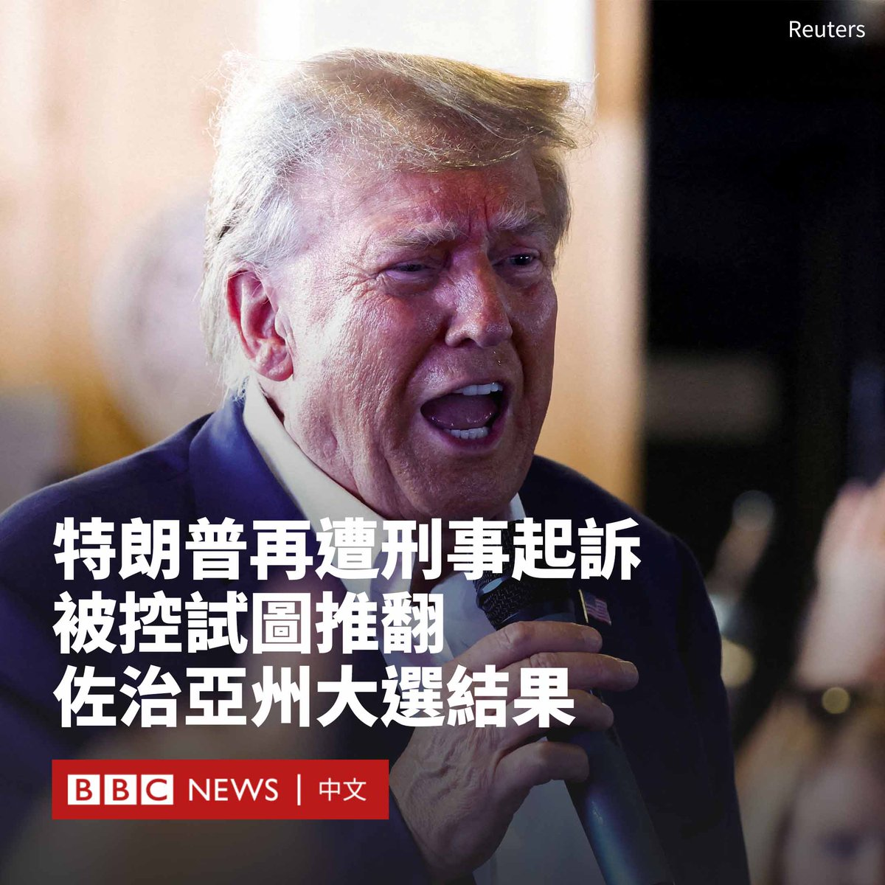

D英国广播公司BBC 北京时间 2023-08-15T12:08:52Z 1691300902106513408 美国前总统特朗普（Donald Trump）因涉嫌试图推翻佐治亚州2020年总统选举的结果遭到刑事起诉。

亚特兰大一个大陪审团听取了富尔顿县地方检察官法尼·威利斯（Fani Willis）在两年多的调查过程中提出的证据，随后向法庭呈交了对特朗普的起诉书。

起诉书包括41项罪名。特朗普和其他18名被告面临有组织敲诈勒索罪等指控。该罪名主要针对有组织犯罪集团的成员，最高可判处20年监禁。

这是特朗普今年以来第四次被刑事起诉。他否认了所有控罪。

被告还包括特朗普前律师鲁迪·朱利安尼（Rudy Giuliani）、白宫前幕僚长马克·梅多斯（Mark Meadows）、白宫前律师约翰·伊斯曼（John Eastman）和司法部前官员杰弗里·克拉克（Jeffrey Clark）等。

长达98页的起诉书称，被告人“明知故犯地加入了非法改变大选结果以支持特朗普的阴谋”。

2021年1月，特朗普在佐治亚州以一万票之差输给了拜登（Joe Biden）后，在一通电话中要求佐治亚州州务卿布拉德·拉芬斯佩尔格（Brad Raffensperger）为他“找到”更多选票。

法尼·威利斯于2021年2月对特朗普及其合作者干预选举的指控展开了调查。

特朗普此前将该调查描述为“政治迫害”。他的竞选团队在一份声明中称，地方检察官是一个“狂热的党派分子”，而“这些虚假起诉”是为了干扰2024年总统竞选。

声明称：“在民主党占压倒性优势的司法辖区，一名有偏见的检察官最近发起协调行动，不仅背叛了美国人民的信任，也暴露了他们捏造指控的真正动机。”   D英国广播公司BBC 北京时间 2023-08-15T09:50:59Z 1691266200972435457 在塔利班统治下，公开执行体罚甚至死刑重现于阿富汗：BBC调查发现，自2022年11月以来，全国举行了至少50场行刑大会，有近350人受笞刑和其他惩罚，还有两人被处决。 https://t.co/nORL3rfvo5   