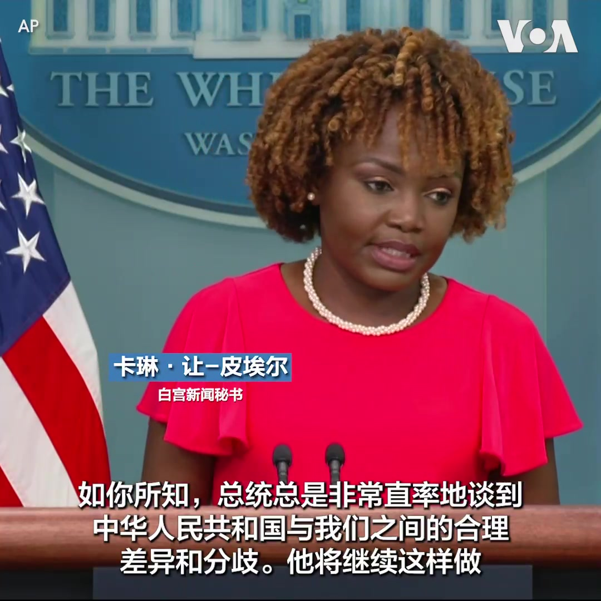
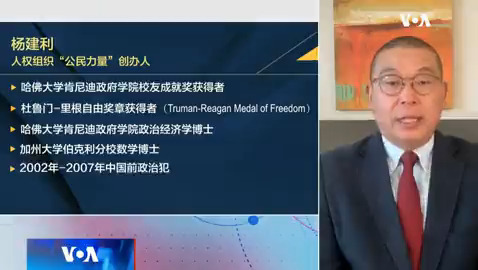
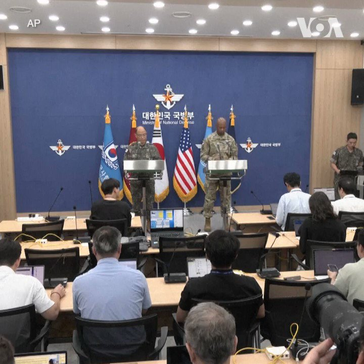

美国之音中文网 北京时间 2023-08-15T08:00:00Z 1691238274545987588 【家事国事天下事，你有何见解】为加大吸引外商投资力度，中国当局8月13日再公布《关于进一步优化外商投资环境 加大吸引外商投资力度的意见》。有人则预测外商投资者已得到足够教训，不会再为中共当局火中取栗；有人则说人的记忆力短暂，而贪婪和侥幸心理则属于商人的基因。两种预测或看法哪种更靠谱？ https://t.co/uT9RNVopSh   美国之音中文网 北京时间 2023-08-15T08:59:04Z 1691253136584024064 亨特·拜登的律师：控辩协议涉枪支部分仍有效 https://t.co/GSOOEG8y2O   美国之音中文网 北京时间 2023-08-15T09:00:00Z 1691253371129536512 一键解锁 #美国热搜 榜1、为什么中共对拜登的投资禁令没有反击之力？是习近平认怂还是憋大招？2、清洗火箭军习近平是自断手足，代表治军策略的失败3、拜登暗示因为遇到经济困境习可能对台动武4、荒诞视频：李毅PK习近平5、粉红外卖骑手6、见习女干部与灾民起冲突 https://t.co/mrj85fdA8V https://t.co/LAIbe0OxY4   美国之音中文网 北京时间 2023-08-15T02:44:08Z 1691158781621608448 【家事国事天下事，你有何见解】
台湾副总统赖清德过境访问美国抵达纽约时，没有出现像过去的反台独或亲中团体集结抗议的情况。第二天早上，赖清德在出席侨团活动时，会场外出现抗议人群，高喊“反对台独，支持和平”以及“赖清德滚蛋”的口号。出现和不出现是中共当局操控不力？收纵自如？随机事件？ https://t.co/wgAuFbD6kH   美国之音中文网 北京时间 2023-08-15T03:46:06Z 1691174375523753984 在保加利亚中部小镇斯塔罗泽勒扎里，每年夏天会有大量游客和艺术家来此聚集，欣赏这里的街头墙上的卡通人物，文娱明星和政界人物的画像，并在现场参与创作。 https://t.co/B2lOZ0Jacv   美国之音中文网 北京时间 2023-08-15T04:40:51Z 1691188153451757568 7月中旬以来，中国掀起强度空前的医药反腐行动。中国官媒报道，迄今已有176位院长、书记被查，多家医药企业董事长被带走。中国网民觉得“大快人心”之际也有人反问：拿下院长书记后，老百姓看病问题就解决了吗？财新网报道，怎么给医院钱和怎么给医生钱的医改两大问题依旧无解。您怎么看中国的医药反腐？ https://t.co/jGQuGAIKE2   美国之音中文网 北京时间 2023-08-15T04:51:58Z 1691190952784736257 “他从不回避坦率地分享他的看法，”白宫新闻秘书卡琳·让-皮埃尔8月14日在例行记者会上被问到拜登总统有关中国的经济增速只有2%，是颗定时炸弹的讲话时说。这位发言人为拜登辩护说，并不只是美国在说这样的话。她也表示，拜登总统认为外交是管理美中竞争的负责任的方式。 https://t.co/CPTrhJ3Ehy   美国之音中文网 北京时间 2023-08-15T05:09:34Z 1691195379927388160 富士康老板看到了在印度投资数十亿美元的潜力 https://t.co/mKB8D1fIDo   美国之音中文网 北京时间 2023-08-15T05:38:05Z 1691202556696104960 美国宣布为乌克兰提供两亿美元新军援 https://t.co/FouGczjnn6   美国之音中文网 北京时间 2023-08-15T05:52:02Z 1691206067890589697 美国在阿拉斯加附近追踪俄罗斯军用飞机 https://t.co/Hz4d3exalA   美国之音中文网 北京时间 2023-08-15T06:00:00Z 1691208075183828992 据华尔街日报报道，德国、法国、意大利等主要欧洲国家可能回避出席定于今年秋天举行的一带一路峰会，表明“习近平的外交雄心面临更具挑战性的全球大环境。” 公民力量创办人杨建利说，一带一路是习近平的旗舰项目，欧洲是其一带一路倡议争取的重点目标。 
#时事大家谈完整版：https://t.co/EpAew1PgTX https://t.co/F45Epz4U5U   美国之音中文网 北京时间 2023-08-15T00:28:32Z 1691124655099203597 香港民主人士李柱铭、吴霭仪等7人14日获法庭撤销一项“组织未经批准集结罪”。香港上诉庭副庭长麦机智（Andrew Macrae）表示，他和其他法官一致撤销了对这些人士的“组织未经批准集结”罪名的指控，但他们“明知而参与未经批准集结”的定罪及刑期上诉则遭驳回、维持原判。  
报道：https://t.co/9CL18Lf8dy https://t.co/wzdu59tqKB   美国之音中文网 北京时间 2023-08-15T02:22:51Z 1691153427840049152 美韩军事官员8月14日说，两国军队将于8月21日至31日举行代号为“乙支自由护盾”（UFS）的联合军演。美军驻韩部队发言人说，此次演习是为了因应东北亚地区不断演进的多种安全威胁，加强韩美同盟的应对能力。此前，朝鲜领导人金正恩在8月9日公开强调“强势备战”。 https://t.co/0Q1UW5xN4F   美国之音中文网 北京时间 2023-08-15T02:55:04Z 1691161532363870211 李柱铭黎智英等7名香港民主派 反修例组织集结上诉得直 参与集结维持原判 https://t.co/ZzNhct7fwm   美国之音中文网 北京时间 2023-08-15T03:00:32Z 1691162908456050688 “当一个女孩不识字，她的未来就会被毁掉，国家就不会发展”，阿富汗的一位教师说。阿富汗塔利班掌权两年来，妇女权利受到严重侵犯。她们的就业、受教育机会被剥夺，几乎完全被排除在公众生活之外。最近塔利班下令美容院关闭，导致6万女性企业人士受影响，进一步缩小了她们在家庭之外可以聚集的空间。 https://t.co/ZAK8w12ugK   美国之音中文网 北京时间 2023-08-15T03:25:35Z 1691169211362770944 众议院外交领袖发表声明，欢迎台湾副总统访问美国 https://t.co/wzCA585KSV   美国之音中文网 北京时间 2023-08-15T03:40:04Z 1691172857995497476 中国针对在土耳其学习或访问过的维吾尔人展开新一轮逮捕行动 https://t.co/uM1UkkqkAz   美国之音中文网 北京时间 2023-08-15T03:44:21Z 1691173934907990016 中国国安部13日点名批评美国，称美国借中国修订《反间谍法》"炒作中国威胁"，暴露其“自私、霸道、虚伪”的本质。文章称，美国用炒作中国威胁弥合自身内政、社会撕裂，是“内病外治”、“饮鸩止渴”。中国威胁真是华盛顿炒作的？美国对国家安全的重视为何让北京跳脚？中国的点名批判能说服多少人？您怎么看？ https://t.co/eNeE1C9Yv2   美国之音中文网 北京时间 2023-08-15T04:09:33Z 1691180279095005184 夏威夷州长警告说，毛伊岛的死亡数字可能升高 https://t.co/xOGlkNMlnt   美国之音中文网 北京时间 2023-08-15T00:27:10Z 1691124311757672449 在乌克兰工业城市科里维里赫，当地工程师与乌克兰军方一道，对民用挖土机进行改装，将其变成战场上的排雷装置。研发团队最近在科里维里赫的一处试验场地对这项发明进行了测试。他们对测试结果感到满意。 https://t.co/lMxLrlbKAC   美国之音中文网 北京时间 2023-08-15T01:25:34Z 1691139008070561792 美国网络安全官员警告：如果台海战事爆发，北京可能攻击美国关键基础设施 https://t.co/NbK9ifT6Gn   美国之音中文网 北京时间 2023-08-15T00:08:03Z 1691119502824742912 澳大利亚海军最大战舰驶往南中国海与菲美举行联合军演 https://t.co/NkqZrkVsla   