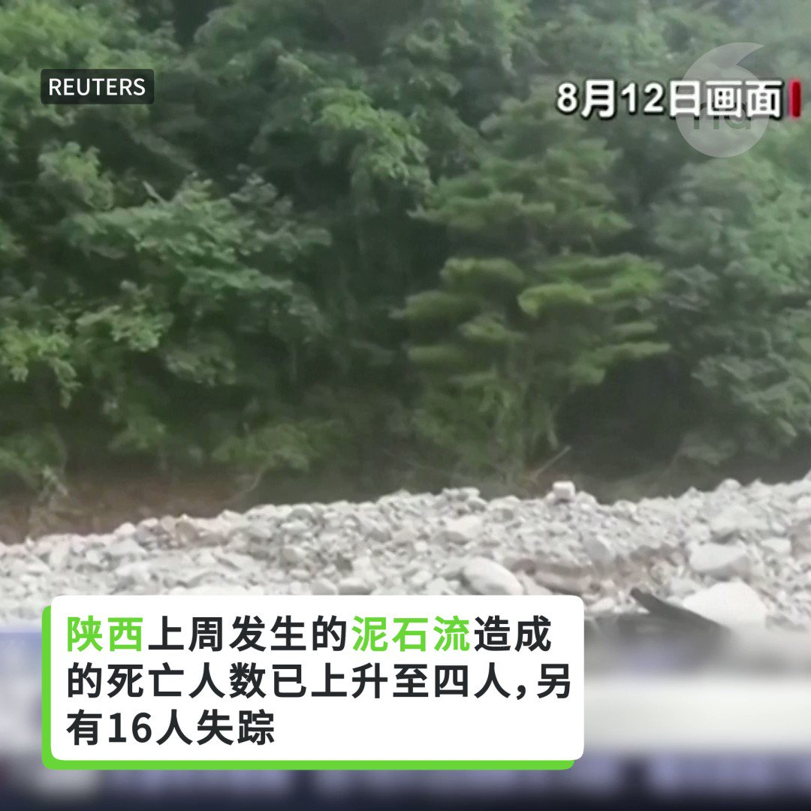
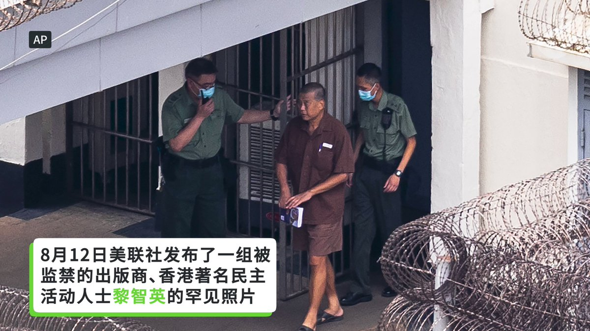

自由亚洲电台 北京时间 2023-08-15T06:28:18Z 1691215196805902340 专栏 | #夜话中南海：新官上任就祸不单行的中共央行新行长 #潘功胜 https://t.co/tvsPcReUz9   自由亚洲电台 北京时间 2023-08-15T06:29:23Z 1691215466587729921 正当西方国家纷纷关闭孔子学院之际，与中国比邻的老挝的顶尖大学将通过孔子学院开设汉语教学硕士课程。 https://t.co/3Gfc5ULLmI   自由亚洲电台 北京时间 2023-08-15T06:27:45Z 1691215056967806979 中国陕西、江苏自然灾害致人员伤亡。陕西上周发生的泥石流造成的死亡人数已上升至四人，另有 16 人失踪。另外，江苏也在13号发生龙卷风和冰雹，造成至少两人死亡、15 人受伤。 https://t.co/OhsXGzZECh   自由亚洲电台 北京时间 2023-08-15T06:31:09Z 1691215911506903040 【#亚太报道（2023-8-14）】
欢迎收听和订阅播客【亚太报道】 https://t.co/MjLNSvVMqc

中国推"#24条"吸引外商投资 / 中国政府会挽救 #碧桂园 和 #中植系 吗 / #赖清德 低调过境纽约 / #高智晟 失踪六年 世界各地集会寻人 / #港府抓夜市吸引大陆客 https://t.co/bDht0fuM4T   自由亚洲电台 北京时间 2023-08-15T06:32:39Z 1691216288193163270 #唯色RFA博客：蛮子的舌头（一） https://t.co/UWBuiIm3fj   自由亚洲电台 北京时间 2023-08-15T06:33:51Z 1691216591554514944 #事实查核｜#美国文盲比例 比七十年前还高了很多？ https://t.co/jhOZEdSmcJ   自由亚洲电台 北京时间 2023-08-15T08:35:40Z 1691247247764168704 RT @RFA_Chinese: 【#亚太报道（2023-8-14）】
欢迎收听和订阅播客【亚太报道】 https://t.co/MjLNSvVMqc

中国推"#24条"吸引外商投资 / 中国政府会挽救 #碧桂园 和 #中植系 吗 / #赖清德 低调过境纽约 / #高智晟 失…   自由亚洲电台 北京时间 2023-08-15T08:36:34Z 1691247474319425536 RT @RFA_Chinese: 8月12日美联社发布了一组被监禁的香港出版商、著名民主活动人士 #黎智英 的罕见照片。黎智英每天大约 23 个小时被单独监禁在一个高度戒备的监狱中，在那里他将面临无期徒刑。 https://t.co/riGgNBGNcl   自由亚洲电台 北京时间 2023-08-15T02:47:59Z 1691159751768358913 近期，中国房企 #碧桂园 没有如期兑付美元债券票息，引市场恐慌。与此同时，#中国金控集团"#中植系"旗下多家公司也发生 #爆雷。专家认为，爆雷接踵而至必然对中国经济产生负面的溢出效应，且中国政府不会出手、也没有能力挽救颓势。https://t.co/nQCe2So1iS   自由亚洲电台 北京时间 2023-08-15T04:58:42Z 1691192646725779456 据美国全国广播公司（NBC）报道，美国网络与基础设施安全局（CISA）局长珍·伊斯特利（Jen Easterly）周六（8月12日）在拉斯维加斯举行的Def Con年度黑客大会上警告说，如果台海发生冲突，#中国黑客 可能对美国关键基础设施进行破坏性的网络攻击。https://t.co/6EjiiR0gOW   自由亚洲电台 北京时间 2023-08-15T00:58:18Z 1691132150194790400 美国国会众议院外交事务委员会主席迈克尔·麦考尔（Michael McCaul）和其下属的印太次委会主席金映玉（Young Kim）于周一（8月14日）就台湾副总统赖清德访问美国发表了一份声明。 https://t.co/kAVdLyZkuq   自由亚洲电台 北京时间 2023-08-15T01:32:31Z 1691140760509571072 据彭博社报道，专注中国的活跃对冲基金截至今年6月只推出了五只新基金，同时有18只基金被清算。报道指出，这是专注中国的活跃对冲基金的数量自2012年以来首次下降，这也标志着中国离岸对冲基金发生了重大转变。 https://t.co/BxqQe7wbrn   自由亚洲电台 北京时间 2023-08-15T04:08:35Z 1691180035355418624 过去几年，十多万港人移居英国，部分港人也开始在英国创业，却因人地生疏面对种种困难。有海外港人商业组织推出首个专为移英港人而设的初创培育计划，入选者有机会获得至少五万英镑初创资金，该计划总投资额预计为五十万英镑。https://t.co/3uWl12ypQa   自由亚洲电台 北京时间 2023-08-15T02:15:03Z 1691151461957369857 8月12日美联社发布了一组被监禁的香港出版商、著名民主活动人士 #黎智英 的罕见照片。黎智英每天大约 23 个小时被单独监禁在一个高度戒备的监狱中，在那里他将面临无期徒刑。 https://t.co/riGgNBGNcl   