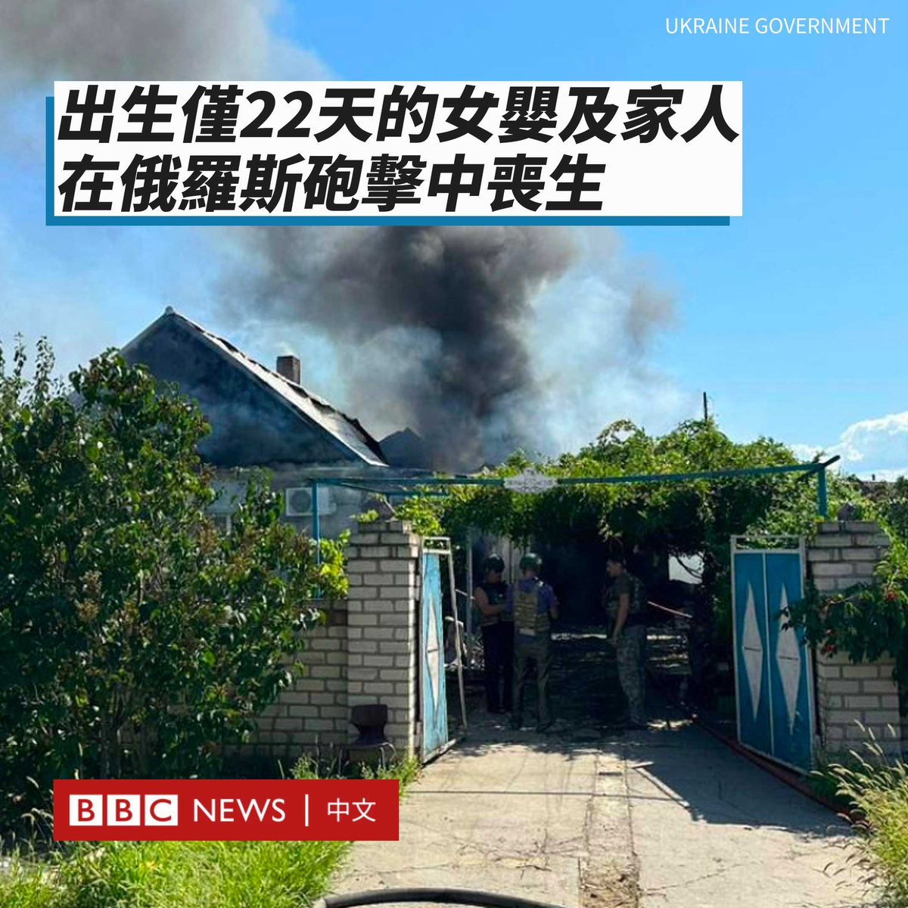
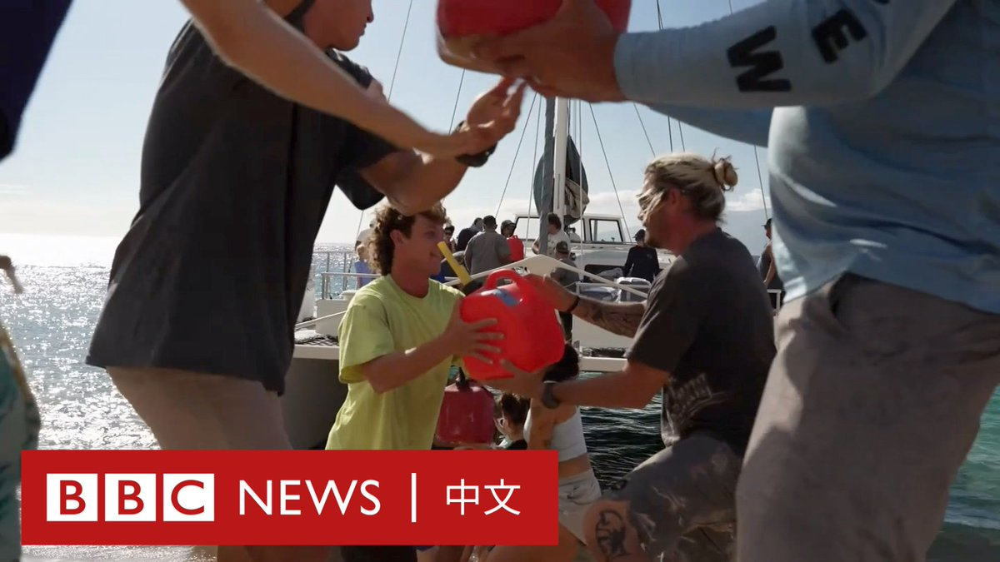
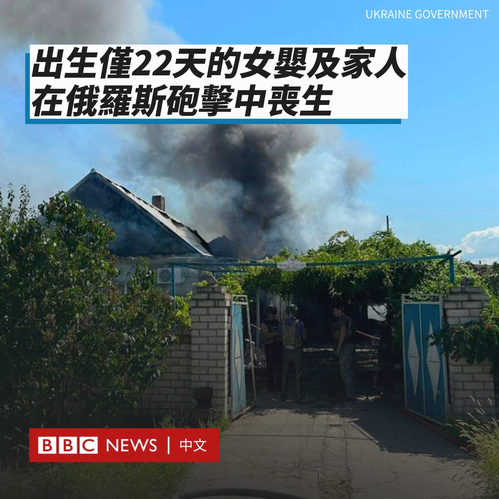
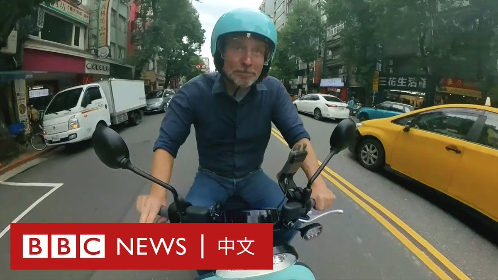
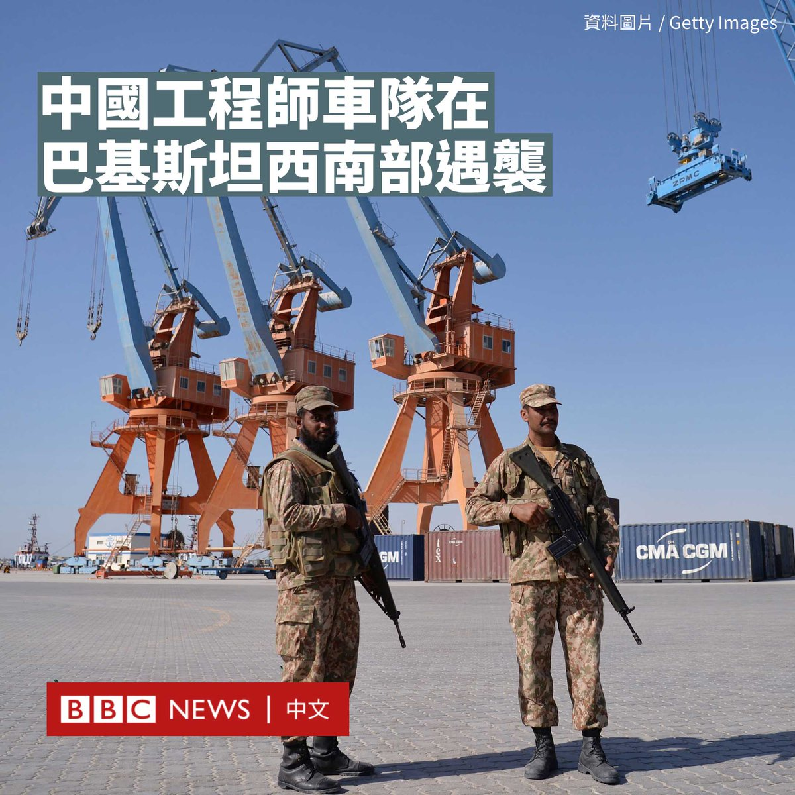
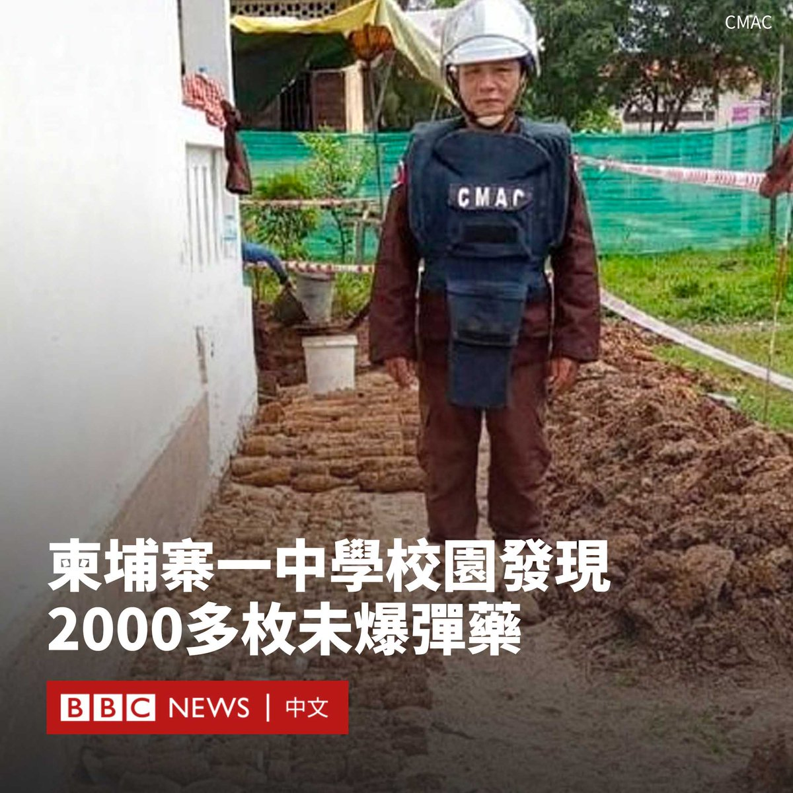

D英国广播公司BBC 北京时间 2023-08-14T20:55:30Z 1691071045728649216 乌克兰内政部长克里缅科（Ihor Klymenko）表示，俄罗斯于周日（8月13日）向乌克兰南部赫尔松地区发动炮击，共有七人遇难，包括一名出生仅22天的女婴、她12岁的哥哥及其父母。

遇难者还包括另一名村民和两位邻近地区的居民，另有13人在炮击中受伤。

克里缅科分享了这个家庭的建筑被炸毁后的照片，显示黑色烟柱从建筑物中升起，遗体被模糊处理。

“必须制止恐怖分子，必须用武力制止他们，他们只能听懂武力的语言。”他说。

乌克兰总统泽连斯基（Volodymyr Zelensky）也谴责了此次袭击，称其“残忍”，并补充说仅在赫尔松就有17起俄罗斯炮击事件的报告，其他地区更多。

“没有一天俄罗斯的邪恶不得到我们完全公正的回应。”他说道。“我们不会放过俄罗斯的任何罪行。”

赫尔松是俄罗斯去年声称吞并的乌克兰四个地区之一。

乌克兰军队去年11月收复了该地区西部的一部分。俄军继续从第聂伯河对岸炮击该地区。

周六（8月12日），俄罗斯指责乌克兰试图对连接克里米亚半岛与俄罗斯本土的克里米亚大桥进行导弹袭击，并称其为“恐怖主义”。乌克兰尚未承认这次袭击。   D英国广播公司BBC 北京时间 2023-08-14T21:13:26Z 1691075559370211328 美国夏威夷毛伊岛在近日的野火中遭受重创，已有近百人死亡，大量房屋与汽车毁于一旦，断水断粮。

BBC驻北美记者沙磊（John Sudworth）跟随志愿者的物资船只登陆灾区，直击现场情况。 https://t.co/qqpsDDGaPX   D英国广播公司BBC 北京时间 2023-08-14T20:20:36Z 1691062261820125184 乌克兰内政部长克里缅科（Ihor Klymenko）表示，俄罗斯于周日（8月13日）向乌克兰南部赫尔松地区发动炮击，共有七人遇难，包括一名出生仅22天的女婴、她12岁的哥哥及其父母。

遇难者还包括另一名村民和两位邻近地区的居民，另有13人在炮击中受伤。

克里缅科分享了这个家庭的建筑被炸毁后的照片，显示黑色烟柱从建筑物中升起，遗体被模糊处理。

“必须制止恐怖分子，必须用武力制止他们，他们只能听懂武力的语言。”他说。

乌克兰总统泽连斯基（Volodymyr Zelensky）也谴责了此次袭击，称其“残忍”，并补充说仅在赫尔松就有17起俄罗斯炮击事件的报告，其他地区更多。

“没有一天俄罗斯的邪恶不得到我们完全公正的回应。”他说道。“我们不会放过俄罗斯的任何罪行。”

赫尔松是俄罗斯去年声称吞并的乌克兰四个地区之一。

乌克兰军队去年11月收复了该地区西部的一部分。俄军继续从第聂伯河对岸炮击该地区。

周六（8月12日），俄罗斯指责乌克兰试图对连接克里米亚半岛与俄罗斯本土的克里米亚大桥进行导弹袭击，并称其为“恐怖主义”。乌克兰尚未承认这次袭击。   D英国广播公司BBC 北京时间 2023-08-14T17:11:39Z 1691014711658291200 在亚洲多地，骑乘机车（摩托车）是最受欢迎的交通方式；尽管方便且便宜，但传统机车的排放会造成空气污染。

台湾一家新创企业打造了号称世界最大规模的电池交换网络，让电动机车用户在使用干净能源的同时不受里程限制、可以依靠遍布全台的超过一万个换电站继续旅程。

BBC记者傅东飞（Rupert Wingfield-Hayes）在台北试乘了这种电动机车，体验这套系统是如何运作。   D英国广播公司BBC 北京时间 2023-08-14T14:33:46Z 1690974979511451648 巴基斯坦西部俾路支省周日（8月13日）发生针对中国工程师的袭击事件。两名分离主义武装分子袭击了一支护送中国工人前往瓜达尔港项目的车队。

中国驻卡拉奇总领馆发言人表示，此次袭击没有造成中国公民伤亡。

总领馆表示，中国强烈谴责恐怖主义行径，并敦促中国公民和企业提高警惕。

“俾路支解放军”（BLA）周日（8月13日）则宣称对该事件负责，并表示其两名战士在自杀式袭击中丧生。

“俾路支解放军”称，有四名中国工人和九名担任警卫的巴基斯坦士兵死亡。不过，该武装组织经常夸大袭击结果。

巴基斯坦军方在一份声明中表示，“恐怖分子在活动中使用了小型武器和手榴弹”。

巴基斯坦一名高级警官告诉法新社：“行动已经结束，两名袭击者已被消灭”。他补充说有三名巴基斯坦士兵受伤。

中国《环球时报》报道，中方接机车队当时在瓜达尔警察局附近遭遇了袭击。中方人员共23人，车队包含三辆SUV（运动型多用途车），一辆面包车。

报道称，袭击过程中有简易炸弹爆炸，面包车受到了枪击，防弹玻璃有裂纹。

瓜达尔港是“中巴经济走廊”的重要一环，该地战略地位十分重要，可以为中国商品进入印度洋开辟了一条全新的快捷通道。

但俾路支省长期受分离主义势力困扰。“俾路支解放军”和其他激进组织表示，巴基斯坦当局侵夺当地的自然资源，称当地人不会从中受益。近年来持续针对中国目标发动攻击。

去年4月，卡拉奇大学孔子学院附近发生袭击，造成三名中国老师和他们的巴基斯坦司机丧生。   D英国广播公司BBC 北京时间 2023-08-14T15:51:42Z 1690994590344765440 柬埔寨东北部一所高中因在校园内发现数以千计的未引爆弹药，被迫暂时关闭。

该学校是位于桔井省（Kratie）的哥沙曼王后高中（Queen Kosomak High School），其曾在内战时被用作军事基地。

照片显示，数吨生锈的爆炸物被整齐地堆放成一排，其中包括手榴弹和反坦克发射器。

柬埔寨地雷行动中心主任洪拉塔纳（Heng Ratana）告诉法新社，三天内共有2000多枚爆炸物被发现。

他说，这些弹药是在清理地基以准备扩建花园时被发现的，如果整个校园都被清理干净，可能会挖出更多弹药。

“这对学生来说十分幸运，因为如果有人挖掘土地并撞到它们，这些爆炸装置很容易爆炸。”他说。

学生们被告知在清理工作完成之前远离学校，预计清理工作需时两天。

柬埔寨内战始于1967年，1975年结束，美国、北越和南越也参与其中，当时美国在柬埔寨境内投下了许多炸弹。

尽管战事已结束数十年，但柬埔寨仍然遭受着战争的影响，该国是世界上埋有地雷数量最多的国家之一。当局承诺在2025年前清除所有地雷和未引爆的弹药。

据哈洛信托会（The HALO Trust）的统计，自1979年以来，遍布该国的地雷已经导致超过64,000人丧生，25,000人截肢。   D英国广播公司BBC 北京时间 2023-08-14T13:05:12Z 1690952690090512384 在中国向海外移民的人数激增之际，上海最大的移民中介公司之一的负责人遭到拘留和调查，这让后疫情时代中国资金流动及外汇管制的话题再次延烧。https://t.co/kAhaDaOhnZ   D英国广播公司BBC 北京时间 2023-08-14T11:06:00Z 1690922693288501248 台湾副总统赖清德在访问巴拉圭途中过境美国纽约，引发两岸关注。他周日（8月13日）参加一场午宴时表示，台湾面对北京不会害怕和退缩，但同时重申愿与中国大陆对话。

“不论极权主义对台湾的威胁有多大，我们绝不会畏惧、退缩，一定坚持对民主自由的价值。”他说道。

他还表示，他将致力于提升台湾自我防卫力量、强化经济安全、加深对民主阵营的链接，以及在尊严对等下进行两岸对话及合作。

赖清德补充说，台湾的安全是世界的安全议题。“当台湾安全，世界就安全，当台海和平，世界就和平。”

美国在台协会（AIT）执行理事蓝莺（Ingrid Larson）出席了赖清德的演讲。

作为台湾明年大选的热门候选人之一，赖清德此次经停美国再次牵动台海紧张局势。台湾和美国表示这是惯例，但中国对其表达强烈谴责。

中国外交部称，赖清德顽固坚持“台独”分裂立场，是彻头彻尾的“麻烦制造者”。美台勾连以“过境”为幌子安排赖清德在美从事政治活动，严重违反一个中国原则。

与此同时，中国还宣布8月12日至14日在东海进行军事演习。台湾国防部称，8月11日至12日共侦获中国大陆九架次军机和七艘次军舰在台海周边活动。

赖清德的纽约之行受到许多台湾侨民的欢迎，但也有很多中国示威者手举五星红旗和“主张台独、走向战争”的标语抗议。

赖清德将前往巴拉圭出席新总统圣地亚哥·培尼亚（Santiago Pena）的就职典礼。巴拉圭是台湾仅有的13个邦交国之一。他返程时预计再次过境美国旧金山。

今年4月，台湾总统蔡英文在访问中美洲后，过境洛杉矶。她会见了美国众议院议长凯文·麦卡锡（Kevin McCarthy），这同样引发了中国的愤怒，而在台湾周边举行军事演习。   D英国广播公司BBC 北京时间 2023-08-14T10:06:00Z 1690907592254713856 海瑟·摩根（Heather Morgan）以“Razzlekhan”的名字发表了数十部饶舌音乐录影带，然而她不为人知的另一面是和丈夫牵涉进一宗偷窃天价比特币和洗钱的犯罪案件。 https://t.co/0xzXxkZP1r   