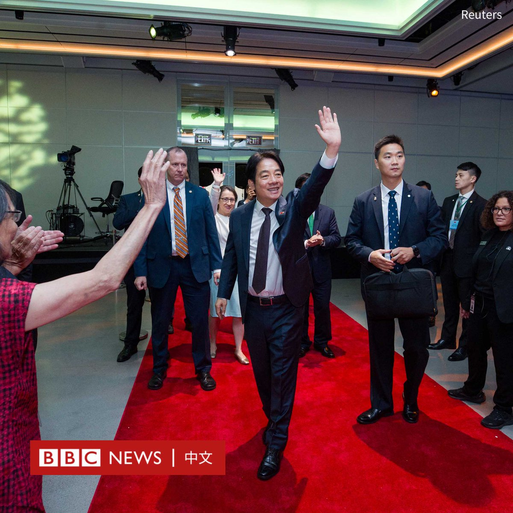
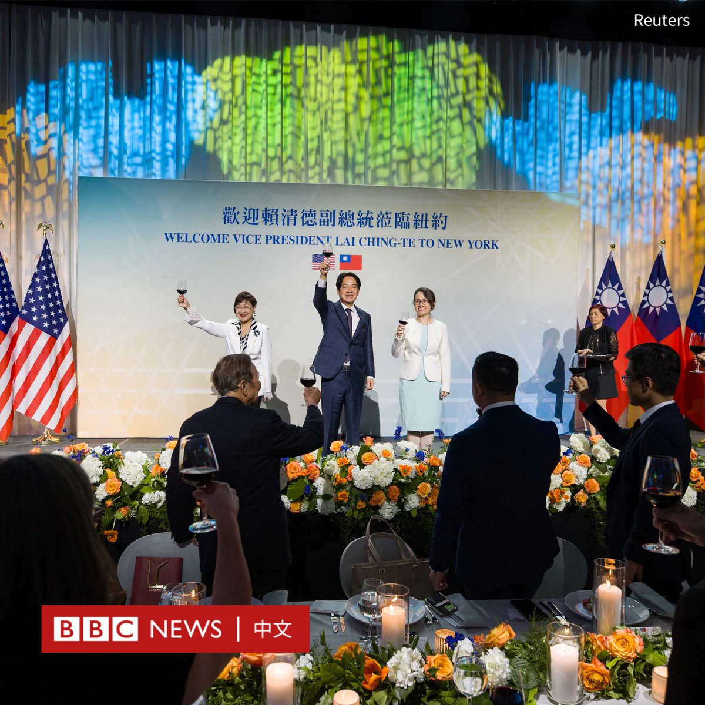
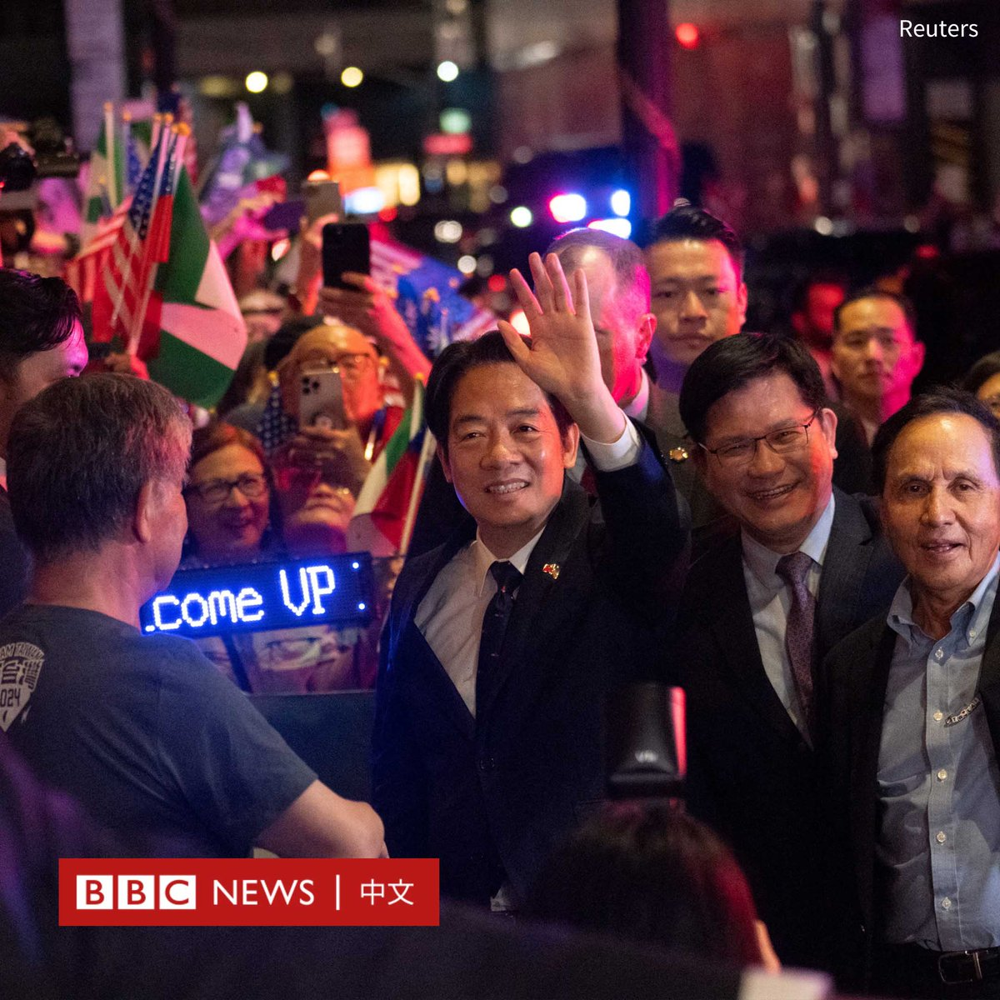
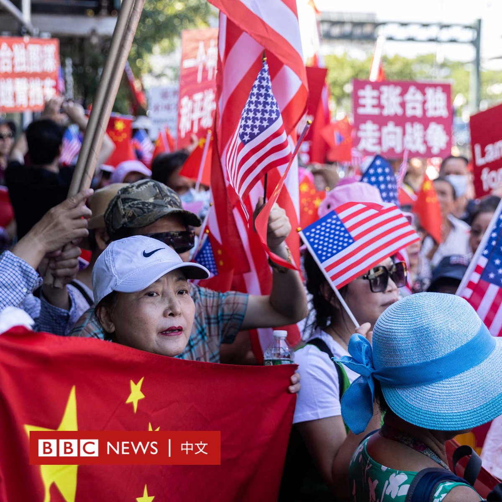

D英国广播公司BBC 北京时间 2023-08-14T13:05:12Z 1690952690090512384 在中国向海外移民的人数激增之际，上海最大的移民中介公司之一的负责人遭到拘留和调查，这让后疫情时代中国资金流动及外汇管制的话题再次延烧。https://t.co/kAhaDaOhnZ   D英国广播公司BBC 北京时间 2023-08-14T11:06:00Z 1690922693288501248 台湾副总统赖清德在访问巴拉圭途中过境美国纽约，引发两岸关注。他周日（8月13日）参加一场午宴时表示，台湾面对北京不会害怕和退缩，但同时重申愿与中国大陆对话。

“不论极权主义对台湾的威胁有多大，我们绝不会畏惧、退缩，一定坚持对民主自由的价值。”他说道。

他还表示，他将致力于提升台湾自我防卫力量、强化经济安全、加深对民主阵营的链接，以及在尊严对等下进行两岸对话及合作。

赖清德补充说，台湾的安全是世界的安全议题。“当台湾安全，世界就安全，当台海和平，世界就和平。”

美国在台协会（AIT）执行理事蓝莺（Ingrid Larson）出席了赖清德的演讲。

作为台湾明年大选的热门候选人之一，赖清德此次经停美国再次牵动台海紧张局势。台湾和美国表示这是惯例，但中国对其表达强烈谴责。

中国外交部称，赖清德顽固坚持“台独”分裂立场，是彻头彻尾的“麻烦制造者”。美台勾连以“过境”为幌子安排赖清德在美从事政治活动，严重违反一个中国原则。

与此同时，中国还宣布8月12日至14日在东海进行军事演习。台湾国防部称，8月11日至12日共侦获中国大陆九架次军机和七艘次军舰在台海周边活动。

赖清德的纽约之行受到许多台湾侨民的欢迎，但也有很多中国示威者手举五星红旗和“主张台独、走向战争”的标语抗议。

赖清德将前往巴拉圭出席新总统圣地亚哥·培尼亚（Santiago Pena）的就职典礼。巴拉圭是台湾仅有的13个邦交国之一。他返程时预计再次过境美国旧金山。

今年4月，台湾总统蔡英文在访问中美洲后，过境洛杉矶。她会见了美国众议院议长凯文·麦卡锡（Kevin McCarthy），这同样引发了中国的愤怒，而在台湾周边举行军事演习。   D英国广播公司BBC 北京时间 2023-08-14T10:06:00Z 1690907592254713856 海瑟·摩根（Heather Morgan）以“Razzlekhan”的名字发表了数十部饶舌音乐录影带，然而她不为人知的另一面是和丈夫牵涉进一宗偷窃天价比特币和洗钱的犯罪案件。 https://t.co/0xzXxkZP1r   