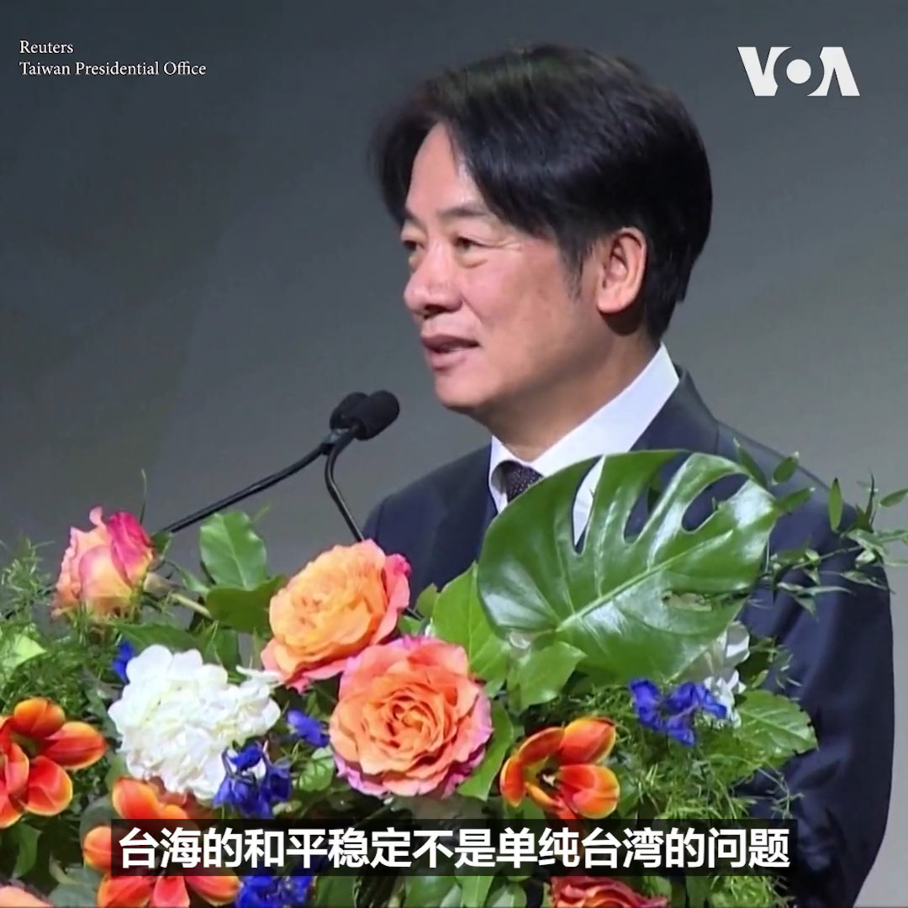
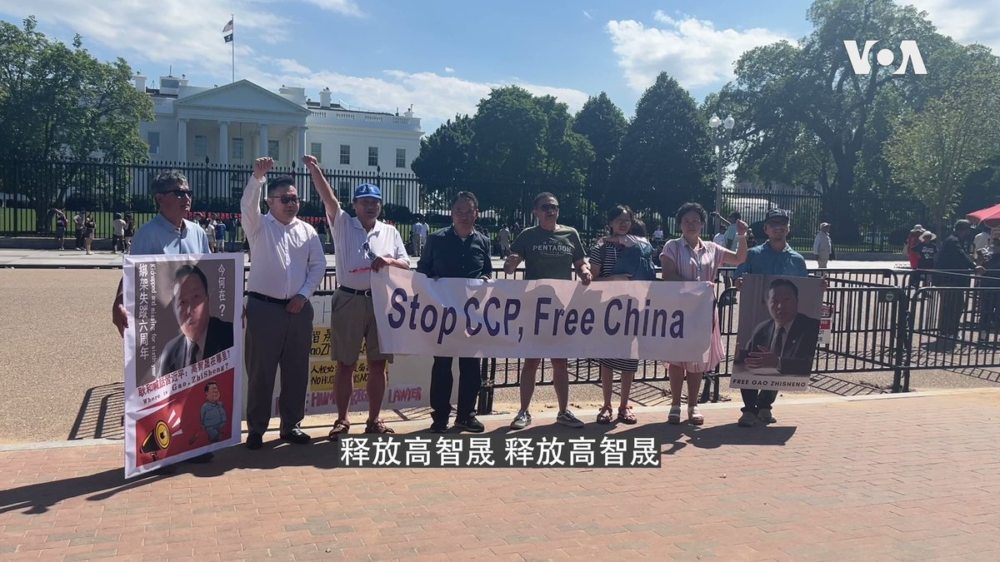
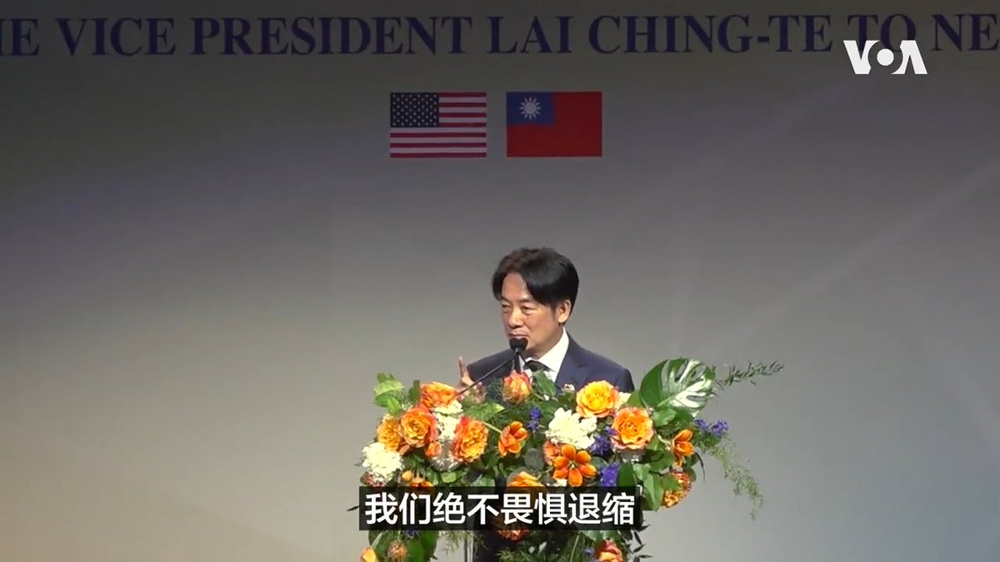
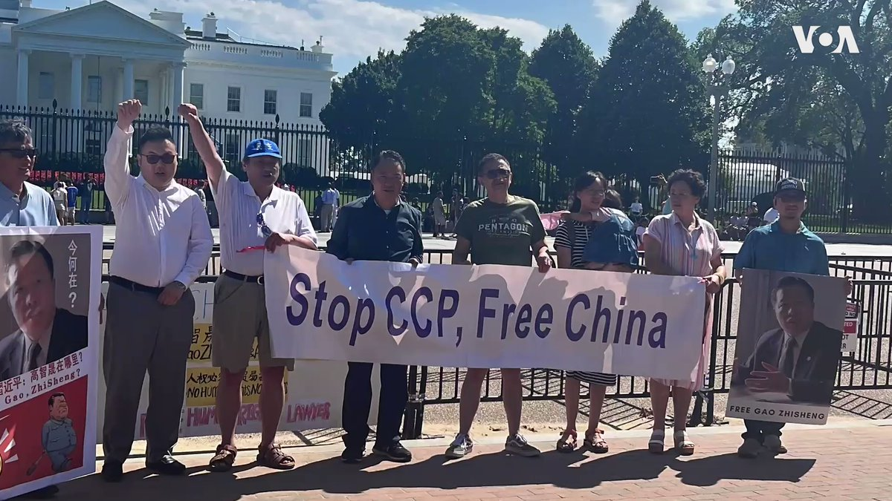

美国之音中文网 北京时间 2023-08-14T22:58:34Z 1691102015810920449 耶伦警告清洁能源供应链被少数国家过度控制构成严重风险 https://t.co/G5lRlpoezi   美国之音中文网 北京时间 2023-08-14T23:03:14Z 1691103192174510081 新西兰总理希金斯（Chris Hipkins）14日宣布取消仍在执行的新冠限制措施。今后将不再有7天隔离期以及医疗设施戴口罩的要求，这意味着所有的限制措施都将被解除。 https://t.co/0jLcC3XRxr   美国之音中文网 北京时间 2023-08-14T21:00:55Z 1691072406809399296 8/14【#时事大家谈】“坏人遇到麻烦会做坏事”，拜登为何说中国是“定时炸弹”？欧洲缺席一带一路峰会，北京未邀请还是请不来？
 
嘉宾：公民力量创办人、独立时评人杨建利；信息与战略研究所经济学者李恒青 
主持人：许波

Youtube🔗 https://t.co/6UfFKheqdv https://t.co/YHJ8CulVRy   美国之音中文网 北京时间 2023-08-14T21:48:08Z 1691084292674252800 乌克兰国家紧急服务署8月14日公布的视频显示，南部城市敖德萨当天凌晨遭遇俄罗斯无人机袭击。当地一家大型商场被导弹击中后起火。敖德萨是乌克兰最大港口和海军基地。自今年七月俄罗斯宣布退出黑海谷物倡议后，敖德萨多次遭遇空袭。 https://t.co/qi5QXd6WrW   美国之音中文网 北京时间 2023-08-14T21:58:02Z 1691086784611188736 碧桂园寻求延缓偿付在岸债券，中国购房人和金融界忐忑不安 https://t.co/c8usRLITe7   美国之音中文网 北京时间 2023-08-14T19:44:59Z 1691053298684416000 “当台湾安全，世界就安全。当台海和平，世界就和平”，台湾副总统赖清德13日在纽约与台湾侨民的午餐会上发表演讲时说。赖清德率领的代表团13日晚已离开美国前往巴拉圭，参加巴拉圭新总统潘尼亚的就职典礼。中国对于赖清德过境美国发出严厉抨击。 
报道：https://t.co/E19vU92zY8 https://t.co/3s3eashdA6   美国之音中文网 北京时间 2023-08-14T16:28:02Z 1691003735185735681 黎智英等7名香港民运人士 被法庭撤销“组织未经批准集结罪 https://t.co/99eRElJCqe   美国之音中文网 北京时间 2023-08-14T16:55:04Z 1691010540603367424 俄罗斯称核潜艇上配置“锆石”（Zircon）高超音速巡航导弹将成为常态 https://t.co/hLGJC6EMSl   美国之音中文网 北京时间 2023-08-14T17:39:06Z 1691021618355765249 中国国防部长正访问俄罗斯、白俄罗斯 讨论削弱西方主导权 https://t.co/MEzOBgtz8R   美国之音中文网 北京时间 2023-08-14T15:15:03Z 1690985366487232512 结束过境纽约行程 赖清德：无论极权威胁多大，台湾绝不畏惧退缩 https://t.co/qkac4pTb7f   美国之音中文网 北京时间 2023-08-14T16:00:04Z 1690996698884222977 金正恩下令迅速扩大弹药产量 被指帮助俄罗斯补充乌克兰战场消耗 https://t.co/kCZQXEcbOQ   美国之音中文网 北京时间 2023-08-14T13:07:33Z 1690953282427248640 美日韩举行三国外长会议 为本周的三国首脑会议铺路 https://t.co/ROtSZkVKAv   美国之音中文网 北京时间 2023-08-14T13:07:35Z 1690953289918287873 台湾副总统赖清德：不管极权威胁多大 绝不畏惧退缩 https://t.co/o0BiVrbaBj   美国之音中文网 北京时间 2023-08-14T09:19:36Z 1690895918025854976 8月13日下午，多位中国民主人士在美国白宫前的拉法叶广场拉起横幅，要求中国政府释放“被失踪“6年的中国维权律师高智晟和其他政治犯。同一天在世界许多城市都举行了释放高智晟的集会活动。详细内容：https://t.co/a5pdrZl8Ln https://t.co/GIPcsrKJ1f   美国之音中文网 北京时间 2023-08-14T09:23:05Z 1690896793129951232 俄罗斯在乌克兰的炮击造成7人死亡，其中包括几天大的婴儿 https://t.co/EyYOwSi2z4   美国之音中文网 北京时间 2023-08-14T10:00:25Z 1690906187770855424 “不管极权主义对台湾的威胁有多大，我们绝不畏惧退缩，”台湾副总统赖清德在纽约过境第二天的侨宴上发表演讲时说。他呼吁台湾团结一致，赢得国际社会的支持和信心。参加侨宴的除了数百名台湾侨民外，还有多名来自纽约州和新泽西州的政府和州议会代表。侨宴外，亲中团体聚集抗议。 https://t.co/DBsEuq1Kt5   美国之音中文网 北京时间 2023-08-14T07:00:00Z 1690860787148230657 美国总统拜登称中国是一颗“滴答作响的定时炸弹”，“这很不妙，因为当坏人遇到麻烦的时候，他们就会做坏事”。拜登是陈述实情还是唱衰中国？环球时报说欧洲国家领袖本不在一带一路峰会邀请之列，西方媒体不要自作多情。北京真有勇气把一带一路峰会办成“丐帮大会”？请看周一时事大家谈并留言互动。 https://t.co/G9so3HORrg   美国之音中文网 北京时间 2023-08-14T07:41:02Z 1690871112916504577 高智晟被强迫失踪六年，民主人士齐聚旧金山中领馆抗议 https://t.co/lfim9YhSbo   美国之音中文网 北京时间 2023-08-14T05:08:04Z 1690832618135437312 访问尼日尔的代表团表示，尼日尔军政府对外交持开放态度 https://t.co/iA5QlkJrGn   美国之音中文网 北京时间 2023-08-14T05:15:20Z 1690834443999612930 美联社最近拍摄的照片显示，香港壹传媒创始人黎智英在香港赤柱监狱内，手中握着一本书在两名狱警陪伴下散步。另外从美联社隔着铁丝网拍摄的视频依稀可以看到黎智英在狭窄的牢房内来回走步。美联社说，黎智英每天被允许在室外停留50分钟锻炼身体。 
报道： https://t.co/zdUpRBipvJ https://t.co/1yts4EeieS   美国之音中文网 北京时间 2023-08-14T06:08:03Z 1690847711963336704 警方突袭搜查堪萨斯州报纸的合法性受到质疑 https://t.co/sEHPPJ8MyH   美国之音中文网 北京时间 2023-08-14T01:20:33Z 1690775360479404032 美联社罕见曝光黎智英狱中照片，每日被单独囚禁23小时 https://t.co/nUnaXZkEVx   美国之音中文网 北京时间 2023-08-14T02:47:03Z 1690797128111771648 聿文视界：北戴河、火箭军和习近平权力现状的评估 https://t.co/pRlChXwsso   美国之音中文网 北京时间 2023-08-14T03:56:05Z 1690814499719155712 8月13日是中国维权律师高智晟被失踪整六年。高智晟长期帮助弱势群体维权，代理多起民告地方政府的维权案，被誉为“中国良心”。中国维权人士13日聚集在美国白宫前的拉法叶广场，拉起横幅呼吁中国当局释放高智晟和所有政治犯。
相关内容：https://t.co/vV3mA2KyIJ https://t.co/5dUoGXEgGM   美国之音中文网 北京时间 2023-08-14T01:37:22Z 1690779592385077248 台湾副总统赖清德12日晚抵达纽约下榻酒店时受到台湾侨界的热情欢迎，没有出现像过去的反台独或亲中团体集结抗议的情况。13日早上，赖清德在出席侨团活动时，会场外出现了抗议人群，高喊“反对台独，支持和平”以及“赖清德滚蛋”的口号。 https://t.co/G4VXFUXC2y   美国之音中文网 北京时间 2023-08-14T00:10:02Z 1690757613951025152 美军高级将领：北京拒接美国军方电话让战争风险升高 https://t.co/FTgRzdMtCt   