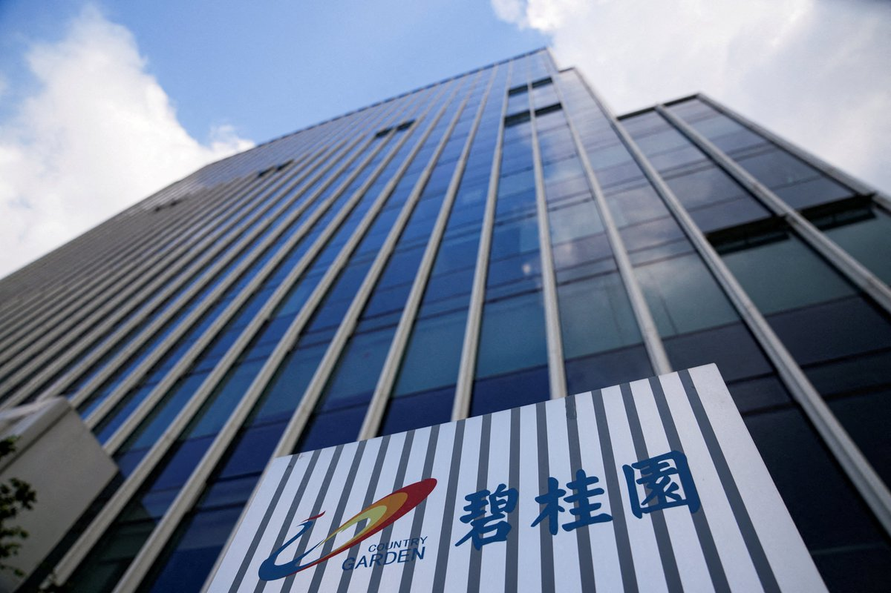
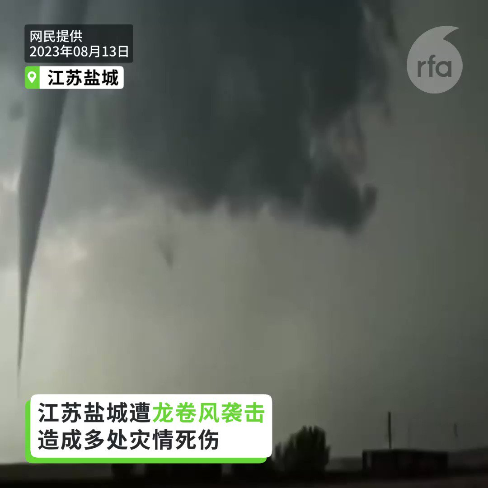
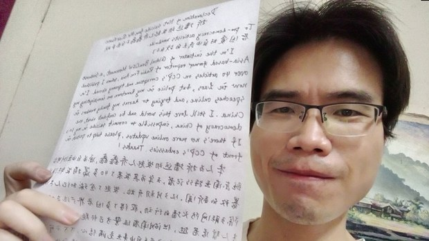
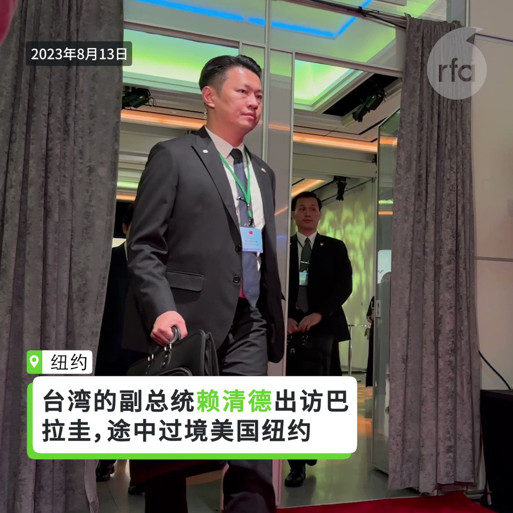

自由亚洲电台 北京时间 2023-08-14T23:05:17Z 1691103708598431744 近期中国不少城市如深圳、上海以至北京都陆续重新放宽政策，容许在路边摆摊。港府也相信，所谓的"#地摊经济"能带动旅游业，尤其是中国大陆游客消费模式改变，有需要把 #香港夜市"搞活搞旺"，不过有学者并不看好此举能留住大陆客。 https://t.co/e8553vFcTa   自由亚洲电台 北京时间 2023-08-14T23:07:01Z 1691104144004984832 近几年来，中国在台海周边派遣军机军舰的数量明显增加，台湾的海空军光是做出应对就消耗不少用油。台媒爆出，截至目前为止，台军已积欠台币40亿元 (约人民币9亿元) 的油钱，台湾国防部回应称已编列预算，没有欠款一说。 https://t.co/V0UP5JR494   自由亚洲电台 北京时间 2023-08-14T23:08:13Z 1691104443994198016 #评论 | #傅申奇：战争在敲门？ https://t.co/r2N3Rju3z0   自由亚洲电台 北京时间 2023-08-14T22:29:44Z 1691094762156355584 中国政府打击 #医疗贪腐 之际，网络流传一份北京市卫生健康委员会发的通知，关于开设所谓的“廉洁帐户”，要求医疗机构受贿者上缴受贿金。有网民质疑，谁授权给北京卫健委赦免自己下属单位的受贿违法人员？ https://t.co/kgDgnuijJJ   自由亚洲电台 北京时间 2023-08-14T22:30:29Z 1691094948039532544 今年的8月13号是中国知名维权律师 #高智晟失踪六周年 的日子。在美国乃至全世界的多座城市，都举行了 #声援高智晟 的集会。 https://t.co/wY65d8yAHG   自由亚洲电台 北京时间 2023-08-14T22:32:04Z 1691095349195407362 专栏 | #有问有答：关注营救人权律师卢思位追踪报道 https://t.co/WOoiK0izvN   自由亚洲电台 北京时间 2023-08-14T23:06:36Z 1691104038262349824 #中国 急需挽救经济下滑的势头。国务院继之前推出的"促进民间投资和扩大消费政策"后，再提出"#吸引外资的24条意见"。商务部表示，政策能提振外资在华的投资，但没有特别针对外资最关切的《#反间谍法》做出更多解释。 https://t.co/VprWTHOc6l   自由亚洲电台 北京时间 2023-08-14T23:28:02Z 1691109432212754433 专栏 | #劳工通讯：安徽省1-5月连续发生三起有限空间事故造成11人死亡 (二) https://t.co/Q015Gt60jB   自由亚洲电台 北京时间 2023-08-14T18:46:50Z 1691038666586800128 【碧桂园股价暴跌18.36%】 
【港股跳水走低 沪深成交萎靡】
中国房企债务危机持续发酵，#碧桂园 控股有限公司股价14日在香港交易所收盘暴跌18.36%，每股收港币0.8元，成交金额高达12亿元。碧桂园的姐妹企业碧桂园服务收盘时也重挫9.65%，收6.74元，成交金额为10亿元。
详细报道：https://t.co/w6omjXspN5   自由亚洲电台 北京时间 2023-08-14T16:47:56Z 1691008744153563136 【#江苏盐城 出现龙卷风】
【2死15伤 房屋农田损坏】
中国近期天灾不断。13日下午，江苏省盐城市大丰区出现 #龙卷风，造成2人死亡，15人受伤。当地政府核查，有283户农房受损，32条蔬菜大棚受损。龙卷风威力巨大，有红砖房连根倒掉，还有人被吹入河中死亡。 https://t.co/AnBoR8iEjf   自由亚洲电台 北京时间 2023-08-14T17:21:35Z 1691017212554039296 【拆墙运动发起人涉颠覆国家政权】
【家属遭湖南当局上门施压】
从 #老挝 被押送回湖南的 #拆墙运动 发起人 #乔鑫鑫 仍被羁押在 #衡阳 的看守所。家属对外透露，乔鑫鑫被当局指控涉嫌“颠覆国家政权”。疑似跨境执法事件曝光后，当局派人上门向当局施压。
https://t.co/XWdSk1fOv0 https://t.co/PZxWmILDED   自由亚洲电台 北京时间 2023-08-14T11:31:38Z 1690929144425783296 【台湾的副总统赖清德低调过境纽约】
#赖清德 在出席 #巴拉圭 新总统的就职典礼途中，过境纽约。周日出席侨宴时表示“#台湾安全世界就安全”。侨宴场外，有上百名亲中人士到场抗议，也有大陆人士支持赖清德。 https://t.co/MiErzKDA31   自由亚洲电台 北京时间 2023-08-14T06:27:58Z 1690852721870745600 #巴基斯坦一中国项目车队遇袭 袭击组织：多人死伤 https://t.co/6UQLn4zrWq   自由亚洲电台 北京时间 2023-08-14T03:16:08Z 1690804448992415744 RT @RFA_Chinese: 【#赖清德 抵纽约过境】
【中国民主人士：支持赖清德 #保卫民主自由】
【亲共团体不见踪影】
【AIT执行理事蓝莺接机】
数十名自称是 #中国民主党 的大陆人士高举横幅前来欢迎，并和 #台侨 们一起站在指定的欢迎区。他们还高呼“中国人反对侵台，…   自由亚洲电台 北京时间 2023-08-14T03:20:40Z 1690805587439734784 RT @RFA_Chinese: 【赖清德抵纽约过境】
【台侨和大陆民主人士共同欢迎】
【不见亲共团体】
台湾的副总统 #赖清德 12日下午启程出访友邦 #巴拉圭，美东时间当晚抵达 #纽约过境。他到达下榻的曼哈顿中城乐天纽约皇宫酒店（Lotte New York Palace）…   自由亚洲电台 北京时间 2023-08-14T04:09:30Z 1690817877731885057 中国连续数月外贸出口及金融信贷疲软、国内消费放缓、青年失业率持续攀升，中国的经济主管部门本周日发布通知，要求进一步加大吸引外商投资力度，以期应对经济增长乏力的状况。https://t.co/oxn0r81mGR   自由亚洲电台 北京时间 2023-08-14T04:10:41Z 1690818176370565121 据维权网8月13日发布的消息，中国知名人权律师 #高智晟失踪6周年 当天，包括洛杉矶法轮功佛学会、中国民主党全国联合总部、六四纪念馆、对华援助协会、人权观察等全球数十家人权组织发布《营救中国人权律师高智晟联署信》。https://t.co/V8W17m7jYC   