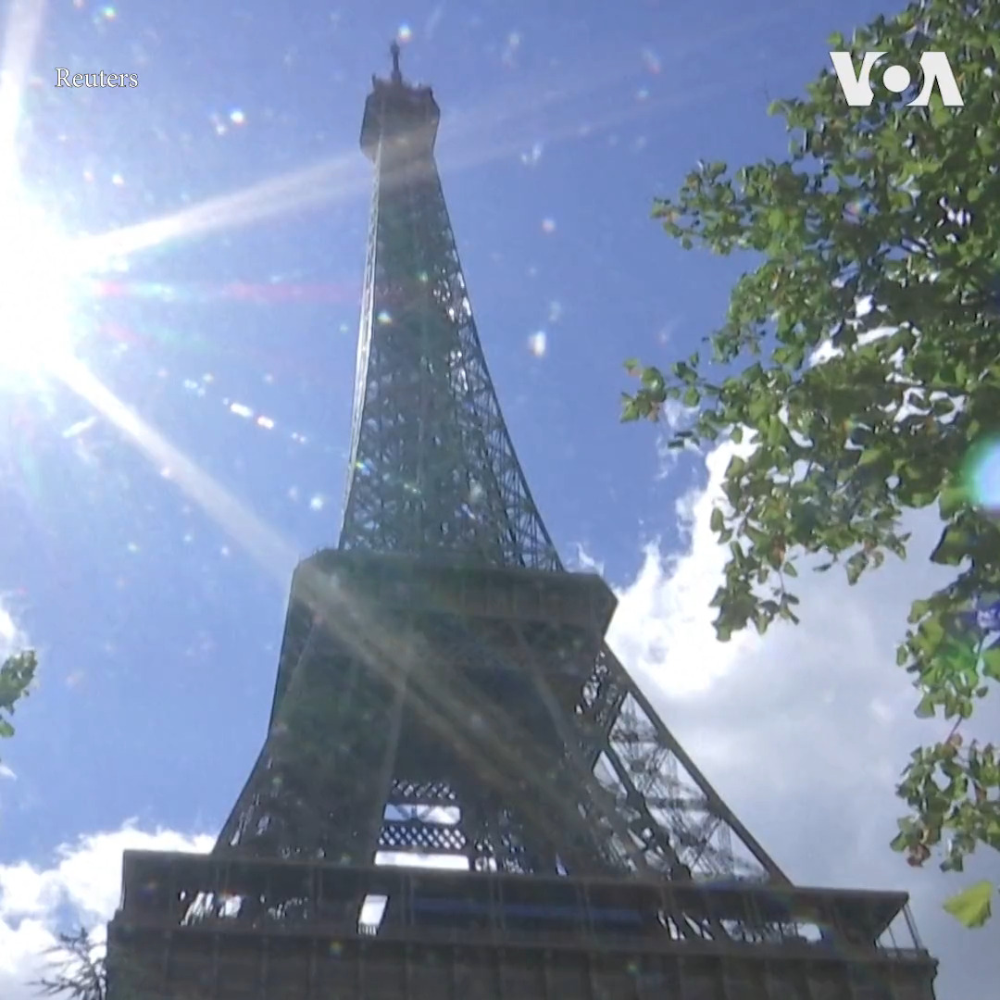

美国之音中文网 北京时间 2023-08-13T00:49:35Z 1690405178518700034 巴黎的埃菲尔铁塔12日受到炸弹威胁，巴黎警方采取了疏散民众并关闭了两个小时，不过后来证实这是虚惊一场。 https://t.co/g7NPKgHZnh   美国之音中文网 北京时间 2023-08-13T01:56:32Z 1690422028011180032 无国界记者呼吁北京释放成蕾 “狱中感言”暴露非人待遇 https://t.co/AU5BAYRvYd   美国之音中文网 北京时间 2023-08-13T02:12:04Z 1690425938411245568 “我担心国轩和中国的联系” 中国电池巨头密西根设厂计划遭遇居民强烈反弹 https://t.co/mLYoySVYzw   美国之音中文网 北京时间 2023-08-13T00:08:03Z 1690394728406347778 美国会议员呼吁立即释放在老挝被拘押的中国人权律师卢思位 https://t.co/KMMCSzYTRW   