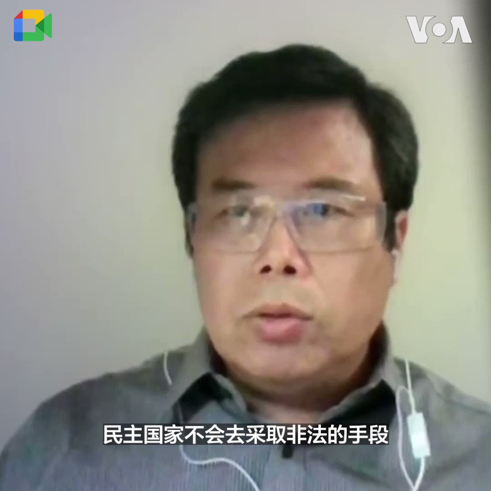
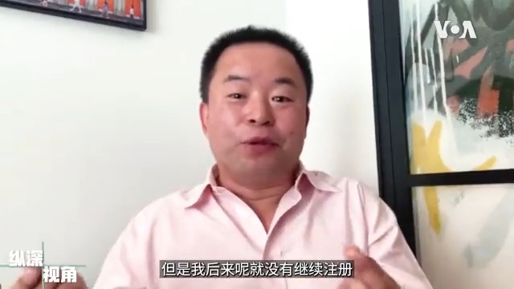

美国之音中文网 北京时间 2023-08-13T15:27:27Z 1690626101314301952 台湾副总统赖清德抵达纽约过境。许多台湾侨民在他下榻酒店外挥舞中华民国国旗表达支持，有的甚至以卡拉OK唱歌的方式迎接他的到访。除台侨外，还有反对中共武统台湾的中国人前往支持。今年早些时候台湾总统蔡英文过境纽约时出现的亲中抗议人群，在赖清德抵达当晚并未出现。https://t.co/HpdpaQSUqt https://t.co/dCcdpNDfQ8   美国之音中文网 北京时间 2023-08-13T13:59:04Z 1690603859708932096 出访巴拉圭 台湾副总统赖清德过境纽约 台侨欢迎 亲中社团拟抗议 https://t.co/aEs42vS7rC   美国之音中文网 北京时间 2023-08-13T12:02:03Z 1690574409889988609 台湾副总统赖清德已抵达纽约过境 中方再声明表坚决反对 https://t.co/WaK63rv1JA   美国之音中文网 北京时间 2023-08-13T12:05:49Z 1690575356997017600 台湾副总统赖清德12日晚抵达纽约，台湾侨界在其下榻酒店外高喊“台湾，加油”，“副总统，加油”。稍早赖清德抵达肯尼迪机场时，台湾驻美代表萧美琴和美国在台协会执行理事蓝莺前往接机。赖清德表示，他期待在过境纽约期间会见朋友和出席活动。中国对赖清德过境访美表示强烈不满。https://t.co/ESCqFuEYyQ https://t.co/33xyxmB4V5   美国之音中文网 北京时间 2023-08-13T04:41:05Z 1690463437149839360 船运公司被警告远离伊朗水域避免被扣留 https://t.co/IdaUw1xPpO   美国之音中文网 北京时间 2023-08-13T10:06:19Z 1690545285536288768 #快讯 台湾副总统赖清德12日晚抵达纽约。他此次是出访巴拉圭途中过境纽约。赖清德在社交媒体上表示，台湾驻美代表萧美琴和美国在台协会华盛顿总部执行理事蓝莺(Ingrid Larson)在纽约肯尼迪机场接机，他期待在纽约会见朋友以及出席过境活动。 https://t.co/f7F27T5xZM   美国之音中文网 北京时间 2023-08-13T10:13:44Z 1690547151259013121 分析人士表示，中国是一个具有谍报战实务经验非常丰富的国家，在其党国体制下所布建的全球间谍网十分绵密，它的主要目标是美国。在面对中国全面渗透的政治战，美国必须建构“美国式的超限战争”思维来反制。报道：  https://t.co/ofmK478Rgn https://t.co/R1YaxBmcQQ   美国之音中文网 北京时间 2023-08-13T10:19:04Z 1690548495151689729 #美中对标 中国热点对标美国论据，用一杯咖啡的时间聊聊中国热点的美国冷思考。最近中国东北、河北饱受洪灾之苦，然而习近平却在北戴河度假。同样的事如果发生在美国，总统作为最高级的民选官员处境会如何？本期视频告诉你。 https://t.co/NJj0RfXrdi   美国之音中文网 北京时间 2023-08-13T08:32:04Z 1690521567162466305 马来西亚选民在州选举中维持政治现状 https://t.co/SNdK2Lj9gL   美国之音中文网 北京时间 2023-08-13T05:28:32Z 1690475380514422784 以色列人抗议司法改革，呼唤民主 https://t.co/8eWEhapQgU   美国之音中文网 北京时间 2023-08-13T02:00:00Z 1690422899914821634 曾在微博上拥有百万粉丝的网络大V慕容雪村因反对习近平“七不讲”遭到全网封杀，也经常被国安骚扰，但之后的多年里，他并不想离开中国。2021年他为了出版一本有关武汉封城的书而被迫流亡。他说自己现在是一只蹦出温水的青蛙，更明白当初生活的地方是一口正在加热的锅。#纵深视角 https://t.co/b4EKzU4NQp https://t.co/yIzsu6LuEe   美国之音中文网 北京时间 2023-08-13T03:40:34Z 1690448206705184768 俄罗斯誓言对乌克兰攻击克里米亚大桥进行报复 https://t.co/EOhCSu7Lfh   美国之音中文网 北京时间 2023-08-13T00:42:34Z 1690403414533177344 中共党国体制下的政治战 分析：须用“美国式超限战争”反制 https://t.co/I4OnDjajmw   美国之音中文网 北京时间 2023-08-13T00:49:35Z 1690405178518700034 巴黎的埃菲尔铁塔12日受到炸弹威胁，巴黎警方采取了疏散民众并关闭了两个小时，不过后来证实这是虚惊一场。 https://t.co/g7NPKgHZnh   美国之音中文网 北京时间 2023-08-13T01:56:32Z 1690422028011180032 无国界记者呼吁北京释放成蕾 “狱中感言”暴露非人待遇 https://t.co/AU5BAYRvYd   美国之音中文网 北京时间 2023-08-13T02:12:04Z 1690425938411245568 “我担心国轩和中国的联系” 中国电池巨头密西根设厂计划遭遇居民强烈反弹 https://t.co/mLYoySVYzw   美国之音中文网 北京时间 2023-08-13T00:08:03Z 1690394728406347778 美国会议员呼吁立即释放在老挝被拘押的中国人权律师卢思位 https://t.co/KMMCSzYTRW   