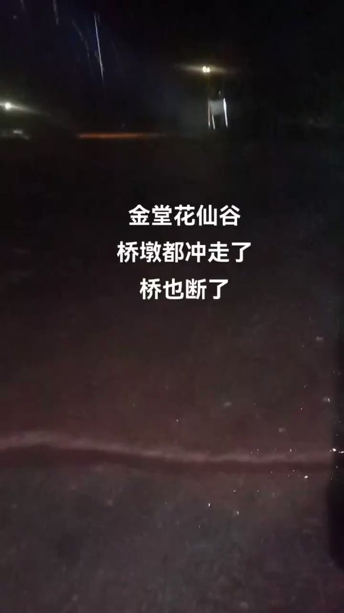
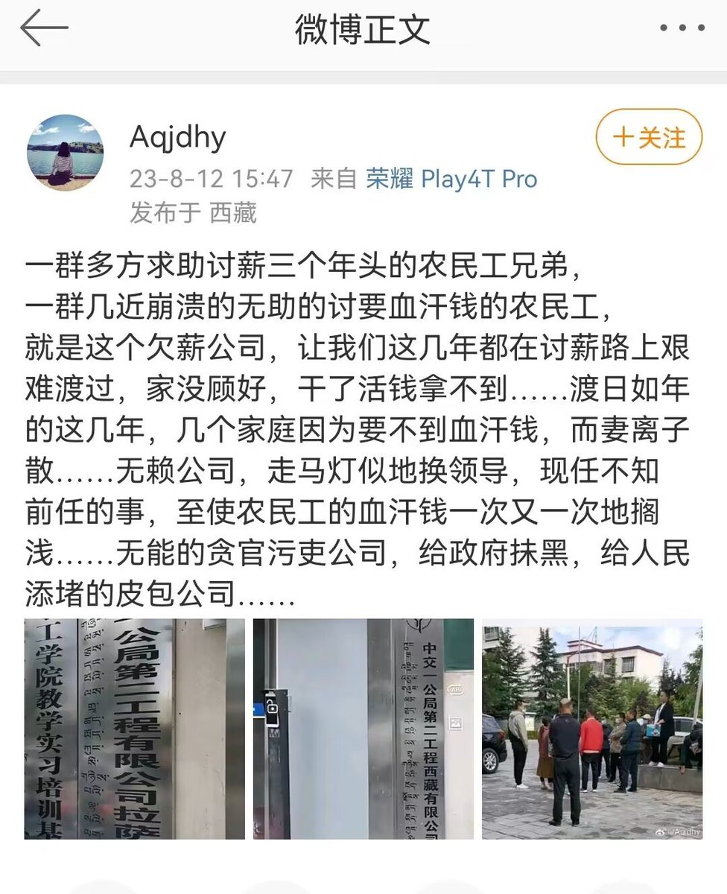
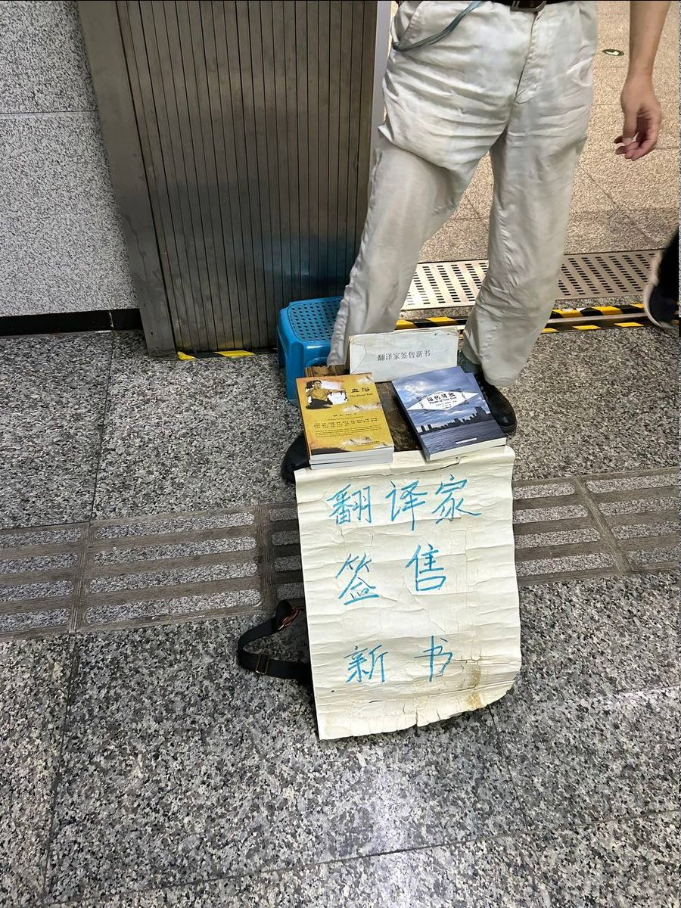
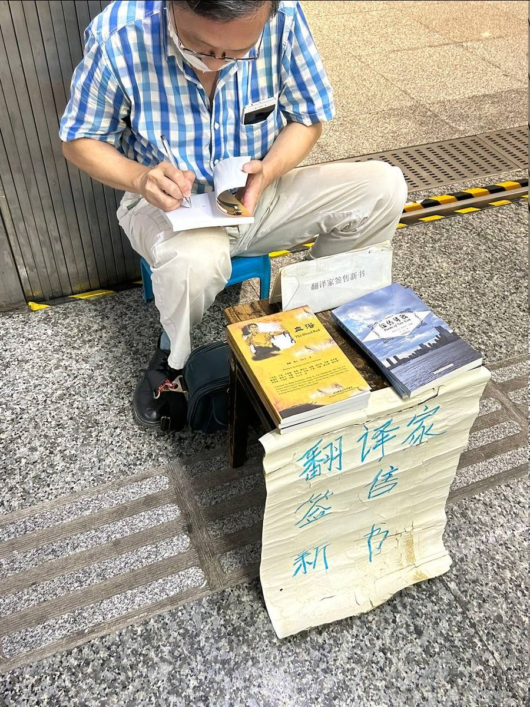

谁将十万横扫三江 北京时间 2023-08-13T08:29:00Z 1690520795746078720 成都金堂县暴雨，金堂花仙谷桥已经冲断 https://t.co/k1zIovmEpg   谁将十万横扫三江 北京时间 2023-08-13T08:39:24Z 1690523413360824320 RT @EvanLi2020: 党培养的一个坚定的反党分子。他见到了89岁的当事人：李曼在土改时是老师，他本人连巴掌大的土地都不曾拥有，却被划为破产地主，承受了几十种酷刑。最可怕的一种是名为“秤杆”：全身脱光，手和脚反捆在一根棍子上，再用一根麻绳将他的生殖器捆起，然后将麻绳悬挂…   谁将十万横扫三江 北京时间 2023-08-13T00:07:25Z 1690394566938284033 讨薪三年求助无门，政府走马灯似的换领导 https://t.co/a6xCeknHpJ   谁将十万横扫三江 北京时间 2023-08-13T00:22:47Z 1690398435093172224 作为大山里的性少数张华，家徒四壁，面临父亲和堂姐的失望，家里一地鸡毛，张华会选择继续读书还是外出打工？ https://t.co/DqM2IJPVCk   谁将十万横扫三江 北京时间 2023-08-13T00:15:43Z 1690396654732808192 8月11日重庆红土地地铁口3B出口，在地铁口看见一个中年人，穿的很整洁，拿着一个公文包坐在凳子上，面前还有一张大凳子，最初只以为他是在那里躲凉快的过路人，后来看见他把一张算不上新的纸展开，背面是一幅很漂亮但也很老旧的画，大概是画的一个古代的女子，我开始以为他是一个画家，或许想把他的画贴在墙上，后来我看到画的正面有字，“翻译家签售新书”，我挺惊讶的，这与我想象中的签售会太不一样了，没有摄像机，没有排队的长龙，没有鲜花掌声，没有红丝绒布铺着的大桌子，他只有一个小小的蓝色塑胶板凳，一张大一点的木板凳当桌子，上面的名牌不再完整了，但这位翻译家也只是坐在那里而已，我最开始路过的时候很好奇，但由于要带着妹妹回家，没做过多停留，出了电梯，我想着等会再出来找他，但我又怕他一会就走了，于是我折返回去，心里有不明意义的紧张，他向我介绍他的新书，我手里只攥着刚刚找爸爸说要买东西的五十块，我有些怕我买不起，后来他说四十一本，我翻了翻，里面似乎也没有什么精彩绝伦的内容，但我莫名有一种想要买的冲动，后来我付了钱就急着走，他把我叫住，从他的公文包里拿出一支笔说要给我签名，我看到他的包上印着我们这边很不错的一所学校的名字，我问他是不是那个学校的教授，他没有回答，签完名之后他还十分郑重的跟我说这种书很有收藏价值，我不太懂，所以只是笑了一下，我问他可不可以拍照，他说可以，于是我照了两张照片，他看着并不百分百的随和，但是很有翻译家的样子。我们的交谈太短，我也不知道我是不是被坑了，但是我很愿意相信他，地铁口的翻译家先生。   