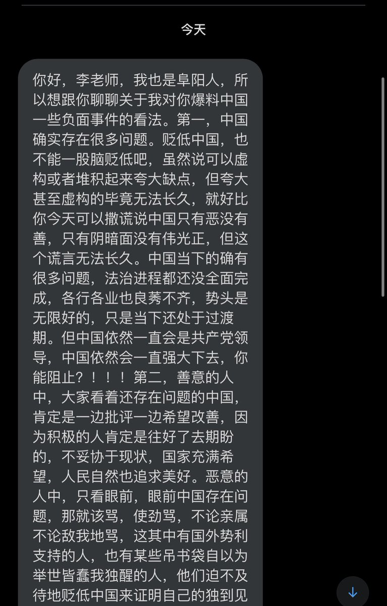
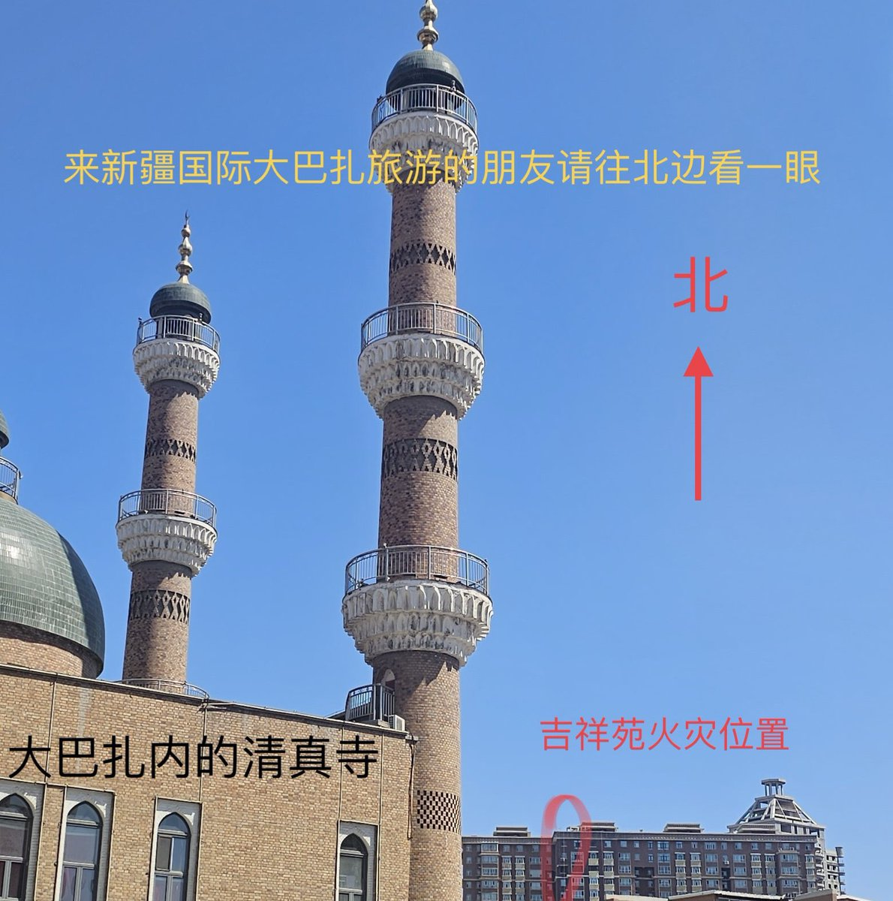
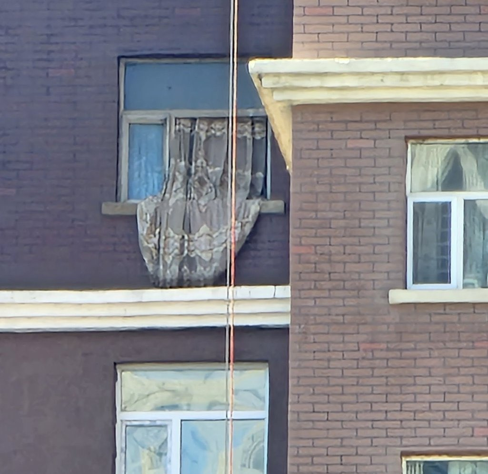
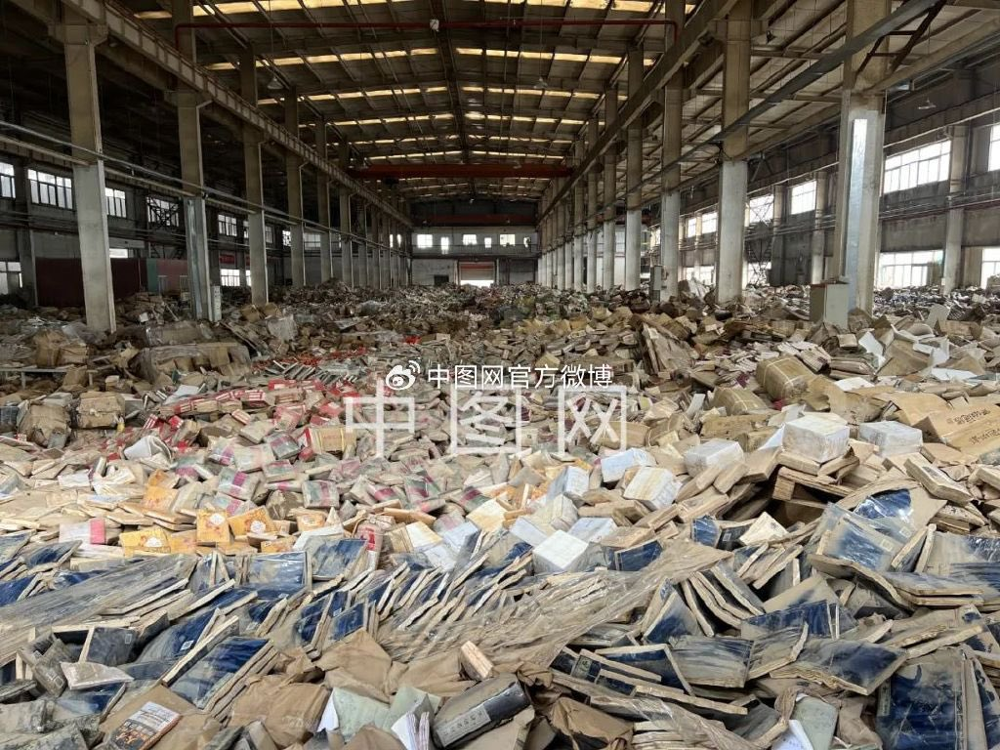

A李老师不是你老师 北京时间 2023-08-12T22:30:50Z 1690370261525127168 这一两天收到不少这类言论，只说明一个问题
就是越来越多的人开始意识到国内接收不到真实的信息，于是翻墙到推特上来了。
只不过推特信息太猛一时半会儿无法咽下，所以就处于排斥反应阶段，总觉得“你们都太极端了”
我的建议是再多刷几天就好了 https://t.co/6jBWJgaAAG   A李老师不是你老师 北京时间 2023-08-12T20:08:13Z 1690334368835747841 网友投稿
成都退林还耕现状：绕城公路附近原本有很多未开发的树林，退林还耕后改种了大量向日葵和玉米。
由于只负责种植业绩，没有任何管理维护，出现大片水淹，虫害，杂草，导致颗粒无收，没有任何经济收益，如今沦为杂草地。
此前，全国各地曾掀起一场热火朝天的“退林还耕”运动，然后6月底，新华社发文称中央从未说过要“退林还耕”，是一个伪概念。   A李老师不是你老师 北京时间 2023-08-12T18:52:51Z 1690315404009414656 “保卫他的玩具，直到大厦崩塌” https://t.co/lqj7ZGgVJj   A李老师不是你老师 北京时间 2023-08-12T20:19:32Z 1690337218055770113 网友投稿
刚刚，深圳地铁没收了一名小朋友的玩具枪。 https://t.co/1lLlrFwzUd   A李老师不是你老师 北京时间 2023-08-12T14:56:38Z 1690255959472406528 怎么连对八国联军都竖大拇指了🤔️ https://t.co/K9I7Mwyo9g   A李老师不是你老师 北京时间 2023-08-12T14:29:34Z 1690249145846566912 网友投稿
有博主发现，国家重点扶持抗美援朝剧《冰雪尖刀连》竟然直接搬用了美国经典战争片《拯救大兵瑞恩》的镜头 https://t.co/QW0C0hUEAL   A李老师不是你老师 北京时间 2023-08-12T15:17:58Z 1690261327300747264 网友投稿
乌鲁木齐火灾发生地，吉祥苑小区近况
那个窗帘自火灾开始已经悬挂了大半年 https://t.co/ymKBWORnyo   A李老师不是你老师 北京时间 2023-08-12T14:11:06Z 1690244501195902976 8月11日
有网友曝光中融信托内部录音：
中植系爆雷引发中融信托停兑
中国版雷曼时刻正在上演 https://t.co/1t3pwXU3JT   A李老师不是你老师 北京时间 2023-08-12T07:10:13Z 1690138581019303936 网友投稿
近日在抖音上有商家宣传专供军队的“手机合规检测系统”
称只需通过扫码和连接设备，就可以查阅微信里删除和撤回的聊天记录，违规涉黄涉密涉军内容，支付宝账单等，最高可同时检测200部手机，安卓和苹果都可以用。 https://t.co/JjFXstGThJ   A李老师不是你老师 北京时间 2023-08-12T07:16:29Z 1690140156466966528 “书的坟冢”
8月10日，中图网发布了其位于涿州的图书仓库受灾后的画面
400万册图书全部泡水损毁 https://t.co/5OHuPnV3V9   A李老师不是你老师 北京时间 2023-08-12T03:26:50Z 1690082365794590720 目前的伦敦墙 https://t.co/oZ5uEnD0Kq   A李老师不是你老师 北京时间 2023-08-12T00:29:44Z 1690037796927418374 中国7月新增人民币贷款3459亿元，预估为7800亿元，前值为30495亿元

中国7月社会融资规模为5282亿元，预期11000亿元，前值42241亿元

中国7月货币供应量M2同比增10.7%，预估为11.0%，前值为11.3%

7月份人民币存款减少1.12万亿元，同比多减1.17万亿元 https://t.co/yHr7jzIZAn   