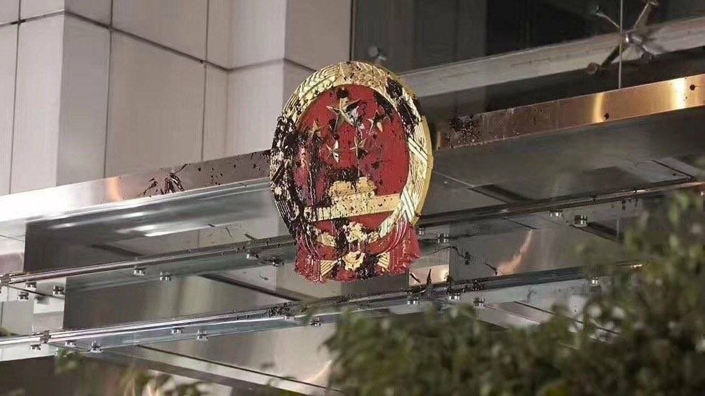
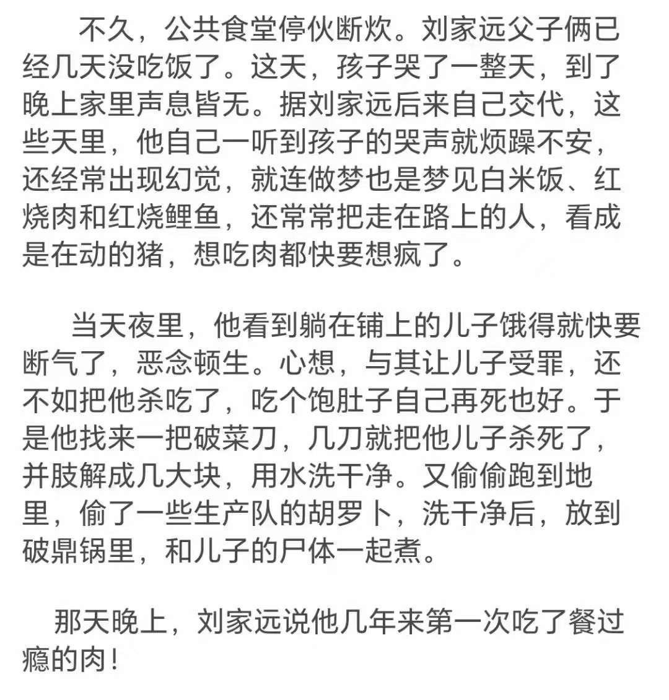

D每日反共 北京时间 2023-08-12T21:01:23Z 1690347751928745984 共匪头目和它的祖宗👇 https://t.co/4j4sb7LLtV   D每日反共 北京时间 2023-08-12T21:40:30Z 1690357596459565057 ZF天天QF国人的YS，你们有发声吗？😅 https://t.co/pz83Fdfq9d   D每日反共 北京时间 2023-08-12T21:43:17Z 1690358292831404032 加一点人民的创意，匪徽看起来就顺眼多了😆 https://t.co/zv7HNDWDkE   D每日反共 北京时间 2023-08-12T21:52:22Z 1690360582288109568 RT @LUOXIANGZY: 今日涿州！
数地开闸蓄洪致使涿州淹死民众不计其数惨绝人寰，中共怕发生民变，派出大量部队武警进驻涿州！
庆丰狗不理：江山就是人民，人民就是江山！为了稳坐江山，必须时刻记住打江山！
雄赳赳气昂昂，作风优良，能打胜仗！ https://t.co/OEr…   D每日反共 北京时间 2023-08-12T22:14:03Z 1690366038784053248 反观涿州，还真是没有对比，就没有伤害！！ https://t.co/oTzYX3SKsE   D每日反共 北京时间 2023-08-12T18:14:00Z 1690305625186881536 七十多年，共匪始终是境外势力！ https://t.co/jfTbagz8Cn   D每日反共 北京时间 2023-08-12T13:31:37Z 1690234563530985473 让人痛心疾首😣 https://t.co/N9iVoSKhjN   D每日反共 北京时间 2023-08-12T14:00:35Z 1690241851415212032 RT @gushenyiren8964: 共匪倒台後，殺過人的共產黨人和公安軍警特以及上層發號施令的官員……該死刑的死刑

剩下罪不至死的應該遣返回俄羅斯，哪裡來的滾回哪裡去。至於俄羅斯接不接收他們那不關我們的事

如果共產黨人在垮台後還能繼續在中國生活從政投票，那他們還會有專…   D每日反共 北京时间 2023-08-12T12:08:29Z 1690213639696052224 RT @gushenyiren8964: 我覺得汽車其實是一種很好的反抗工具
當公安站成一排放催淚彈的時候如果此時有速度快的汽車（數量越多越好）同時去撞他們，效果就和騎兵一樣。對公安心裡可以產生恐懼他們很容易一哄而散。且汽車還可以堵路鳴笛及保護抗爭者，可發揮用途很多

當年羅馬…   D每日反共 北京时间 2023-08-12T00:50:23Z 1690042992965591040 连易子而食都不干了👇
这就是流氓治下中国人的生活！ https://t.co/fE0oB6ATso   