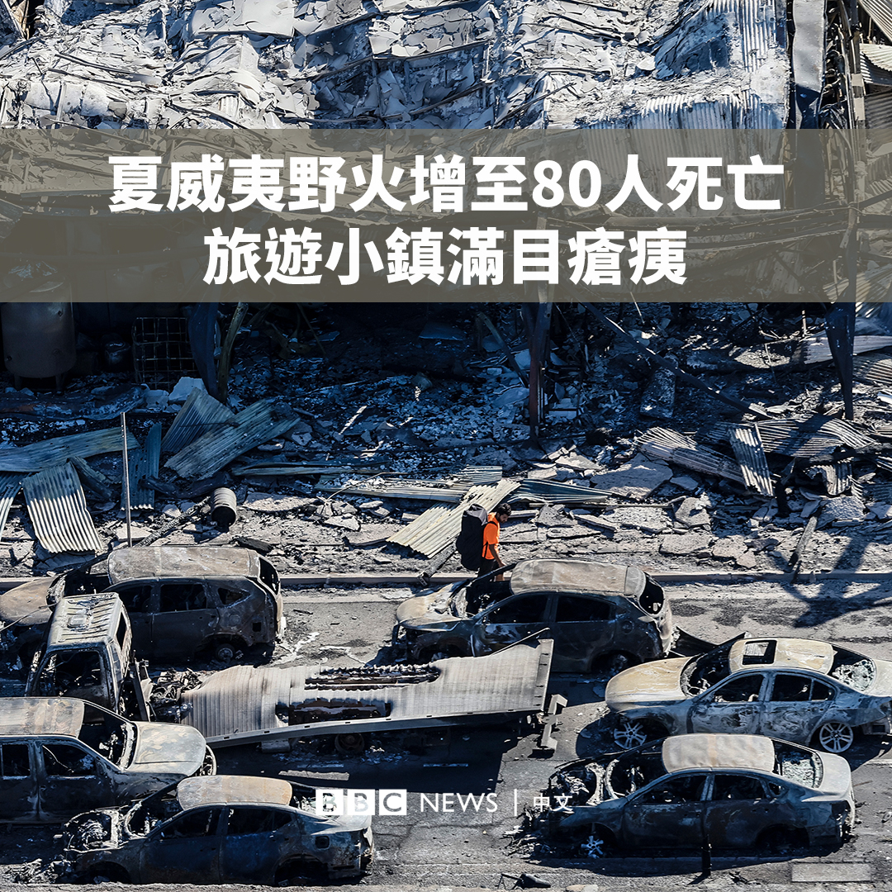
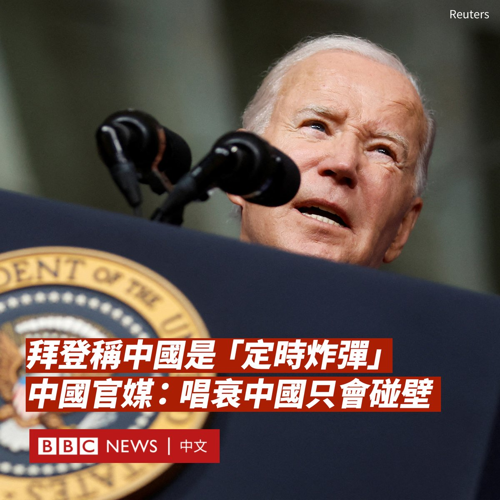

D英国广播公司BBC 北京时间 2023-08-12T20:41:06Z 1690342646756397056 美国夏威夷官员称，目前已有80人在毛伊岛的野火中丧生，仍有数百人失踪。

触目惊心的画面显示野火摧毁了大量房屋和设施，历史悠久的小镇拉海纳满目疮痍。

消防员仍在试图控制多个地区的火势。与此同时，对于当局是否足够快地向居民发出警告的质疑也随之而来。 https://t.co/sqPZEyWz6T   D英国广播公司BBC 北京时间 2023-08-12T21:44:51Z 1690358689654280192 流亡英国三年的香港前学生运动领袖罗冠聪被香港政府以触犯《国安法》为由，悬红100万港币缉捕。

他在英国接受BBC采访，称当局对他的悬赏金额远多于涉嫌谋杀案的在逃者，认为当局是把国家安全的概念当作武器。他亦回应了有否因当局扣查其家人而感到某程度上的内疚。https://t.co/R7jmSOm8XZ   D英国广播公司BBC 北京时间 2023-08-12T18:45:16Z 1690313494368038912 在北京西部，十岁的苗春优在洪流中尖叫着呼唤妈妈，湍急的洪水将她从父亲的手中冲散，母亲急着抓住一根树枝，想要救起女儿。

她的母亲说，春优是她收养的女儿。当时，洪水将他们一家三口赶到屋顶上，她最终只能眼睁睁地看着女儿被“有两个成人高”的洪浪吞没。
https://t.co/a1YYghpn9v   D英国广播公司BBC 北京时间 2023-08-12T13:03:31Z 1690227490160300032 在美国总统拜登（Joe Biden）把中国经济状况比作一枚“定时炸弹”后，中国官媒回击称：“唱衰中国，只会在事实面前反复碰壁”。

拜登周四（8月10日）在犹他州帕克城（Park City）的一场竞选筹款活动上说，“中国是一颗滴答作响的定时炸弹……中国陷入了麻烦。中国以前以每年8%的增速来维持增长，现在每年接近2%。”他说。

目前尚不清楚拜登引用的“2%”是指什么数据。据中国国家统计局，中国第一季度经济同比增长4.5%，环比增长2.2%；第二季度同比增长6.3%，环比增长0.8%。

拜登还更加尖锐地说：“他们遇到了一些问题。这很不好，因为那帮坏家伙在遇到问题时就会做坏事。”

他在演讲中同时表示其不想伤害中国，希望与中国建立理性的关系。

中国官媒新华社一天后发表评论文章回应称“中国经济恢复向好，主要宏观指标总体改善，成绩有目共睹。”

新华社在评论中称：“美国国内困局难解……出了问题归咎中国，成了美政客转移国内舆论视线最常用的‘挡箭牌’。”

中国驻美国大使馆发言人刘鹏宇也警告，华盛顿不要把北京当作“替罪羊”，不要煽动“分裂和对抗”。

他在给路透社的一份声明中说：“我们反对美方拿中国说事，抹黑中国或贬低中国的前景。”

白宫官员周五（8月11日）则回应称，拜登的言论指的是中国国内经济和社会紧张局势，这可能会影响北京与世界的互动方式。

发言人约翰·柯比（John Kirby）称，中国令人担忧的一个方面是通过提供高息基础设施贷款，然后在各国违约时没收资产的行为。他将其称之为对其他国家的“欺凌”、“胁迫”和“恐吓”。

今年6月，拜登公开点名批评习近平为“独裁者”，引起北京的强烈不满。

中国外交部发言人毛宁称这种说法“极其荒谬，且不负责任”，违反“外交礼节和中国政治的尊严”，“是公开政治挑衅”。   