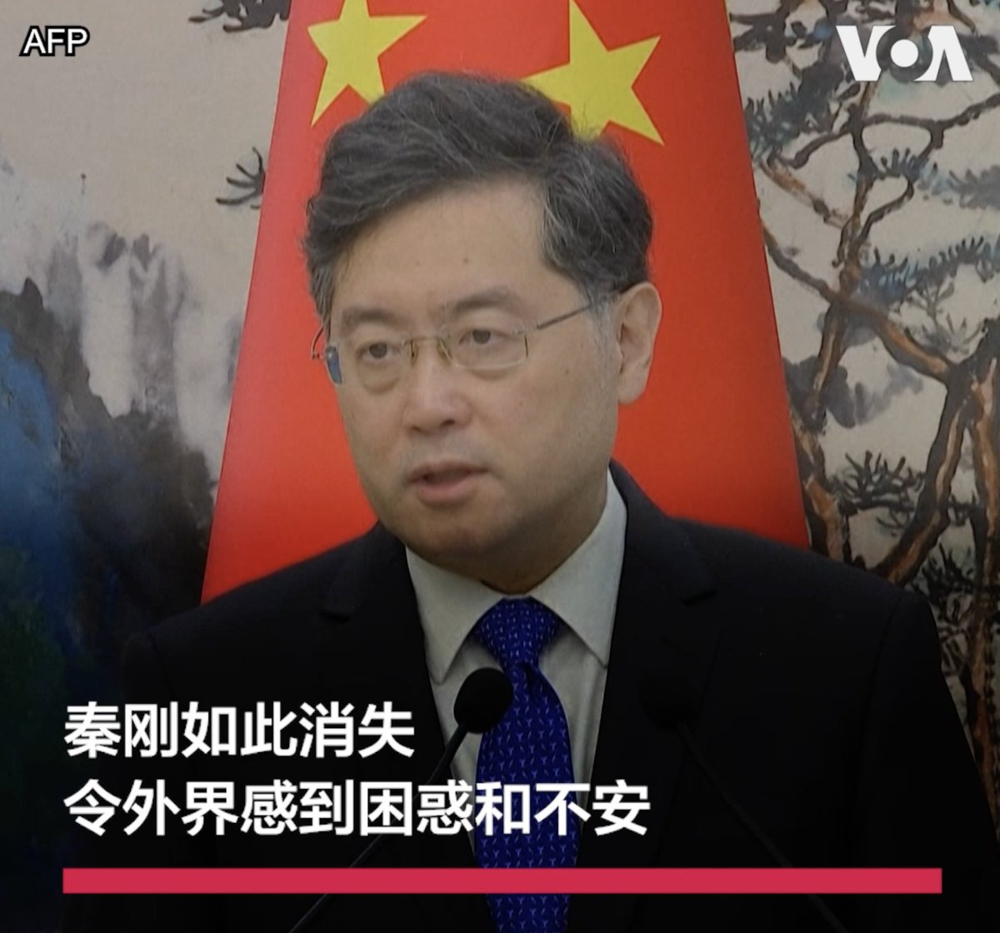

美国之音中文网 北京时间 2023-08-12T21:51:34Z 1690360378100695040 一艘载有移民的船只12日穿越英吉利海峡途中翻船，至少造成6人死亡，有50多人获救。视频显示在多佛尔港口，获救的移民们正在从英国边防机构的船只下船。英国政府的数据显示自2018年开始到现在试图渡过英吉利海峡到英国的移民已超过10万，今年迄今已有近1万6千。 https://t.co/PJPVBudoLs   美国之音中文网 北京时间 2023-08-12T22:12:05Z 1690365541192810496 北京拟放宽户籍以促消费 专家: “画饼充饥”解决不了信心危机 https://t.co/3h6XYXhLDE   美国之音中文网 北京时间 2023-08-12T19:44:23Z 1690328371266256896 台湾副总统赖清德12日在桃园机场对媒体表示，要让国际社会了解台湾是坚持民主自由和人权的国家，以及为维护印太和平稳定所作的努力。赖清德此次率团访问巴拉圭，作为蔡英文总统的特使参加巴拉圭新总统潘尼亚的就职典礼，往返分别在纽约和旧金山过境。 
报道：https://t.co/vtG4aW2MbF https://t.co/sdnpmr3CK7   美国之音中文网 北京时间 2023-08-12T17:25:02Z 1690293305169604608 担忧成蕾在狱中安危 澳大利亚总理促中国放人 https://t.co/9U5R7tIe4z   美国之音中文网 北京时间 2023-08-12T16:09:33Z 1690274310089519104 台湾副总统启程过境美国 AIT表态欢迎 国安官员忧中国军演恫吓 https://t.co/gqbr4GSUah   美国之音中文网 北京时间 2023-08-12T12:55:05Z 1690225370572984321 台湾旅游业者盼陆客团来台 当局称未收到对方善意回应 坚持同步开放团客 https://t.co/1R966fTuJu   美国之音中文网 北京时间 2023-08-12T13:10:32Z 1690229259200339968 西安突发山洪泥石流 2死亡 16人失踪 https://t.co/BtJos2lCxm   美国之音中文网 北京时间 2023-08-12T08:00:01Z 1690151113197019136 世界媒体看中国—金哲：拿秦刚玩捉迷藏。

报道👉https://t.co/XTZvEeMbTl https://t.co/tETEM9vJwP   美国之音中文网 北京时间 2023-08-12T09:00:01Z 1690166212813262848 一键解锁#美国热搜 榜：1、抖音主播卡车一灯一家14口死于洪水，几近灭族2、面对洪灾，习近平神隐，他该下罪己诏3、解读拜登下达对华投资禁令4、高碑店群众抗议继续，县城戒严5、上海宣布举报违法行为的奖金最高100万鼓励相互举报揭发6、新华社：干部病房不可撤销7、足球场上球迷齐声用国骂骂中国足协 https://t.co/PdKY8mIWFC   美国之音中文网 北京时间 2023-08-12T08:10:04Z 1690153641515376640 西非国家为派兵恢复尼日尔宪政民主做准备，紧张局势升级 https://t.co/S7zNNgOh8N   美国之音中文网 北京时间 2023-08-12T09:25:03Z 1690172513161195520 白宫：美国“致力于”培训乌克兰飞行员驾驶F-16战机 https://t.co/aFXWGtE8YN   美国之音中文网 北京时间 2023-08-12T09:55:04Z 1690180064279961601 美中同意将两国间每周航班增加一倍 https://t.co/shz8SrUQdQ   美国之音中文网 北京时间 2023-08-12T05:32:12Z 1690113912656601088 针对千亿富豪姚振华当街被打，悉尼科技大学中国学副教授冯崇义博士说：习近平重手打击资本无序扩张，造成了要收拾大资本家之势。现在经济下滑很厉害，火烧替罪羊姚老板们可以火中取栗，他们常用这种手法。
#时事大家谈 完整版：https://t.co/Lkog0dSa7v https://t.co/QMnG7YrvW9   美国之音中文网 北京时间 2023-08-12T07:00:00Z 1690136008745259015 慕容雪村曾是中国最红的网络作家。从享受网络文化初盛期的红利，到成为意见领袖，再到遭遇全网封杀，最后流亡海外，他一次次的人生转折也折射出中国公共空间的变化。在变化中，知识分子该何去何从？蹦出温水的青蛙更明白中国是一口正在加热的锅？8/12早9点，敬请收看《纵深视角》专访慕容雪村。 https://t.co/HPdFHzWNSL   美国之音中文网 北京时间 2023-08-12T07:05:03Z 1690137279745200129 皮尤调查：24个中高收入国家民众对台湾持正面观感 https://t.co/jqG39zNAo1   美国之音中文网 北京时间 2023-08-12T08:30:00Z 1690158659630698496 中国报道—叶兵：北戴河会议讨论什么？分析人士认为中共危机四伏，习近平无力回天。

报道：https://t.co/nNfT7Tn5kk https://t.co/4YpfUi4Hqt   美国之音中文网 北京时间 2023-08-12T09:06:03Z 1690167729053982721 中国电动车电池公司国轩(Gotion)获准在美国密西根州设厂，在当地引发民众抗议。当地政府希望国轩带来经济发展，州政府也为该项目批款1.75亿美元。但不少民众不买单，甚至发起罢免镇委员会的请愿。是什么原因让他们对上亿投资和工作机会说不？本周在当地的一场讨论会上，民众各抒己见。 https://t.co/05iac39XFL   美国之音中文网 北京时间 2023-08-12T01:13:34Z 1690048828370718721 中国海警与俄罗斯、韩国海岸警卫队举行联合海上执法训练 https://t.co/h8DqgAMRPm   美国之音中文网 北京时间 2023-08-12T04:00:00Z 1690090710710784000 社媒平台X老板马斯克和脸书创始人扎克伯格以综合格斗的形式约架，这场对决将在意大利举行。路透社11日在纽约的时报广场采访了一些民众，他们有的支持马斯克，有的支持扎克伯格。也有的人觉得他们这么做纯属炒作。 https://t.co/TT5KJPbVs1   美国之音中文网 北京时间 2023-08-12T04:20:04Z 1690095758891188225 中国宣布恢复赴美国团队旅游，美商务部长称是旅游业的“胜利” https://t.co/tSUv0cARej   美国之音中文网 北京时间 2023-08-12T04:51:33Z 1690103684829708288 王毅东南亚三国行 中国多边外交攻势能巩固与东盟关系吗？ https://t.co/PQXMNjSsDJ   美国之音中文网 北京时间 2023-08-12T04:59:06Z 1690105582198333440 中国外长王毅本周访问新加坡、马来西亚及柬埔寨三国，希望借此与东南亚加强战略沟通。专家分析，王毅此行可能是想削弱星美安全关系，也想与大马进一步强化经贸合作，不过高科技中企能否大举进驻当地是观察重点。此外，虽然王毅访柬将深化中柬关系，但恐也导致西方与金边关系下修。 https://t.co/WHPRSidZp3   美国之音中文网 北京时间 2023-08-12T05:26:08Z 1690112387041435649 多伦多大学“公民实验室”报告披露，腾讯公司“搜狗”输入法存在安全漏洞，用户输入信息可被网络监听者解密，复原成明文。公民实验室就此联系腾讯，搜狗修复该漏洞。但报告提醒，搜狗依旧将用户输入数据传送至中国的服务器，这些服务器均受中国法律管辖。您还会使用搜狗输入法吗？欢迎分享您的看法。 https://t.co/WLFWUpsWNP   美国之音中文网 北京时间 2023-08-12T05:49:05Z 1690118163684626434 VOA专访美总统特使：美国审议向太平洋三岛国提供安全保证，阻止中国力量进入 https://t.co/n4ciufGYUi   美国之音中文网 北京时间 2023-08-12T06:00:01Z 1690120915630395400 默克多退出谷歌接力、谷歌败退领英上，领英再败后，资本家是否放弃进军中国言论市场？南卡大学艾肯商学院讲座教授谢田博士说：中共给优惠，会让资本家再上钩，然后作为样板，吸引更多的资本家进来。领英不会是去北京的最后一家西方企业。

#时事大家谈 完整版：https://t.co/Lkog0dSHX3 https://t.co/VKAQAGPdNo   美国之音中文网 北京时间 2023-08-12T01:00:04Z 1690045428170100736 拜登再吐真言：中国是一枚正在“滴答作响的定时炸弹” https://t.co/RDIryoYgXd   美国之音中文网 北京时间 2023-08-12T01:27:06Z 1690052231297409024 深陷债务危机的中国地产业巨头碧桂园8月11日股价创下新低。业界预期，碧桂园可能会在近期启动债务重组，以缓解资金压力。有分析指出，即使中国政府指令银行帮助碧桂园渡过难关，但短期救市措施很难消弭中国地产业的系统性风险。在北京街头，也有民众对此感到担忧。 https://t.co/6db4TPrXjh   美国之音中文网 北京时间 2023-08-12T03:16:15Z 1690079700188581888 因国家安全罪名被中国拘留的澳大利亚记者成蕾(Cheng Lei)在一封书信中描述了每年只站在阳光下10个小时的感受。成蕾于2020年8月被中国安全官员拘留。这封信是她从那之后的首次声明，并由她的伴侣对外发布。详细：https://t.co/TaM8z8evoY https://t.co/3qsmnIPh19   美国之音中文网 北京时间 2023-08-12T03:20:04Z 1690080660449558529 司法部长任命特别检察官负责调查亨特·拜登案 https://t.co/n95FAu0owe   美国之音中文网 北京时间 2023-08-12T03:35:52Z 1690084637907783681 美国、日本、印度和澳大利亚四国“马拉巴尔”海上联合军演8月11日在悉尼东海岸正式启动。此次演习将从8月11日持续至22日，演习包括潜艇和飞行演练等作战训练。这也是始于1992年的“马拉巴尔”军演首次在澳大利亚海域举行。 https://t.co/1m29fOi9Sp   美国之音中文网 北京时间 2023-08-12T04:06:26Z 1690092331695849472 在执政近40年的柬埔寨首相洪森宣布将在8月下台后，柬埔寨国王稍早发布命令，任命洪森长子洪马内担任下届首相。即便洪马内曾留学英美，但专家推测，柬国的专制政策大致不变、与美国关系也难升级，而中国将持续透过经济利诱，深化与柬埔寨的“铁杆”友谊。https://t.co/MnALUAGuEW https://t.co/10O1bz1dnm   美国之音中文网 北京时间 2023-08-12T01:11:16Z 1690048248998699014 美国总统拜登10日在一场政治筹款活动上直指中国高失业率和老龄化等问题，称这让中国成为“定时炸弹”。“坏家伙们遇到麻烦就会做坏事，”他说。新华社评论对此回应称：“唱衰中国，只会在事实面前反复碰壁。”事实究竟如何？现下中国经济是真衰还是被唱衰？欢迎分享您的看法。 https://t.co/RXnkKM9Ruk   美国之音中文网 北京时间 2023-08-12T01:12:52Z 1690048651299627008 台湾副总统、民进党总统候选人赖清德将于8月12日到18日率领代表团，前往台湾邦交国巴拉圭参加巴拉圭总统就职典礼，并将在往返行程中分别过境纽约和旧金山。美国表示，这是依循以往惯例，美国的一中政策未变，中方没有理由做出过度反应。 https://t.co/S3O4Flgz2P   美国之音中文网 北京时间 2023-08-12T01:48:34Z 1690057635981074439 来自世界各国的童军们11日在首尔世界杯体育场参加第25届世界童军大露营闭营仪式和音乐会 。参加演出的韩团包括NewJeans和The Boyz等。今年有4万多童军来到韩国，但出现热浪导致多人生病、美英团队因营地条件提前离开，台风导致全面撤离等问题。童军们后来被分散到韩国各处，参加政府资助的文化活动 。 https://t.co/qcWuXBU9p8   美国之音中文网 北京时间 2023-08-12T01:55:33Z 1690059393675755520 碧桂园债务暴雷，其股价周五暴跌 https://t.co/BZ3FeVGr71   美国之音中文网 北京时间 2023-08-12T02:11:32Z 1690063416264986624 香港警方国安处接38万条举报信息创新高 评论员指太侧重国安影响国际形象 https://t.co/sOVtlgu62n   美国之音中文网 北京时间 2023-08-12T00:01:35Z 1690030709992497153 夏威夷毛伊岛大火罹难者已达55人，蔡英文总统慰问受灾居民愿随时提供援助 https://t.co/4y9vpYbdLT   