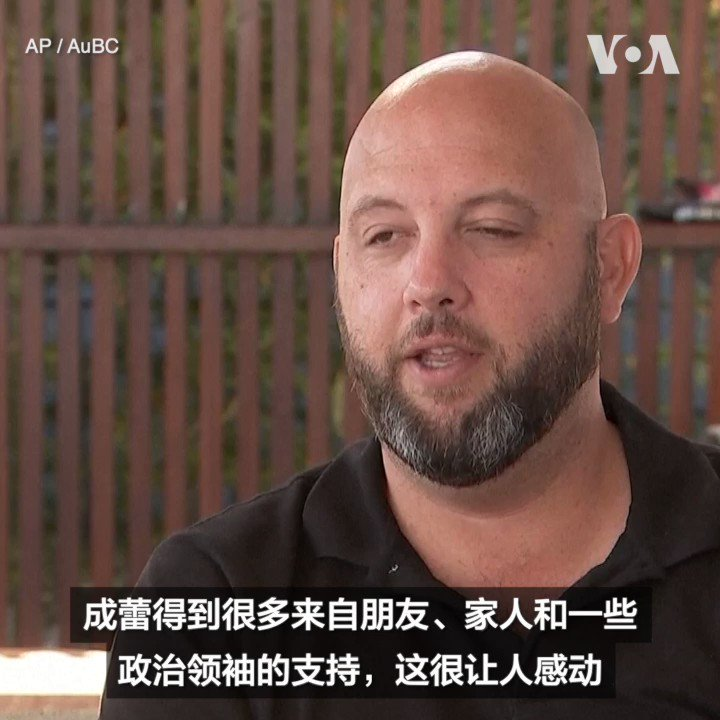
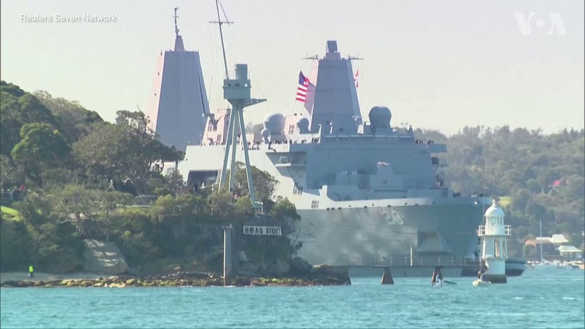
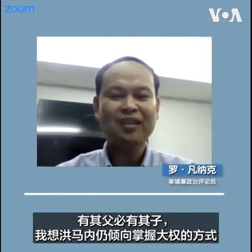
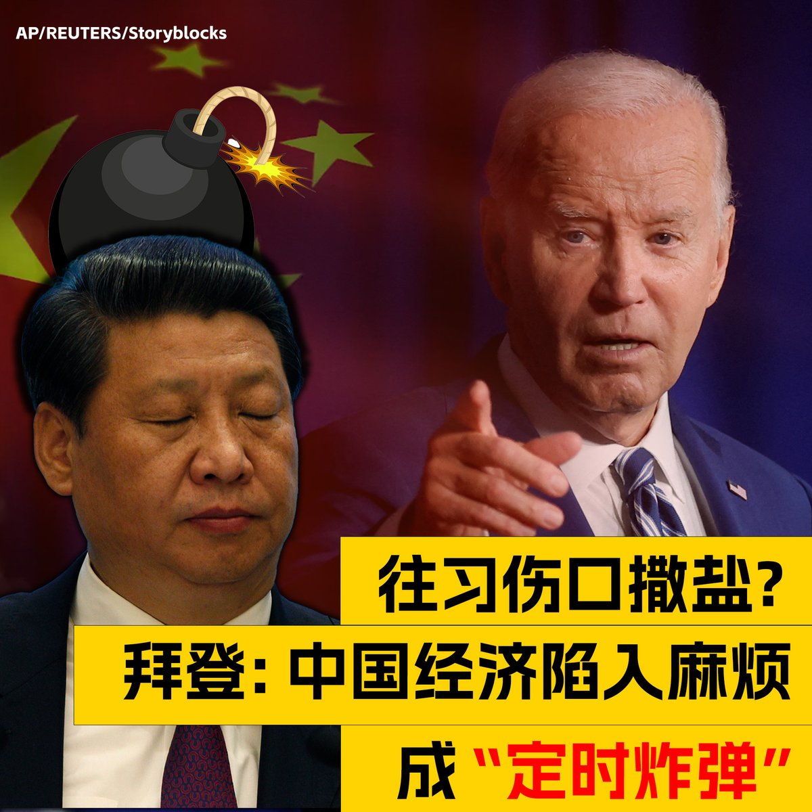
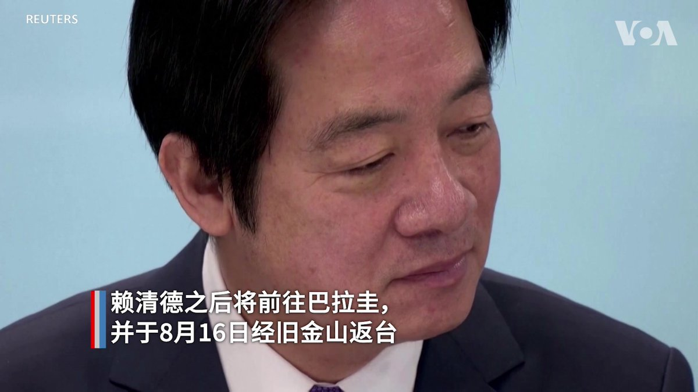

美国之音中文网 北京时间 2023-08-12T06:00:01Z 1690120915630395400 默克多退出谷歌接力、谷歌败退领英上，领英再败后，资本家是否放弃进军中国言论市场？南卡大学艾肯商学院讲座教授谢田博士说：中共给优惠，会让资本家再上钩，然后作为样板，吸引更多的资本家进来。领英不会是去北京的最后一家西方企业。

#时事大家谈 完整版：https://t.co/Lkog0dSHX3 https://t.co/VKAQAGPdNo   美国之音中文网 北京时间 2023-08-12T01:00:04Z 1690045428170100736 拜登再吐真言：中国是一枚正在“滴答作响的定时炸弹” https://t.co/RDIryoYgXd   美国之音中文网 北京时间 2023-08-12T01:27:06Z 1690052231297409024 深陷债务危机的中国地产业巨头碧桂园8月11日股价创下新低。业界预期，碧桂园可能会在近期启动债务重组，以缓解资金压力。有分析指出，即使中国政府指令银行帮助碧桂园渡过难关，但短期救市措施很难消弭中国地产业的系统性风险。在北京街头，也有民众对此感到担忧。 https://t.co/6db4TPrXjh   美国之音中文网 北京时间 2023-08-12T03:16:15Z 1690079700188581888 因国家安全罪名被中国拘留的澳大利亚记者成蕾(Cheng Lei)在一封书信中描述了每年只站在阳光下10个小时的感受。成蕾于2020年8月被中国安全官员拘留。这封信是她从那之后的首次声明，并由她的伴侣对外发布。详细：https://t.co/TaM8z8evoY https://t.co/3qsmnIPh19   美国之音中文网 北京时间 2023-08-12T03:20:04Z 1690080660449558529 司法部长任命特别检察官负责调查亨特·拜登案 https://t.co/n95FAu0owe   美国之音中文网 北京时间 2023-08-12T03:35:52Z 1690084637907783681 美国、日本、印度和澳大利亚四国“马拉巴尔”海上联合军演8月11日在悉尼东海岸正式启动。此次演习将从8月11日持续至22日，演习包括潜艇和飞行演练等作战训练。这也是始于1992年的“马拉巴尔”军演首次在澳大利亚海域举行。 https://t.co/1m29fOi9Sp   美国之音中文网 北京时间 2023-08-12T04:06:26Z 1690092331695849472 在执政近40年的柬埔寨首相洪森宣布将在8月下台后，柬埔寨国王稍早发布命令，任命洪森长子洪马内担任下届首相。即便洪马内曾留学英美，但专家推测，柬国的专制政策大致不变、与美国关系也难升级，而中国将持续透过经济利诱，深化与柬埔寨的“铁杆”友谊。https://t.co/MnALUAGuEW https://t.co/10O1bz1dnm   美国之音中文网 北京时间 2023-08-12T01:11:16Z 1690048248998699014 美国总统拜登10日在一场政治筹款活动上直指中国高失业率和老龄化等问题，称这让中国成为“定时炸弹”。“坏家伙们遇到麻烦就会做坏事，”他说。新华社评论对此回应称：“唱衰中国，只会在事实面前反复碰壁。”事实究竟如何？现下中国经济是真衰还是被唱衰？欢迎分享您的看法。 https://t.co/RXnkKM9Ruk   美国之音中文网 北京时间 2023-08-12T01:12:52Z 1690048651299627008 台湾副总统、民进党总统候选人赖清德将于8月12日到18日率领代表团，前往台湾邦交国巴拉圭参加巴拉圭总统就职典礼，并将在往返行程中分别过境纽约和旧金山。美国表示，这是依循以往惯例，美国的一中政策未变，中方没有理由做出过度反应。 https://t.co/S3O4Flgz2P   美国之音中文网 北京时间 2023-08-12T01:48:34Z 1690057635981074439 来自世界各国的童军们11日在首尔世界杯体育场参加第25届世界童军大露营闭营仪式和音乐会 。参加演出的韩团包括NewJeans和The Boyz等。今年有4万多童军来到韩国，但出现热浪导致多人生病、美英团队因营地条件提前离开，台风导致全面撤离等问题。童军们后来被分散到韩国各处，参加政府资助的文化活动 。 https://t.co/qcWuXBU9p8   美国之音中文网 北京时间 2023-08-12T01:55:33Z 1690059393675755520 碧桂园债务暴雷，其股价周五暴跌 https://t.co/BZ3FeVGr71   美国之音中文网 北京时间 2023-08-12T02:11:32Z 1690063416264986624 香港警方国安处接38万条举报信息创新高 评论员指太侧重国安影响国际形象 https://t.co/sOVtlgu62n   美国之音中文网 北京时间 2023-08-12T00:01:35Z 1690030709992497153 夏威夷毛伊岛大火罹难者已达55人，蔡英文总统慰问受灾居民愿随时提供援助 https://t.co/4y9vpYbdLT   