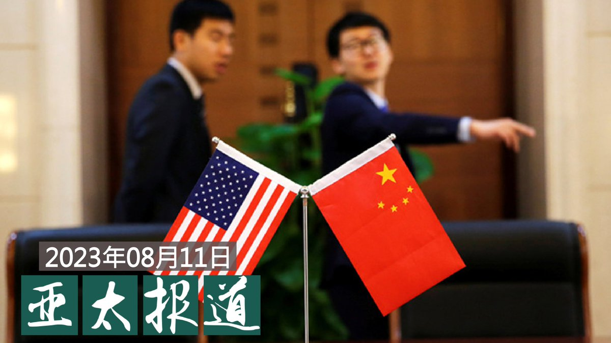
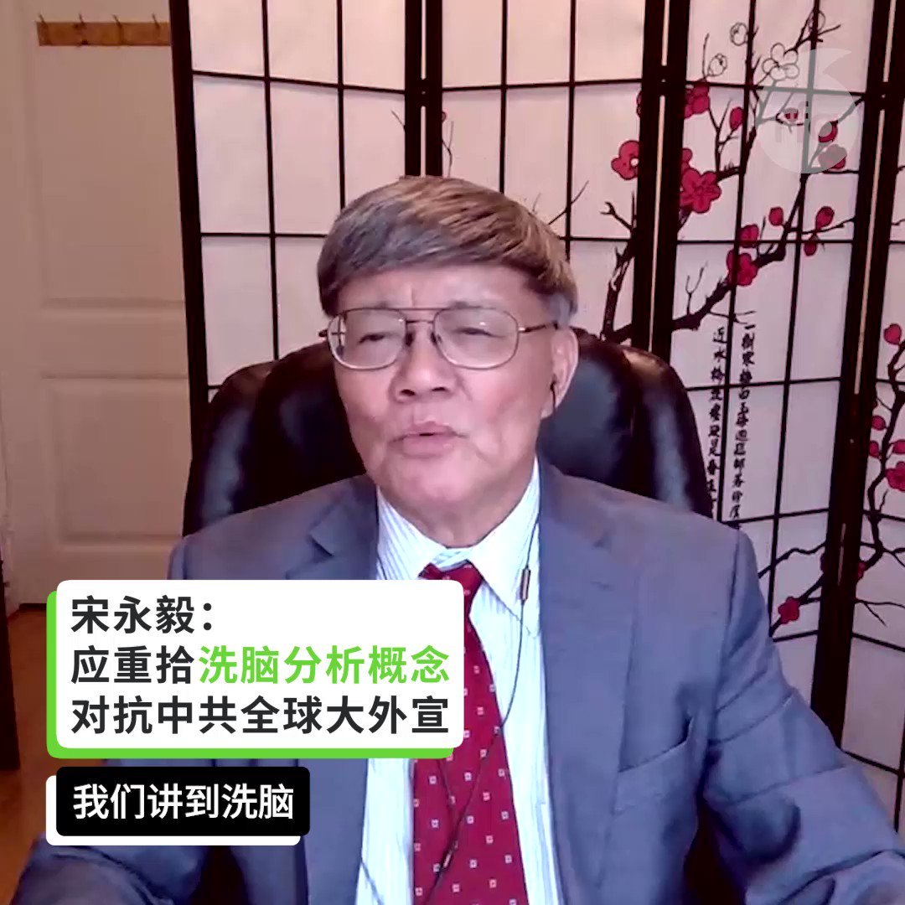

自由亚洲电台 北京时间 2023-08-12T03:20:29Z 1690080764250193923 专栏 | #西藏纵览：中国当局释放被判四年徒刑的西藏作家 https://t.co/kKnDv7I0bd   自由亚洲电台 北京时间 2023-08-12T05:22:59Z 1690111592816316416 本台 #事实查核 深度报道 【#中国外宣在异乡：海外华人的平行媒体时空】   第四集 《说着英语  想像故乡的新西兰“老 #粉红”》
 https://t.co/hTvvo06Job
谈起如何了解他门祖父辈的家乡?
 “CGTN!”
萝丝的丈夫、82岁的会长吕显华(Kai Luey)毫不犹豫地说:“它让我了解中国。”
一旁的会友跟着应合，几个人不约而同谈到了在当地免费配送的中国官方报纸China Daily，或是社交媒体上分享的一些短视频。   自由亚洲电台 北京时间 2023-08-12T06:32:50Z 1690129170574315521 #事实查核｜因拜登限制进口中国商品 美国人疯抢中国品牌电视？ https://t.co/NbJbZ0PqIW   自由亚洲电台 北京时间 2023-08-12T03:21:03Z 1690080907909300230 专栏 | #解读新疆：伊斯坦布尔青年中心造福维族青年；维吾尔妇女因子被捕 https://t.co/FiW7mWEdNx   自由亚洲电台 北京时间 2023-08-12T04:45:26Z 1690102144656113665 今年夏天中国创纪录的高温和历史性的洪水成为各大媒体的头版头条，但极端天气引发的灾害却未能引发国内公众关于气候变化的关注。 https://t.co/ZcauiwnOGe   自由亚洲电台 北京时间 2023-08-12T04:46:04Z 1690102304022941696 据美国《华尔街日报》报道，华盛顿智库战略与国际问题研究中心近日发布的一项贸易数据分析显示，中国在400多项商品上对美国及其盟友的进口依赖度达到或超过70%。该中心的车维德(Victor D. Cha)说，有关国家或可利用这些商品来回击中国的经济施压，并且可能需要集体行动。 https://t.co/9qf46SC492   自由亚洲电台 北京时间 2023-08-12T05:28:12Z 1690112905537073152 专栏 | #夜话中南海：沈德咏为何立功不被从宽，坦白换得从严？https://t.co/BBQJBZJttk   自由亚洲电台 北京时间 2023-08-12T02:35:55Z 1690069549511839744 随着美中紧张关系和技术竞争日益加剧，美国总统 #拜登 本周三签署 #行政令，详细说明了其计划限制美国主体对中国半导体和微电子、量子信息技术和人工智能领域进行投资，以维护国家安全。美国专家学者本周五指出，虽然行政令有待完善，但仍会触发美国盟国及合作伙伴的跟进。 https://t.co/6nG4ThKeEG   自由亚洲电台 北京时间 2023-08-12T03:00:39Z 1690075773653159936 【#亚太报道（2023-8-11）】
欢迎收听和订阅播客【亚太报道】 https://t.co/MjLNSvVeAE

#中美谍战 升温 /中国间谍渗入 #新西兰/美 #限制对华投资 加速 #外资逃离中国/纪检监察通报 #医疗贪腐 引发相互举报/ 中国管控论坛活动诈骗有政治考量 https://t.co/l0JoMME8P3   自由亚洲电台 北京时间 2023-08-12T04:17:11Z 1690095033905553412 【剖析中共当代 #洗脑 行为 对抗极权主义】
【中共用“#泛洗脑主义”混淆是非】
https://t.co/RcO5ctksSA
加州州立大學洛杉矶分校荣休教授 #宋永毅， 纽约城市大学政治学教授 #夏明 在#亚洲很想聊 节目介绍，为何今天民主阵营必须重拾“洗脑”此一概念，对抗极权体制的谎言，以及对中国和国际的“思想改造”？#习近平 的 #高科技洗脑，如何进攻世界各国的学者政要，扩大其影响力？   自由亚洲电台 北京时间 2023-08-12T00:50:17Z 1690042965597847552 新西兰安全情报局发表的年度国安威胁评估报告表示，中国情报机构在当地持续进行间谍活动，对华人社区的干预程度加大，不断监控在当地定居的中国侨民社群，认为这对新西兰构成“复杂”的谍报隐忧。 https://t.co/KlIZ0D6zwC   自由亚洲电台 北京时间 2023-08-12T00:51:50Z 1690043359220445195 台湾的副总统 #赖清德出访巴拉圭，将于本周六（12日）抵达 #纽约 过境。由于赖清德也是明年一月 #台湾总统大选 的参选人和有力竞争者，目前又正值美中之间关系的敏感时期，这次过境美台双方将如何处理？中方又会如何反应？ https://t.co/RjcN22EO1A   自由亚洲电台 北京时间 2023-08-12T01:14:57Z 1690049174195326977 到8月13日，中国 #人权律师 #高智晟 被中国政府秘密抓捕，被失踪就已经有六年时间。
 
身在美国的高智晟妻子 #耿和 周五（8月11日）对外发出呼吁，希望人权机构和媒体、自媒体予以关注，并期待良知正义人士的支持。 https://t.co/biJpDXzsyj   自由亚洲电台 北京时间 2023-08-12T00:07:53Z 1690032295296798720 加拿大研究机构：“#搜狗”把用户打的每个字都传回总部 https://t.co/rCaJiGc4QX   