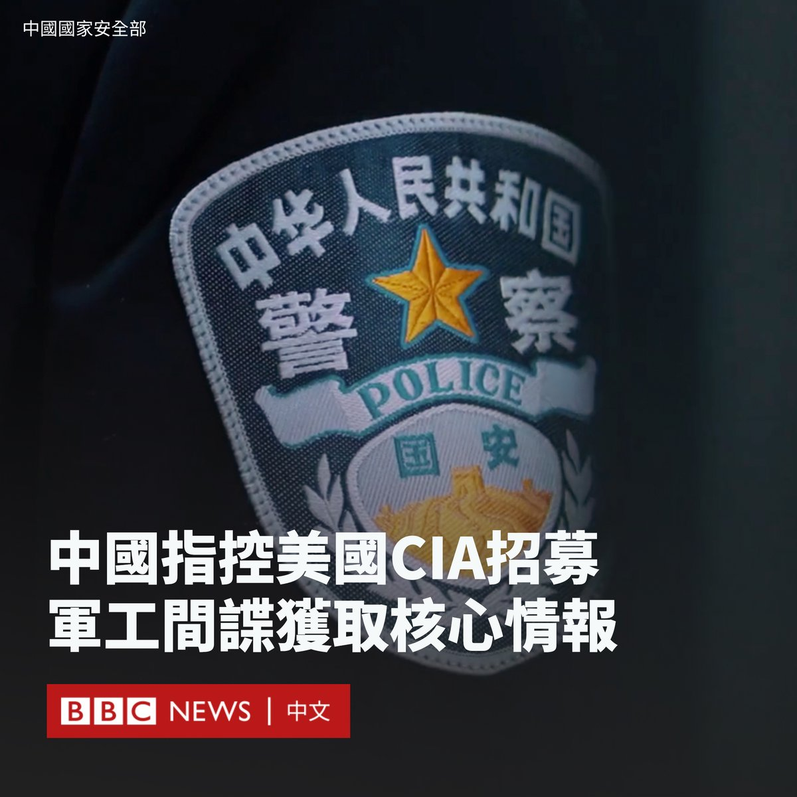

D英国广播公司BBC 北京时间 2023-08-11T15:21:30Z 1689899826782068736 上个世纪，发达债权国曾组成巴黎俱乐部，为债务国面临的债务危机寻找解决方案。但时过境迁，如今债权国中有了一位体量庞大的新玩家——中国。

为什么中国对外债权规模近年来激增？在减债的博弈中，中国和西方存在哪些分歧？更重要的是，在国内经济放缓下，对外减债意味着什么？https://t.co/JF55nAB6rc   D英国广播公司BBC 北京时间 2023-08-11T13:00:45Z 1689864406304526336 中国当局周五（8月11日）指控，一名美国特工以驻意大利使馆官员的名义招募中国人从事间谍工作。

中国国家安全部称，当局近日破获一起美国中央情报局（CIA）参与的间谍案，逮捕了一名52岁的中国某军工集团的工作人员。

该部在一份新闻稿中称，曾某是军工集团的“重要涉密人员”，他曾被单位公派至意大利留学进修，期间一名名为“塞斯”的美国驻意大利使馆官员主动与之结识。

新闻稿称，这名美国特工通过聚餐、郊游、观赏歌剧等活动与曾某拉近关系，并向其“灌输西方价值观”，而曾某的“政治立场产生动摇”。

后来，该特工向曾某亮明其是美国CIA罗马站人员的身份，承诺给付巨额报酬并为其全家办理赴美移民，但需要曾某提供中国的敏感军事情报。

据报道，曾某表示同意，签署了参谍协议并接受考核和培训。在回国后继续与中情局人员秘密接头，外泄了大量核心情报，收取间谍经费。

国安部表示，该部已获取曾某间谍活动证据，“依法对其采取强制措施，及时消除危害”。目前，该案已被移送至检察机关审查起诉。

华盛顿尚未对该指控作出回应。

中国和美国经常互相指控对方进行间谍或其他攻击活动。今年4月，中国通过了新修订的《反间谍法》，覆盖了许多新的数据和数字活动，该法律于7月1日生效。国家安全部本月强调“反间防谍需要全社会动员”。

上周，美国宣布逮捕两名华裔海军水兵，指控他们涉嫌向中国提供军事情报，包括海军舰艇的国防机密信息。   D英国广播公司BBC 北京时间 2023-08-11T14:15:20Z 1689883177551114240 从九月起，俄罗斯的中学生们将会在新的历史教科书中学习有关乌克兰战争的内容。他们将被教导，如果不是普京总统对乌克兰发起“特别军事行动”，人类文明将走向终结。https://t.co/qQ8WbqYbtZ   D英国广播公司BBC 北京时间 2023-08-11T11:00:01Z 1689834022212378624 BBC一项调查显示，在苏丹等阿拉伯国家，女性被精神治疗师以“心灵疗法”的名义施展性侵害的情况非常普遍。

经过一年的访问，有超过80名女性证实她们遭到性骚扰甚至强奸。BBC的卧底记者亦在调查过程中经历了一名治疗师的性骚扰。 https://t.co/DWRJqsUKJg   D英国广播公司BBC 北京时间 2023-08-11T08:49:28Z 1689801170653417472 大西洋理事会智库高级研究员丹兹曼（Sarah Bauerle Danzman）认为，公布的限制措施比此前讨论中一些人建议的范围更窄，但仍代表着政府监管“前所未有”地扩大：“这绝对是一件大事，而且肯定与过去的政策大为不同。”https://t.co/4SuYQHJbIW   