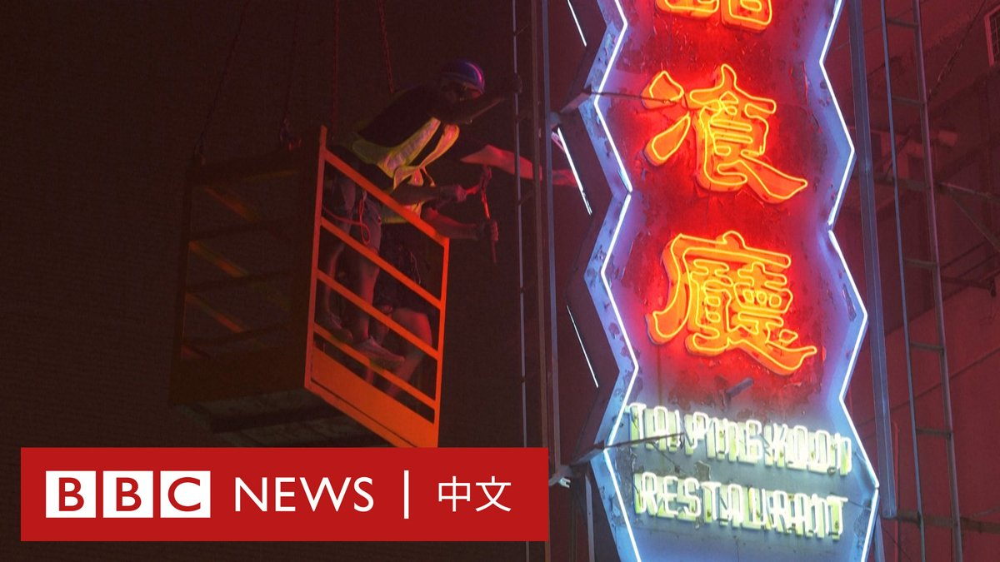
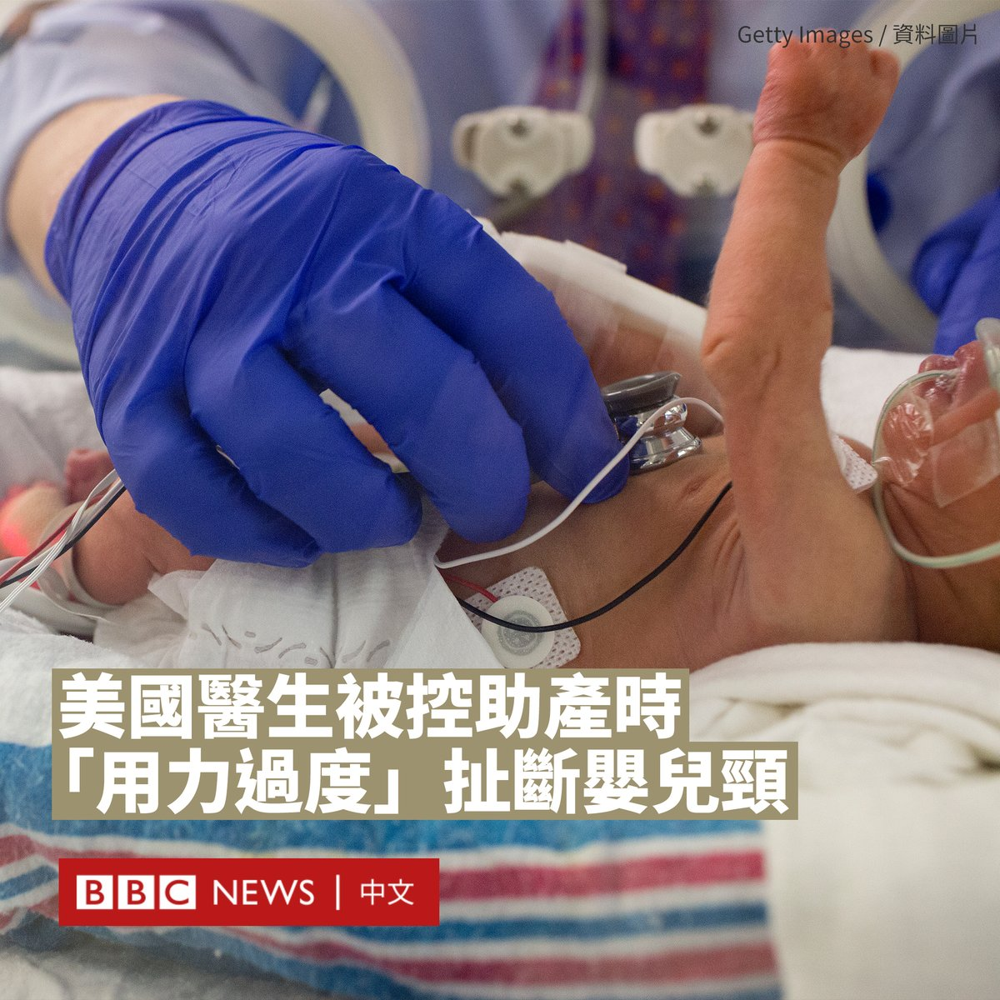

D英国广播公司BBC 北京时间 2023-08-11T22:57:00Z 1690014460428128256 霓虹招牌曾是香港标志性的街头一景，但越来越多招牌因安全因素遭到拆除。据统计，近五年有超过1.6万个招牌被拆除或修葺。

一个近期由保护组织发起的展览展示了许多近年被拆卸的招牌。组织者希望让人们看见每一个物件背后花费的工夫，以及师傅“如何创造让香港之所以是香港的独特街景”。 https://t.co/6fpYcBHb8w   D英国广播公司BBC 北京时间 2023-08-11T18:38:11Z 1689949324019646465 美国佐治亚州一名20岁的母亲控诉，在一场“噩梦般”的分娩过程中，她的孩子因医生的操作导致身首异处。
 
婴儿的父母杰西卡·罗斯（Jessica Ross）和特雷维恩·泰勒（Treveon Taylor）提起诉讼，称医院医生特蕾西·圣朱利安（Tracey St Julian）存在严重疏忽，导致他们的孩子在难产中死亡，并试图隐瞒死亡方式。
  
代表婴儿家属的律师声称，圣朱利安医生在分娩过程中对婴儿过度用力。其法律团队成员科里·林奇（Cory Lynch）表示，这对夫妇对他们第一个孩子的诞生“非常兴奋”，但“不幸的是，他们的梦想和希望变成一场噩梦，而南部地区医疗中心掩盖了这个事实。”
 
警告：以下内容可能会令部分读者感到不安

诉状指，圣朱利安医生试图使用不同的方法进行阴道分娩，包括“拖拉婴儿的头部”。代表律师罗德里克·埃蒙德（Roderick Edmond）称，医生对婴儿施加了“离奇过度的力量”。
 
“圣朱利安医生在试图分娩婴儿的过程中，用力拉扯婴儿的头部和颈部，用力拖拽他，导致婴儿的头骨、面部和颈部骨折。”他说。“当子宫被打开时，先是脚出来，然后是身体，但没有头。”
 
由于肩难产（婴儿的肩膀被卡在产道中），这名婴儿无法通过阴道分娩。
 
根据起诉书，圣朱利安医生是一名拥有执业证书的产科医生和妇科医生，但她没有按照夫妻之前的要求，在适当的时间进行剖腹产。
 
法医办公室和克莱顿县警察正在调查此案，他们在7月13日得知此事，尽管死亡发生在7月9日。
 
林奇称，医务人员为掩盖这一结果，用毯子裹住婴儿的身体，并立起他的头部，以使其看起来仍然连接着，并指医务人员没有报告这起事件。根据诉状，这对夫妇是在孩子死后四天才知道详情。
 
涉事医院的在一份声明中表示，“我们衷心地为这个家庭和所有受到这一悲剧影响的人们祈祷”，并称圣朱利安医生不是医院的员工 。

诉状指控医院存在严重过失、欺诈和故意造成精神痛苦。除了索赔10,000美元的丧葬费用外，原告还要求获得未公开金额的损失赔偿。   D英国广播公司BBC 北京时间 2023-08-11T17:45:49Z 1689936148439977984 中国行为艺术家“坚果兄弟”发起为各大碳排放公司“赎罪”的倡议，通过众筹帮助那些必须直面高温天气的户外劳动者防暑降温，但截至目前收效有限。https://t.co/pS2aKFWBzr   D英国广播公司BBC 北京时间 2023-08-11T15:21:30Z 1689899826782068736 上个世纪，发达债权国曾组成巴黎俱乐部，为债务国面临的债务危机寻找解决方案。但时过境迁，如今债权国中有了一位体量庞大的新玩家——中国。

为什么中国对外债权规模近年来激增？在减债的博弈中，中国和西方存在哪些分歧？更重要的是，在国内经济放缓下，对外减债意味着什么？https://t.co/JF55nAB6rc   D英国广播公司BBC 北京时间 2023-08-11T13:00:45Z 1689864406304526336 中国当局周五（8月11日）指控，一名美国特工以驻意大利使馆官员的名义招募中国人从事间谍工作。

中国国家安全部称，当局近日破获一起美国中央情报局（CIA）参与的间谍案，逮捕了一名52岁的中国某军工集团的工作人员。

该部在一份新闻稿中称，曾某是军工集团的“重要涉密人员”，他曾被单位公派至意大利留学进修，期间一名名为“塞斯”的美国驻意大利使馆官员主动与之结识。

新闻稿称，这名美国特工通过聚餐、郊游、观赏歌剧等活动与曾某拉近关系，并向其“灌输西方价值观”，而曾某的“政治立场产生动摇”。

后来，该特工向曾某亮明其是美国CIA罗马站人员的身份，承诺给付巨额报酬并为其全家办理赴美移民，但需要曾某提供中国的敏感军事情报。

据报道，曾某表示同意，签署了参谍协议并接受考核和培训。在回国后继续与中情局人员秘密接头，外泄了大量核心情报，收取间谍经费。

国安部表示，该部已获取曾某间谍活动证据，“依法对其采取强制措施，及时消除危害”。目前，该案已被移送至检察机关审查起诉。

华盛顿尚未对该指控作出回应。

中国和美国经常互相指控对方进行间谍或其他攻击活动。今年4月，中国通过了新修订的《反间谍法》，覆盖了许多新的数据和数字活动，该法律于7月1日生效。国家安全部本月强调“反间防谍需要全社会动员”。

上周，美国宣布逮捕两名华裔海军水兵，指控他们涉嫌向中国提供军事情报，包括海军舰艇的国防机密信息。   D英国广播公司BBC 北京时间 2023-08-11T14:15:20Z 1689883177551114240 从九月起，俄罗斯的中学生们将会在新的历史教科书中学习有关乌克兰战争的内容。他们将被教导，如果不是普京总统对乌克兰发起“特别军事行动”，人类文明将走向终结。https://t.co/qQ8WbqYbtZ   D英国广播公司BBC 北京时间 2023-08-11T11:00:01Z 1689834022212378624 BBC一项调查显示，在苏丹等阿拉伯国家，女性被精神治疗师以“心灵疗法”的名义施展性侵害的情况非常普遍。

经过一年的访问，有超过80名女性证实她们遭到性骚扰甚至强奸。BBC的卧底记者亦在调查过程中经历了一名治疗师的性骚扰。 https://t.co/DWRJqsUKJg   D英国广播公司BBC 北京时间 2023-08-11T08:49:28Z 1689801170653417472 大西洋理事会智库高级研究员丹兹曼（Sarah Bauerle Danzman）认为，公布的限制措施比此前讨论中一些人建议的范围更窄，但仍代表着政府监管“前所未有”地扩大：“这绝对是一件大事，而且肯定与过去的政策大为不同。”https://t.co/4SuYQHJbIW   